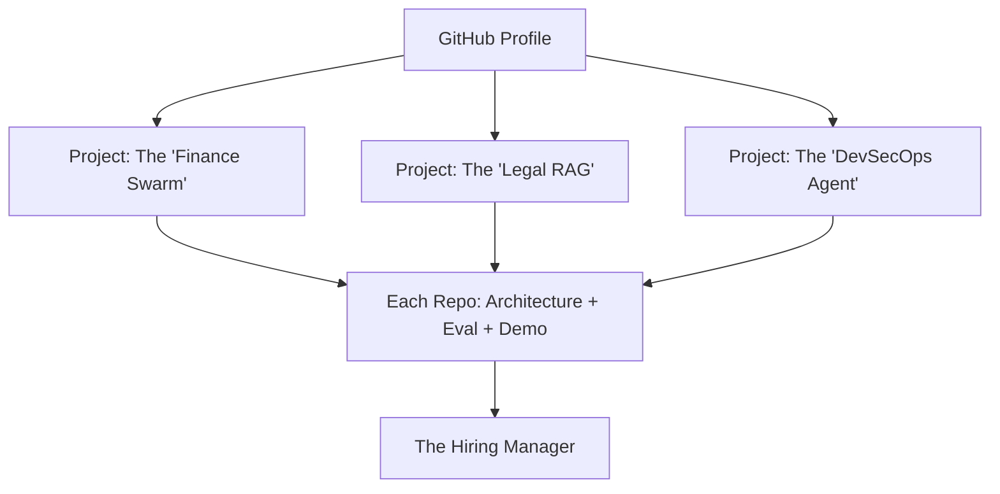

# 📂 Mastering the AI Agent Portfolio: Showcasing Excellence
> **Level:** Advanced | **Language:** Hinglish | **Goal:** Master the art of building and presenting a "Job-winning" AI Agent portfolio that demonstrates your ability to solve real-world problems with production-grade engineering.

---

## 🧭 1. Beginner-Friendly Hinglish Explanation
Portfolio Mastery ka matlab hai **"Apna kaam duniya ko dikhana"**.

- **The Problem:** 2026 mein sirf "Certificate" se job nahi milti. Companies ko "Live Demo" dekhna hai.
- **The Concept:** Aapke portfolio mein 2-3 aisi cheezein honi chahiye jo:
  - **Solved a Problem:** "Maine ye banaya kyunki... (e.g., market research slow thi)."
  - **Used Pro-Tech:** "Maine LangGraph aur Pinecone use kiya."
  - **Is Live:** "Aap ise yahan check kar sakte ho (Link)."
- **The Goal:** Recruitment team ko "Wow" bolne par majboor karna.

Portfolio aapki **"Proof of Work"** hai.

---

## 🧠 2. Deep Technical Explanation
A 2026-standard portfolio focuses on **Full-stack AI Integration**, **Observability**, and **Documentation**.

### 1. The Portfolio 'Golden Trio':
- **Project 1: The Complex Orchestrator.** A multi-agent system (e.g., using CrewAI or LangGraph) that handles a multi-step business workflow.
- **Project 2: The RAG Specialist.** A deep retrieval system (using Hybrid Search, Reranking, and Graph Memory) on a specialized dataset.
- **Project 3: The Secure Sandbox.** An agent that executes code safely in a micro-VM, showing your focus on security.

### 2. Must-have Repo Elements:
- **Architecture Diagram:** A clean Mermaid or Draw.io chart in the README.
- **Evaluation Report:** A table showing the agent's accuracy/latency metrics.
- **Setup Guide:** A one-command setup using `Docker Compose` or `Poetry`.

---

## 🏗️ 3. Architecture Diagrams (The Portfolio Structure)


---

## 💻 4. Production-Ready Code Example (The 'Clean README' Snippet)
```markdown
# 🚀 Project: The Autonomous Market Analyst
> A multi-agent system that monitors 500 stocks and generates daily reports.

### 🛠️ Tech Stack
- **Orchestration:** LangGraph (Stateful workflow)
- **Memory:** Pinecone (Vector) + Redis (Session)
- **Monitoring:** LangSmith (Tracing)

### 📊 Performance Metrics
| Metric | Result |
| :--- | :--- |
| **Accuracy** | 94% |
| **Avg. Response Time** | 12s |
| **Token Cost / Task** | $0.05 |
```

---

## 🌍 5. Real-World Use Cases (Portfolio Ideas)
- **Auto-Podcast Creator:** An agent that takes a topic, researches it, writes a 2-person script, and generates the audio.
- **Smart Home Controller:** An agent that connects to local IoT devices (simulated or real) and manages energy based on price.
- **Personal Learning Coach:** An agent that tracks your "Knowledge Gap" and creates custom quizzes every day.

---

## ❌ 6. Failure Cases (Common Portfolio Mistakes)
- **The "Tutorial Copy":** Putting a basic "Chat with PDF" project that 1 million other people have on their profile.
- **No Documentation:** A great project with an empty README. No one will run your code if they don't know what it does.
- **Broken Demos:** A link to a website that doesn't load or returns "API Key Error."

---

## 🛠️ 7. Debugging Guide (Improving your Profile)
| Symptom | Cause | Fix |
| :--- | :--- | :--- |
| **No one is clicking your links** | Boring titles | Use **'Action-oriented'** titles (e.g., "Autonomous Supply Chain Optimizer" instead of "AI Project 1"). |
| **Interviewer says code is 'Messy'** | No formatting | Use **'Pre-commit hooks'** (Black, Flake8, MyPy) to ensure your code is professional. |

---

## ⚖️ 8. Tradeoffs to Master
- **Quantity (10 small projects) vs. Quality (2 massive, production-grade projects).** (Always pick Quality!).
- **Framework-heavy (Easy to build) vs. From-scratch (Shows deep knowledge).**

---

## 🛡️ 9. Security in your Portfolio
- **NEVER check in your `.env` file or API keys.** Use `python-dotenv` and a `.gitignore` file.
- **Mention Security:** "I used Pydantic to prevent JSON-based attacks in this project."

---

## 📈 10. Scaling Challenges
- Describe in your README how you would "Scale" your project if it had 1 million users. (Shows you think like a Senior Engineer).

---

## 💸 11. Cost Considerations
- Provide a "Cost analysis" in your project README. "Running this agent costs $\$0.10$ per 1000 tokens."

---

## 📝 12. Top 3 Portfolio Tips
1. **Host a Live Demo:** Use Vercel, Streamlit, or Gradio. A link you can click is better than a video.
2. **Include a 'Failures' section:** "Initially, the agent hallucinated math; I fixed it by adding a 'Python REPL' tool." (Shows honesty and problem-solving).
3. **Use Professional Branding:** A clean, minimal design for your portfolio website or GitHub landing page.

---

## ⚠️ 13. Common Mistakes
- **No License:** Not adding an MIT or Apache license to your open-source work.
- **Old Tech:** Using LangChain v0.1 in 2026. Stay updated with the latest versions.

---

## ✅ 14. Best Practices for GitHub
- **Use Issues & PRs:** Even if you are working alone, use PRs to show you know the professional git workflow.
- **Write Good Commits:** `feat: add state persistence` is better than `update code`.
- **Pin your best repos:** Use the "Pinned" section on GitHub to highlight your 2-3 "Masterpieces."

---

## 🚀 15. Latest 2026 Industry Patterns
- **Agentic Documentation:** Using an agent to "Write" the documentation for your project as it evolves.
- **Video Walkthroughs:** Adding a 2-minute "Loom" video to your README explaining the architecture.
- **Interactive Traces:** Providing a public link to your **LangSmith** traces so people can see the "Brain" of your agent in action.
