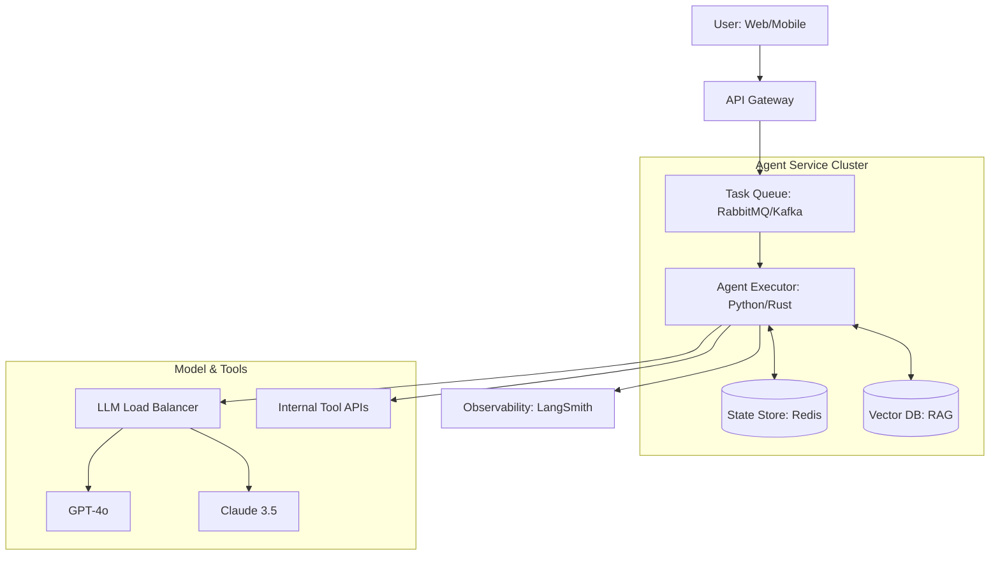

# 🏗️ System Design for AI Agents: Engineering the Future
> **Level:** Extreme Advanced | **Language:** Hinglish | **Goal:** Master the art of designing scalable, resilient, and high-performance AI agent systems for the enterprise, focusing on the infrastructure, data flow, and orchestration patterns of 2026.

---

## 🧭 1. Beginner-Friendly Hinglish Explanation
System Design ka matlab hai **"AI ka Blueprint banana"**.

- **The Problem:** Ek akela agent laptop par chalana asan hai. Par jab wahi agent 10,000 customers handle karega, tab kya hoga? 
- **The Concept:** 
  - **Scalability:** System ko load ke hisaab se bada karna.
  - **Latency:** Agent ko "Fast" response dene ke liye stream aur cache karna.
  - **Reliability:** Agar ek model down ho jaye, toh dusre par automatically shift ho jana.
- **The Goal:** AI ko sirf ek "Demo" se nikaal kar ek **"Production-Grade Software"** banana.

System Design AI ko **"Toy"** se **"Tool"** banata hai.

---

## 🧠 2. Deep Technical Explanation
System design for agents involves **Asynchronous Task Queuing**, **Semantic Caching**, and **Multi-Region Orchestration**.

### 1. The Core Infrastructure Components:
- **The Orchestrator:** Manages the state and routing (e.g., LangGraph, Kubernetes).
- **The Context Store:** Fast retrieval of conversation history (Redis/PostgreSQL).
- **The Memory Layer:** Long-term storage of user preferences (Vector DB like Pinecone or Weaviate).
- **The Tooling Layer:** A set of microservices that the agent can call via API.

### 2. State Management:
Managing the "State" of 1,000 parallel agent loops requires a persistent state store that supports **Checkpointing** (saving progress) and **Rollbacks**.

### 3. Load Balancing for LLMs:
Distributing requests across different model providers (OpenAI, Anthropic, Azure) to handle rate limits and downtime.

---

## 🏗️ 3. Architecture Diagrams (The Enterprise Agent Stack)


---

## 💻 4. Production-Ready Code Example (An Agentic Task Queue)
```python
# 2026 Standard: Handling long-running agent tasks asynchronously

import asyncio
from celery import Celery

app = Celery('agent_tasks', broker='redis://localhost:6379/0')

@app.task
def run_autonomous_research(task_id, query):
    # 1. Initialize agent with persistence
    agent = MyExpertAgent(task_id=task_id)
    
    # 2. Run the complex, multi-step workflow
    result = agent.execute_workflow(query)
    
    # 3. Notify user via Webhook or WebSocket
    notify_user(task_id, result)

# Insight: Never run long agent loops in the main 
# request-response cycle. Use a 'Background Queue'.
```

---

## 🌍 5. Real-World Use Cases
- **Global Customer Support:** Scaling an agent that speaks 50 languages and handles 1 million tickets a month.
- **Autonomous Financial Audit:** Running agents that scan 100,000 PDF invoices, cross-check them with bank statements, and flag anomalies.
- **AI-Driven E-commerce:** An agent that personalizes the whole website for every user based on their real-time behavior and memory.

---

## ❌ 6. Failure Cases
- **The "Dead Letter" Trap:** An agent task fails and goes into an infinite "Retry" loop, burning through $\$1000$ of tokens in 1 hour. **Fix: Use 'Exponential Backoff' and 'Max Retry Limits'.**
- **State Mismatch:** User talks to Agent Instance A, but their state is saved in Instance B, causing the agent to "Forget" the conversation.
- **Vector DB Latency:** The RAG retrieval takes longer than the LLM inference, making the system feel slow.

---

## 🛠️ 7. Debugging Guide
| Symptom | Cause | Fix |
| :--- | :--- | : :--- |
| **Agent is giving 'Outdated' info** | Cache is stale | Implement **'TTL (Time To Live)'** for semantic caches and clear them when the source data changes. |
| **System crashes during peak hours** | API Rate Limiting | Use **'LLM Fallback Logic'** to switch to a different provider or a local model when limits are reached. |

---

## ⚖️ 8. Tradeoffs
- **Real-time Streaming (Fast UX) vs. Batch Processing (Reliable/Analyzable).**
- **Vertical Scaling (Stronger single server) vs. Horizontal Scaling (Multiple smaller servers).**

---

## 🛡️ 9. Security Concerns
- **Token Injection:** An attacker manipulating the "Task Queue" to inject malicious instructions into the agent's next step.
- **DDoS via AI:** A script that triggers 10,000 expensive agent loops to bankrupt your company. **Fix: Use 'User-level Rate Limiting'.**

---

## 📈 10. Scaling Challenges
- **Cold Starts:** The time it takes to load a 70B model or a complex agent state.
- **Cross-Region Sync:** Keeping the "User Memory" consistent between a server in USA and a server in India.

---

## 💸 11. Cost Considerations
- **Egress Costs:** The price of moving data between your Vector DB and your LLM provider.
- **GPU Hosting vs. API Tokens:** When is it cheaper to rent an H100 vs. paying OpenAI?

---

## 📝 12. Interview Questions
1. "How would you design a system that supports 10,000 concurrent agentic workflows?"
2. "Explain the role of a 'Semantic Cache' in an agentic system."
3. "How do you handle 'State Management' in a serverless agent deployment?"

---

## ⚠️ 13. Common Mistakes
- **No Persistence:** Relying on in-memory storage for agent state (If the server restarts, the agent's work is gone).
- **Ignoring Tool Latency:** Not setting a "Timeout" for tool calls, causing the whole agent loop to hang.

---

## ✅ 14. Best Practices
- **Stateless Executors:** Keep your agent logic stateless and fetch the state from a DB at every step.
- **Event-Driven Architecture:** Let the agent trigger events (e.g., `Task_Completed`) that other systems can react to.
- **Graceful Degradation:** If the "Search" tool is down, the agent should still be able to use its internal knowledge or tell the user.

---

## 🚀 15. Latest 2026 Industry Patterns
- **Serverless Agent Functions:** Running agents as individual AWS Lambda/Vercel functions for infinite scaling.
- **Edge-Cloud Hybrid:** Running the "Fast" logic on the user's device and the "Deep" logic in the cloud.
- **Self-Optimizing Infra:** An AI that monitors its own token usage and "Swaps" models to save money without losing accuracy.
