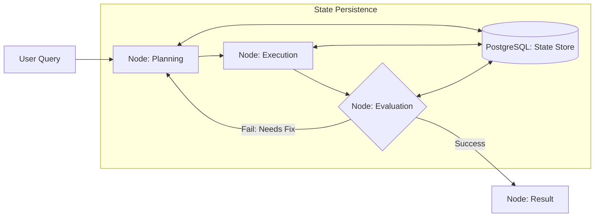

# ⛓️ System Design for Agentic Workflows: Planning the Logic
> **Level:** Extreme Advanced | **Language:** Hinglish | **Goal:** Master the design of complex, stateful workflows that allow agents to handle multi-turn reasoning, loops, and error correction without losing track of the goal.

---

## 🧭 1. Beginner-Friendly Hinglish Explanation
System Design for Agentic Workflows ka matlab hai **"AI ki Logic Chain banana"**.

- **The Problem:** Agar aap AI ko ek bada task dete ho, toh wo rasta bhatak sakta hai (Lost in the middle). 
- **The Concept:** Humein AI ko ek "Dhanche" (Framework) mein bandhna hoga:
  - **The Graph:** Agent ko nodes (Steps) aur edges (Connections) ke through guide karna.
  - **State:** Har step par data ko "Save" karna (Checkpoints).
  - **Conditionals:** "Agar X hua toh Step A par jao, nahi toh Step B par."
- **The Goal:** AI ki "Randomness" ko ek **"Reliable Process"** mein badalna.

Workflows AI ko ek **"Bhatakte hue traveller"** se ek **"Train"** bana dete hain jo tracks par chalti hai.

---

## 🧠 2. Deep Technical Explanation
Agentic workflows move from **Linear Pipelines** to **Directed Acyclic Graphs (DAGs)** and **Cyclic Graphs**.

### 1. Key Workflow Patterns:
- **Router Pattern:** An initial LLM call decides which "Path" (Specialist agent) to take.
- **Synthesizer Pattern:** Running 3 parallel agent tasks and then using a 4th agent to merge them.
- **Evaluator-Optimizer Loop:** Agent A creates, Agent B critiques, Agent A improves. (The most robust pattern for high-quality output).

### 2. State Persistence (The 'Time-Travel' Feature):
2026-standard workflows allow you to **"Pause"** an agent mid-loop, save its state to a DB, and **"Resume"** it 3 days later exactly where it left off.

---

## 🏗️ 3. Architecture Diagrams (The State Machine)


---

## 💻 4. Production-Ready Code Example (A Stateful LangGraph Snippet)
```python
# 2026 Standard: Defining a stateful graph workflow

from langgraph.graph import StateGraph

# 1. Define the State Schema
class WorkflowState(TypedDict):
    query: str
    intermediate_steps: list[str]
    is_finished: bool

# 2. Build the Graph
builder = StateGraph(WorkflowState)
builder.add_node("planner", plan_node)
builder.add_node("executor", exec_node)

# 3. Add Conditional Logic
builder.add_conditional_edges(
    "executor",
    should_continue, # A function that checks if more work is needed
    {True: "planner", False: END}
)

# Insight: Using 'State Graphs' makes your 
# agent's behavior 100% auditable and debuggable.
```

---

## 🌍 5. Real-World Use Cases
- **Autonomous Support:** "Check Order Status" $\rightarrow$ "Ask for Email" $\rightarrow$ "Verify in DB" $\rightarrow$ "Reply."
- **Complex Content Gen:** "Research" $\rightarrow$ "Outline" $\rightarrow$ "Draft Section 1" $\rightarrow$ "Review" $\rightarrow$ "Finalize."
- **Data Pipeline:** "Fetch API" $\rightarrow$ "Scrub PII" $\rightarrow$ "Transform to JSON" $\rightarrow$ "Save to S3."

---

## ❌ 6. Failure Cases
- **The "Infinite Loop":** The Evaluation node always says "Fail," so the agent keeps planning forever. **Fix: Use a 'Max Loop Count' variable in the state.**
- **Context Overload:** Passing the *entire* conversation history in every node, blowing up the token budget.
- **State Desync:** The database and the running agent have different versions of the state.

---

## 🛠️ 7. Debugging Guide (Troubleshooting Workflows)
| Symptom | Cause | Fix |
| :--- | :--- | :--- |
| **Agent skips important steps** | Weak edge logic | Use **'Structured Booleans'** in the router node to force clear "Yes/No" decisions. |
| **Response is slow** | Sequential nodes | Run independent nodes in **'Parallel'** using `asyncio.gather`. |

---

## ⚖️ 8. Tradeoffs
- **Rigid Workflows (Safe/Predictable) vs. Fluid Agents (Creative/Unpredictable).**
- **Explicit Graphs (Easy to debug) vs. Autonomous Planning (Powerful).**

---

## 🛡️ 9. Security in Workflows
- **Node Isolation:** Ensuring the "Web Search" node cannot access the "Database Admin" node's secrets.
- **Input Sanitization at every step:** Not just at the beginning!

---

## 📈 10. Scaling Challenges
- **Concurrency in Graphs:** Handling 1000 users in a stateful graph without crashing the database.

---

## 💸 11. Cost Considerations
- **Graph Overhead:** Every node is a potential LLM call. **Strategy: Use 'Small Models' for Routing/Evaluation nodes.**

---

## 📝 12. Interview Questions
1. "What is the benefit of a Graph-based workflow over a linear Chain?"
2. "How do you handle 'Error Recovery' in an agentic workflow?"
3. "Explain the 'Evaluator-Optimizer' pattern."

---

## ⚠️ 13. Common Mistakes
- **No 'Exit' Strategy:** Forget to define what happens if the agent *cannot* solve the problem. (Always have a "Human Fallback").
- **Too many nodes:** Creating a 50-node graph for a 2-step task. (Keep it simple!).

---

## ✅ 14. Best Practices
- **Checkpointing:** Save the state after every node execution.
- **Visualize your Graphs:** Use Mermaid in your documentation to explain the logic.
- **Unit Test individual Nodes:** Don't just test the whole graph; test the "Planner" and "Executor" separately.

---

## 🚀 15. Latest 2026 Industry Patterns
- **Dynamic Graph Construction:** The agent "Rewrites" its own graph structure based on the task complexity.
- **Cross-Workflow State Sharing:** Letting a "Support Workflow" talk to a "Sales Workflow" through a shared memory bus.
- **Human-in-the-Loop Nodes:** A node in the graph that literally "Pauses" the agent and waits for a human email/Slack response before continuing.
