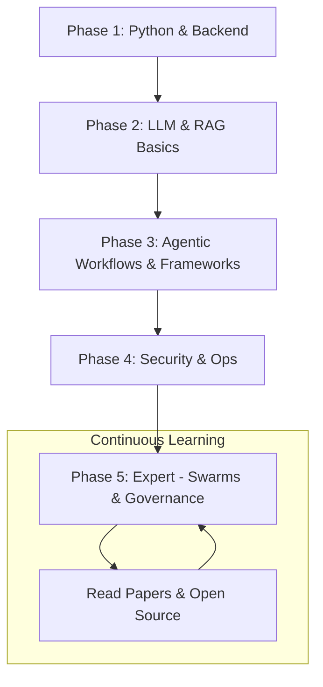

# 🗺️ The AI Agent Career Roadmap 2026: Navigating the Frontier
> **Level:** Beginner to Advanced | **Language:** Hinglish | **Goal:** Master the career path of an AI Agent Engineer, from learning the fundamentals to becoming a senior architect in the most exciting field of 2026.

---

## 🧭 1. Beginner-Friendly Hinglish Explanation
Career Roadmap ka matlab hai **"AI Engineer banne ka rasta"**.

- **The Opportunity:** 2026 mein AI Agents ki demand "Software Developers" se zyada hai. Companies ko aise log chahiye jo AI ko "Chala" sakein, sirf "Baat" nahi.
- **The Path:**
  - **Step 1: Python Mastery.** Bina code ke AI nahi ban sakta.
  - **Step 2: LLM Fundamentals.** Tokens, Context, aur Embeddings samajhna.
  - **Step 3: Frameworks.** LangGraph, CrewAI, aur MCP seekhna.
  - **Step 4: Production.** Security, Scaling, aur Monitoring (Observability).
- **The Goal:** Ek **"Full-stack AI Engineer"** banna jo autonomous systems build kar sake.

Ye rasta "Hard" hai par **"Rewards"** (Salary & Impact) kamaal ke hain.

---

## 🧠 2. Deep Technical Explanation
The AI Agent Engineer role is a hybrid of **Machine Learning**, **Backend Engineering**, and **Product Design**.

### 1. The Skill Pyramid:
- **Foundations (Bottom):** Python (Async), Data Structures, Git.
- **AI Literacy:** RAG, Prompt Engineering, Model Selection (Open vs Closed).
- **Agentic Logic:** Orchestration (State Graphs), Tool-use, Planning algorithms.
- **Ops & Infra (Top):** Docker, Vector DBs, LangSmith, E2B (Sandboxing).

### 2. The Evolution of Roles:
- **Junior AI Dev:** Builds simple RAG bots and chains.
- **AI Agent Engineer:** Builds autonomous, tool-using agents with memory.
- **AI Architect:** Designs multi-agent systems, swarms, and cross-enterprise AI workflows.

---

## 🏗️ 3. Architecture Diagrams (The Learning Journey)


---

## 💻 4. Production-Ready Code Example (A Career 'Growth' Function)
```python
# 2026 Standard: A pseudo-code for your career progress

def grow_as_ai_engineer(current_skills):
    roadmap = ["Async Python", "Vector DBs", "LangGraph", "Micro-VM Security"]
    
    for skill in roadmap:
        if skill not in current_skills:
            build_project_with(skill)
            update_portfolio(skill)
            
    return "Ready for Senior AI Role"

# Insight: In AI, 'Building' is the only way to 'Learn'.
```

---

## 🌍 5. Real-World Use Cases (Target Roles)
- **Fintech AI Engineer:** Building agents that automate "Compliance" and "Trading."
- **EdTech AI Architect:** Designing "Personalized Tutors" that follow a student for years.
- **HealthTech Security Engineer:** Securing agents that handle "Patient Data."

---

## ❌ 6. Failure Cases (Why people quit)
- **Tutorial Hell:** Only watching videos but never writing a single line of original code.
- **Ignoring the Math:** Not understanding "Embeddings" or "Probabilities," leading to bad debugging.
- **Tool Obsession:** Focusing on "Which framework is best?" instead of "How does the agent reason?"

---

## 🛠️ 7. Debugging Guide (Career Pitfalls)
| Symptom | Cause | Fix |
| :--- | :--- | :--- |
| **Failing Interviews** | No 'Proof of Work' | Build **'2-3 Live Projects'** and document them on GitHub. |
| **Feel 'Outdated' in 3 months** | AI speed is too fast | Dedicate **'1 hour/day'** to reading newsletters (like 'The Sequence' or 'Daily AI'). |

---

## ⚖️ 8. Tradeoffs to Master
- **Specialization (Expert in one thing) vs. Versatility (Good at everything).** (In AI, start broad, then specialize).
- **Big Tech Jobs (Money/Stability) vs. AI Startups (High Growth/Risk).**

---

## 🛡️ 9. Security & Ethics as a Career Pillar
- Senior roles in 2026 require a deep understanding of "AI Governance" and "Liability."

---

## 📈 10. Scaling Challenges
- Scaling your own "Productivity" using AI agents (The 'AI-Augmented Engineer').

---

## 💸 11. Cost Considerations
- The cost of learning: GPU credits, API tokens, and paid courses. (Invest in yourself!).

---

## 📝 12. Top 3 Career Tips
1. **Master Async Python:** Most agent frameworks are async.
2. **Learn to Read Papers:** Read the original "Attention is all you need" and "ReAct" papers.
3. **Build a Personal Brand:** Twitter (X), LinkedIn, and GitHub are your 2026 resumes.

---

## ⚠️ 13. Common Mistakes
- **Neglecting the Backend:** Thinking you can be an AI Engineer without knowing how APIs or Databases work.
- **Thinking LLMs are 'Magic':** Treating them as mysterious brains instead of probabilistic token predictors.

---

## ✅ 14. Best Practices for Growth
- **Pair Programming with AI:** Use Antigravity/Cursor to write code $10x$ faster.
- **Open Source Contributions:** Help improve LangGraph or CrewAI.
- **Networking:** Go to AI Meetups and Hackathons.

---

## 🚀 15. Latest 2026 Industry Patterns
- **Agentic Dev Teams:** Entire companies where humans manage "Swarms" of developers.
- **On-Device Agent Specialization:** A huge demand for engineers who can run agents on phones (NPUs).
- **Agentic Law & Ethics:** A booming field for engineers who can bridge the gap between "Code" and "Compliance."
