# 🤖 AI Agents Guide
> **Level:** Beginner → Intermediate | **Language:** Hinglish | **Goal:** AI Agents ko deeply samajhna
## 🧭 Core Concepts (Concept-First)
+- AI Agent Fundamentals: Understanding what makes an AI agent different from a simple chatbot
+- Agent Architecture: Perception-reasoning-action loop, memory systems, and tool integration
+- Planning & Decision Making: How agents break down goals and choose optimal actions
+- Tool Usage: Connecting agents to external APIs, databases, and computational resources
+- Multi-Agent Systems: Coordination, communication, and specialization in agent teams
+- Safety & Evaluation: Guardrails, testing methodologies, and performance measurement
+- Practical Implementation: Building agents with popular frameworks and real-world examples
---

## 📋 Is Guide Se Kya Seekhoge

| Topic | Status |
|-------|--------|
| AI Agent kya hota hai | ✅ Covered |
| Chatbot vs Agent ka fark | ✅ Covered |
| Agent ka internal loop | ✅ Covered |
| Tools, Memory, Planning | ✅ Covered |
| Multi-Agent Systems | ✅ Covered |
| Real Working Example | ✅ Covered |
| Exercises + Tests | ✅ Covered |

---

## 1. 🧠 AI Agent Kya Hota Hai

AI agent ek aisa software system hota hai jo:

- **goal samajhta hai** — sirf instruction nahi, poora intent
- **context dekhta hai** — past actions aur environment dekhkar sochta hai
- **decision leta hai** — next best step choose karta hai
- **tools use kar sakta hai** — search, calculator, database, email, etc.
- **steps me kaam karta hai** — ek hi go me sab nahi karta
- **output deta hai** — final result ya action complete karta hai

> 💡 **Simple Line:**
> `Chatbot sirf jawab de sakta hai, Agent kaam bhi kar sakta hai.`

---

## 2. ⚔️ Chatbot vs AI Agent — Fark Kya Hai

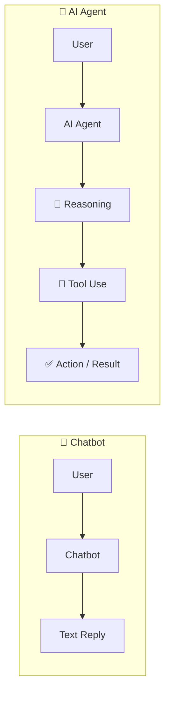

| Feature | Chatbot | AI Agent |
|---------|---------|----------|
| Sirf jawab deta hai | ✅ | ✅ |
| Plan bana sakta hai | ❌ | ✅ |
| Tools use kar sakta hai | ❌ | ✅ |
| Multiple steps me kaam karta hai | ❌ | ✅ |
| Environment se interact karta hai | ❌ | ✅ |
| Mistakes dekhkar correct karta hai | ❌ | ✅ |

---

## 3. 🔗 Generative AI Aur AI Agents Ka Relation

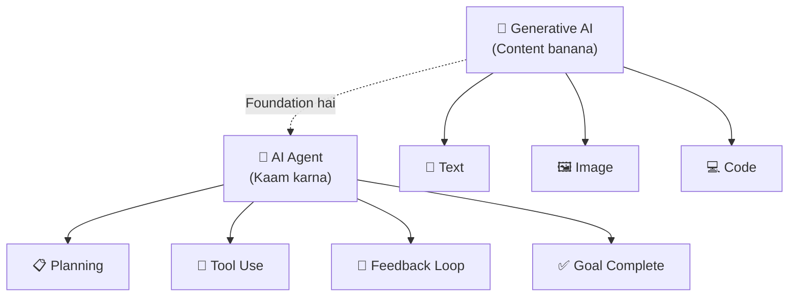

> 🧩 **Key Insight:**
> - **Generative AI** = Content banane ki capability
> - **AI Agent** = Decision + Action + Tool use wali capability
>
> `Har agent me generative AI ho sakta hai, lekin har generative AI system agent nahi hota.`

---

## 4. 🗺️ AI Agent Ka Big Picture

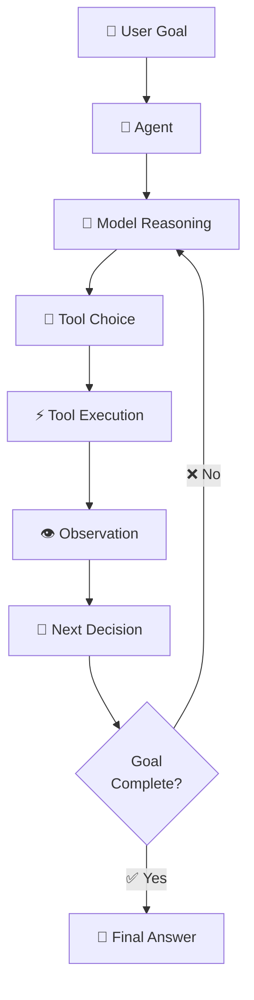

**Explanation:**
- Agent user ka goal leta hai
- Model se sochta hai kya karna hai
- Tool choose aur execute karta hai
- Result dekhkar next step decide karta hai
- Goal complete hone tak loop chalta rehta hai

---

## 5. 🧩 AI Agent Ke Main Components

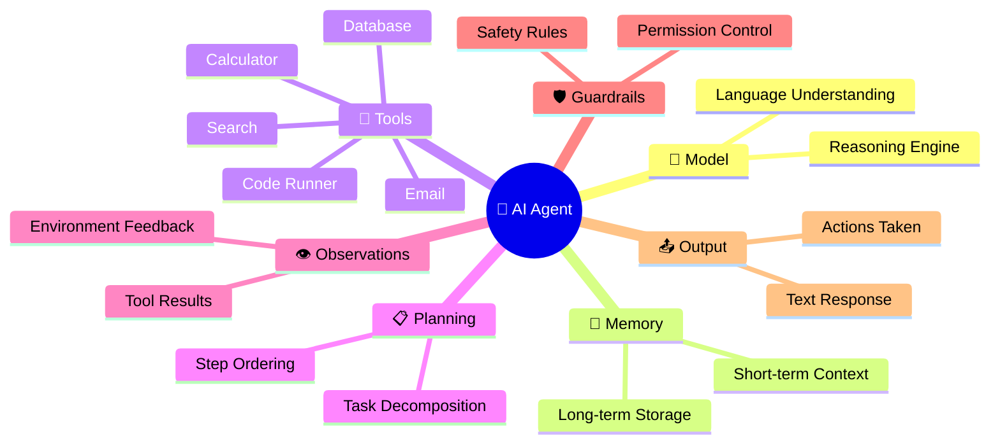

### 🧠 Model
Ye reasoning ya language understanding ka brain hota hai. Agent ka intelligence isi se aata hai.

### 💾 Memory

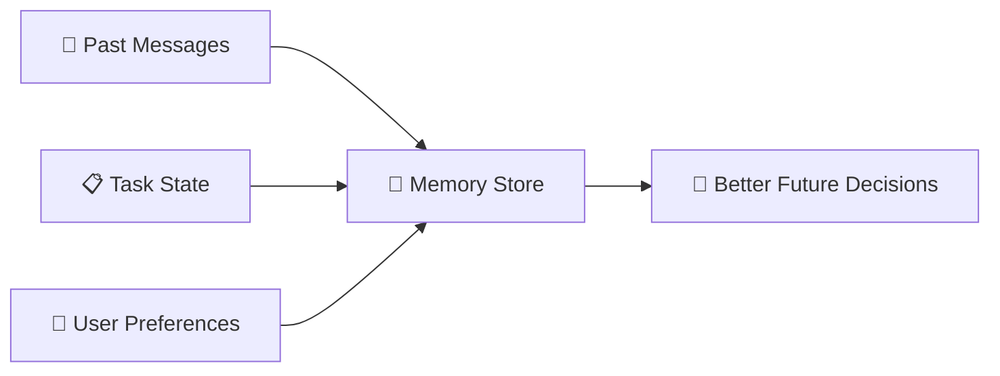

Memory 2 types ki hoti hai:
- **Short-term:** Current conversation context
- **Long-term:** Database me stored past interactions

### 🔧 Tools
Tools hi agent ko useful banate hain. Without tools, agent sirf text generate kar sakta hai.

### 📋 Planning
Bade task ko chhote manageable steps me todna.

---

## 6. 🔄 AI Agent Ka Internal Loop — Sabse Important!

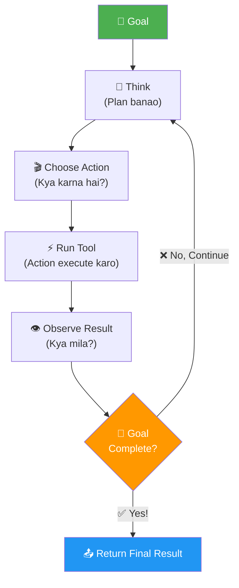

> 🔑 **Ye sabse important diagram hai!**
>
> Agent ka core loop = **Think ➜ Act ➜ Observe ➜ Repeat**
>
> Isi wajah se agent static chatbot se zyada powerful hota hai.

---

## 7. ⚙️ AI Agent Kaise Decide Karta Hai

Agent usually ye factors dekhta hai:

```
User Goal kya hai?
    ↓
Mere paas kaunse tools hain?
    ↓
Kya mujhe aur data chahiye?
    ↓
Ab kaunsa step best hai?
    ↓
Kya task complete ho gaya?
    ↓
Kya answer dena safe hai?
```

Agent kaam blindly nahi karta — wo context aur available actions ke hisaab se step choose karta hai.

---

## 8. 🔧 AI Agent Me Tools Ka Role

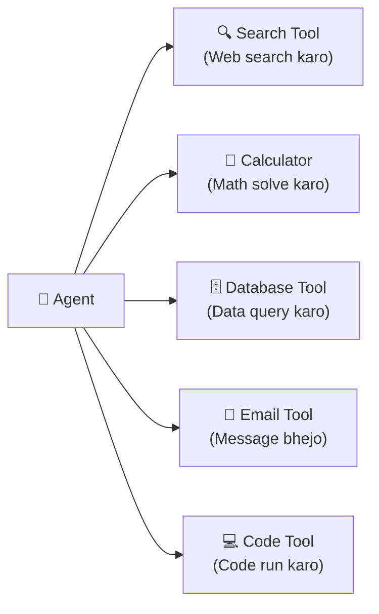

| Without Tools | With Tools |
|--------------|-----------|
| Sirf text generate karta hai | Real actions kar sakta hai |
| Outdated info deta hai | Fresh data la sakta hai |
| Math guess karta hai | Exact calculations karta hai |
| Files nahi padh sakta | Files read/write kar sakta hai |

---

## 9. 🤝 Single-Agent vs Multi-Agent

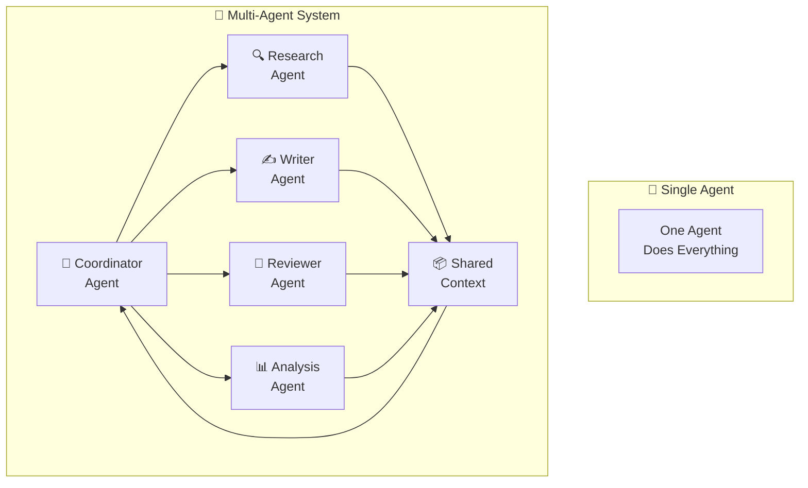

| | Single Agent | Multi-Agent |
|-|-------------|------------|
| Complexity | Simple | Complex |
| Build karna | Easy | Harder |
| Specialization | Limited | High |
| Big tasks | Struggles | Handles well |
| Debug karna | Easy | Harder |

---

## 10. 🔴 Real Working Example — Agent Ko Samjho!

> **Scenario:** User bolta hai: _"Mujhe aaj ka weather batao aur agar baarish ho to umbrella remind karo"_

### Agent Ka Step-by-Step Execution:

```python
# ===== STEP 1: Goal Receive =====
user_goal = "Aaj ka weather batao, baarish ho to umbrella remind karo"

# ===== STEP 2: Agent Planning =====
plan = [
    "Step 1: Weather API call karo",
    "Step 2: Result check karo - baarish hai ya nahi",
    "Step 3: Agar baarish hai to reminder add karo",
    "Step 4: Final response banao"
]

# ===== STEP 3: Tool Call - Weather Search =====
def weather_tool(city):
    # API se real weather data fetch karta hai
    return {"city": city, "condition": "Rainy", "temp": 22}

weather_result = weather_tool("Mumbai")
# Output: {"city": "Mumbai", "condition": "Rainy", "temp": 22}

# ===== STEP 4: Agent Observation =====
if weather_result["condition"] == "Rainy":
    reminder = "☂️ Umbrella zaroor le jao!"
else:
    reminder = "No umbrella needed!"

# ===== STEP 5: Final Response =====
final_response = f"""
Mumbai Weather: {weather_result['temp']}°C, {weather_result['condition']}
{reminder}
"""
print(final_response)
# Output:
# Mumbai Weather: 22°C, Rainy
# ☂️ Umbrella zaroor le jao!
```

### Is Process Ka Flow:

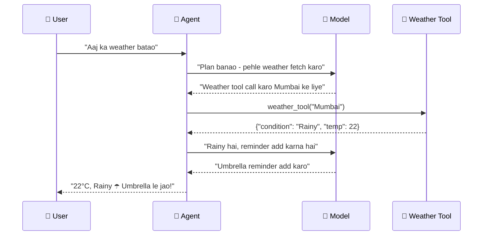

---

## 11. 🏗️ AI Agent Build Karne Ke Liye Kya Chahiye

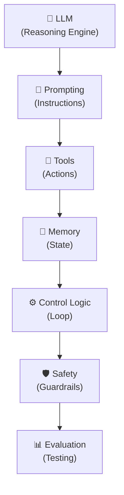

**Minimal Agent banane ke liye:**

```python
# Simple Agent Structure in Python

class SimpleAgent:
    def __init__(self, model, tools):
        self.model = model      # LLM brain
        self.tools = tools      # Available actions
        self.memory = []        # Conversation history
        self.max_steps = 10     # Safety limit

    def think(self, goal):
        """Model se next action decide karwao"""
        context = self.memory + [{"role": "user", "content": goal}]
        return self.model.decide(context, self.tools)

    def act(self, action, params):
        """Tool execute karo"""
        if action in self.tools:
            result = self.tools[action](**params)
            self.memory.append({"action": action, "result": result})
            return result
        return "Tool not found!"

    def run(self, goal):
        """Main agent loop"""
        for step in range(self.max_steps):
            # Think - kya karna hai
            next_action = self.think(goal)

            # Check - goal complete?
            if next_action == "DONE":
                return self.memory[-1]["result"]

            # Act - tool chalao
            result = self.act(next_action["tool"], next_action["params"])

            print(f"Step {step+1}: {next_action['tool']} → {result}")

        return "Max steps reached!"
```

---

## 12. 🛡️ AI Agent Safety Kyu Important Hai

Agent real actions kar sakta hai, isliye risk normal chatbot se zyada hota hai.

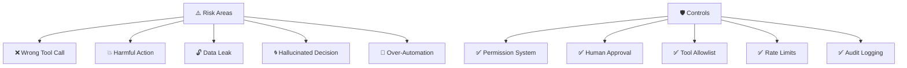

**Safety Rules (Must Follow):**
1. 🔐 **Least Privilege** — sirf zaruri permissions do
2. ✅ **Human Approval** — risky actions ke liye confirm karo
3. 📝 **Logging** — har action record karo
4. 🚫 **Allowlist** — sirf approved tools allow karo

---

## 13. 📊 AI Agent Evaluation

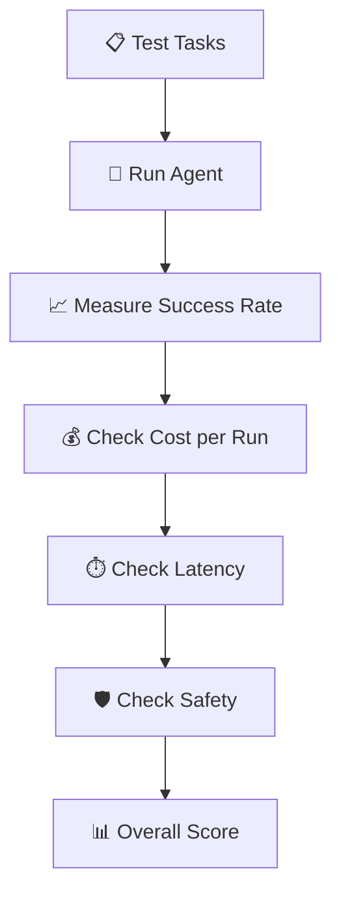

| Metric | Kya Measure Karta Hai | Good Value |
|--------|----------------------|-----------|
| Task Success Rate | Kitne tasks complete hue | >80% |
| Tool Accuracy | Sahi tool use hua ya nahi | >90% |
| Cost per Task | API calls ka cost | As low as possible |
| Latency | Kitna time laga | <30 seconds |
| Safety Score | Unsafe actions | 0 unsafe actions |

---

## 14. 🎯 Kaunse Frameworks Use Karein

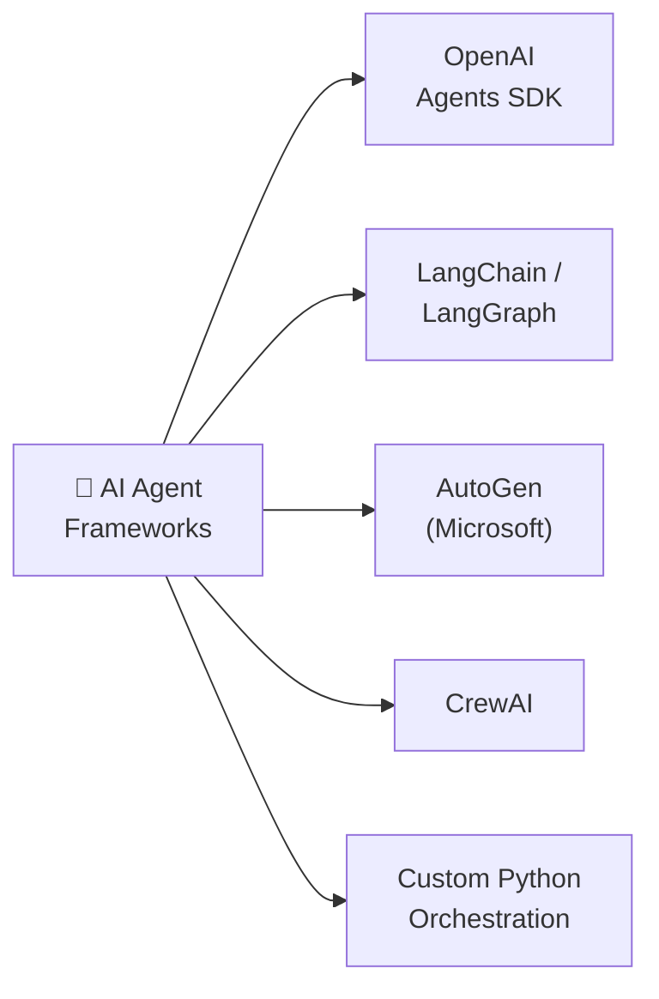

| Framework | Best For | Difficulty |
|-----------|---------|-----------|
| OpenAI Agents SDK | Simple, production-ready | ⭐⭐ |
| LangChain | Complex chains & RAG | ⭐⭐⭐ |
| AutoGen | Multi-agent conversations | ⭐⭐⭐ |
| CrewAI | Team-based agents | ⭐⭐⭐ |
| Custom Python | Full control | ⭐⭐⭐⭐ |

---

## 15. 📚 Student Learning Path

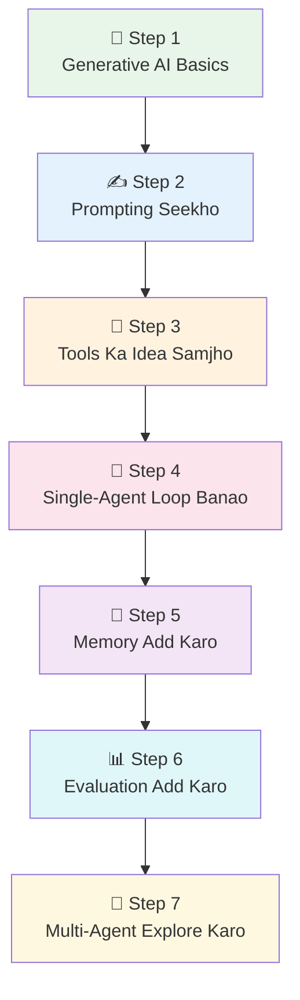

---

## 🧪 Exercises — Practice Karo!

### Exercise 1: Basic Understanding ⭐
**Question:** Neeche diye gaye scenarios me se kaunsa AI Agent ka use case hai aur kaunsa sirf Chatbot ka?

```
A) User puchta hai: "Python me list sort kaise karte hain?"
B) User puchta hai: "Meri website ka SEO audit karo aur improvements suggest karo"
C) User puchta hai: "Machine learning kya hota hai?"
D) User puchta hai: "Mera email inbox check karo aur important emails ka summary do"
```

<details>
<summary>✅ Answer Dekho</summary>

- **A) Chatbot** — Simple Q&A, koi tool use nahi
- **B) Agent** — Website scan karna, SEO tools use karna, multiple steps
- **C) Chatbot** — Simple explanation, koi action nahi
- **D) Agent** — Email inbox access karna, summary banana = multiple tools + actions

</details>

---

### Exercise 2: Agent Loop Identify Karo ⭐⭐
**Scenario:** User bolta hai "GitHub par mere latest 3 repos ke names batao aur unka description likho"

**Task:** Iss scenario ke liye agent ka step-by-step loop likhlo (Think → Act → Observe pattern me):

```
Step 1: Think - ___________
Step 1: Act   - ___________
Step 1: Observe - ___________

Step 2: Think - ___________
Step 2: Act   - ___________
Step 2: Observe - ___________

Step 3: Think - ___________
Step 3: Act   - ___________
Step 3: Final - ___________
```

<details>
<summary>✅ Answer Dekho</summary>

```
Step 1: Think   - "Pehle GitHub API se repos fetch karne chahiye"
Step 1: Act     - github_tool.get_repos(username, limit=3)
Step 1: Observe - [{"name": "MyLLM", "desc": "..."}, ...]

Step 2: Think   - "Repos mil gaye, ab description likhni hai"
Step 2: Act     - model.generate_description(repo_data)
Step 2: Observe - "MyLLM: A mini GPT-style language model..."

Step 3: Think   - "Sab descriptions ready hain, format karo"
Step 3: Act     - format_response(repos_with_descriptions)
Step 3: Final   - "1. MyLLM - ...\n2. Repo2 - ...\n3. Repo3 - ..."
```

</details>

---

### Exercise 3: Multi-Agent System Design ⭐⭐⭐
**Task:** Ek "Research Report Generator" ke liye multi-agent system design karo. Likho ki:
1. Kaun se agents honge?
2. Har agent ka kya kaam hoga?
3. Kaise communicate karenge?

<details>
<summary>✅ Answer Dekho</summary>

```
Agents:
1. 🎯 Coordinator Agent
   - User se goal leta hai
   - Kaam assign karta hai
   - Final output combine karta hai

2. 🔍 Research Agent
   - Web search karta hai
   - Papers/articles padhta hai
   - Raw data collect karta hai

3. 📊 Analysis Agent
   - Research data analyze karta hai
   - Key insights nikalta hai
   - Patterns identify karta hai

4. ✍️ Writer Agent
   - Insights ko readable format me likhta hai
   - Section-wise report banata hai

5. 🔎 Reviewer Agent
   - Errors check karta hai
   - Factual accuracy verify karta hai
   - Improvements suggest karta hai

Communication: Shared context/state via message passing
Final output: Polished research report
```

</details>

---

## 📝 Quick Test — Samajh Check Karo!

**Q1:** Agent aur chatbot me main difference kya hai?

```
A) Agent zyada expensive hota hai
B) Agent tools use kar sakta hai aur multi-step kaam kar sakta hai
C) Agent sirf images process karta hai  
D) Agent offline kaam karta hai
```

<details><summary>Answer</summary>**B** ✅ — Agent tools use karke real actions le sakta hai, multiple steps me</details>

---

**Q2:** KV Cache ka role kya hai agent me?

```
A) Memory store karne ke liye
B) Security increase karne ke liye
C) Generation fast karne ke liye  
D) Tool calls reduce karne ke liye
```

<details><summary>Answer</summary>**C** ✅ — KV Cache purane tokens ko recompute karne se bachata hai, generation fast hoti hai</details>

---

**Q3:** Multi-agent system kab use karo?

```
A) Jab task simple ho
B) Jab sirf text generate karna ho
C) Jab task complex ho, multiple skills chahiye ho
D) Jab cost bachani ho
```

<details><summary>Answer</summary>**C** ✅ — Complex tasks, multiple specializations needed hone par</details>

---

## 📺 Video Resources (Hindi/Urdu)

| Topic | Link | Language |
|-------|------|----------|
| **AI Agents Crash Course** | [Watch on YouTube](https://www.youtube.com/watch?v=J_0vUfXBy-I) | Hindi |
| **LangChain Agents Tutorial** | [Watch on YouTube](https://www.youtube.com/watch?v=1F_E5hI1VfI) | Hindi |
| **Agentic AI 🚀 Smart Agents** | [Watch on YouTube](https://www.youtube.com/playlist?list=PLmPj1e7oP7jHkP1N3YvQ1j2J5d6z4Z0L1) | Urdu/Hindi |

---

## 🔗 Resources

| Resource | Link | Type |
|----------|------|------|
| OpenAI Agents SDK | [platform.openai.com](https://platform.openai.com/docs/guides/agents-sdk/) | Official Docs |
| Anthropic Agent Guide | [anthropic.com](https://www.anthropic.com/engineering/building-agents-with-the-claude-agent-sdk/) | Article |
| Building Effective Agents | [Anthropic PDF](https://resources.anthropic.com/hubfs/Building%20Effective%20AI%20Agents-%20Architecture%20Patterns%20and%20Implementation%20Frameworks.pdf?hsLang=en) | Guide |
| Microsoft AutoGen | [microsoft.github.io](https://microsoft.github.io/autogen/) | Framework |

---

## 🏆 Final Summary

> **AI agent ek aisa system hai jo model ki intelligence ko tools, memory aur control loop ke saath combine karta hai.**

```
Agent = Model + Tools + Memory + Planning + Control Loop + Guardrails
```

- **Single-agent** — Simple, practical, easy to build
- **Multi-agent** — Specialization, teamwork, complex tasks

> 💪 **Student ke liye advice:**
> Agent banana matlab sirf model use karna nahi,
> balki model ke around ek **intelligent working system design karna** hai.
