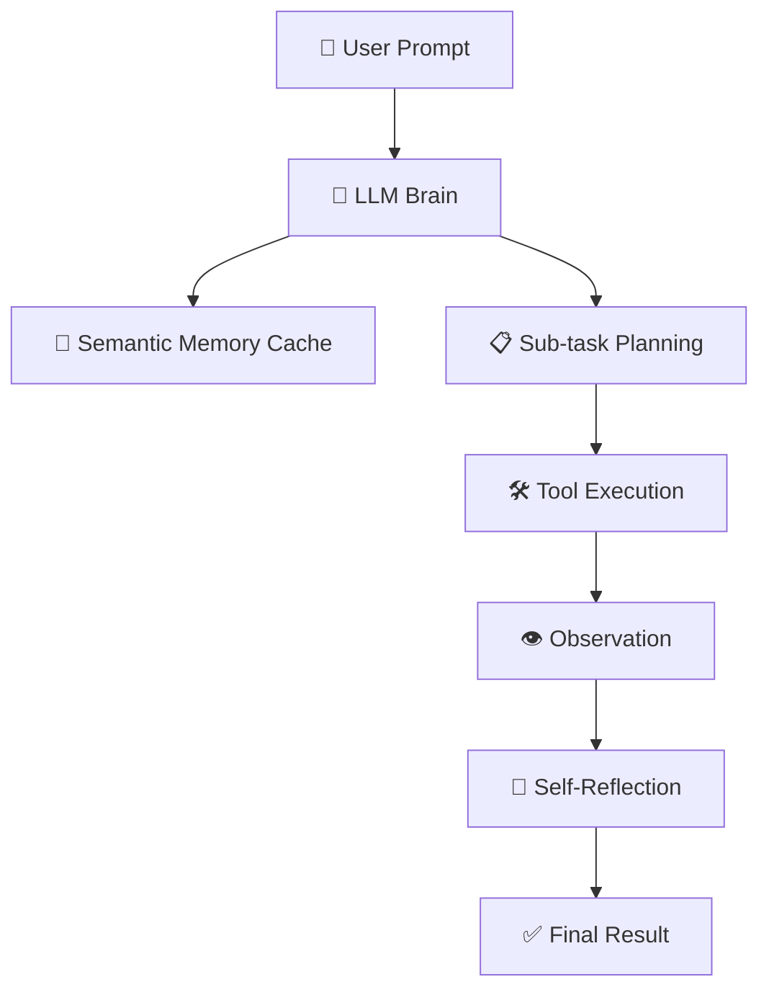

# 🧠 Agent Memory & Planning — The Reasoning Engine
> **Level:** Beginner → Expert | **Language:** Hinglish | **Goal:** Master Short-term vs Long-term Memory, Self-Reflection, Tool-use, and Planning Strategies (Chain of Thought, ReAct).

---

## 📋 Table of Contents: How Agents Think?

| Area | Topic | Role |
|------|-------|------|
| **1. Memory** | Short-term vs Long-term | User history aur global database access. |
| **2. Reasoning** | Chain of Thought (CoT) | Step-by-step problem solving. |
| **3. Planning** | ReAct & Reflection | Plan -> Action -> Review loop. |
| **4. Memory DB** | Vector Storage | Infinite memory (Semantic retrieval). |
| **5. Task Split** | Planning Nodes | Complex tasks ko sub-tasks mein baantna. |
| **6. Self-Correction**| Error Feedback | Galat output ko khud theek karna. |

---

## 🏗️ 1. Memory Systems: Forget vs Remember

Agents ko context yaad rakhna parta hai.
1. **Short-term Memory (Context Window):** Current chat ke pichle 10-20 messages. (Fast, but limited).
2. **Long-term Memory (Vector DB):** Mahino purani conversation ya kisi book ki knowledge. (Semantic search se retrieve hoti hai).

> 💡 **Mnemonic:** **S-L-R** (Short, Long, Retrieve). Memory hi agent ko "Smart" banati hai.

---

## 🧩 2. Planning Stategies: How to Solve?

### A. Chain of Thought (CoT):
LLM ko "Think step-by-step" bolne se woh logical steps calculate karta hai.
- **Goal:** Logical flow maintain karna (No jumps).

### B. ReAct (Reason + Act):
"Reasoning" aur "Acting" ko combine karna.
- **Step 1:** Reason (Mujhe kya karna chahiye?).
- **Step 2:** Act (Tool use karo - e.g. Search Google).
- **Step 3:** Observe (Results dekho).
- **Step 4:** Repeat.

---

## 🔄 3. Self-Reflection & Self-Correction

Bina reflection ke agent "Ziddi" ho jata hai.
- **Agent Reflection:** Ek second "Reviewer" agent jo pehle agent ka response check kare aur bataaye ke "Ye galat hai, logic theek karo".
- **Critique Loop:** "Aapka answer 100% correct nahi hai, reason: X. Please regenerate."

---

## 🛠️ 4. Tool Use & Tool Selection

Agent ko pata hona chahiye kaunsa tool kab use karna hai.
- **Tool Description Matters:** LLM sirf tool ke metadata (Name, Description) se decide karta hai use call karna hai ya nahi.
- **Parameters Passing:** `JSON` format mein Arguments extract karna for tool execution.

---

## 🧪 Quick Test — AI Agent Engineer Level!

### Q1: Agent "Hallucinate" kab karta hai?
**Answer:** Jab uske paas relevant context (Memory/Knowledge) nahi hota, aur woh random guess karta hai "Helpful" hone ke liye. Solution: **Grounding** with search tools.

### Q2: Memory Management in agents?
**Answer:** "Conversation Buffer Memory" (Sab yaad rakho) vs "Conversation Summary Memory" (Sirf summary yaad rakho for long chats).

---

## 🏗️ Architecture Design: The "Agent Brain"

---

## 🏆 Final Summary Checklist
- [ ] Short-term context window management?
- [ ] Vector database linked for Long-term retrieval?
- [ ] Planning strategy (CoT/ReAct) clearly defined?
- [ ] Reflection loop for error correction?

> **Agent Tip:** Intelligence without Memory is just a fancy calculator. Memory makes it an actual assistant.
