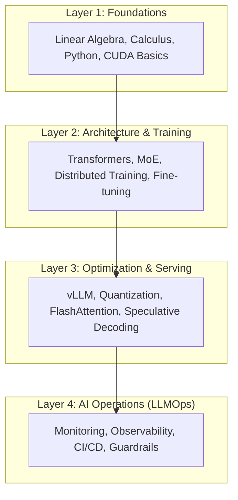

# 🗺️ AI Roadmap 2026: The Path to Becoming a Production AI Infrastructure Architect
> **Level:** Beginner to Architect | **Language:** Hinglish | **Goal:** Navigate the complex ecosystem of AI Engineering, from foundational mathematics to large-scale distributed infrastructure and LLMOps.

---

## 🧭 1. Beginner-Friendly Hinglish Explanation
AI Roadmap 2026 ka matlab hai wo rasta jo aapko sirf "AI User" se "AI Creator/Architect" banayega. 2026 mein industry sirf un logo ko value degi jo models ko sirf "use" nahi karte, balki unhe "optimise" aur "scale" karna jaante hain. 

Sochiye, ChatGPT se baat karna asan hai, par ek aisa system banana jo millions of log ek saath use karein bina slow huye, wo asli engineering hai. Is roadmap mein hum 5 bade stages cover karenge:
1. **The Core (Maths & Logic):** AI ki bhasha seekhna.
2. **The Brain (ML & DL):** Neural networks ko samajhna.
3. **The Language (NLP & Transformers):** Modern LLMs ki anatomy.
4. **The Muscle (Infrastructure):** GPUs, CUDA, aur Distributed training.
5. **The Shield (Ops & Security):** Model ko duniya ke liye safe aur fast banana.

---

## 🧠 2. Deep Technical Explanation
The AI Engineering stack in 2026 is no longer just about calling APIs. It has bifurcated into **AI Application Engineering** and **AI Infrastructure Engineering**. This roadmap focuses on the latter, which requires:
- **Low-Level Mastery:** Understanding how tensors are stored in VRAM and how they move across NVLink.
- **Optimization Mastery:** Knowing when to use FP8 vs BF16, and how Quantization (AWQ, GPTQ) impacts perplexity.
- **Distributed Systems:** Mastering Data Parallelism (DDP), Tensor Parallelism (TP), and Pipeline Parallelism (PP).
- **Inference Runtimes:** Deep dive into vLLM, TensorRT-LLM, and Triton Inference Server.
- **Evaluation Engineering:** Building automated "LLM-as-a-Judge" pipelines to replace human vibe-checks.

---

## 📐 3. Mathematical Intuition
Everything in AI is a **Function Approximation** problem in high-dimensional space.
- **Representation:** Data is transformed into vectors (Embeddings). If two concepts are similar, their vectors point in the same direction (Cosine Similarity).
- **The Search:** Optimization is about finding the global minimum of the **Loss Function** using Gradient Descent.
- **Non-Linearity:** Without activation functions (ReLU, GeLU), neural networks would just be giant linear regressions. 
- **Probability:** LLMs predict $P(w_t | w_{<t})$. The "Temperature" control is just a scaling factor in the **Softmax** function.

---

## 📊 4. Architecture Diagrams (The 2026 AI Stack)


---

## 💻 5. Production-Ready Examples (Profiling GPU Usage)
```python
# 2026 Pro-Tip: Before you deploy, you MUST profile memory.
import torch
from transformers import AutoModelForCausalLM

def profile_model_vram(model_id: str):
    print(f"Profiling Model: {model_id}")
    # Initial memory state
    start_mem = torch.cuda.memory_allocated() / 1024**3
    
    # Load model in 4-bit (Production Standard)
    model = AutoModelForCausalLM.from_pretrained(
        model_id, 
        load_in_4bit=True, 
        device_map="auto"
    )
    
    end_mem = torch.cuda.memory_allocated() / 1024**3
    print(f"VRAM Used: {end_mem - start_mem:.2f} GB")
    
    # Check max memory peaks during inference
    # This helps in sizing the right AWS/GCP instance.
    return model

# profile_model_vram("meta-llama/Llama-3-70b")
```

---

## ❌ 6. Failure Cases
- **Over-Optimization:** Quantizing a model to 2-bits (EXL2) to save cost, but the model starts talking gibberish (high perplexity).
- **Context Overload:** Sending a 100k token prompt to a model without a "KV Cache" management strategy, leading to 60-second latencies.
- **Hardware Mismatch:** Trying to run BF16 models on old T4 GPUs which don't support it natively, leading to slow emulation.

---

## 🛠️ 7. Debugging Guide
- **Symptom:** Model generates repetitive text.
- **Check:** **Penalty parameters**. Is `repetition_penalty` too low?
- **Check:** **Temperature**. Is it too low (making the model deterministic and boring)?
- **Check:** **Prompt Hijacking**. Is the system prompt being ignored by the user's input?

---

## ⚖️ 8. Tradeoffs
- **Precision vs. VRAM:** FP16 is accurate but needs 2x memory of INT8.
- **Latency vs. Throughput:** Batching 128 requests is efficient for the server (Throughput) but slow for the first user (Latency).
- **Latency vs. Cost:** Using GPT-4o is fast and easy but costs 50x more than a self-hosted Llama-3-8B.

---

## 🛡️ 9. Security Concerns
- **Prompt Injection:** Attacker bypasses your filters using "Ignore all previous instructions".
- **Data Leakage:** PII (Personal Identifiable Information) being leaked into the training set of a fine-tuned model.
- **Insecure Tools:** Giving an agent access to a Python shell without a Docker sandbox.

---

## 📈 10. Scaling Challenges
- **Cold Starts:** Loading a 140GB weights file into VRAM when a serverless function wakes up.
- **GPU Orchestration:** Handling failover when an A100 node goes down in the middle of a training run.
- **State Management:** Syncing conversation history across 50 distributed inference pods.

---

## 💸 11. Cost Considerations
- **Compute is the new Rent:** In 2026, 70% of AI startup costs are GPU bills.
- **Strategy:** Use "Small Models" (3B-8B) for 90% of tasks and "Giant Models" (GPT-4) only for routing and complex reasoning.
- **Optimization:** Use **Prompt Caching** to save 50-80% on input token costs.

---

## ✅ 12. Best Practices
- **Evaluation First:** Pehle benchmark banao, phir model badlo. Bina metrics ke change karna "Andhere mein teer marna" hai.
- **Modular Pipelines:** Keep your RAG, LLM, and Post-processing code separate.
- **Version Everything:** Weights, Prompts, and Datasets must have git-like versioning.

---

## ⚠️ 13. Common Mistakes
- **Hype Chasing:** Using a new framework every week without mastering the underlying CUDA/Python basics.
- **Ignoring Latency:** Building a great system that takes 30 seconds to reply (User will leave).
- **No Guardrails:** Deploying an agent to production without a "Safety Layer" (LlamaGuard/NeMo).

---

## 📝 14. Interview Questions
1. **"What is the difference between Pipeline Parallelism and Tensor Parallelism?"**
2. **"How do you handle 'Context Window' limitations in a long-running RAG system?"**
3. **"Explain why 'FlashAttention' is faster than standard 'Self-Attention'?"**

---

## 🚀 15. Latest 2026 Industry Patterns
- **Mixture of Experts (MoE):** Models like Mixtral that activate only 20% of their brain per token, saving huge compute.
- **Compound AI Systems:** Moving away from "One giant model" to "Multiple small specialized models" working together in a graph.
- **Speculative Decoding:** Using a 1B model to "guess" tokens and the 70B model to "verify" them, speeding up inference by 3x.

---

> **Final Roadmap Insight:** 2026 is the year of the **Efficiency Engineer**. The goal is no longer just "making it work," but "making it work at $0.001 per query with sub-second latency."
