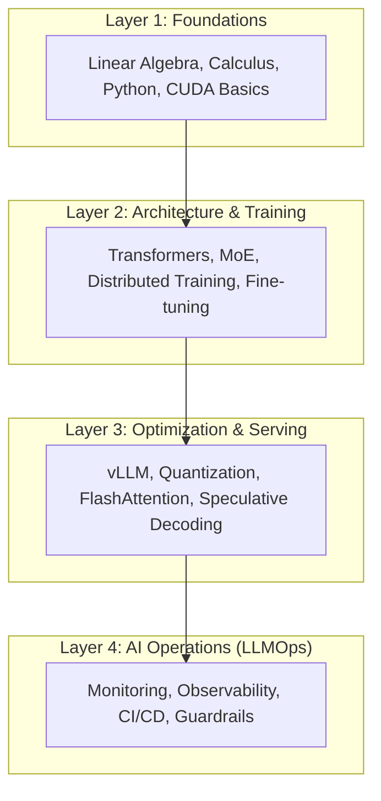

# 🗺️ AI Roadmap 2026: Production AI Infrastructure Architect Banne Ka Rasta
> **Level:** Beginner to Architect | **Language:** Hinglish | **Goal:** AI Engineering ke complex ecosystem ko navigate karna, foundational mathematics se lekar large-scale distributed infrastructure aur LLMOps tak.

---

## 🧭 1. Beginner-Friendly Hinglish Explanation
AI Roadmap 2026 ka matlab hai wo rasta jo aapko sirf "AI User" se "AI Creator/Architect" banayega. 2026 mein industry sirf un logo ko value degi jo models ko sirf "use" nahi karte, balki unhe "optimise" aur "scale" karna jaante hain. 

Sochiye, ChatGPT se baat karna asan hai, par ek aisa system banana jo millions of log ek saath use karein bina slow huye, wo asli engineering hai. Is roadmap mein hum 5 bade stages cover karenge:
1. **The Core (Maths & Logic):** AI ki bhasha seekhna.
2. **The Brain (ML & DL):** Neural networks ko samajhna.
3. **The Language (NLP & Transformers):** Modern LLMs ki anatomy.
4. **The Muscle (Infrastructure):** GPUs, CUDA, aur Distributed training.
5. **The Shield (Ops & Security):** Model ko duniya ke liye safe aur fast banana.

---

## 🧠 2. Deep Technical Explanation
2026 me AI Engineering stack ab sirf APIs call karne ke baare me nahi reh gaya hai. Ye do hisson me bat chuka hai: **AI Application Engineering** aur **AI Infrastructure Engineering**. Ye roadmap doosre wale (latter) par focus karta hai, jiske liye zaroori hai:
- **Low-Level Mastery:** Ye samajhna ki tensors VRAM me kaise store hote hain aur NVLink ke through kaise move karte hain.
- **Optimization Mastery:** Ye jaanna ki kab FP8 vs BF16 use karna hai, aur kaise Quantization (AWQ, GPTQ) perplexity ko impact karta hai.
- **Distributed Systems:** Data Parallelism (DDP), Tensor Parallelism (TP), aur Pipeline Parallelism (PP) me mastery haasil karna.
- **Inference Runtimes:** vLLM, TensorRT-LLM, aur Triton Inference Server ka deep dive.
- **Evaluation Engineering:** Automated "LLM-as-a-Judge" pipelines banana taaki human vibe-checks ko replace kiya ja sake.

---

## 📐 3. Mathematical Intuition
AI me sab kuch high-dimensional space me ek **Function Approximation** problem hai.
- **Representation:** Data ko vectors (Embeddings) me transform kiya jata hai. Agar do concepts similar hain, toh unke vectors same direction me point karte hain (Cosine Similarity).
- **The Search:** Optimization ka matlab hai Gradient Descent ka use karke **Loss Function** ka global minimum find karna.
- **Non-Linearity:** Activation functions (ReLU, GeLU) ke bina, neural networks sirf giant linear regressions bankar reh jayenge.
- **Probability:** LLMs $P(w_t | w_{<t})$ ko predict karte hain. "Temperature" control sirf **Softmax** function me ek scaling factor hai.

---

## 📊 4. Architecture Diagrams (The 2026 AI Stack)

```mermaid
graph TD
    subgraph "Layer 4: AI Operations (LLMOps)"
    Ops[Monitoring, Observability, CI/CD, Guardrails]
    end
    
    subgraph "Layer 3: Optimization & Serving"
    Inf[vLLM, Quantization, FlashAttention, Speculative Decoding]
    end
    
    subgraph "Layer 2: Architecture & Training"
    Arch[Transformers, MoE, Distributed Training, Fine-tuning]
    end
    
    subgraph "Layer 1: Foundations"
    Math[Linear Algebra, Calculus, Python, CUDA Basics]
    end

    Math --> Arch
    Arch --> Inf
    Inf --> Ops
```

---

## 💻 5. Production-Ready Examples (Profiling GPU Usage)
```python
# 2026 Pro-Tip: Deploy karne se pehle, aapko memory profile ZAROOR karni chahiye.
import torch
from transformers import AutoModelForCausalLM

def profile_model_vram(model_id: str):
    print(f"Profiling Model: {model_id}")
    # Initial memory state
    start_mem = torch.cuda.memory_allocated() / 1024**3
    
    # Model ko 4-bit me load karein (Production Standard)
    model = AutoModelForCausalLM.from_pretrained(
        model_id, 
        load_in_4bit=True, 
        device_map="auto"
    )
    
    end_mem = torch.cuda.memory_allocated() / 1024**3
    print(f"VRAM Used: {end_mem - start_mem:.2f} GB")
    
    # Inference ke dauran max memory peaks check karein
    # Ye right AWS/GCP instance size decide karne me help karta hai.
    return model

# profile_model_vram("meta-llama/Llama-3-70b")
```

---

## ❌ 6. Failure Cases
- **Over-Optimization:** Cost bachane ke liye model ko 2-bits (EXL2) me quantize karna, par model gibberish (high perplexity) baat karne lagta hai.
- **Context Overload:** Ek 100k token prompt ko bina kisi "KV Cache" management strategy ke model me bhejna, jisse 60-second latencies aati hain.
- **Hardware Mismatch:** BF16 models ko purane T4 GPUs par run karne ki koshish karna jo ise natively support nahi karte, jisse slow emulation hota hai.

---

## 🛠️ 7. Debugging Guide
- **Symptom:** Model repetitive text generate kar raha hai.
- **Check:** **Penalty parameters**. Kya `repetition_penalty` bahut low hai?
- **Check:** **Temperature**. Kya ye bahut low hai (jo model ko deterministic aur boring bana deta hai)?
- **Check:** **Prompt Hijacking**. Kya user ke input se system prompt ignore ho raha hai?

---

## ⚖️ 8. Tradeoffs
- **Precision vs. VRAM:** FP16 accurate hai par ise INT8 se 2x memory ki zaroorat hoti hai.
- **Latency vs. Throughput:** 128 requests ko batch karna server ke liye efficient (Throughput) hai par pehle user ke liye slow (Latency) hai.
- **Latency vs. Cost:** GPT-4o use karna fast aur easy hai par ye self-hosted Llama-3-8B se 50x expensive hota hai.

---

## 🛡️ 9. Security Concerns
- **Prompt Injection:** Attacker "Ignore all previous instructions" use karke aapke filters ko bypass kar deta hai.
- **Data Leakage:** Fine-tuned model ke training set me PII (Personal Identifiable Information) leak hona.
- **Insecure Tools:** Docker sandbox ke bina kisi agent ko Python shell ka access dena.

---

## 📈 10. Scaling Challenges
- **Cold Starts:** Jab koi serverless function wake up hota hai toh VRAM me 140GB weights file load karna.
- **GPU Orchestration:** Ek training run ke beech me jab koi A100 node down ho jata hai toh failover ko handle karna.
- **State Management:** 50 distributed inference pods ke beech conversation history ko sync karna.

---

## 💸 11. Cost Considerations
- **Compute is the new Rent:** 2026 me, AI startup ke 70% costs GPU bills hote hain.
- **Strategy:** 90% tasks ke liye "Small Models" (3B-8B) aur routing aur complex reasoning ke liye sirf "Giant Models" (GPT-4) use karein.
- **Optimization:** Input token costs par 50-80% save karne ke liye **Prompt Caching** ka use karein.

---

## ✅ 12. Best Practices
- **Evaluation First:** Pehle benchmark banao, phir model badlo. Bina metrics ke change karna "Andhere mein teer marna" hai.
- **Modular Pipelines:** Apne RAG, LLM, aur Post-processing code ko separate rakhein.
- **Version Everything:** Weights, Prompts, aur Datasets ka git-like versioning hona zaroori hai.

---

## ⚠️ 13. Common Mistakes
- **Hype Chasing:** Underlying CUDA/Python basics ko master kiye bina har hafte naya framework use karna.
- **Ignoring Latency:** Ek aisa badhiya system banana jo reply karne me 30 seconds leta hai (User chala jayega).
- **No Guardrails:** Kisi "Safety Layer" (LlamaGuard/NeMo) ke bina production me agent deploy karna.

---

## 📝 14. Interview Questions
1. **"Pipeline Parallelism aur Tensor Parallelism me kya difference hai?"**
2. **"Ek long-running RAG system me aap 'Context Window' ki limitations ko kaise handle karte hain?"**
3. **"Explain karein ki 'FlashAttention' standard 'Self-Attention' se fast kyun hai?"**

---

## 🚀 15. Latest 2026 Industry Patterns
- **Mixture of Experts (MoE):** Mixtral jaise models jo per token apne brain ka sirf 20% activate karte hain, jisse compute bahut save hota hai.
- **Compound AI Systems:** "One giant model" se hatkar "Multiple small specialized models" ki taraf badhna jo ek graph me saath kaam karte hain.
- **Speculative Decoding:** Tokens ko "guess" karne ke liye 1B model aur unhe "verify" karne ke liye 70B model ka use karna, jisse inference speed 3x badh jaati hai.

---

> **Final Roadmap Insight:** 2026 **Efficiency Engineer** ka saal hai. Ab goal sirf "work karwana" nahi hai, balki use "$0.001 per query par sub-second latency" ke saath chalana hai.
