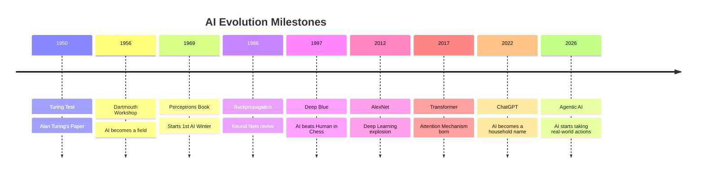

# 📜 History of AI: From Logic Gates to Generative Giants
> **Level:** Beginner | **Language:** Hinglish | **Goal:** Trace the evolution of Artificial Intelligence through its philosophical origins, technical breakthroughs, and the "AI Winters" to the modern era of Large Language Models.

---

## 🧭 1. Beginner-Friendly Hinglish Explanation
AI ki kahani koi nayi baat nahi hai, ye 1950s se chalti aa rahi hai. Is safar ko hum 4 bade hisson mein baant sakte hain:

1. **The Birth (1950s):** Jab Alan Turing ne pucha, "Kya machine soch sakti hai?". Pehle AI sirf "Logic" aur "Maths" par focus karte the.
2. **The First Hype & Winter (1960s-1980s):** Shuruat mein bahut bade-bade waade kiye gaye par hardware kamzor tha. Is wajah se funding band ho gayi, jise hum "AI Winter" kehte hain.
3. **Machine Learning Era (1990s-2010):** Jab humne "Rules" likhna choda aur data se "Pattern" dhoondhna shuru kiya. Isi waqt Deep Blue ne Chess mein world champion ko haraya.
4. **The Deep Learning & GenAI Revolution (2012-Today):** GPUs aur Internet data ki wajah se AI achanak bahut smart ho gaya. 2017 mein "Transformer" architecture ne sab kuch badal diya, jiske bina ChatGPT kabhi na ban pata.

---

## 🧠 2. Deep Technical Explanation
The technical evolution of AI is a battle between **Symbolic AI (GOFAI)** and **Connectionism (Neural Networks)**:
- **1956 (Dartmouth Workshop):** Official birth of AI. Initial success in logic-based systems (Logic Theorist).
- **1960s-70s (Perceptrons):** Early neural networks. Minsky & Papert proved they couldn't solve simple non-linear problems like XOR, leading to the **First AI Winter**.
- **1986 (Backpropagation):** Hinton and others popularized Backprop, allowing multi-layer networks to learn.
- **1997 (Deep Blue):** IBM's system beat Garry Kasparov, proving symbolic search can win complex games.
- **2012 (AlexNet):** Using CNNs on GPUs won ImageNet with a massive margin. **The Deep Learning Era** begins.
- **2017 (Attention is All You Need):** Google researchers introduced the Transformer, replacing RNNs/LSTMs with a parallelizable mechanism that treats the entire sequence at once.
- **2022-2026 (GenAI):** Models like GPT-4, Llama, and Sora prove that "Scaling Laws" (More compute + More data) lead to emergent reasoning.

---

## 📊 3. Key Milestones Timeline


---

## 🏗️ 4. The "AI Winter" Cycles
Why did AI fail in the past?
- **Computation Gap:** Neural networks are hungry. 1980s computers were like pocket calculators compared to today's H100s.
- **Data Gap:** Before the internet, where would you get 1 trillion tokens of text?
- **Over-Promising:** Scientists claimed AI would solve human intelligence in 10 years. When it didn't, investors pulled out.

---

## 📐 5. Mathematical Shift
- **Early AI:** Focus on **Discrete Mathematics** (Graph search, Logic).
- **Modern AI:** Focus on **Continuous Mathematics** (Calculus, Linear Algebra, Probability).
- **The Core Idea:** Moving from "Is it True/False?" to "How likely is it to be true?".

---

## 💻 6. Production-Ready Examples (Rule-based vs Learning-based)
```python
# Old Era (1970s): Rule-based Diagnosis
def expert_system(symptoms):
    rules = {
        "fever + cough": "Flu",
        "chest pain": "Emergency",
        "red eyes": "Allergy"
    }
    return rules.get(symptoms, "Unknown")

# Modern Era (2026): Neural/Probabilistic Diagnosis
def ai_system(symptoms_vector):
    # This vector is passed through 100 layers of math
    prediction = neural_network.forward(symptoms_vector)
    return f"Probabilistic Match: {prediction}"

# Difference: The rule-based system fails if the symptom is "fever + red eyes".
# The AI system finds the nearest statistical match.
```

---

## ❌ 7. Failure Cases
- **Expert Systems Brittleness:** In the 80s, medical expert systems failed because they couldn't handle "Uncertainty" or cases they weren't explicitly told about.
- **The Perceptron Trap:** Believing that a single-layer model could solve everything (led to the first winter).
- **Bias Legacy:** Historical datasets (like those from the 90s) were heavily biased towards certain demographics, a problem we are still fighting today.

---

## 🛠️ 8. Debugging Guide (Historical Perspective)
- **Symptom:** Why did Neural Networks stop learning in the 90s?
- **Fix:** **Vanishing Gradients**. We solved it by using **ReLU** activation instead of Sigmoid and using **ResNets** (residual connections).
- **Fix:** **Hardware**. We moved from CPUs to GPUs (originally made for games) to do massive parallel math.

---

## ⚖️ 9. Tradeoffs
- **Symbolic AI:** High explainability, Low flexibility.
- **Connectionism (Neural Nets):** Low explainability (Black Box), High flexibility.
- **Modern Trend:** **Neuro-symbolic AI** — trying to get the best of both worlds.

---

## 🛡️ 10. Security Concerns
- **Historical Hallucinations:** AI has always "guessed" things. In the past, it was a logic error; now it's a linguistic hallucination.
- **Deepfakes:** Since 2018 (GANs), the ability to fake history/reality has become a major global threat.

---

## 📈 11. Scaling Challenges
- **The Data Wall:** We are running out of high-quality human text on the internet.
- **Energy Crisis:** Training a 2026-level model requires a small nuclear power plant's worth of energy.

---

## 💸 12. Cost Considerations
- **1950s:** Computer time cost $1000s per hour.
- **2026:** LLM tokens cost $0.00001 per million, but training them costs $1 Billion+.

---

## ✅ 13. Best Practices
- **Master the Basics:** Don't just learn "how to prompt"; learn the history of **Backpropagation** and **Backtracking** to understand how AI thinks.
- **Be Skeptical of Hype:** Every era had a "Hype cycle". Real value comes from long-term stability.

---

## 📝 14. Interview Questions
1. **"What caused the first AI winter?"** (Complexity of real-world data and limited compute).
2. **"Difference between Symbolic AI and Connectionism?"** (Rules vs. Neural Networks).
3. **"Why was the AlexNet moment significant?"** (It proved that GPUs + Big Data + Deep Nets = SOTA results).

---

## 🚀 15. Latest 2026 Industry Patterns
- **Retrospective Learning:** AI models that read their own history and "Self-correct" their internal logic.
- **Sustainable AI:** A shift from "Bigger is Better" to "Smaller and Smarter" to avoid the environmental cost of training.
- **World Models:** Moving from text prediction to predicting physical reality (Video and Physics).
