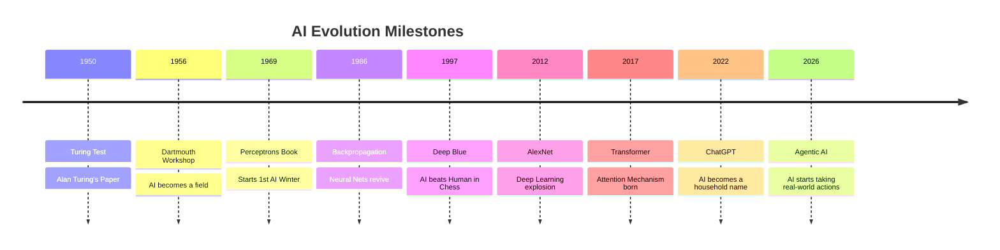

# 📜 History of AI: Logic Gates Se Lekar Generative Giants Tak
> **Level:** Beginner | **Language:** Hinglish | **Goal:** Artificial Intelligence ke evolution ko iske philosophical origins, technical breakthroughs, aur "AI Winters" se lekar Large Language Models ke modern era tak trace karna.

---

## 🧭 1. Beginner-Friendly Hinglish Explanation
AI ki kahani koi nayi baat nahi hai, ye 1950s se chalti aa rahi hai. Is safar ko hum 4 bade hisson mein baant sakte hain:

1. **The Birth (1950s):** Jab Alan Turing ne pucha, "Kya machine soch sakti hai?". Pehle AI sirf "Logic" aur "Maths" par focus karte the.
2. **The First Hype & Winter (1960s-1980s):** Shuruat mein bahut bade-bade waade kiye gaye par hardware kamzor tha. Is wajah se funding band ho gayi, jise hum "AI Winter" kehte hain.
3. **Machine Learning Era (1990s-2010):** Jab humne "Rules" likhna choda aur data se "Pattern" dhoondhna shuru kiya. Isi waqt Deep Blue ne Chess mein world champion ko haraya.
4. **The Deep Learning & GenAI Revolution (2012-Today):** GPUs aur Internet data ki wajah se AI achanak bahut smart ho gaya. 2017 mein "Transformer" architecture ne sab kuch badal diya, jiske bina ChatGPT kabhi na ban pata.

---

## 🧠 2. Deep Technical Explanation
AI ka technical evolution asal me **Symbolic AI (GOFAI)** aur **Connectionism (Neural Networks)** ke beech ki ek jang hai:
- **1956 (Dartmouth Workshop):** AI ka official birth. Logic-based systems (Logic Theorist) me initial success mili.
- **1960s-70s (Perceptrons):** Early neural networks. Minsky & Papert ne prove kiya ki ye XOR jaise simple non-linear problems ko solve nahi kar sakte, jisse **First AI Winter** shuru hua.
- **1986 (Backpropagation):** Hinton aur doosre researchers ne Backprop ko popularize kiya, jisse multi-layer networks ke liye seekhna possible ho gaya.
- **1997 (Deep Blue):** IBM ke system ne Garry Kasparov ko haraya, jisse ye prove hua ki symbolic search complex games ko jeet sakti hai.
- **2012 (AlexNet):** GPUs par CNNs ka use karke ImageNet ko massive margin se jeeta gaya. Yahan se **The Deep Learning Era** shuru hota hai.
- **2017 (Attention is All You Need):** Google ke researchers ne Transformer introduce kiya, jisne RNNs/LSTMs ko ek parallelizable mechanism se replace kiya jo puri sequence ko ek saath process karta hai.
- **2022-2026 (GenAI):** GPT-4, Llama, aur Sora jaise models ne prove kiya ki "Scaling Laws" (More compute + More data) se emergent reasoning paida hoti hai.

---

## 📊 3. Key Milestones Timeline

```mermaid
timeline
    title AI Evolution Milestones
    1950 : Turing Test : Alan Turing's Paper
    1956 : Dartmouth Workshop : AI becomes a field
    1969 : Perceptrons Book : Starts 1st AI Winter
    1986 : Backpropagation : Neural Nets revive
    1997 : Deep Blue : AI beats Human in Chess
    2012 : AlexNet : Deep Learning explosion
    2017 : Transformer : Attention Mechanism born
    2022 : ChatGPT : AI becomes a household name
    2026 : Agentic AI : AI starts taking real-world actions
```

---

## 🏗️ 4. The "AI Winter" Cycles
Past me AI fail kyun hua?
- **Computation Gap:** Neural networks computational resource ke bhookhe hote hain. 1980s ke computers aaj ke H100s ke samne pocket calculators ki tarah the.
- **Data Gap:** Internet se pehle, aap 1 trillion tokens ka text kahan se laate?
- **Over-Promising:** Scientists ne claim kiya tha ki AI 10 saal me human intelligence ko solve kar dega. Jab aisa nahi hua, toh investors ne apna paisa nikal liya.

---

## 📐 5. Mathematical Shift
- **Early AI:** Focus **Discrete Mathematics** (Graph search, Logic) par tha.
- **Modern AI:** Focus **Continuous Mathematics** (Calculus, Linear Algebra, Probability) par hai.
- **The Core Idea:** "Kya ye True/False hai?" se shift hokar "Iske true hone ki kitni probability hai?" par aana.

---

## 💻 6. Production-Ready Examples (Rule-based vs Learning-based)
```python
# Purana Daur (1970s): Rule-based Diagnosis
def expert_system(symptoms):
    rules = {
        "fever + cough": "Flu",
        "chest pain": "Emergency",
        "red eyes": "Allergy"
    }
    return rules.get(symptoms, "Unknown")

# Modern Daur (2026): Neural/Probabilistic Diagnosis
def ai_system(symptoms_vector):
    # Ye vector math ki 100 layers se pass hota hai
    prediction = neural_network.forward(symptoms_vector)
    return f"Probabilistic Match: {prediction}"

# Difference: Agar symptom "fever + red eyes" ho toh rule-based system fail ho jata hai.
# AI system nearest statistical match find kar leta hai.
```

---

## ❌ 7. Failure Cases
- **Expert Systems Brittleness:** 80s me medical expert systems isliye fail ho gaye kyunki wo "Uncertainty" ko handle nahi kar sakte the ya fir un cases ko jo unhe explicitly bataye nahi gaye the.
- **The Perceptron Trap:** Ye maan lena ki ek single-layer model sab kuch solve kar sakta hai (jiski wajah se pehla winter aaya).
- **Bias Legacy:** Historical datasets (jaise 90s wale) kuch specific demographics ke prati heavily biased the, ek aisi problem jisse hum aaj bhi lad rahe hain.

---

## 🛠️ 8. Debugging Guide (Historical Perspective)
- **Symptom:** 90s me Neural Networks ne learn karna kyun band kar diya tha?
- **Fix:** **Vanishing Gradients**. Humne ise Sigmoid ki jagah **ReLU** activation aur **ResNets** (residual connections) ka use karke solve kiya.
- **Fix:** **Hardware**. Humne massive parallel math karne ke liye CPUs se GPUs (jo originally games ke liye bane the) par shift kiya.

---

## ⚖️ 9. Tradeoffs
- **Symbolic AI:** High explainability, Low flexibility.
- **Connectionism (Neural Nets):** Low explainability (Black Box), High flexibility.
- **Modern Trend:** **Neuro-symbolic AI** — dono worlds ka best paane ki koshish karna.

---

## 🛡️ 10. Security Concerns
- **Historical Hallucinations:** AI ne hamesha cheezein "guess" ki hain. Past me ye ek logic error tha; ab ye ek linguistic hallucination hai.
- **Deepfakes:** 2018 (GANs) se lekar ab tak, history/reality ko fake karne ki ability ek major global threat ban chuki hai.

---

## 📈 11. Scaling Challenges
- **The Data Wall:** Internet par humare paas high-quality human text khatam ho raha hai.
- **Energy Crisis:** 2026-level ke model ko train karne ke liye ek chhote nuclear power plant jitni energy ki zaroorat hoti hai.

---

## 💸 12. Cost Considerations
- **1950s:** Computer time ki cost per hour $1000s hoti thi.
- **2026:** LLM tokens ki cost $0.00001 per million hai, lekin unhe train karne me $1 Billion+ lagta hai.

---

## ✅ 13. Best Practices
- **Master the Basics:** Sirf "how to prompt" mat seekho; AI kaise sochta hai ye samajhne ke liye **Backpropagation** aur **Backtracking** ki history ko bhi seekho.
- **Be Skeptical of Hype:** Har era ka ek "Hype cycle" hota tha. Asli value long-term stability se aati hai.

---

## 📝 14. Interview Questions
1. **"Pehle AI winter ki kya wajah thi?"** (Real-world data ki complexity aur limited compute).
2. **"Symbolic AI aur Connectionism me kya difference hai?"** (Rules vs. Neural Networks).
3. **"AlexNet moment kyun significant tha?"** (Isne prove kiya ki GPUs + Big Data + Deep Nets = SOTA results).

---

## 🚀 15. Latest 2026 Industry Patterns
- **Retrospective Learning:** AI models jo apni khud ki history ko read karte hain aur apni internal logic ko "Self-correct" karte hain.
- **Sustainable AI:** Training ke environmental cost se bachne ke liye "Bigger is Better" se shift hokar "Smaller and Smarter" ki taraf badhna.
- **World Models:** Text prediction se hatkar physical reality (Video aur Physics) ko predict karne ki taraf badhna.
