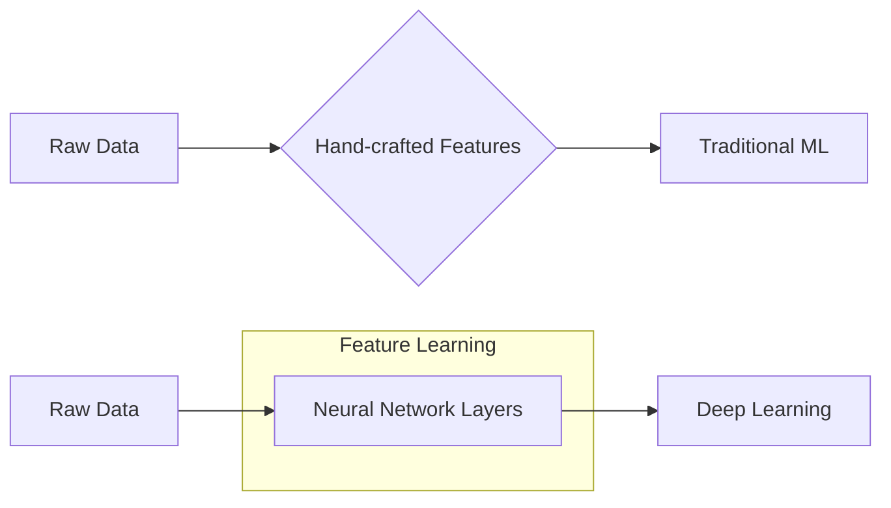

# 🤖 What is AI, ML, DL, and LLM? The Hierarchy of Intelligence
> **Level:** Beginner | **Language:** Hinglish | **Goal:** Master the conceptual boundaries and engineering differences between Artificial Intelligence, Machine Learning, Deep Learning, and Large Language Models.

---

## 🧭 1. Beginner-Friendly Hinglish Explanation
AI ki duniya aksar confusion se bhari hoti hai kyunki log in terms ko mix kar dete hain. Asliyat mein ye ek "Russian Nesting Doll" (ek ke andar ek) ki tarah hai:

1. **AI (Artificial Intelligence):** Ye sabse bada circle hai. Iska matlab hai "Computer ko chalak banana". Agar ek program simple If-Else se chess khel raha hai, toh wo bhi AI hai.
2. **ML (Machine Learning):** AI ka wo part jahan hum computer ko rules nahi sikhate, balki data dikhate hain. "Ye dekho 10,000 kutte ki photos, ab khud seekho kutta kaisa dikhta hai".
3. **DL (Deep Learning):** ML ka advance version jo "Insaan ke dimaag" (Neural Networks) se inspired hai. Isme layers hoti hain jo complex patterns (jaise awaaz ya chehra) ko pehchanti hain.
4. **LLM (Large Language Models):** DL ka wo specialized branch jo sirf "Language" (bhasha) par focus karta hai. Jaise ChatGPT ya Llama. Ye billions of books padh kar seekhte hain ki agla word kya hona chahiye.

---

## 🧠 2. Deep Technical Explanation
The hierarchy is defined by the **abstraction of feature engineering**:
- **Symbolic AI:** Explicit rules. Features are hand-crafted by domain experts. No "learning" involved.
- **Machine Learning (Classical):** Algorithms like Random Forest, SVM, or XGBoost. Features are still mostly hand-crafted (Feature Engineering), but the decision boundary is learned statistically.
- **Deep Learning:** Features are learned automatically through **Representation Learning**. Multiple layers of non-linear transformations extract increasingly abstract features (edges -> shapes -> objects).
- **Large Language Models (LLMs):** A subset of Deep Learning using the **Transformer Architecture**. They leverage **Unsupervised Pre-training** on internet-scale data. Their "Emergent Abilities" (reasoning, coding) come from the sheer scale of parameters and data.

---

## 🏗️ 3. Architecture Comparison
| Concept | Core Mechanism | Input Type | Best For |
| :--- | :--- | :--- | :--- |
| **AI (Rules)** | Logic Trees | Structured | Simple automation, Games |
| **ML (Classical)** | Statistics / Trees | Tabular (Excel) | Fraud detection, Churn prediction |
| **DL** | Neural Networks | Unstructured (Img/Audio) | Face ID, Self-driving cars |
| **LLM** | Transformers | Text / Tokens | Writing, Coding, Reasoning |

---

## 📐 4. Mathematical Intuition
- **ML:** Finding a hyperplane that separates two classes in a feature space.
- **DL:** Stacking multiple matrices to approximate a non-linear function $y = f(x; \theta)$.
- **LLM:** Predicting the conditional probability of the next token $x_t$ given the sequence $x_{1...t-1}$:
  $$P(x_t | x_{1...t-1}) = \text{Softmax}(\text{Transformer}(x_{1...t-1}))$$

---

## 📊 5. Feature Engineering Evolution (Diagram)


---

## 💻 6. Production-Ready Examples (Choosing the Right Tool)
```python
# 2026 Strategy: Use the simplest tool that works.

# 1. Simple AI (Rule-based)
def calculate_tax(income):
    if income < 50000: return 0
    return income * 0.2

# 2. Machine Learning (Scikit-learn) - For tabular data
from sklearn.ensemble import RandomForestClassifier
def predict_churn(customer_data):
    model = RandomForestClassifier().fit(X_train, y_train)
    return model.predict(customer_data)

# 3. LLM (OpenAI/Ollama) - For reasoning/language
def summarize_legal_doc(text):
    return llm.invoke(f"Summarize this document: {text}")

# Pro-tip: Don't use an LLM for tax calculation! It might hallucinate numbers.
```

---

## ❌ 7. Failure Cases
- **Overkill Failure:** Using an LLM for a task that is $100\%$ deterministic (like sorting a list). It's slow and expensive.
- **Black Box Failure:** Using Deep Learning for bank loan approvals where "Explainability" is legally required. Classical ML (Decision Trees) is better here.
- **Data Starvation:** Training a Deep Learning model with $500$ rows of data. It will overfit instantly.

---

## 🛠️ 8. Debugging Guide
- **Symptom:** Your LLM is giving inconsistent answers.
- **Fix:** Check **Temperature** (set to 0 for consistency).
- **Check:** **Prompt Clarity**. Are you giving enough context?
- **Check:** **Model Size**. Are you using a 1B model for a 70B-level reasoning task?

---

## ⚖️ 9. Tradeoffs
- **Traditional ML:** Fast, cheap, runs on CPU, explainable.
- **Deep Learning:** High accuracy on complex data, needs GPU, hard to explain.
- **LLM:** Zero-shot capability (no training needed), extremely expensive, high latency.

---

## 🛡️ 10. Security Concerns
- **Data Privacy:** Sending customer data to a cloud LLM provider.
- **Adversarial Attacks:** Adding "invisible" pixels to an image to make a DL model think a stop sign is a speed limit sign.
- **Prompt Injection:** Tricking an LLM into leaking its system prompt or private database info.

---

## 📈 11. Scaling Challenges
- **Compute:** LLMs need $H100$ clusters. ML needs a single $T4$ or even a CPU.
- **Dataset Management:** Moving from MBs of CSV files (ML) to TBs of unstructured text/images (DL/LLM).

---

## 💸 12. Cost Considerations
- **ML:** Milliseconds of CPU time ($\approx \$0.00001$).
- **DL Inference:** Milliseconds of GPU time ($\approx \$0.0001$).
- **LLM Inference:** Seconds of GPU time ($\approx \$0.01$ per query).
- **Conclusion:** A $1000x$ cost difference exists between ML and LLM. Choose wisely.

---

## ✅ 13. Best Practices
- **Data First:** Good data + simple ML $>$ Bad data + complex LLM.
- **Evaluate Cost:** Calculate the "Cost per 1,000 calls" before finalizing an architecture.
- **Hybrid Approach:** Use ML for filtering/routing and LLM for the final "Smart" response.

---

## ⚠️ 14. Common Mistakes
- **Hype-driven Development:** Using LLMs for everything just because they are popular.
- **Ignoring Baseline:** Not comparing your fancy Deep Learning model against a simple Linear Regression.
- **Ignoring Inference Speed:** Building a model that takes 10 seconds to respond to a web request.

---

## 📝 15. Interview Questions
1. **"Can a Deep Learning model work without Feature Engineering?"** (Yes, that's its main purpose).
2. **"Difference between Supervised and Unsupervised Learning in the context of LLMs?"** (Pre-training is Unsupervised, Fine-tuning is Supervised).
3. **"Why do we need Neural Networks for Image recognition but not for house price prediction?"** (Images have high-dimensional spatial patterns that linear models can't capture).

---

## 🚀 15. Latest 2026 Industry Patterns
- **Edge AI:** Running "Micro-LLMs" (under 1B parameters) locally on mobile phones to reduce latency and cost.
- **Neuro-Symbolic AI:** Mixing the hard logic of "Rule-based AI" with the creative reasoning of "LLMs" to solve complex math and scientific problems.
