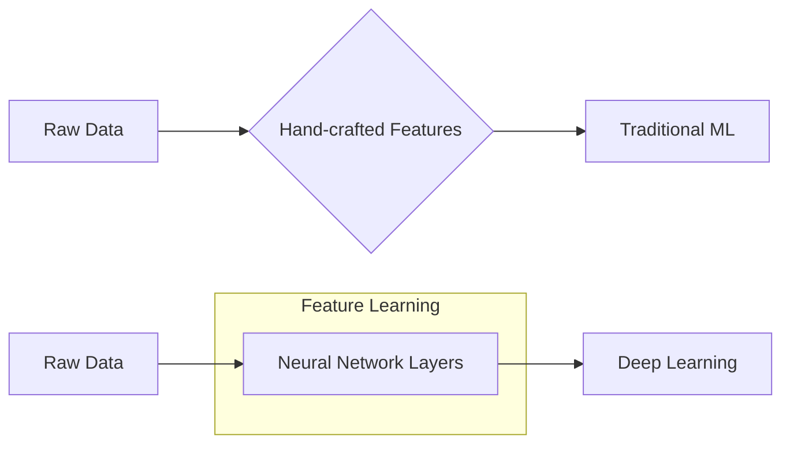

# 🤖 What is AI, ML, DL, and LLM? The Hierarchy of Intelligence
> **Level:** Beginner | **Language:** Hinglish | **Goal:** Artificial Intelligence, Machine Learning, Deep Learning, aur Large Language Models ke beech ke conceptual boundaries aur engineering differences ko master karna.

---

## 🧭 1. Beginner-Friendly Hinglish Explanation
AI ki duniya aksar confusion se bhari hoti hai kyunki log in terms ko mix kar dete hain. Asliyat mein ye ek "Russian Nesting Doll" (ek ke andar ek) ki tarah hai:

1. **AI (Artificial Intelligence):** Ye sabse bada circle hai. Iska matlab hai "Computer ko chalak banana". Agar ek program simple If-Else se chess khel raha hai, toh wo bhi AI hai.
2. **ML (Machine Learning):** AI ka wo part jahan hum computer ko rules nahi sikhate, balki data dikhate hain. "Ye dekho 10,000 kutte ki photos, ab khud seekho kutta kaisa dikhta hai".
3. **DL (Deep Learning):** ML ka advance version jo "Insaan ke dimaag" (Neural Networks) se inspired hai. Isme layers hoti hain jo complex patterns (jaise awaaz ya chehra) ko pehchanti hain.
4. **LLM (Large Language Models):** DL ka wo specialized branch jo sirf "Language" (bhasha) par focus karta hai. Jaise ChatGPT ya Llama. Ye billions of books padh kar seekhte hain ki agla word kya hona chahiye.

---

## 🧠 2. Deep Technical Explanation
Intelligence ki hierarchy ko **feature engineering ki abstraction** se define kiya jata hai:
- **Symbolic AI:** Explicit rules hote hain. Features ko domain experts dwara hand-craft kiya jata hai. Isme koi "learning" involve nahi hoti.
- **Machine Learning (Classical):** Algorithms jaise Random Forest, SVM, ya XGBoost. Features ab bhi mostly hand-crafted (Feature Engineering) hote hain, lekin decision boundary ko statistically seekha jata hai.
- **Deep Learning:** Features ko **Representation Learning** ke zariye automatically seekha jata hai. Non-linear transformations ki multiple layers increasingly abstract features (edges -> shapes -> objects) ko extract karti hain.
- **Large Language Models (LLMs):** Deep Learning ka ek subset jo **Transformer Architecture** use karta hai. Ye internet-scale data par **Unsupervised Pre-training** ka use karte hain. Unki "Emergent Abilities" (reasoning, coding) parameters aur data ke sheer scale se aati hain.

---

## 🏗️ 3. Architecture Comparison
| Concept | Core Mechanism | Input Type | Best For |
| :--- | :--- | :--- | :--- |
| **AI (Rules)** | Logic Trees | Structured | Simple automation, Games |
| **ML (Classical)** | Statistics / Trees | Tabular (Excel) | Fraud detection, Churn prediction |
| **DL** | Neural Networks | Unstructured (Img/Audio) | Face ID, Self-driving cars |
| **LLM** | Transformers | Text / Tokens | Writing, Coding, Reasoning |

---

## 📐 4. Mathematical Intuition
- **ML:** Ek aisi hyperplane find karna jo feature space me do classes ko separate karti hai.
- **DL:** Ek non-linear function $y = f(x; \theta)$ ko approximate karne ke liye multiple matrices ko stack karna.
- **LLM:** Sequence $x_{1...t-1}$ ke diye hone par agle token $x_t$ ki conditional probability ko predict karna:
  $$P(x_t | x_{1...t-1}) = \text{Softmax}(\text{Transformer}(x_{1...t-1}))$$

---

## 📊 5. Feature Engineering Evolution (Diagram)

```mermaid
graph LR
    A[Raw Data] --> B{Hand-crafted Features}
    B --> C[Traditional ML]
    
    D[Raw Data] --> E[Neural Network Layers]
    E --> F[Deep Learning]
    
    subgraph "Feature Learning"
    E
    end
```

---

## 💻 6. Production-Ready Examples (Choosing the Right Tool)
```python
# 2026 Strategy: Jo simplest tool kaam kare, wahi use karein.

# 1. Simple AI (Rule-based)
def calculate_tax(income):
    if income < 50000: return 0
    return income * 0.2

# 2. Machine Learning (Scikit-learn) - Tabular data ke liye
from sklearn.ensemble import RandomForestClassifier
def predict_churn(customer_data):
    model = RandomForestClassifier().fit(X_train, y_train)
    return model.predict(customer_data)

# 3. LLM (OpenAI/Ollama) - Reasoning/language ke liye
def summarize_legal_doc(text):
    return llm.invoke(f"Summarize this document: {text}")

# Pro-tip: Tax calculation ke liye LLM use mat karein! Ye numbers hallucinate kar sakta hai.
```

---

## ❌ 7. Failure Cases
- **Overkill Failure:** Ek aisi task ke liye LLM use karna jo $100\%$ deterministic hai (jaise list ko sort karna). Ye slow aur expensive hota hai.
- **Black Box Failure:** Bank loan approvals ke liye Deep Learning ka use karna jahan "Explainability" legally required hai. Classical ML (Decision Trees) yahan better option hai.
- **Data Starvation:** Sirf $500$ rows of data ke saath Deep Learning model train karna. Ye instantly overfit ho jayega.

---

## 🛠️ 8. Debugging Guide
- **Symptom:** Aapka LLM inconsistent answers de raha hai.
- **Fix:** **Temperature** check karein (consistency ke liye 0 set karein).
- **Check:** **Prompt Clarity**. Kya aap enough context de rahe hain?
- **Check:** **Model Size**. Kya aap 70B-level reasoning task ke liye 1B model use kar rahe hain?

---

## ⚖️ 9. Tradeoffs
- **Traditional ML:** Fast, cheap, CPU par run karta hai, explainable hai.
- **Deep Learning:** Complex data par high accuracy, GPU ki need hoti hai, explain karna mushkil hai.
- **LLM:** Zero-shot capability (kisi training ki zaroorat nahi), extremely expensive, high latency.

---

## 🛡️ 10. Security Concerns
- **Data Privacy:** Customer ka data cloud LLM provider ko send karna.
- **Adversarial Attacks:** Kisi image me "invisible" pixels add karna taaki DL model stop sign ko speed limit sign samajh le.
- **Prompt Injection:** LLM ko trick karna taaki wo apna system prompt ya private database info leak kar de.

---

## 📈 11. Scaling Challenges
- **Compute:** LLMs ko $H100$ clusters ki zaroorat hoti hai. ML ko ek single $T4$ ya CPU ki zaroorat hoti hai.
- **Dataset Management:** MBs of CSV files (ML) se shift hokar TBs of unstructured text/images (DL/LLM) par jana.

---

## 💸 12. Cost Considerations
- **ML:** CPU time ke milliseconds ($\approx \$0.00001$).
- **DL Inference:** GPU time ke milliseconds ($\approx \$0.0001$).
- **LLM Inference:** GPU time ke seconds ($\approx \$0.01$ per query).
- **Conclusion:** ML aur LLM ke beech $1000x$ cost difference hota hai. Wisely select karein.

---

## ✅ 13. Best Practices
- **Data First:** Good data + simple ML $>$ Bad data + complex LLM.
- **Evaluate Cost:** Architecture finalize karne se pehle "Cost per 1,000 calls" calculate karein.
- **Hybrid Approach:** Filtering/routing ke liye ML aur final "Smart" response ke liye LLM ka use karein.

---

## ⚠️ 14. Common Mistakes
- **Hype-driven Development:** LLMs ko har cheez ke liye use karna sirf isliye kyunki wo popular hain.
- **Ignoring Baseline:** Apne fancy Deep Learning model ko ek simple Linear Regression ke against compare na karna.
- **Ignoring Inference Speed:** Ek aisa model banana jo web request ko respond karne me 10 seconds leta hai.

---

## 📝 15. Interview Questions
1. **"Kya Deep Learning model Feature Engineering ke bina kaam kar sakta hai?"** (Yes, yahi iska main purpose hai).
2. **"LLMs ke context me Supervised aur Unsupervised Learning me kya difference hai?"** (Pre-training Unsupervised hoti hai, Fine-tuning Supervised hoti hai).
3. **"Hume Image recognition ke liye Neural Networks ki need kyun hoti hai par house price prediction ke liye kyun nahi?"** (Images me high-dimensional spatial patterns hote hain jo linear models capture nahi kar sakte).

---

## 🚀 15. Latest 2026 Industry Patterns
- **Edge AI:** Latency aur cost kam karne ke liye mobile phones par locally "Micro-LLMs" (under 1B parameters) run karna.
- **Neuro-Symbolic AI:** Complex math aur scientific problems ko solve karne ke liye "Rule-based AI" ke hard logic ko "LLMs" ki creative reasoning ke saath mix karna.
