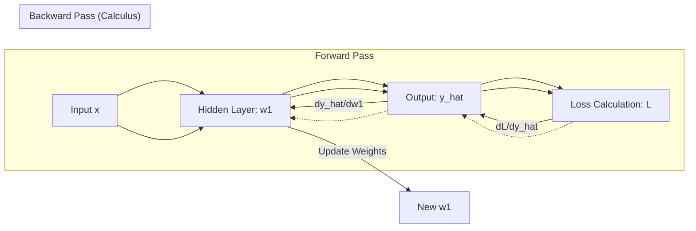

# 📉 Calculus for AI: The Engine of Learning & Backpropagation
> **Level:** Intermediate | **Language:** Hinglish | **Goal:** Master the multivariate calculus, chain rules, and gradients that allow neural networks to update their weights and optimize their performance.

---

## 🧭 1. Beginner-Friendly Hinglish Explanation
Calculus AI ka wo "Dimaag" hai jo use "Galti sudharna" (Learning) sikhata hai. 

Sochiye aap ek andheri gully mein hain aur aapko sabse niche wale point (The Valley) par pahunchna hai jahan "Error" sabse kam ho. Aap har step par apne pairon se ye check karte hain ki dhalan (slope) kis taraf hai. 
- **Derivative:** Ye batata hai ki ek chota sa badlav (change) karne se output mein kitna fark padega.
- **Gradient:** Bahut saare derivatives ka collection jo humein "Fastest Rasta" (direction) batata hai error kam karne ke liye.
- **Backpropagation:** Galti ko peeche ki taraf bhej kar har layer ko batana ki use kitna change hona hai.

Bina calculus ke, AI sirf ek static (Ruka hua) model hota jo kabhi apne aap ko sudhar nahi pata.

---

## 🧠 2. Deep Technical Explanation
In AI, we focus on **Multivariate Differential Calculus**:
1. **Partial Derivatives ($\partial$):** Measuring how the loss $L$ changes with respect to ONE specific weight $w_i$, keeping all other weights constant.
2. **The Gradient ($\nabla$):** A vector of all partial derivatives. It points towards the steepest increase of the function. For optimization, we move in the **Negative Gradient** direction.
3. **The Chain Rule:** The backbone of Backpropagation. It allows us to calculate the derivative of a nested function: 
   $$\frac{\partial L}{\partial w_1} = \frac{\partial L}{\partial y} \cdot \frac{\partial y}{\partial z} \cdot \frac{\partial z}{\partial w_1}$$
4. **Jacobian Matrix:** A matrix containing all first-order partial derivatives of a vector-valued function. Essential for multi-output networks.
5. **Hessian Matrix:** A matrix of second-order partial derivatives. It describes the **Curvature** of the loss landscape (helpful for advanced optimizers like AdaHessian).

---

## 🏗️ 3. Optimization Concepts
| Concept | Goal | AI Application |
| :--- | :--- | :--- |
| **First Derivative** | Find Slope | Gradient Descent |
| **Second Derivative** | Find Curvature | Adam, RMSProp |
| **Global Minimum** | Best Weights | Perfect Model |
| **Local Minimum** | Good Weights | Standard Production Model |
| **Saddle Point** | Flat Spot | Stuck Model (Need Momentum) |

---

## 📐 4. Mathematical Intuition
- **The Derivative:** $\frac{dy}{dx}$ is the sensitivity of $y$ to $x$. If $\frac{dy}{dx} = 2$, it means if $x$ increases by $0.1$, $y$ increases by $0.2$.
- **Stationary Points:** Where the derivative is $0$. This is where we want to end up (The Bottom of the Valley).
- **Auto-Differentiation:** Modern frameworks (PyTorch) don't use manual formulas; they build a **Computational Graph** and use the chain rule to flow gradients backward automatically.

---

## 📊 5. Backpropagation Flow (Diagram)


---

## 💻 6. Production-Ready Examples (Manual Gradient Check)
```python
# 2026 Pro-Tip: Always verify your logic with a Numerical Gradient
import torch

def model_fn(x, w):
    return x * w

def loss_fn(y_hat, y_true):
    return (y_hat - y_true)**2

# Analytical Gradient (Math)
# dL/dw = dL/dy_hat * dy_hat/dw
# dL/dy_hat = 2 * (y_hat - y_true)
# dy_hat/dw = x
# So, dL/dw = 2 * (x*w - y_true) * x

x, w, y_true = 2.0, 3.0, 10.0
y_hat = model_fn(x, w)

# Manual Calculation
dL_dw_manual = 2 * (y_hat - y_true) * x
print(f"Manual Gradient: {dL_dw_manual}")

# PyTorch Auto-Diff
w_torch = torch.tensor(3.0, requires_grad=True)
loss = loss_fn(model_fn(x, w_torch), y_true)
loss.backward()
print(f"PyTorch Gradient: {w_torch.grad}")

# If Manual == PyTorch, your calculus logic is correct!
```

---

## ❌ 6. Failure Cases
- **Vanishing Gradients:** In very deep networks, as you multiply small derivatives (Chain Rule), the gradient becomes $0.0000001$. The weights stop updating. **Fix:** Use **ReLU** or **Residual Connections**.
- **Exploding Gradients:** In RNNs, the derivatives grow to $10^{10}$, causing `NaN` values. **Fix:** Use **Gradient Clipping**.
- **Divergence:** If the "Step" (Learning Rate) is too large, the model jumps over the valley and the loss increases.

---

## 🛠️ 7. Debugging Guide
- **Symptom:** Loss is "Flat" (not moving).
- **Check:** **Saturation**. Are your inputs too large for the Sigmoid/Tanh activation? This creates near-zero derivatives.
- **Check:** **Weight Initialization**. If all weights are equal, gradients become identical, and the model can't learn complex patterns. Use **Xavier/Kaiming Initialization**.

---

## ⚖️ 8. Tradeoffs
- **Exact Gradient (Full Batch):** Very accurate but slow and memory-intensive.
- **Estimated Gradient (Stochastic/Batch):** Noisy but much faster and helps in escaping local minima.
- **Numerical Gradient:** Extremely slow but 100% reliable for checking if your "Auto-diff" logic has a bug.

---

## 🛡️ 9. Security Concerns
- **Gradient Inversion Attacks:** An attacker can observe the gradients sent by a client (in Federated Learning) and mathematically reconstruct the client's private training data.
- **Adversarial Noise:** Using calculus to find the smallest possible change to an image (direction of highest sensitivity) that flips the model's classification.

---

## 📈 10. Scaling Challenges
- **Second-Order Optimization:** Using the Hessian (2nd derivative) is $100x$ more powerful but requires $O(N^2)$ memory. For a 7B model, this is impossible. We use **Low-rank approximations** like L-BFGS.

---

## 💸 11. Cost Considerations
- Backpropagation requires storing every intermediate "Forward" value to calculate derivatives. This is why training uses $3x-4x$ more VRAM than inference.
- **Saving Tip:** Use **Gradient Checkpointing** to recompute intermediate values instead of storing them, saving $70\%$ VRAM at the cost of $30\%$ more time.

---

## ✅ 12. Best Practices
- **Use Log-Probabilities:** When calculating derivatives of probabilities, always use the log-space to avoid precision loss (Numerical Stability).
- **Normalize Inputs:** Calculus works best when slopes are uniform. Standardizing data ($mean=0, std=1$) prevents the loss landscape from becoming too "stretched".

---

## ⚠️ 13. Common Mistakes
- **Zeroing Gradients:** Forgetting `optimizer.zero_grad()` in PyTorch. Gradients accumulate by default, which will ruin your weight updates.
- **Sigmoid at Output:** Using Sigmoid in deep layers leads to vanishing gradients. Only use it for the final binary output.

---

## 📝 14. Interview Questions
1. **"Why do we use the 'Negative' of the gradient to update weights?"** (Because the gradient points up, and we want to go down to the minimum).
2. **"Explain the 'Chain Rule' in the context of a 3-layer neural network."**
3. **"What is the Jacobian and why is it used in Reinforcement Learning?"**

---

## 🚀 15. Latest 2026 Industry Patterns
- **K-FAC (Kronecker-Factored Approximate Curvature):** A way to use second-order information (Hessian) for massive LLM training with minimal memory overhead.
- **Differentiable Programming:** The entire software stack (even Databases and OS kernels) being written in a way that is "Differentiable," allowing AI to optimize the whole system using calculus.
- **Physics-Informed Neural Networks (PINNs):** Using calculus to embed physical laws (like gravity or fluid dynamics) directly into the model's loss function.
