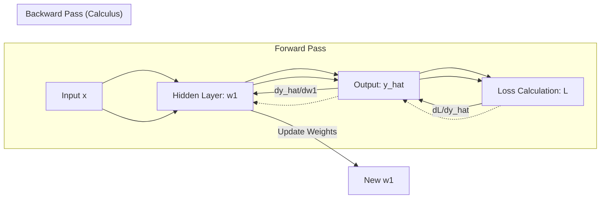

# 📉 Calculus for AI: Learning & Backpropagation Ka Engine
> **Level:** Intermediate | **Language:** Hinglish | **Goal:** Multivariate calculus, chain rules, aur gradients ko master karna jo neural networks ko weight update karne aur unki performance ko optimize karne me help karte hain.

---

## 🧭 1. Beginner-Friendly Hinglish Explanation
Calculus AI ka wo "Dimaag" hai jo use "Galti sudharna" (Learning) sikhata hai. 

Sochiye aap ek andheri gully mein hain aur aapko sabse niche wale point (The Valley) par pahunchna hai jahan "Error" sabse kam ho. Aap har step par apne pairon se ye check karte hain ki dhalan (slope) kis taraf hai. 
- **Derivative:** Ye batata hai ki ek chota sa badlav (change) karne se output mein kitna fark padega.
- **Gradient:** Bahut saare derivatives ka collection jo humein "Fastest Rasta" (direction) batata hai error kam karne ke liye.
- **Backpropagation:** Galti ko peeche ki taraf bhej kar har layer ko batana ki use kitna change hona hai.

Bina calculus ke, AI sirf ek static (Ruka hua) model hota jo kabhi apne aap ko sudhar nahi pata.

---

## 🧠 2. Deep Technical Explanation
AI me, hum **Multivariate Differential Calculus** par focus karte hain:
1. **Partial Derivatives ($\partial$):** Ye measure karna ki baaki saare weights ko constant rakhte hue sirf EK specific weight $w_i$ ke respect me loss $L$ kaise change hota hai.
2. **The Gradient ($\nabla$):** Saare partial derivatives ka ek vector. Ye function ke steepest increase ki direction me point karta hai. Optimization ke liye, hum **Negative Gradient** ki direction me move karte hain.
3. **The Chain Rule:** Backpropagation ki backbone. Ye hume ek nested function ka derivative calculate karne ki permission deta hai:
   $$\frac{\partial L}{\partial w_1} = \frac{\partial L}{\partial y} \cdot \frac{\partial y}{\partial z} \cdot \frac{\partial z}{\partial w_1}$$
4. **Jacobian Matrix:** Ek aisi matrix jisme vector-valued function ke saare first-order partial derivatives hote hain. Multi-output networks ke liye ye zaroori hai.
5. **Hessian Matrix:** Second-order partial derivatives ki matrix. Ye loss landscape ki **Curvature** ko describe karti hai (AdaHessian jaise advanced optimizers ke liye helpful hai).

---

## 🏗️ 3. Optimization Concepts
| Concept | Goal | AI Application |
| :--- | :--- | :--- |
| **First Derivative** | Find Slope | Gradient Descent |
| **Second Derivative** | Find Curvature | Adam, RMSProp |
| **Global Minimum** | Best Weights | Perfect Model |
| **Local Minimum** | Good Weights | Standard Production Model |
| **Saddle Point** | Flat Spot | Stuck Model (Need Momentum) |

---

## 📐 4. Mathematical Intuition
- **The Derivative:** $\frac{dy}{dx}$ is the sensitivity of $y$ to $x$. If $\frac{dy}{dx} = 2$, it means if $x$ increases by $0.1$, $y$ increases by $0.2$.
- **Stationary Points:** Where the derivative is $0$. This is where we want to end up (The Bottom of the Valley).
- **Auto-Differentiation:** Modern frameworks (PyTorch) don't use manual formulas; they build a **Computational Graph** and use the chain rule to flow gradients backward automatically.

---

## 📊 5. Backpropagation Flow (Diagram)

```mermaid
graph LR
    Input[Input x] --> Hidden[Hidden Layer: w1]
    Hidden --> Output[Output: y_hat]
    Output --> Loss[Loss Calculation: L]
    
    subgraph "Forward Pass"
    Input --> Hidden --> Output --> Loss
    end
    
    Loss -- "dL/dy_hat" --> Output
    Output -- "dy_hat/dw1" --> Hidden
    Hidden -- "Update Weights" --> Weights[New w1]
    
    subgraph "Backward Pass (Calculus)"
    Loss -.-> Output -.-> Hidden
    end
```

---

## 💻 6. Production-Ready Examples (Manual Gradient Check)
```python
# 2026 Pro-Tip: Apne logic ko Numerical Gradient ke sath hamesha verify karein
import torch

def model_fn(x, w):
    return x * w

def loss_fn(y_hat, y_true):
    return (y_hat - y_true)**2

# Analytical Gradient (Math)
# dL/dw = dL/dy_hat * dy_hat/dw
# dL/dy_hat = 2 * (y_hat - y_true)
# dy_hat/dw = x
# So, dL/dw = 2 * (x*w - y_true) * x

x, w, y_true = 2.0, 3.0, 10.0
y_hat = model_fn(x, w)

# Manual Calculation
dL_dw_manual = 2 * (y_hat - y_true) * x
print(f"Manual Gradient: {dL_dw_manual}")

# PyTorch Auto-Diff
w_torch = torch.tensor(3.0, requires_grad=True)
loss = loss_fn(model_fn(x, w_torch), y_true)
loss.backward()
print(f"PyTorch Gradient: {w_torch.grad}")

# If Manual == PyTorch, your calculus logic is correct!
```

---

## ❌ 6. Failure Cases
- **Vanishing Gradients:** Bahut deep networks me, jaise-jaise aap small derivatives ko multiply karte hain (Chain Rule), gradient $0.0000001$ ho jata hai. Weights update hona band ho jaate hain. **Fix:** **ReLU** ya **Residual Connections** ka use karein.
- **Exploding Gradients:** RNNs me, derivatives grow hokar $10^{10}$ ho jaate hain, jiski wajah se `NaN` values aane lagti hain. **Fix:** **Gradient Clipping** ka use karein.
- **Divergence:** Agar "Step" (Learning Rate) bahut large hai, toh model valley ke upar se jump kar jata hai aur loss increase hone lagta.

---

## 🛠️ 7. Debugging Guide
- **Symptom:** Loss is "Flat" (not moving).
- **Check:** **Saturation**. Are your inputs too large for the Sigmoid/Tanh activation? This creates near-zero derivatives.
- **Check:** **Weight Initialization**. If all weights are equal, gradients become identical, and the model can't learn complex patterns. Use **Xavier/Kaiming Initialization**.

---

## ⚖️ 8. Tradeoffs
- **Exact Gradient (Full Batch):** Bahut accurate par slow aur memory-intensive hota hai.
- **Estimated Gradient (Stochastic/Batch):** Noisy hota hai par kafi fast hota hai aur local minima se bachne me help karta hai.
- **Numerical Gradient:** Extremely slow hota hai par ye check karne ke liye 100% reliable hai ki aapke "Auto-diff" logic me koi bug toh nahi hai.

---

## 🛡️ 9. Security Concerns
- **Gradient Inversion Attacks:** Ek attacker client dwara send kiye gaye gradients ko observe kar sakta hai (Federated Learning me) aur mathematically client ke private training data ko reconstruct kar sakta hai.
- **Adversarial Noise:** Image me sabse chota possible change find karne ke liye calculus ka use karna (direction of highest sensitivity) jo model ki classification ko flip kar de.

---

## 📈 10. Scaling Challenges
- **Second-Order Optimization:** Hessian (2nd derivative) ka use karna $100x$ zyada powerful hai par iske liye $O(N^2)$ memory chahiye hoti hai. 7B model ke liye ye impossible hai. Hum **Low-rank approximations** jaise L-BFGS ka use karte hain.

---

## 💸 11. Cost Considerations
- Backpropagation ke liye derivatives calculate karne ke waste har ek intermediate "Forward" value ko store karna zaroori hai. Yahi wajah hai ki training me inference se $3x-4x$ zyada VRAM use hota hai.
- **Saving Tip:** Intermediate values ko store karne ke bajaye unhe recompute karne ke liye **Gradient Checkpointing** ka use karein, jisse $30\%$ extra time ki cost par $70\%$ VRAM save hoti hai.

---

## ✅ 12. Best Practices
- **Use Log-Probabilities:** Probabilities ke derivatives calculate karte waqt, precision loss se bachne ke liye hamesha log-space use karein (Numerical Stability).
- **Normalize Inputs:** Calculus tab best kaam karta hai jab slopes uniform ho. Data ko standardize karna ($mean=0, std=1$) loss landscape ko zyada "stretched" hone se rokta hai.

---

## ⚠️ 13. Common Mistakes
- **Zeroing Gradients:** PyTorch me `optimizer.zero_grad()` karna bhul jana. Gradients by default accumulate hote hain, jo aapke weight updates ko kharab kar denge.
- **Sigmoid at Output:** Deep layers me Sigmoid use karne se vanishing gradients ki problem hoti hai. Ise sirf final binary output ke liye hi use karein.

---

## 📝 14. Interview Questions
1. **"Weights ko update karne ke liye hum gradient ke 'Negative' ka use kyun karte hain?"** (Kyunki gradient upar ki taraf point karta hai, aur hum niche minimum tak jana chahte hain).
2. **"Ek 3-layer neural network ke context me 'Chain Rule' ko explain karein."**
3. **"Jacobian kya hai aur Reinforcement Learning me iska use kyun hota hai?"**

---

## 🚀 15. Latest 2026 Industry Patterns
- **K-FAC (Kronecker-Factored Approximate Curvature):** Minimal memory overhead ke sath massive LLM training ke liye second-order information (Hessian) use karne ka ek rasta.
- **Differentiable Programming:** Pure software stack (yahan tak ki Databases aur OS kernels bhi) ko is tarah likhna jo "Differentiable" ho, jisse AI pure system ko calculus ka use karke optimize kar sake.
- **Physics-Informed Neural Networks (PINNs):** Model ke loss function me directly physical laws (jaise gravity ya fluid dynamics) ko embed karne ke liye calculus ka use karna.
