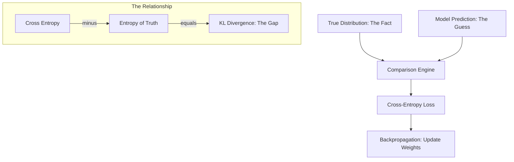

# 📊 Information Theory for AI: The Science of Entropy, Surprise, & Loss
> **Level:** Advanced | **Language:** Hinglish | **Goal:** Master the concepts of information measurement, entropy, and divergence that underpin modern AI loss functions and evaluation metrics.

---

## 🧭 1. Beginner-Friendly Hinglish Explanation
Information Theory ka matlab hai "Information ko mathematically naapna (measure karna)". 

Sochiye, main aapko bolun "Kal suraj East se niklega". Isme koi "Surprise" nahi hai kyunki ye humein pehle se pata hai. Isliye isme **Information** bahut kam hai. Lekin agar main bolun "Kal Mumbai mein barf (snow) giregi", toh ye bahut bada surprise hai. Yani is news mein **Information** zyada hai. 

AI mein hum isi "Surprise" ko use karte hain:
- **Entropy:** Model kitna "Confused" hai?
- **Cross-Entropy:** Model ka answer "Sach" se kitna door hai?
- **Mutual Information:** Ek cheez janne se doosri cheez kitni clear ho jati hai?

Information theory hi wo math hai jo humein batati hai ki AI ne kitna "Seekha" hai aur kitna "Bhatka" hai.

---

## 🧠 2. Deep Technical Explanation
Information Theory in AI provides the **Statistical Foundation for Loss Functions**:
1. **Entropy ($H$):** The average amount of uncertainty in a random variable. 
   $$H(X) = - \sum_{x \in X} p(x) \log p(x)$$
   High entropy = Maximum uncertainty (Uniform distribution).
2. **Cross-Entropy ($H(P, Q)$):** Measures the average number of bits needed to identify an event from distribution $P$ using a code optimized for $Q$. In AI, $P$ is the true label and $Q$ is the model's prediction.
3. **KL Divergence ($D_{KL}$):** A measure of how one probability distribution $Q$ is different from a second, reference probability distribution $P$. 
   $$D_{KL}(P || Q) = H(P, Q) - H(P)$$
   In RLHF, we use KL Divergence to ensure the fine-tuned model doesn't drift too far from the base model.
4. **Mutual Information ($I(X; Y)$):** Measures the reduction in uncertainty of $X$ given $Y$. Used in feature selection and "Information Bottleneck" theory.

---

## 🏗️ 3. Information Theory in AI Pipeline
| Concept | Goal | AI Application |
| :--- | :--- | :--- |
| **Entropy** | Measure Confusion | Prediction Confidence |
| **Cross-Entropy** | Measure Error | Classification Loss Function |
| **KL Divergence** | Measure Similarity | VAEs, RLHF, Knowledge Distillation |
| **Perplexity** | Measure Prediction | Standard LLM Evaluation Metric |

---

## 📐 4. Mathematical Intuition
- **Self-Information:** $I(x) = -\log p(x)$. Low probability events have high information.
- **The Log Base:** We use $\log_2$ for "Bits" and $\ln$ (base $e$) for "Nats." AI frameworks mostly use $\ln$.
- **Minimizing Cross-Entropy:** When we minimize cross-entropy loss, we are mathematically trying to make our model's probability distribution ($Q$) exactly match the real-world distribution ($P$).

---

## 📊 5. Cross-Entropy vs. KL Divergence (Diagram)


---

## 💻 6. Production-Ready Examples (Calculating Loss Manually)
```python
# 2026 Pro-Tip: Understanding the math inside nn.CrossEntropyLoss
import torch
import torch.nn.functional as F

def manual_cross_entropy(logits, target_idx):
    # Logits are raw scores from the model
    probs = F.softmax(logits, dim=-1)
    # Cross Entropy = -log(prob of correct class)
    loss = -torch.log(probs[target_idx])
    return loss

# Example
raw_logits = torch.tensor([1.2, 5.0, 0.3]) # Model thinks class 1 is most likely
correct_class = 1 # Indeed, it is class 1

print(f"Manual CE Loss: {manual_cross_entropy(raw_logits, correct_class):.4f}")
print(f"PyTorch CE Loss: {F.cross_entropy(raw_logits.unsqueeze(0), torch.tensor([correct_class])):.4f}")
```

---

## ❌ 7. Failure Cases
- **The Zero Probability Trap:** If a model predicts $0\%$ probability for a class that actually occurred, Cross-Entropy becomes $\infty$, and the training crashes. **Fix:** Use **Label Smoothing** ($0.9$ for correct, $0.1$ spread across others).
- **Mode Collapse:** In generative models, if the entropy becomes too low, the model starts producing the same output again and again (No diversity).
- **KL Divergence Non-Symmetry:** $D_{KL}(P||Q) \neq D_{KL}(Q||P)$. If you mix these up in your RLHF code, the model will fail to align correctly.

---

## 🛠️ 8. Debugging Guide
- **Symptom:** Loss is $0$ at the start.
- **Check:** **Data Leakage**. Your model likely "sees" the answer in the input, making its surprise (Entropy) zero.
- **Symptom:** Perplexity is extremely high.
- **Check:** **Tokenization**. If your tokenizer is breaking words into too many small pieces, the model will be more "Surprised" by each token, increasing perplexity.

---

## ⚖️ 9. Tradeoffs
- **High Entropy:** The model is creative but might hallucinate or be unreliable.
- **Low Entropy:** The model is very accurate but boring and repetitive (e.g., repeating the same sentence).
- **Cross-Entropy vs MSE:** Cross-entropy is better for classification because its "Gradient" is much steeper when the model is very wrong, leading to faster learning.

---

## 🛡️ 10. Security Concerns
- **Membership Inference:** By looking at the Cross-Entropy loss of a model on a specific piece of text, an attacker can tell if that text was part of the model's training data (if loss is unusually low).
- **Entropy Attacks:** Forcing a model into a high-entropy state (high confusion) via specific prompt patterns, causing it to consume more compute or reveal internal logic.

---

## 📈 11. Scaling Challenges
- **Large Vocabulary:** Calculating the Softmax (denominator) for $128,000$ tokens in every step is slow. We use **Sparse Cross Entropy** or **Sampled Softmax** to scale.

---

## 💸 12. Cost Considerations
- **Loss = Compute:** The higher your initial entropy/loss, the more training steps (and money) you need to reach convergence.
- **Data Quality:** High-quality data has low "Noise" (intrinsic entropy), which means the model learns faster, saving thousands in GPU costs.

---

## ✅ 13. Best Practices
- **Use Log-Sum-Exp:** When calculating entropy, never calculate raw probabilities first; use `log_softmax` to avoid "Numerical Underflow" (where small numbers become zero).
- **Monitor Perplexity:** It is the best way to track if your model's "Understanding" of language is improving.
- **Label Smoothing:** Always use it for production models to prevent the model from becoming "Over-confident" and brittle.

---

## ⚠️ 14. Common Mistakes
- **Confusing Entropy with Information:** Entropy is the *lack* of information or the *potential* for it.
- **Comparing Cross-Entropy across different Tokenizers:** You can't compare the loss of a Llama model and a GPT model directly because their vocabularies (and thus their entropy baselines) are different.

---

## 📝 15. Interview Questions
1. **"Why is Cross-Entropy used for training LLMs instead of Accuracy?"** (Because Accuracy is not differentiable; you can't calculate its slope).
2. **"What is KL Divergence and why is it used in RLHF?"**
3. **"Explain the intuition: Why does a rare event have more 'Information' than a common one?"**

---

## 🚀 15. Latest 2026 Industry Patterns
- **Contrastive Learning (InfoNCE):** Using "Mutual Information" to train models like CLIP that can connect images and text without labels.
- **Information Bottleneck (IB) Theory:** A new theory suggesting that Deep Learning works because it "compresses" input data, throwing away useless information and keeping only the core "features."
- **Entropy-Based Pruning:** Deleting neurons in a 70B model that have the lowest "Information Contribution" to reduce the model size by $50\%$ with only $1\%$ loss in intelligence.
