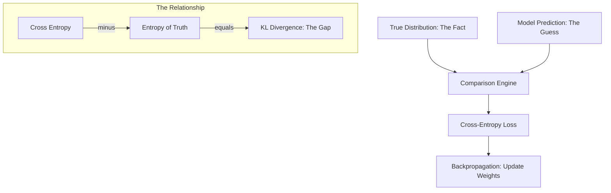

# 📊 Information Theory for AI: Entropy, Surprise, & Loss Ki Science
> **Level:** Advanced | **Language:** Hinglish | **Goal:** Information measurement, entropy, aur divergence ke concepts ko master karna jo modern AI loss functions aur evaluation metrics ki foundation hain.

---

## 🧭 1. Beginner-Friendly Hinglish Explanation
Information Theory ka matlab hai "Information ko mathematically naapna (measure karna)". 

Sochiye, main aapko bolun "Kal suraj East se niklega". Isme koi "Surprise" nahi hai kyunki ye humein pehle se pata hai. Isliye isme **Information** bahut kam hai. Lekin agar main bolun "Kal Mumbai mein barf (snow) giregi", toh ye bahut bada surprise hai. Yani is news mein **Information** zyada hai. 

AI mein hum isi "Surprise" ko use karte hain:
- **Entropy:** Model kitna "Confused" hai?
- **Cross-Entropy:** Model ka answer "Sach" se kitna door hai?
- **Mutual Information:** Ek cheez janne se doosri cheez kitni clear ho jati hai?

Information theory hi wo math hai jo humein batati hai ki AI ne kitna "Seekha" hai aur kitna "Bhatka" hai.

---

## 🧠 2. Deep Technical Explanation
AI me Information Theory **Loss Functions ke liye Statistical Foundation** provide karti hai:
1. **Entropy ($H$):** Kisi random variable me average uncertainty ki amount. 
   $$H(X) = - \sum_{x \in X} p(x) \log p(x)$$
   High entropy = Maximum uncertainty (Uniform distribution).
2. **Cross-Entropy ($H(P, Q)$):** Ye measure karta hai ki distribution $P$ se kisi event ko identify karne ke liye average kitne bits ki zaroorat hoti hai jab $Q$ ke liye optimized code ka use kiya jaye. AI me, $P$ true label hai aur $Q$ model ki prediction hai.
3. **KL Divergence ($D_{KL}$):** Ye measure karta hai ki kaise ek probability distribution $Q$ doosre reference probability distribution $P$ se different hai. 
   $$D_{KL}(P || Q) = H(P, Q) - H(P)$$
   RLHF me, hum KL Divergence ka use ye ensure karne ke liye karte hain ki fine-tuned model base model se bahut zyada door (drift) na chala jaye.
4. **Mutual Information ($I(X; Y)$):** Ye measure karta hai ki $Y$ ke diye hone par $X$ ki uncertainty me kitni reduction aati hai. Feature selection aur "Information Bottleneck" theory me iska use hota hai.

---

## 🏗️ 3. Information Theory in AI Pipeline
| Concept | Goal | AI Application |
| :--- | :--- | :--- |
| **Entropy** | Measure Confusion | Prediction Confidence |
| **Cross-Entropy** | Measure Error | Classification Loss Function |
| **KL Divergence** | Measure Similarity | VAEs, RLHF, Knowledge Distillation |
| **Perplexity** | Measure Prediction | Standard LLM Evaluation Metric |

---

## 📐 4. Mathematical Intuition
- **Self-Information:** $I(x) = -\log p(x)$. Low probability events me high information hoti hai.
- **The Log Base:** Hum "Bits" ke liye $\log_2$ aur "Nats" ke liye $\ln$ (base $e$) ka use karte hain. AI frameworks mostly $\ln$ use karte hain.
- **Minimizing Cross-Entropy:** Jab hum cross-entropy loss ko minimize karte hain, toh hum mathematically apne model ke probability distribution ($Q$) ko real-world distribution ($P$) se exact match karwane ki koshish kar rahe hote hain.

---

## 📊 5. Cross-Entropy vs. KL Divergence (Diagram)

```mermaid
graph TD
    P[True Distribution: The Fact] --> Comp[Comparison Engine]
    Q[Model Prediction: The Guess] --> Comp
    Comp --> CE[Cross-Entropy Loss]
    CE --> Back[Backpropagation: Update Weights]
    
    subgraph "The Relationship"
    CE2[Cross Entropy] -- "minus" --> E[Entropy of Truth]
    E -- "equals" --> KL[KL Divergence: The Gap]
    end
```

---

## 💻 6. Production-Ready Examples (Calculating Loss Manually)
```python
# 2026 Pro-Tip: nn.CrossEntropyLoss ke andar ki math ko samajhna
import torch
import torch.nn.functional as F

def manual_cross_entropy(logits, target_idx):
    # Logits model se aane wale raw scores hote hain
    probs = F.softmax(logits, dim=-1)
    # Cross Entropy = -log(correct class ki probability)
    loss = -torch.log(probs[target_idx])
    return loss

# Example
raw_logits = torch.tensor([1.2, 5.0, 0.3]) # Model sochta hai ki class 1 sabse zyada likely hai
correct_class = 1 # Indeed, ye class 1 hi hai

print(f"Manual CE Loss: {manual_cross_entropy(raw_logits, correct_class):.4f}")
print(f"PyTorch CE Loss: {F.cross_entropy(raw_logits.unsqueeze(0), torch.tensor([correct_class])):.4f}")
```

---

## ❌ 7. Failure Cases
- **The Zero Probability Trap:** Agar model kisi aisi class ke liye $0\%$ probability predict karta hai jo actually occur hui hai, toh Cross-Entropy $\infty$ ban jata hai aur training crash ho jati hai. **Fix:** **Label Smoothing** ka use karein (correct ke liye $0.9$, baaki ke beech $0.1$ spread karein).
- **Mode Collapse:** Generative models me, agar entropy bahut low ho jati hai, toh model baar-baar same output produce karne lagta hai (No diversity).
- **KL Divergence Non-Symmetry:** $D_{KL}(P||Q) \neq D_{KL}(Q||P)$ hota hai. Agar aap apne RLHF code me in dono ko mix up kar dete hain, toh model correctly align hone me fail ho jayega.

---

## 🛠️ 8. Debugging Guide
- **Symptom:** Start me loss $0$ aa raha hai.
- **Check:** **Data Leakage**. Aapka model shaayad input me hi answer ko dekh raha hai, jisse uski surprise (Entropy) zero ho jaati hai.
- **Symptom:** Perplexity extremely high hai.
- **Check:** **Tokenization**. Agar aapka tokenizer words ko bahut saare chhote pieces me break kar raha hai, toh model har token par zyada "Surprised" hoga, jisse perplexity badh jayegi.

---

## ⚖️ 9. Tradeoffs
- **High Entropy:** Model creative hota hai lekin hallucinate kar sakta hai ya unreliable ho sakta hai.
- **Low Entropy:** Model bahut accurate hota hai par boring aur repetitive ho jata hai (e.g., same sentence repeat karna).
- **Cross-Entropy vs MSE:** Classification ke liye Cross-entropy better hai kyunki jab model bahut badi galti karta hai tab iska "Gradient" kafi steep hota hai, jisse learning fast hoti hai.

---

## 🛡️ 10. Security Concerns
- **Membership Inference:** Kisi specific piece of text par model ke Cross-Entropy loss ko dekh kar, ek attacker ye bata sakta hai ki kya wo text model ke training data ka part tha (agar loss unusually low ho).
- **Entropy Attacks:** Specific prompt patterns ke zariye model ko high-entropy state (high confusion) me force karna, jisse wo zyada compute consume kare ya internal logic ko reveal kar de.

---

## 📈 11. Scaling Challenges
- **Large Vocabulary:** Har step me $128,000$ tokens ke liye Softmax (denominator) calculate karna slow hota hai. Scale karne ke liye hum **Sparse Cross Entropy** ya **Sampled Softmax** ka use karte hain.

---

## 💸 12. Cost Considerations
- **Loss = Compute:** Aapka initial entropy/loss jitna high hoga, convergence tak pahunchne ke liye utne hi zyada training steps (aur money) ki need hogi.
- **Data Quality:** High-quality data me "Noise" (intrinsic entropy) low hota hai, jiska matlab hai ki model fast learn karta hai, jisse GPU costs me thousands save hote hain.

---

## ✅ 13. Best Practices
- **Use Log-Sum-Exp:** Entropy calculate karte waqt, raw probabilities ko pehle calculate mat karein; "Numerical Underflow" (jahan small numbers zero ban jaate hain) se bachne ke liye `log_softmax` ka use karein.
- **Monitor Perplexity:** Ye ye track karne ka best way hai ki kya aapke model ki language ki "Understanding" improve ho rahi hai.
- **Label Smoothing:** Production models ke liye iska use hamesha karein taaki model ko "Over-confident" aur brittle hone se bachaya ja sake.

---

## ⚠️ 14. Common Mistakes
- **Confusing Entropy with Information:** Entropy ka matlab information ki *lack* (kami) hona ya fir iski *potential* hona hai.
- **Comparing Cross-Entropy across different Tokenizers:** Aap Llama model aur GPT model ke loss ko directly compare nahi kar sakte kyunki unki vocabularies (aur is wajah se unke entropy baselines) different hote hain.

---

## 📝 15. Interview Questions
1. **"LLMs ko train karne ke liye Accuracy ke bajaye Cross-Entropy kyun use kiya jata hai?"** (Kyunki Accuracy differentiable nahi hai; aap iska slope calculate nahi kar sakte).
2. **"KL Divergence kya hai aur RLHF me iska use kyun hota hai?"**
3. **"Intuition explain karein: Kisi rare event me common event se zyada 'Information' kyun hoti hai?"**

---

## 🚀 15. Latest 2026 Industry Patterns
- **Contrastive Learning (InfoNCE):** CLIP jaise models ko train karne ke liye "Mutual Information" ka use karna jo bina labels ke images aur text ko connect kar sakte hain.
- **Information Bottleneck (IB) Theory:** Ek nayi theory jo suggest karti hai ki Deep Learning isliye kaam karta hai kyunki ye input data ko "compress" karta hai, useless information ko drop kar deta hai aur sirf core "features" ko hi rakhta hai.
- **Entropy-Based Pruning:** Ek 70B model me un neurons ko delete karna jinka "Information Contribution" lowest hai, taaki intelligence me sirf $1\%$ loss ke sath model size ko $50\%$ reduce kiya ja sake.
