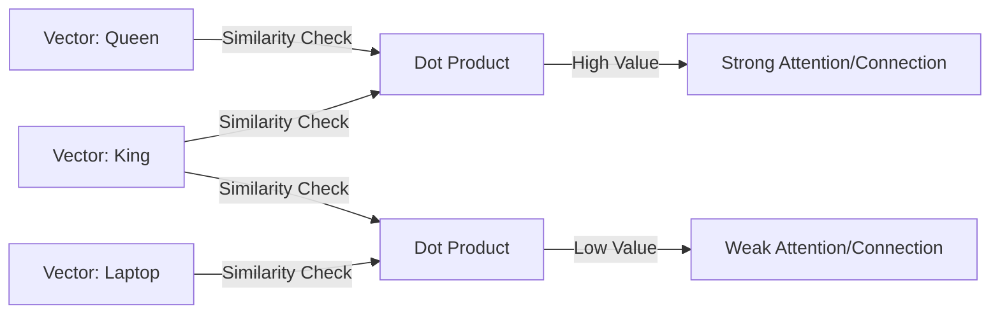

# 🧮 Linear Algebra for AI: The Language of Space & Tensors
> **Level:** Intermediate | **Language:** Hinglish | **Goal:** Master the linear operations, transformations, and decomposition techniques that allow machines to process high-dimensional data at scale.

---

## 🧭 1. Beginner-Friendly Hinglish Explanation
Linear Algebra AI ka wo "Software" hai jo hardware (GPU) aur intelligence (Model) ko jodta hai. 

Sochiye, computer ke liye ek photo "chehra" nahi hai, balki numbers ka ek bada grid hai. Ek word "Apple" computer ke liye sirf text nahi hai, balki 1536 numbers ki ek list (Vector) hai. 
- **Vectors:** Numbers ki ek list jo "Space" mein ek direction batati hai.
- **Matrices:** Vectors ka collection.
- **Multiplication:** Ek "Space" se doosri "Space" mein jana. (e.g., English space se Hindi space mein translation).

Bina Linear Algebra ke, hum data ko compute hi nahi kar paate. Ye AI ki wo buniyaadi bhasha hai jo har calculation ko speed deti hai.

---

## 🧠 2. Deep Technical Explanation
Linear Algebra in AI is built around **Tensor Operations**:
1. **Rank & Dimensions:** 
   - **Rank 0:** Scalar (Magnitude only).
   - **Rank 1:** Vector (Magnitude + Direction).
   - **Rank 2:** Matrix (Grid of data).
   - **Rank 3+:** Tensors (Images with RGB, Video with Time, etc.).
2. **Matrix Multiplication ($C = AB$):** The most fundamental operation. Every layer in a neural network is essentially a matrix multiplication followed by a non-linearity.
3. **Dot Product:** Measures the alignment of two vectors. $a \cdot b = ||a|| ||b|| \cos(\theta)$. Used in **Self-Attention** to calculate scores between words.
4. **Decomposition (SVD & PCA):** Breaking down a massive matrix into smaller, essential parts.
   - **SVD (Singular Value Decomposition):** $A = U \Sigma V^T$. Essential for model compression (Low-Rank Adaptation - LoRA).
5. **Norms ($L1, L2$):** Measuring the size of a vector. $L2$ norm is the standard distance; $L1$ is used for sparsity and robustness.

---

## 🏗️ 3. Architecture Visualization
| Data Type | Tensor Shape | Example |
| :--- | :--- | :--- |
| **Token Embedding** | `[1, 1536]` | A single word's meaning. |
| **Batch of Embeddings** | `[32, 1536]` | 32 words processed at once. |
| **Weight Matrix** | `[1536, 4096]` | The "Knowledge" of a layer. |
| **Color Image** | `[3, 224, 224]` | RGB channels $\times$ Height $\times$ Width. |

---

## 📐 4. Mathematical Intuition
- **Basis:** The set of vectors that span the entire space. In AI, embeddings find the "Semantic Basis" of language.
- **Linear Transformation:** A function $T(x)$ that preserves vector addition and scalar multiplication. Every weight update in AI is a search for the "Perfect Linear Transformation" that maps inputs to correct outputs.
- **Eigenvalues ($\lambda$) and Eigenvectors ($v$):** Directions that only scale during a transformation ($Av = \lambda v$). In data science, the directions with the largest eigenvalues represent the most information (Principal Components).

---

## 📊 5. Dot Product & Similarity (Diagram)


---

## 💻 6. Production-Ready Examples (Matrix Ops with NumPy & PyTorch)
```python
# 2026 Standard: High Performance Matrix Operations
import torch

def layer_transformation(input_tensor, weight_matrix, bias_vector):
    # Standard Neural Network Layer Operation: y = xW + b
    # Using PyTorch for GPU acceleration
    output = torch.matmul(input_tensor, weight_matrix.t()) + bias_vector
    return output

# Low-Rank Approximation (LoRA intuition)
def lora_approximation(A, r=8):
    # Reducing a large matrix A to two smaller ones (U and V)
    # A approx = U @ V
    U, S, V = torch.svd(A)
    A_compressed = torch.mm(U[:, :r], torch.mm(torch.diag(S[:r]), V[:, :r].t()))
    return A_compressed

# This saves 90% memory in fine-tuning large models!
```

---

## ❌ 7. Failure Cases
- **Singularity:** If a matrix is "Singular" (Determinant = 0), it cannot be inverted. This leads to math errors in certain optimization algorithms.
- **Dimensionality Curse:** As you add more dimensions (more numbers in a vector), all vectors become equidistant, and "Similarity" becomes meaningless.
- **Precision Overflow:** Multiplying very large matrices can exceed the 16-bit float limit, leading to `NaN` (Not a Number) errors.

---

## 🛠️ 8. Debugging Guide
- **Symptom:** "Incompatible shapes" error.
- **Fix:** Check the inner dimensions. To multiply $(M \times N)$ by $(P \times Q)$, $N$ must equal $P$.
- **Symptom:** Model weights are exploding.
- **Check:** **Spectral Radius**. If the largest eigenvalue of your weight matrix is $>1$, the values will grow exponentially. Use **Weight Normalization**.

---

## ⚖️ 9. Tradeoffs
- **Precision (FP32 vs FP8):** Higher precision is accurate but 4x slower than FP8. In 2026, we use FP8 for inference to save 75% VRAM.
- **Sparse vs Dense:** Sparse matrices (mostly zeros) save memory but GPUs are optimized for Dense math. Only use Sparse if sparsity is $>90\%$.

---

## 🛡️ 10. Security Concerns
- **Spectral Attacks:** Hackers can inject "poison" into a training set that specifically targets the dominant eigenvalues, causing the model to fail on specific triggers without being noticed during testing.
- **Model Inversion:** Using linear algebra to reconstruct the original training data from the weights of a model.

---

## 📈 11. Scaling Challenges
- **Matrix Partitioning:** Dividing a 175B parameter matrix across 8 GPUs.
- **NVLink Bottleneck:** When the math is faster than the speed at which data can move between matrices/GPUs.

---

## 💸 12. Cost Considerations
- Matrix multiplication is the "Gas" of AI. $99\%$ of your GPU bill is just matrix multiplications.
- **Saving Tip:** Using **Triton Kernels** or **FlashAttention** to optimize matrix access patterns can save $30-50\%$ on cloud costs.

---

## ✅ 13. Best Practices
- **Broadcast Carefully:** Let NumPy/PyTorch handle dimension matching (Broadcasting), but verify with unit tests.
- **Pre-allocate Memory:** Never resize matrices inside a loop.
- **Use Ad-Hoc Normalization:** Always normalize vectors before calculating Cosine Similarity to avoid magnitude bias.

---

## ⚠️ 14. Common Mistakes
- **Transposition Errors:** Forgetting to transpose the weight matrix in $y = xW^T + b$.
- **In-place Operations:** Modifying a matrix in-place during backpropagation can break the gradient calculation.

---

## 📝 15. Interview Questions
1. **"Explain Singular Value Decomposition (SVD) and its role in LLM fine-tuning (LoRA)."**
2. **"Why is the Dot Product used to measure semantic similarity?"**
3. **"What is a 'Tensor' and how does it differ from a 'Matrix'?"**

---

## 🚀 15. Latest 2026 Industry Patterns
- **Weight-Decoupled Quantization:** Treating weights as low-rank matrices to achieve near-lossless 4-bit quantization.
- **MatMul-Free Architectures:** Research into "Linear-Attention" and "State Space Models (SSM)" like Mamba that try to reduce the $O(N^2)$ cost of matrix operations.
- **Hardware-Aware Algebra:** Designing algorithms that fit specifically into the L1/L2 cache of the H200 chips for $10x$ speedups.
