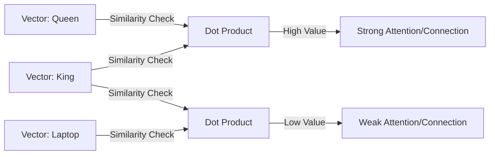

# 🧮 Linear Algebra for AI: Space & Tensors Ki Bhasha
> **Level:** Intermediate | **Language:** Hinglish | **Goal:** Linear operations, transformations, aur decomposition techniques ko master karna jo machines ko high-dimensional data ko scale par process karne me help karte hain.

---

## 🧭 1. Beginner-Friendly Hinglish Explanation
Linear Algebra AI ka wo "Software" hai jo hardware (GPU) aur intelligence (Model) ko jodta hai. 

Sochiye, computer ke liye ek photo "chehra" nahi hai, balki numbers ka ek bada grid hai. Ek word "Apple" computer ke liye sirf text nahi hai, balki 1536 numbers ki ek list (Vector) hai. 
- **Vectors:** Numbers ki ek list jo "Space" mein ek direction batati hai.
- **Matrices:** Vectors ka collection.
- **Multiplication:** Ek "Space" se doosri "Space" mein jana. (e.g., English space se Hindi space mein translation).

Bina Linear Algebra ke, hum data ko compute hi nahi kar paate. Ye AI ki wo buniyaadi bhasha hai jo har calculation ko speed deti hai.

---

## 🧠 2. Deep Technical Explanation
AI me Linear Algebra **Tensor Operations** ke aaspas built hai:
1. **Rank & Dimensions:**
   - **Rank 0:** Scalar (Sirf Magnitude).
   - **Rank 1:** Vector (Magnitude + Direction).
   - **Rank 2:** Matrix (Data ka Grid).
   - **Rank 3+:** Tensors (RGB ke sath Images, Time ke sath Video, etc.).
2. **Matrix Multiplication ($C = AB$):** Sabse fundamental operation. Neural network ki har layer essentially ek matrix multiplication hoti hai jiske baad ek non-linearity lagayi jaati hai.
3. **Dot Product:** Do vectors ke alignment ko measure karta hai. $a \cdot b = ||a|| ||b|| \cos(\theta)$. Words ke beech scores calculate karne ke liye **Self-Attention** me iska use kiya jata hai.
4. **Decomposition (SVD & PCA):** Ek massive matrix ko chhote, essential parts me break karna.
   - **SVD (Singular Value Decomposition):** $A = U \Sigma V^T$. Model compression (Low-Rank Adaptation - LoRA) ke liye zaroori hai.
5. **Norms ($L1, L2$):** Vector ke size ko measure karna. $L2$ norm standard distance hai; $L1$ ka use sparsity aur robustness ke liye kiya jata hai.

---

## 🏗️ 3. Architecture Visualization
| Data Type | Tensor Shape | Example |
| :--- | :--- | :--- |
| **Token Embedding** | `[1, 1536]` | A single word's meaning. |
| **Batch of Embeddings** | `[32, 1536]` | 32 words processed at once. |
| **Weight Matrix** | `[1536, 4096]` | The "Knowledge" of a layer. |
| **Color Image** | `[3, 224, 224]` | RGB channels $\times$ Height $\times$ Width. |

---

## 📐 4. Mathematical Intuition
- **Basis:** Vectors ka wo set jo pure space ko span karta hai. AI me, embeddings language ke "Semantic Basis" ko find karti hain.
- **Linear Transformation:** Ek aisa function $T(x)$ jo vector addition aur scalar multiplication ko preserve karta hai. AI me har ek weight update "Perfect Linear Transformation" ki search hai jo inputs ko correct outputs se map karta hai.
- **Eigenvalues ($\lambda$) and Eigenvectors ($v$):** Wo directions jo transformation ke dauran sirf scale hoti hain ($Av = \lambda v$). Data science me, jin directions me largest eigenvalues hote hain, wo sabse zyada information represent karti hain (Principal Components).

---

## 📊 5. Dot Product & Similarity (Diagram)

```mermaid
graph LR
    V1[Vector: King] -- Similarity Check --> DP[Dot Product]
    V2[Vector: Queen] -- Similarity Check --> DP
    DP -- "High Value" --> Result[Strong Attention/Connection]
    
    V3[Vector: Laptop] -- Similarity Check --> DP2[Dot Product]
    V1 -- Similarity Check --> DP2
    DP2 -- "Low Value" --> Result2[Weak Attention/Connection]
```

---

## 💻 6. Production-Ready Examples (Matrix Ops with NumPy & PyTorch)
```python
# 2026 Standard: High Performance Matrix Operations
import torch

def layer_transformation(input_tensor, weight_matrix, bias_vector):
    # Standard Neural Network Layer Operation: y = xW + b
    # GPU acceleration ke liye PyTorch ka use
    output = torch.matmul(input_tensor, weight_matrix.t()) + bias_vector
    return output

# Low-Rank Approximation (LoRA intuition)
def lora_approximation(A, r=8):
    # Ek badi matrix A ko do choti matrices (U aur V) me reduce karna
    # A approx = U @ V
    U, S, V = torch.svd(A)
    A_compressed = torch.mm(U[:, :r], torch.mm(torch.diag(S[:r]), V[:, :r].t()))
    return A_compressed

# Ye large models ko fine-tune karte waqt 90% memory save karta hai!
```

---

## ❌ 7. Failure Cases
- **Singularity:** Agar koi matrix "Singular" hai (Determinant = 0), it cannot be inverted. This leads to math errors in certain optimization algorithms.
- **Dimensionality Curse:** Jaise-jaise aap zyada dimensions add karte hain (vector me zyada numbers), saare vectors equidistant ho jaate hain, aur "Similarity" meaningless ho jaati hai.
- **Precision Overflow:** Bahut large matrices ko multiply karne se 16-bit float limit exceed ho sakti hai, jisse `NaN` (Not a Number) errors aate hain.

---

## 🛠️ 8. Debugging Guide
- **Symptom:** "Incompatible shapes" error.
- **Fix:** Inner dimensions check karein. To multiply $(M \times N)$ by $(P \times Q)$, $N$ must equal $P$.
- **Symptom:** Model weights explode ho rahe hain.
- **Check:** **Spectral Radius**. If the largest eigenvalue of your weight matrix is $>1$, the values will grow exponentially. Use **Weight Normalization**.

---

## ⚖️ 9. Tradeoffs
- **Precision (FP32 vs FP8):** Higher precision accurate hoti hai par FP8 se 4x slow hoti hai. In 2026, we use FP8 for inference to save 75% VRAM.
- **Sparse vs Dense:** Sparse matrices (mostly zeros) memory save karti hain lekin GPUs Dense math ke liye optimized hote hain. Only use Sparse if sparsity is $>90\%$.

---

## 🛡️ 10. Security Concerns
- **Spectral Attacks:** Hackers training set me "poison" inject kar sakte hain jo specifically targets the dominant eigenvalues, causing the model to fail on specific triggers without being noticed during testing.
- **Model Inversion:** Model ke weights se original training data ko reconstruct karne ke liye linear algebra ka use karna.

---

## 📈 11. Scaling Challenges
- **Matrix Partitioning:** Ek 175B parameter matrix ko 8 GPUs par divide karna.
- **NVLink Bottleneck:** When the math is faster than the speed at which data can move between matrices/GPUs.

---

## 💸 12. Cost Considerations
- Matrix multiplication AI ka "Gas" hai. $99\%$ of your GPU bill is just matrix multiplications.
- **Saving Tip:** Matrix access patterns ko optimize karne ke liye **Triton Kernels** ya **FlashAttention** ka use karna cloud costs me $30-50\%$ save kar sakta hai.

---

## ✅ 13. Best Practices
- **Broadcast Carefully:** NumPy/PyTorch ko dimension matching (Broadcasting) handle karne dein, par unit tests ke sath verify zaroor karein.
- **Pre-allocate Memory:** Loop ke andar kabhi bhi matrices ko resize na karein.
- **Use Ad-Hoc Normalization:** Magnitude bias se bachne ke liye Cosine Similarity calculate karne se pehle hamesha vectors ko normalize karein.

---

## ⚠️ 14. Common Mistakes
- **Transposition Errors:** $y = xW^T + b$ me weight matrix ko transpose karna bhul jana.
- **In-place Operations:** Backpropagation ke dauran kisi matrix ko in-place modify karna gradient calculation ko break kar sakta hai.

---

## 📝 15. Interview Questions
1. **"Singular Value Decomposition (SVD) aur LLM fine-tuning (LoRA) me iske role ko explain karein."**
2. **"Semantic similarity ko measure karne ke liye Dot Product ka use kyun kiya jata hai?"**
3. **"Ek 'Tensor' kya hai aur ye 'Matrix' se kaise alag hai?"**

---

## 🚀 15. Latest 2026 Industry Patterns
- **Weight-Decoupled Quantization:** Near-lossless 4-bit quantization achieve karne ke liye weights ko low-rank matrices ki tarah treat karna.
- **MatMul-Free Architectures:** "Linear-Attention" aur Mamba jaise "State Space Models (SSM)" me research jo matrix operations ki $O(N^2)$ cost ko reduce karne ki koshish karte hain.
- **Hardware-Aware Algebra:** Aise algorithms design karna jo specifically H200 chips ke L1/L2 cache me fit ho sakein, jisse $10x$ speedups mile.
