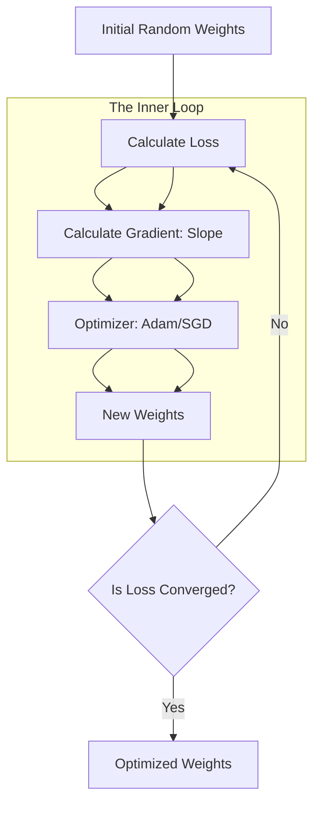

# 🎯 Optimization for AI: Finding the Global Minimum in the Loss Landscape
> **Level:** Advanced | **Language:** Hinglish | **Goal:** Master the algorithms, heuristics, and mathematical strategies that allow models to converge to the best possible set of weights efficiently.

---

## 🧭 1. Beginner-Friendly Hinglish Explanation
Optimization ka matlab hai "Sabse behtar (Perfect) weights dhoondhna". 

Sochiye AI model ek anpadh baccha hai. Jab wo galti karta hai, toh "Loss Function" use batata hai ki galti kitni badi hai. Par "Sudharna kaise hai?", ye **Optimizer** batata hai. 
- **Learning Rate:** Ye ek chote bacche ke kadam (steps) ki tarah hai. Agar kadam bahut bade hain, toh wo manjil ko cross kar jayega. Agar bahut chote hain, toh wo kabhi pahunch hi nahi payega.
- **Adam/SGD:** Ye wo algorithms hain jo tay karte hain ki kab tez bhagna hai aur kab dhyan se chalna hai.

Optimization hi wo jaadu hai jo "Random Numbers" ko "Siri" ya "ChatGPT" jaise intelligent dimaag mein badalta hai.

---

## 🧠 2. Deep Technical Explanation
Optimization in AI is the search for $\theta^*$ such that $J(\theta^*)$ is minimized:
1. **Gradient Descent:** The baseline. $\theta = \theta - \eta \nabla J(\theta)$.
2. **Stochastic Gradient Descent (SGD):** Optimization using one sample at a time. High variance but avoids local minima.
3. **Momentum:** Adding a "velocity" term to the update. It helps the optimizer "roll over" small humps and saddle points in the loss landscape.
4. **RMSProp (Root Mean Square Propagation):** Keeps a running average of squared gradients to normalize the update for each parameter.
5. **Adam (Adaptive Moment Estimation):** The "Gold Standard". It combines the benefits of **Momentum** (speed) and **RMSProp** (stability). It maintains an estimate of the first and second moments of the gradients.
6. **AdamW:** A version of Adam that decouples weight decay from the gradient update, crucial for modern LLM training.

---

## 🏗️ 3. Optimizer Comparison Table
| Optimizer | Key Strength | Best Use Case |
| :--- | :--- | :--- |
| **SGD** | High Generalization | Computer Vision, Fine-tuning |
| **Momentum** | Fast Convergence | Standard Deep Learning |
| **Adam** | Robust to Noise | NLP, Transformers, LLMs |
| **AdamW** | Better Regularization | State-of-the-art LLM Training |
| **L-BFGS** | High Precision | Small datasets, Physics models |

---

## 📐 4. Mathematical Intuition
- **Learning Rate ($\eta$):** The most sensitive hyperparameter. Too high $\implies$ Divergence; Too low $\implies$ Stagnation.
- **Saddle Points:** In high dimensions ($70B+$ parameters), "Local Minima" are rare. Most points where the gradient is $0$ are actually "Saddle Points" (where one direction goes up and another goes down). Optimizers like Adam are designed to navigate these.
- **Plateaus:** Flat regions where the gradient is near-zero. We use **Learning Rate Schedulers** (like Cosine Annealing) to "kick" the model out of these.

---

## 📊 5. Optimization Path (Diagram)


---

## 💻 6. Production-Ready Examples (Configuring an Optimizer)
```python
# 2026 Pro-Tip: Use AdamW with a Learning Rate Scheduler for LLMs
import torch
from torch.optim import AdamW
from torch.optim.lr_scheduler import CosineAnnealingLR

# Initialize Model
model = my_model()

# Optimizer Configuration
# Weight decay is critical to prevent overfitting
optimizer = AdamW(
    model.parameters(), 
    lr=1e-5, 
    weight_decay=0.01, 
    betas=(0.9, 0.999) # Standard Adam constants
)

# Scheduler: Starts high, ends low for stable convergence
scheduler = CosineAnnealingLR(optimizer, T_max=1000, eta_min=1e-7)

for epoch in range(100):
    train_one_epoch()
    optimizer.step()
    scheduler.step() # Update learning rate
    optimizer.zero_grad()
```

---

## ❌ 7. Failure Cases
- **Gradient Explosion:** Weights go to `inf` or `NaN`. **Fix:** Use **Gradient Clipping** (`torch.nn.utils.clip_grad_norm_`).
- **Learning Rate Decay too fast:** The model stops learning before reaching the minimum.
- **Bad Batch Size:** Too small batch leads to extreme noise; too large batch leads to "Generalization Gap" (model works on training data but fails on new data).

---

## 🛠️ 8. Debugging Guide
- **Symptom:** Loss is "Spiking" (increasing and decreasing wildly).
- **Check:** **Learning Rate**. It's likely too high.
- **Check:** **Data Shuffling**. Are you seeing the same patterns repeatedly?
- **Symptom:** Loss is "Stuck" at a specific value.
- **Check:** **Vanishing Gradients**. Check if your weights are initialized to 0 or if you have dead ReLU neurons.

---

## ⚖️ 9. Tradeoffs
- **Speed vs. Memory:** Adam uses $2x$ more memory than SGD (to store the moments). For massive models, this is a huge tradeoff.
- **Convergence vs. Generalization:** Adam converges faster, but SGD often finds "Sharper" minima that work better on unseen data.

---

## 🛡️ 10. Security Concerns
- **Backdoor Attacks:** An attacker can provide training data that creates a "Secret Minimum" in the loss landscape. The model works $99\%$ of the time but fails on a specific "Trigger Word."
- **Optimizer Manipulation:** If an attacker can slightly modify the optimizer's state, they can prevent the model from ever converging.

---

## 📈 11. Scaling Challenges
- **Distributed Optimization:** How to average gradients across 1,024 GPUs without the network overhead becoming a bottleneck. Use **DeepSpeed** or **FSDP**.
- **Memory Optimization:** 8-bit optimizers (like bitsandbytes) that save $75\%$ memory for optimizer states.

---

## 💸 12. Cost Considerations
- **Training Time = Money:** A more efficient optimizer (like AdamW) can reach the target accuracy in 100 hours instead of 200, saving $\$50,000$ in H100 rental costs.
- **Precision:** Training in `bfloat16` or `float8` reduces the mathematical load on the optimizer, speeding up training by $2x$.

---

## ✅ 13. Best Practices
- **Warmup:** Always start with a very low learning rate for the first 500-1000 steps to "prime" the weights.
- **Check Your Loss Curve:** Always log your loss to **Weights & Biases (W&B)**. A "Healthy" loss curve should be a smooth downward curve, not a jagged mess.
- **Weight Decay:** Don't skip it. It's the best way to keep your model's "brain" healthy and not over-reliant on any single neuron.

---

## ⚠️ 14. Common Mistakes
- **High Learning Rate at the Start:** This often "destroys" the pre-trained knowledge of a model during fine-tuning.
- **Not Zeroing Gradients:** PyTorch `backward()` accumulates gradients. If you don't call `zero_grad()`, your weights will be updated by a "Sum" of all previous errors.

---

## 📝 15. Interview Questions
1. **"Why is AdamW preferred over Adam for Transformer training?"** (Because of how it handles Weight Decay).
2. **"What is 'Stochastic' in Stochastic Gradient Descent?"** (The random sampling of data points).
3. **"Explain the 'Exploding Gradient' problem and how to fix it."**

---

## 🚀 15. Latest 2026 Industry Patterns
- **Lion (Evolutive Sign Momentum):** A new optimizer that uses the "Sign" (Positive/Negative) of the gradient instead of the magnitude, saving memory and speeding up training.
- **Sophia (Second-order Clipping):** A lightweight optimizer that approximates the Hessian to move $2x$ faster than Adam in non-convex landscapes.
- **GaLore (Gradient Low-Rank Projection):** A technique that allows training large models on consumer GPUs by projecting gradients into a low-rank space.
