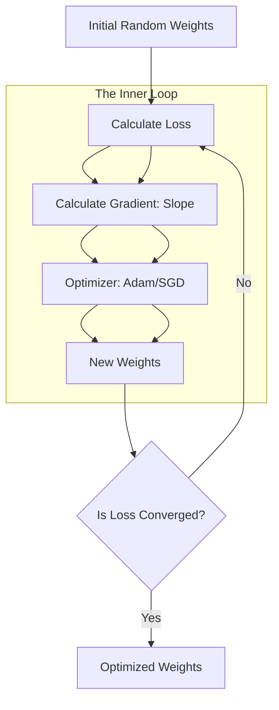

# 🎯 Optimization for AI: Loss Landscape Me Global Minimum Dhoondhna
> **Level:** Advanced | **Language:** Hinglish | **Goal:** Aise algorithms, heuristics, aur mathematical strategies ko master karna jo models ko efficiently best possible weights ke set par converge hone me help karte hain.

---

## 🧭 1. Beginner-Friendly Hinglish Explanation
Optimization ka matlab hai "Sabse behtar (Perfect) weights dhoondhna". 

Sochiye AI model ek anpadh baccha hai. Jab wo galti karta hai, toh "Loss Function" use batata hai ki galti kitni badi hai. Par "Sudharna kaise hai?", ye **Optimizer** batata hai. 
- **Learning Rate:** Ye ek chote bacche ke kadam (steps) ki tarah hai. Agar kadam bahut bade hain, toh wo manjil ko cross kar jayega. Agar bahut chote hain, toh wo kabhi pahunch hi nahi payega.
- **Adam/SGD:** Ye wo algorithms hain jo tay karte hain ki kab tez bhagna hai aur kab dhyan se chalna hai.

Optimization hi wo jaadu hai jo "Random Numbers" ko "Siri" ya "ChatGPT" jaise intelligent dimaag mein badalta hai.

---

## 🧠 2. Deep Technical Explanation
AI me Optimization asal me $\theta^*$ ki search hai jisse $J(\theta^*)$ minimize ho sake:
1. **Gradient Descent:** Baseline operation. $\theta = \theta - \eta \nabla J(\theta)$.
2. **Stochastic Gradient Descent (SGD):** Ek baar me sirf ek sample ka use karke optimization karna. Isme high variance hota hai par ye local minima se bachne me help karta hai.
3. **Momentum:** Update me ek "velocity" term add karna. Ye optimizer ko loss landscape me chhote humps aur saddle points ke upar se "roll over" karne me help karta hai.
4. **RMSProp (Root Mean Square Propagation):** Har parameter ke liye update ko normalize karne ke liye squared gradients ka ek running average maintain karta hai.
5. **Adam (Adaptive Moment Estimation):** Hamara "Gold Standard". Ye **Momentum** (speed) aur **RMSProp** (stability) ke benefits ko combine karta hai. Ye gradients ke first aur second moments ka ek estimate maintain karta hai.
6. **AdamW:** Adam ka ek version jo weight decay ko gradient update se decouple karta hai, jo modern LLM training ke liye bahut crucial hai.

---

## 🏗️ 3. Optimizer Comparison Table
| Optimizer | Key Strength | Best Use Case |
| :--- | :--- | :--- |
| **SGD** | High Generalization | Computer Vision, Fine-tuning |
| **Momentum** | Fast Convergence | Standard Deep Learning |
| **Adam** | Robust to Noise | NLP, Transformers, LLMs |
| **AdamW** | Better Regularization | State-of-the-art LLM Training |
| **L-BFGS** | High Precision | Small datasets, Physics models |

---

## 📐 4. Mathematical Intuition
- **Learning Rate ($\eta$):** Sabse sensitive hyperparameter. Too high $\implies$ Divergence; Too low $\implies$ Stagnation.
- **Saddle Points:** High dimensions me ($70B+$ parameters), "Local Minima" rare hote hain. Aise most points jahan gradient $0$ hota hai, wo actually "Saddle Points" hote hain (jahan ek direction upar jaati hai aur doosri niche). Adam jaise optimizers ko inhi ko navigate karne ke liye design kiya gaya hai.
- **Plateaus:** Flat regions jahan gradient near-zero hota hai. Hum model ko inme se "kick" karne ke liye **Learning Rate Schedulers** (jaise Cosine Annealing) ka use karte hain.

---

## 📊 5. Optimization Path (Diagram)

```mermaid
graph TD
    Start[Initial Random Weights] --> Loss[Calculate Loss]
    Loss --> Grad[Calculate Gradient: Slope]
    Grad --> Opt[Optimizer: Adam/SGD]
    Opt --> Update[New Weights]
    Update --> Check{Is Loss Converged?}
    Check -- "No" --> Loss
    Check -- "Yes" --> Final[Optimized Weights]
    
    subgraph "The Inner Loop"
    Loss --> Grad --> Opt --> Update
    end
```

---

## 💻 6. Production-Ready Examples (Configuring an Optimizer)
```python
# 2026 Pro-Tip: LLMs ke liye Learning Rate Scheduler ke sath AdamW use karein
import torch
from torch.optim import AdamW
from torch.optim.lr_scheduler import CosineAnnealingLR

# Initialize Model
model = my_model()

# Optimizer Configuration
# Overfitting se bachne ke liye weight decay critical hai
optimizer = AdamW(
    model.parameters(), 
    lr=1e-5, 
    weight_decay=0.01, 
    betas=(0.9, 0.999) # Standard Adam constants
)

# Scheduler: Stable convergence ke liye start me high aur end me low hota hai
scheduler = CosineAnnealingLR(optimizer, T_max=1000, eta_min=1e-7)

for epoch in range(100):
    train_one_epoch()
    optimizer.step()
    scheduler.step() # Learning rate update karein
    optimizer.zero_grad()
```

---

## ❌ 7. Failure Cases
- **Gradient Explosion:** Weights `inf` ya `NaN` ban jaate hain. **Fix:** **Gradient Clipping** (`torch.nn.utils.clip_grad_norm_`) ka use karein.
- **Learning Rate Decay too fast:** Model minimum tak pahunchne se pehle hi seekhna (learning) band kar deta hai.
- **Bad Batch Size:** Bahut small batch se extreme noise paida hoti hai; bahut large batch se "Generalization Gap" (model training data par kaam karta hai par new data par fail ho jata hai) create ho jata hai.

---

## 🛠️ 8. Debugging Guide
- **Symptom:** Loss "Spiking" ho raha hai (wildly increase aur decrease hona).
- **Check:** **Learning Rate**. Ye shaayad bahut high hai.
- **Check:** **Data Shuffling**. Kya aap same patterns ko baar-baar dekh rahe hain?
- **Symptom:** Loss kisi specific value par "Stuck" ho gaya hai.
- **Check:** **Vanishing Gradients**. Check karein ki kya aapke weights 0 par initialized hain ya aapke paas dead ReLU neurons hain.

---

## ⚖️ 9. Tradeoffs
- **Speed vs. Memory:** Adam (moments ko store karne ke liye) SGD se $2x$ zyada memory use karta hai. Massive models ke liye ye ek bahut bada tradeoff hai.
- **Convergence vs. Generalization:** Adam fast converge karta hai, lekin SGD aksar aise "Sharper" minima find karta hai jo unseen data par better perform karte hain.

---

## 🛡️ 10. Security Concerns
- **Backdoor Attacks:** Ek attacker aisi training data provide kar sakta hai jo loss landscape me ek "Secret Minimum" create kar de. Model $99\%$ time toh kaam karega lekin specific "Trigger Word" aane par fail ho jayega.
- **Optimizer Manipulation:** Agar koi attacker optimizer ke state ko slightly modify kar de, toh wo model ko kabhi converge hone se rok sakta hai.

---

## 📈 11. Scaling Challenges
- **Distributed Optimization:** Network overhead ko bottleneck banaye bina 1,024 GPUs par gradients ko kaise average kiya jaye. Iske liye **DeepSpeed** ya **FSDP** ka use karein.
- **Memory Optimization:** 8-bit optimizers (jaise bitsandbytes) jo optimizer states ke liye $75\%$ memory save karte hain.

---

## 💸 12. Cost Considerations
- **Training Time = Money:** Ek zyada efficient optimizer (jaise AdamW) 200 hours ke bajaye 100 hours me target accuracy tak pahunch sakta hai, jisse H100 rental costs me $\$50,000$ ki saving hoti hai.
- **Precision:** `bfloat16` ya `float8` me train karne se optimizer par mathematical load reduce hota hai, jisse training $2x$ fast ho jaati hai.

---

## ✅ 13. Best Practices
- **Warmup:** Weights ko "prime" karne ke liye pehle 500-1000 steps ke liye hamesha bahut low learning rate se start karein.
- **Check Your Loss Curve:** Apne loss ko hamesha **Weights & Biases (W&B)** par log karein. Ek "Healthy" loss curve ek smooth downward curve hona chahiye, na ki koi jagged mess.
- **Weight Decay:** Ise skip na karein. Ye aapke model ke "brain" ko healthy rakhne aur use kisi single neuron par over-reliant hone se bachane ka best way hai.

---

## ⚠️ 14. Common Mistakes
- **High Learning Rate at the Start:** Fine-tuning ke dauran ye aksar model ke pre-trained knowledge ko "destroy" kar deta hai.
- **Not Zeroing Gradients:** PyTorch `backward()` gradients ko accumulate karta hai. Agar aap `zero_grad()` call nahi karte hain, toh aapke weights saare previous errors ke "Sum" se update honge.

---

## 📝 15. Interview Questions
1. **"Transformer training ke liye Adam ke bajaye AdamW ko kyun prefer kiya jata hai?"** (Weight Decay ko handle karne ke uske tarike ke kaaran).
2. **"Stochastic Gradient Descent me 'Stochastic' kya hai?"** (Data points ki random sampling).
3. **"Explain karein ki 'Exploding Gradient' problem kya hai aur ise kaise fix kiya jaye."**

---

## 🚀 15. Latest 2026 Industry Patterns
- **Lion (Evolutive Sign Momentum):** Ek naya optimizer jo magnitude ke bajaye gradient ke "Sign" (Positive/Negative) ka use karta hai, jisse memory save hoti hai aur training fast hoti hai.
- **Sophia (Second-order Clipping):** Ek lightweight optimizer jo non-convex landscapes me Adam se $2x$ fast move karne ke liye Hessian ko approximate karta hai.
- **GaLore (Gradient Low-Rank Projection):** Ek aisi technique jo gradients ko low-rank space me project karke consumer GPUs par large models ko train karne ki permission deti hai.
