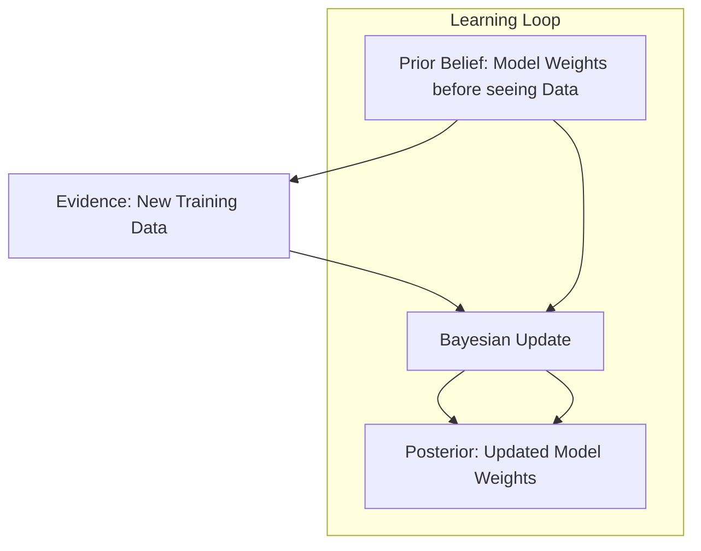

# 🎲 Probability and Statistics for AI: Quantifying Uncertainty & Likelihood
> **Level:** Intermediate | **Language:** Hinglish | **Goal:** Master the statistical frameworks and probabilistic logic required to design, evaluate, and calibrate modern AI systems.

---

## 🧭 1. Beginner-Friendly Hinglish Explanation
AI hamesha "Andaze" par chalta hai, "Fact" par nahi. 

Sochiye aap ChatGPT se puchte hain, "What is the capital of India?". Wo ye nahi jaanta ki "New Delhi" sach hai, balki usne millions of books se ye seekha hai ki is sawal ke baad "New Delhi" aane ki **Probability** $99.9\%$ hai. 

- **Probability:** Ye batati hai ki ek event hone ke kitne chance hain.
- **Statistics:** Ye batati hai ki hum "Purane Data" se "Naye Patterns" kaise dhoondhein.
- **Uncertainty:** AI mein sabse zaruri baat ye hai ki model kab "Confused" hai. Statistics humein wo "Error Bar" ya "Confidence Score" deti hai.

Bina statistics ke, AI sirf andhere mein teer marta; iske saath wo "Sahi teer" marne ka mathematical logic samajhta hai.

---

## 🧠 2. Deep Technical Explanation
AI is essentially **Statistical Inference** at scale:
1. **Random Variables:** Data points are treated as samples from a hidden distribution.
2. **Probability Distributions:** 
   - **Gaussian (Normal):** The "Bell Curve". Most natural data (heights, noise) follows this.
   - **Bernoulli/Multinomial:** For binary (Yes/No) and multi-class (Category 1, 2, 3) classification.
3. **Bayes' Theorem:** The foundation of updating beliefs based on new data. 
   $$P(\text{Model} | \text{Data}) = \frac{P(\text{Data} | \text{Model}) P(\text{Model})}{P(\text{Data})}$$
4. **Expectation ($\mathbb{E}$) & Variance ($\text{Var}$):** Expectation is the "Average" prediction; Variance is the "Inconsistency" or "Spread".
5. **Maximum Likelihood Estimation (MLE):** The method used to find the best weights for a model by maximizing the probability of the training data.

---

## 🏗️ 3. Core Statistical Frameworks
| Concept | Goal | AI Application |
| :--- | :--- | :--- |
| **P-Value** | Check Significance | Is this model improvement real or a fluke? |
| **Confidence Interval** | Range of Truth | Error bars for model accuracy. |
| **Hypothesis Testing** | Decision Making | A/B Testing between two different prompts. |
| **Correlation ($r$)** | Relationship | Does 'Feature A' actually help in predicting 'Target B'? |

---

## 📐 4. Mathematical Intuition
- **Entropy ($H$):** Measuring the "Surprise" or "Messiness" in data. LLMs are trained to minimize **Cross-Entropy**, which means making their predictions less surprising/confused compared to human text.
- **The Law of Large Numbers:** The more data you have, the more your sample average will look like the true population average. This is why "More Data" makes AI smarter.
- **Central Limit Theorem:** Even if your data is messy, the average of samples will always follow a Normal Distribution. This is why many AI algorithms assume "Gaussian Noise".

---

## 📊 5. Bayes' Rule in AI (Diagram)


---

## 💻 6. Production-Ready Examples (Calibration & Probability)
```python
# 2026 Pro-Tip: Never trust raw Softmax scores. Always calibrate.
import numpy as np

def softmax(logits):
    exps = np.exp(logits - np.max(logits)) # Numerical stability trick
    return exps / np.sum(exps)

def get_confidence_score(logits, threshold=0.85):
    probs = softmax(logits)
    max_prob = np.max(probs)
    
    if max_prob < threshold:
        return "I am uncertain. Suggesting human review."
    return f"Prediction: {np.argmax(probs)} (Confidence: {max_prob:.2f})"

# Logits from a classification model
raw_outputs = [2.1, 5.5, 1.2]
print(get_confidence_score(raw_outputs))
```

---

## ❌ 7. Failure Cases
- **The "Black Swan" Event:** Statistics works on history. If something never happened before (like a global pandemic), the model will assign it $0\%$ probability and fail completely.
- **Overconfidence (Overfitting):** A model might say it's $99.9\%$ sure while being completely wrong because it hasn't seen enough diverse data. **Fix:** Use **Label Smoothing**.
- **Data Drift:** The statistics of your users change (e.g., they stop using formal language and start using Gen-Z slang), making your "Old" model's statistics useless.

---

## 🛠️ 8. Debugging Guide
- **Symptom:** Model gives very different answers for very similar inputs.
- **Check:** **High Variance**. Your model is likely overfitting. Use **Regularization (L2)** or **Dropout**.
- **Check:** **Sampling Bias**. Is your training set only representing a small "Slice" of reality? Check the **Distribution Histograms**.

---

## ⚖️ 9. Tradeoffs
- **Precision vs Recall:** Do you want to catch every single spam email (High Recall) or do you want to make sure no real email is marked as spam (High Precision)?
- **Frequentist vs Bayesian:** Frequentists only care about the current data. Bayesians care about "Prior" knowledge + Data. Use Bayesian when you have very small datasets.

---

## 🛡️ 10. Security Concerns
- **Model Stealing:** An attacker can send thousands of queries to your API, observe the output probabilities, and mathematically "Clone" your model's internal distribution without seeing your code.
- **Privacy Leakage:** If a specific name appears too often in the training data, the model might assign it a very high "Likelihood," effectively leaking private information via completion.

---

## 📈 11. Scaling Challenges
- **The Billions of Parameters Problem:** Calculating the "Covariance Matrix" for a 70B model is mathematically impossible. We use approximations like **Diagonal Matrices** to manage complexity.

---

## 💸 12. Cost Considerations
- **A/B Testing Cost:** Running two models at once for statistical significance doubles your GPU bill. Use **Multi-Armed Bandits** to optimize the cost of testing.
- **Sampling:** Instead of running evaluation on 1 million rows, use statistics to find that 10,000 rows give you the same result with $99\%$ confidence, saving $99\%$ of the cost.

---

## ✅ 13. Best Practices
- **Always Report Confidence:** Don't just show the result; show how sure the AI is.
- **Check Outliers:** Use **Z-Scores** to find and remove "Garbage Data" that might ruin your model's statistics.
- **Use Cross-Validation:** Never trust a single "Train-Test" split. Shuffle and test 5-10 times.

---

## ⚠️ 14. Common Mistakes
- **Confusing Correlation with Causation:** Just because people buy more umbrellas when it's raining doesn't mean umbrellas cause rain.
- **Ignoring the "Long Tail":** Focusing only on the "Mean" and ignoring the rare but critical edge cases.

---

## 📝 15. Interview Questions
1. **"What is 'P-hacking' and why is it dangerous for AI research?"**
2. **"How does Bayes' Theorem help in reducing 'Spam' or 'False Positives'?"**
3. **"Explain the 'Bias-Variance Tradeoff' in terms of model complexity."**

---

## 🚀 15. Latest 2026 Industry Patterns
- **Conformal Prediction:** A new standard to provide "Guaranteed Confidence Intervals" for LLMs, making them reliable for medical and legal use.
- **Diffusion Models:** The math of "Denoising" (Statistics of Gaussian noise) is what powers images and video generation in 2026.
- **Stochastic Parrots Audit:** Using statistical "Perplexity" tests to see if an AI is actually reasoning or just repeating memorized patterns from the internet.
