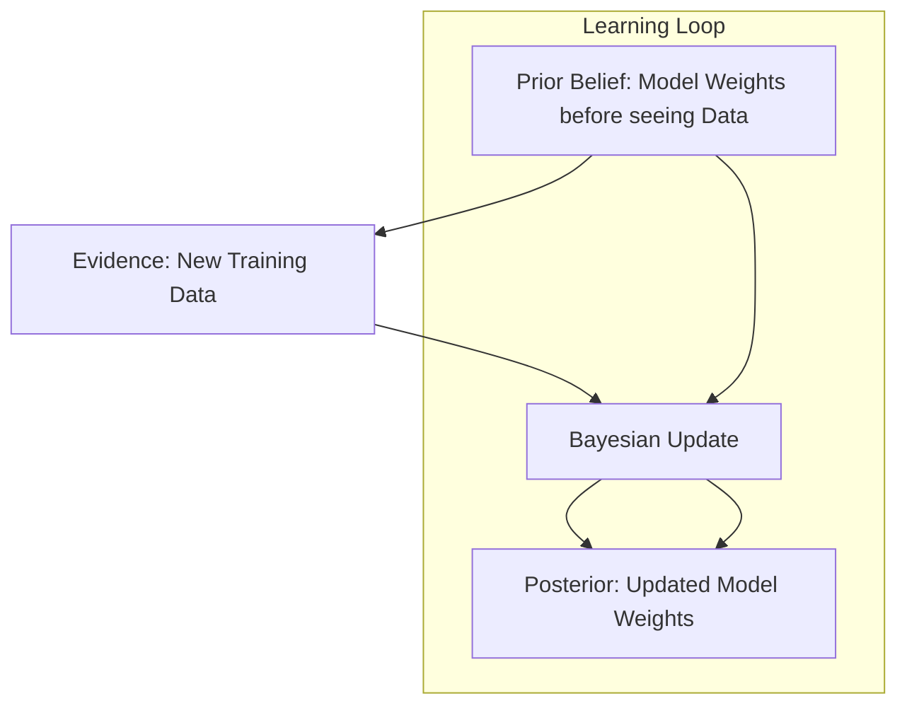

# 🎲 Probability and Statistics for AI: Uncertainty & Likelihood Ko Quantify Karna
> **Level:** Intermediate | **Language:** Hinglish | **Goal:** Modern AI systems ko design, evaluate, aur calibrate karne ke liye required statistical frameworks aur probabilistic logic ko master karna.

---

## 🧭 1. Beginner-Friendly Hinglish Explanation
AI hamesha "Andaze" par chalta hai, "Fact" par nahi. 

Sochiye aap ChatGPT se puchte hain, "What is the capital of India?". Wo ye nahi jaanta ki "New Delhi" sach hai, balki usne millions of books se ye seekha hai ki is sawal ke baad "New Delhi" aane ki **Probability** $99.9\%$ hai. 

- **Probability:** Ye batati hai ki ek event hone ke kitne chance hain.
- **Statistics:** Ye batati hai ki hum "Purane Data" se "Naye Patterns" kaise dhoondhein.
- **Uncertainty:** AI mein sabse zaruri baat ye hai ki model kab "Confused" hai. Statistics humein wo "Error Bar" ya "Confidence Score" deti hai.

Bina statistics ke, AI sirf andhere mein teer marta; iske saath wo "Sahi teer" marne ka mathematical logic samajhta hai.

---

## 🧠 2. Deep Technical Explanation
AI essentially scale par **Statistical Inference** hai:
1. **Random Variables:** Data points ko ek hidden distribution se samples ki tarah treat kiya jata hai.
2. **Probability Distributions:** 
   - **Gaussian (Normal):** Hamara "Bell Curve". Most natural data (heights, noise) ise follow karta hai.
   - **Bernoulli/Multinomial:** Binary (Yes/No) aur multi-class (Category 1, 2, 3) classification ke liye.
3. **Bayes' Theorem:** New data ke basis par beliefs ko update karne ka foundation. 
   $$P(\text{Model} | \text{Data}) = \frac{P(\text{Data} | \text{Model}) P(\text{Model})}{P(\text{Data})}$$
4. **Expectation ($\mathbb{E}$) & Variance ($\text{Var}$):** Expectation "Average" prediction hai; Variance "Inconsistency" ya "Spread" hai.
5. **Maximum Likelihood Estimation (MLE):** Training data ke probability ko maximize karke model ke liye best weights find karne ka method.

---

## 🏗️ 3. Core Statistical Frameworks
| Concept | Goal | AI Application |
| :--- | :--- | :--- |
| **P-Value** | Significance Check Karna | Kya ye model improvement real hai ya sirf ek fluke hai? |
| **Confidence Interval** | Range of Truth | Model accuracy ke liye error bars. |
| **Hypothesis Testing** | Decision Making | Do different prompts ke beech A/B Testing karna. |
| **Correlation ($r$)** | Relationship | Kya 'Feature A' actually 'Target B' ko predict karne me help karta hai? |

---

## 📐 4. Mathematical Intuition
- **Entropy ($H$):** Data me "Surprise" ya "Messiness" ko measure karna. LLMs ko **Cross-Entropy** minimize karne ke liye train kiya jata hai, jiska matlab hai unki predictions ko human text ke comparison me less surprising/confused banana.
- **The Law of Large Numbers:** Aapke paas jitna zyada data hoga, aapka sample average true population average ki tarah utna hi zyada dikhega. Yahi wajah hai ki "More Data" AI ko smart banata hai.
- **Central Limit Theorem:** Bhale hi aapka data kitna bhi messy ho, samples ka average hamesha Normal Distribution ko follow karega. Yahi wajah hai ki kai AI algorithms "Gaussian Noise" assume karte hain.

---

## 📊 5. Bayes' Rule in AI (Diagram)

```mermaid
graph TD
    Prior[Prior Belief: Model Weights before seeing Data] --> Evidence[Evidence: New Training Data]
    Evidence --> Update[Bayesian Update]
    Update --> Posterior[Posterior: Updated Model Weights]
    
    subgraph "Learning Loop"
    Prior --> Update --> Posterior
    end
```

---

## 💻 6. Production-Ready Examples (Calibration & Probability)
```python
# 2026 Pro-Tip: Raw Softmax scores par kabhi trust na karein. Hamesha calibrate karein.
import numpy as np

def softmax(logits):
    exps = np.exp(logits - np.max(logits)) # Numerical stability trick
    return exps / np.sum(exps)

def get_confidence_score(logits, threshold=0.85):
    probs = softmax(logits)
    max_prob = np.max(probs)
    
    if max_prob < threshold:
        return "I am uncertain. Suggesting human review."
    return f"Prediction: {np.argmax(probs)} (Confidence: {max_prob:.2f})"

# Classification model se aane wale logits
raw_outputs = [2.1, 5.5, 1.2]
print(get_confidence_score(raw_outputs))
```

---

## ❌ 7. Failure Cases
- **The "Black Swan" Event:** Statistics history par kaam karti hai. Agar koi cheez pehle kabhi nahi hui (jaise global pandemic), toh model use $0\%$ probability assign karega aur completely fail ho jayega.
- **Overconfidence (Overfitting):** Ek model completely wrong hote hue bhi bol sakta hai ki wo $99.9\%$ sure hai kyunki usne enough diverse data nahi dekha hai. **Fix:** **Label Smoothing** ka use karein.
- **Data Drift:** Aapke users ki statistics change ho jati hain (e.g., wo formal language use karna band kar dete hain aur Gen-Z slang start kar dete hain), jisse aapke "Old" model ki statistics useless ho jaati hain.

---

## 🛠️ 8. Debugging Guide
- **Symptom:** Model very similar inputs ke liye bahut different answers deta hai.
- **Check:** **High Variance**. Aapka model shaayad overfit kar raha hai. **Regularization (L2)** ya **Dropout** ka use karein.
- **Check:** **Sampling Bias**. Kya aapka training set reality ke sirf ek chhote se "Slice" ko represent kar raha hai? **Distribution Histograms** check karein.

---

## ⚖️ 9. Tradeoffs
- **Precision vs Recall:** Kya aap har ek single spam email ko catch karna chahte hain (High Recall) ya ye ensure karna chahte hain ki koi real email spam na mark ho (High Precision)?
- **Frequentist vs Bayesian:** Frequentists sirf current data ki care karte hain. Bayesians "Prior" knowledge + Data dono ki care karte hain. Jab aapke paas bahut small datasets ho toh Bayesian use karein.

---

## 🛡️ 10. Security Concerns
- **Model Stealing:** Ek attacker aapki API ko thousands of queries send kar sakta hai, output probabilities ko observe kar sakta hai, aur bina aapka code dekhe mathematically aapke model ke internal distribution ko "Clone" kar sakta hai.
- **Privacy Leakage:** Agar training data me koi specific name bahut baar aata hai, toh model use bahut high "Likelihood" assign kar sakta hai, jisse completion ke dauran private information effectively leak ho jaati hai.

---

## 📈 11. Scaling Challenges
- **The Billions of Parameters Problem:** Ek 70B model ke liye "Covariance Matrix" calculate karna mathematically impossible hai. Complexity manage karne ke liye hum **Diagonal Matrices** jaise approximations ka use karte hain.

---

## 💸 12. Cost Considerations
- **A/B Testing Cost:** Statistical significance ke liye ek sath do models run karne se aapka GPU bill double ho jata hai. Testing ke cost ko optimize karne ke liye **Multi-Armed Bandits** ka use karein.
- **Sampling:** 1 million rows par evaluation run karne ke bajaye, statistics ka use karke ye find karein ki kya 10,000 rows aapko $99\%$ confidence ke sath same result de sakti hain, jisse $99\%$ cost save ho sake.

---

## ✅ 13. Best Practices
- **Always Report Confidence:** Sirf result mat dikhayein; ye bhi dikhayein ki AI kitna sure hai.
- **Check Outliers:** Aise "Garbage Data" ko find aur remove karne ke liye **Z-Scores** ka use karein jo aapke model ki statistics ko kharab kar sakte hain.
- **Use Cross-Validation:** Kisi single "Train-Test" split par kabhi trust na karein. Shuffle karein aur 5-10 times test karein.

---

## ⚠️ 14. Common Mistakes
- **Confusing Correlation with Causation:** Sirf isliye ki jab baarish hoti hai toh log zyada umbrellas buy karte hain, iska matlab ye nahi hai ki umbrellas baarish ka kaaran bante hain.
- **Ignoring the "Long Tail":** Sirf "Mean" par focus karna aur rare par critical edge cases ko ignore kar dena.

---

## 📝 15. Interview Questions
1. **"'P-hacking' kya hai aur AI research ke liye ye dangerous kyun hai?"**
2. **"Bayes' Theorem 'Spam' ya 'False Positives' ko reduce karne me kaise help karta hai?"**
3. **"Model complexity ke terms me 'Bias-Variance Tradeoff' ko explain karein."**

---

## 🚀 15. Latest 2026 Industry Patterns
- **Conformal Prediction:** LLMs ke liye "Guaranteed Confidence Intervals" provide karne ka ek naya standard, jo unhe medical aur legal use ke liye reliable banata hai.
- **Diffusion Models:** "Denoising" ki math (Gaussian noise ki statistics) hi wo cheez hai jo 2026 me images aur video generation ko power karti hai.
- **Stochastic Parrots Audit:** Statistical "Perplexity" tests ka use karke ye check karna ki kya AI actually reasoning kar raha hai ya sirf internet se memorized patterns ko repeat kar raha hai.
