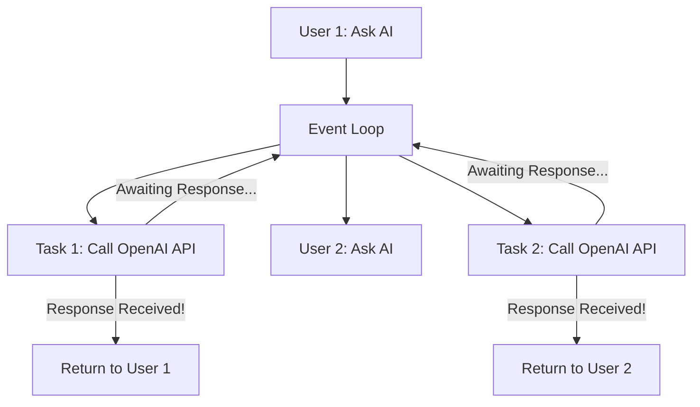

# ⚡ Async Python: High-Concurrency AI Backend Systems
> **Level:** Advanced | **Language:** Hinglish | **Goal:** Master the `asyncio` framework to build non-blocking AI services that can handle thousands of concurrent LLM calls and real-time data streams.

---

## 🧭 1. Beginner-Friendly Hinglish Explanation
Async Python ka matlab hai "Parallelism bina Intezar ke". 

Sochiye, aap ek customer support agent hain. Ek customer ne ek mushkil sawal pucha jiska answer dhoondhne mein AI 10 second lega. 
- **Synchronous (Purana Tareeka):** Aap 10 second tak phone pakad kar baithe rahenge. Is beech koi doosra customer call nahi kar sakta. 
- **Asynchronous (Naya Tareeka):** Aap "Answer" request bhej denge aur phone side mein rakh kar doosre customer ki call utha lenge. Jaise hi answer aayega, aap pehle customer ko wapas call kar denge.

AI Engineering mein jab hum LLMs (OpenAI, Anthropic) ko call karte hain, toh network "intezar" (waiting) bahut hota hai. Async use karke hum ek hi server par bina "Hang" huye hazaaron users ko handle kar sakte hain.

---

## 🧠 2. Deep Technical Explanation
`asyncio` is a single-threaded, single-process design that uses **Cooperative Multitasking**:
1. **The Event Loop:** The brain of async. It keeps track of all running tasks. When a task hits an `await`, the loop pauses it and picks up another task.
2. **Coroutines:** Functions defined with `async def`. They don't run immediately; they return a "Coroutine Object" that must be scheduled on the loop.
3. **Awaitable Objects:** Usually I/O operations (Database queries, API calls, File reading). `await` tells the loop: "I'm waiting for this, feel free to do other things."
4. **Non-blocking I/O:** Standard libraries like `requests` are "Blocking." You MUST use async-compatible libraries like `httpx`, `aiohttp`, or `motor`.
5. **Tasks & Futures:** `asyncio.create_task()` schedules a coroutine to run "in the background" immediately.

---

## 🏗️ 3. Async AI Backend Architecture
| Component | Sync Choice (Avoid) | Async Choice (Use) |
| :--- | :--- | :--- |
| **Web Framework** | Flask / Django | FastAPI / Litestar |
| **HTTP Client** | `requests` | `httpx` / `aiohttp` |
| **Database** | `psycopg2` | `asyncpg` / `SQLAlchemy Async` |
| **Task Queue** | Celery (Sync) | Arq / Taskiq |
| **Event Streaming** | Standard WebSockets | FastAPI WebSockets |

---

## 📐 4. Mathematical Intuition
Async is about maximizing **CPU Utilization**.
- **Wait Time ($W$):** Time spent waiting for LLM/Database.
- **Compute Time ($C$):** Time spent running logic/Python code.
- In AI apps, $W >> C$. 
- If you use Sync, your CPU is idle $90\%$ of the time. 
- With Async, you fill those $90\%$ gaps with other users' requests. **Result:** $10x$ Throughput on the same hardware.

---

## 📊 5. The Event Loop Lifecycle (Diagram)


---

## 💻 6. Production-Ready Examples (Concurrent LLM Requests)
```python
# 2026 Pro-Tip: Parallelize I/O bound AI tasks with asyncio.gather
import asyncio
import httpx
import time

async def fetch_ai_summary(document_id: int):
    print(f"Starting analysis for Doc {document_id}")
    async with httpx.AsyncClient() as client:
        # Simulate an LLM API call (takes 2 seconds)
        response = await client.get(f"https://api.ai.com/v1/analyze/{document_id}", timeout=10.0)
        return response.json()

async def main():
    start_time = time.perf_counter()
    
    # Scheduling 5 documents to be analyzed at the SAME TIME
    tasks = [fetch_ai_summary(i) for i in range(5)]
    
    # asyncio.gather waits for all to finish
    results = await asyncio.gather(*tasks)
    
    end_time = time.perf_counter()
    print(f"Analyzed {len(results)} docs in {end_time - start_time:.2f} seconds.")

# Total time will be ~2 seconds, not 10!
if __name__ == "__main__":
    asyncio.run(main())
```

---

## ❌ 7. Failure Cases
- **The "Blocking" Disaster:** Calling `time.sleep(5)` or a synchronous `requests.get()` inside an `async` function. This **Stops the entire server** for all users.
- **Unbounded Concurrency:** Launching $10,000$ async tasks at once can crash your memory or get your IP banned by the AI provider. **Fix:** Use a **Semaphore** to limit concurrency (e.g., max 50 at a time).
- **Infinite Await:** Forgetting to set a `timeout` on an API call. The task will wait forever, leaking resources.

---

## 🛠️ 8. Debugging Guide
- **Symptom:** Server is unresponsive but CPU usage is low.
- **Check:** **Are you blocking the loop?** Use the `aiodebug` or `PYTHONASYNCIODEBUG=1` env variable. It will log an error if any task blocks the loop for more than $100ms$.
- **Symptom:** "RuntimeError: Event loop is closed."
- **Check:** Are you trying to run an async function inside a thread that doesn't have an active event loop?

---

## ⚖️ 9. Tradeoffs
- **Async vs. Multiprocessing:** Async is for "Waiting" (I/O). Multiprocessing is for "Calculating" (CPU Math).
- **Complexity:** Async code is harder to read and trace. Stack traces are often confusing because they jump between different contexts.

---

## 🛡️ 10. Security Concerns
- **Race Conditions:** Even though it's single-threaded, two async tasks might try to update the same variable (e.g., a shared "Cost counter") at the same time. Use `asyncio.Lock()`.
- **Resource Exhaustion:** An attacker can keep thousands of async connections open, consuming all "File Descriptors." Always use strict **Connection Timeouts**.

---

## 📈 11. Scaling Challenges
- One Python process (and one Event Loop) can only use **One CPU Core**. To scale to 64 cores, you need to run **64 Workers** (using Gunicorn with Uvicorn workers).
- **Database Connection Pooling:** Standard pools don't work with async. You need an async-specific pool (like `asyncpg.create_pool`).

---

## 💸 12. Cost Considerations
- Async is the ultimate "Cost Optimizer." It allows you to handle the traffic of $5$ synchronous servers on just $1$ asynchronous server. This cuts your **EC2/Cloud Run** bill by $80\%$.

---

## ✅ 13. Best Practices
- **Never Block:** If you have to do heavy math, offload it to `loop.run_in_executor()`.
- **Use `httpx`:** It's the modern, async-capable replacement for `requests`.
- **Graceful Shutdown:** Always handle `SIGTERM` to close your async model connections properly.

---

## ⚠️ 14. Common Mistakes
- Using `await` on something that is not an awaitable (like a regular function).
- Forgetting to actually call `await` on a coroutine (it will just return the object and nothing will happen).

---

## 📝 15. Interview Questions
1. **"What is the difference between Concurrency and Parallelism in Python?"**
2. **"How does the Event Loop handle 10,000 requests if it's single-threaded?"**
3. **"What happens if you run `requests.get()` inside a FastAPI endpoint?"** (It blocks the entire loop/server).

---

## 🚀 15. Latest 2026 Industry Patterns
- **Native Async Tensors:** Research into moving tensors between CPU and GPU asynchronously using `await tensor.to_gpu()`.
- **Structured Concurrency:** Using libraries like `Trio` or Python 3.11+ `TaskGroups` for safer, more predictable async error handling.
- **Async Agents:** Multi-agent systems (like CrewAI or LangGraph) moving to fully async execution to allow $50$ agents to "think" simultaneously.
