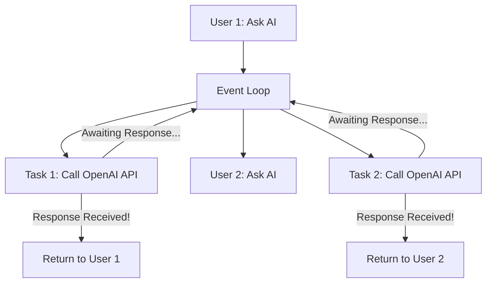

# ⚡ Async Python: High-Concurrency AI Backend Systems
> **Level:** Advanced | **Language:** Hinglish | **Goal:** Non-blocking AI services build karne ke liye `asyncio` framework ko master karna jo thousands of concurrent LLM calls aur real-time data streams ko handle kar sakein.

---

## 🧭 1. Beginner-Friendly Hinglish Explanation
Async Python ka matlab hai "Parallelism bina Intezar ke". 

Sochiye, aap ek customer support agent hain. Ek customer ne ek mushkil sawal pucha jiska answer dhoondhne mein AI 10 second lega. 
- **Synchronous (Purana Tareeka):** Aap 10 second tak phone pakad kar baithe rahenge. Is beech koi doosra customer call nahi kar sakta. 
- **Asynchronous (Naya Tareeka):** Aap "Answer" request bhej denge aur phone side mein rakh kar doosre customer ki call utha lenge. Jaise hi answer aayega, aap pehle customer ko wapas call kar denge.

AI Engineering mein jab hum LLMs (OpenAI, Anthropic) ko call karte hain, toh network "intezar" (waiting) bahut hota hai. Async use karke hum ek hi server par bina "Hang" huye hazaaron users ko handle kar sakte hain.

---

## 🧠 2. Deep Technical Explanation
`asyncio` ek single-threaded, single-process design hai jo **Cooperative Multitasking** ka use karta hai:
1. **The Event Loop:** Async ka brain. Ye chal rahe saare tasks ka track rakhta hai. Jab koi task `await` ko hit karta hai, toh loop use pause kar deta hai aur doosre task ko pick kar leta hai.
2. **Coroutines:** Aise functions jinhe `async def` ke sath define kiya jata hai. Ye immediately run nahi hote; ye ek "Coroutine Object" return karte hain jise loop par schedule karna hota hai.
3. **Awaitable Objects:** Usually I/O operations (Database queries, API calls, File reading). `await` loop ko batata hai: "Main iske liye wait kar raha hoon, aap doosre kaam karne ke liye free hain."
4. **Non-blocking I/O:** Standard libraries jaise `requests` "Blocking" hoti hain. Aapko zaroor `httpx`, `aiohttp`, ya `motor` jaisi async-compatible libraries ka use karna chahiye.
5. **Tasks & Futures:** `asyncio.create_task()` immediately "background" me run hone ke liye coroutine ko schedule kar deta hai.

---

## 🏗️ 3. Async AI Backend Architecture
| Component | Sync Choice (Avoid) | Async Choice (Use) |
| :--- | :--- | :--- |
| **Web Framework** | Flask / Django | FastAPI / Litestar |
| **HTTP Client** | `requests` | `httpx` / `aiohttp` |
| **Database** | `psycopg2` | `asyncpg` / `SQLAlchemy Async` |
| **Task Queue** | Celery (Sync) | Arq / Taskiq |
| **Event Streaming** | Standard WebSockets | FastAPI WebSockets |

---

## 📐 4. Mathematical Intuition
Async ka maqsad **CPU Utilization** ko maximize karna hai.
- **Wait Time ($W$):** Time spent waiting for LLM/Database.
- **Compute Time ($C$):** Time spent running logic/Python code.
- In AI apps, $W >> C$. 
- If you use Sync, your CPU is idle $90\%$ of the time. 
- With Async, you fill those $90\%$ gaps with other users' requests. **Result:** $10x$ Throughput on the same hardware.

---

## 📊 5. The Event Loop Lifecycle (Diagram)

```mermaid
graph TD
    User1[User 1: Ask AI] --> Loop[Event Loop]
    Loop --> Task1[Task 1: Call OpenAI API]
    Task1 -- "Awaiting Response..." --> Loop
    Loop --> User2[User 2: Ask AI]
    Loop --> Task2[Task 2: Call OpenAI API]
    Task2 -- "Awaiting Response..." --> Loop
    Task1 -- "Response Received!" --> Result1[Return to User 1]
    Task2 -- "Response Received!" --> Result2[Return to User 2]
```

---

## 💻 6. Production-Ready Examples (Concurrent LLM Requests)
```python
# 2026 Pro-Tip: asyncio.gather ke sath I/O bound AI tasks ko parallelize karein
import asyncio
import httpx
import time

async def fetch_ai_summary(document_id: int):
    print(f"Starting analysis for Doc {document_id}")
    async with httpx.AsyncClient() as client:
        # Simulate an LLM API call (takes 2 seconds)
        response = await client.get(f"https://api.ai.com/v1/analyze/{document_id}", timeout=10.0)
        return response.json()

async def main():
    start_time = time.perf_counter()
    
    # Scheduling 5 documents to be analyzed at the SAME TIME
    tasks = [fetch_ai_summary(i) for i in range(5)]
    
    # asyncio.gather waits for all to finish
    results = await asyncio.gather(*tasks)
    
    end_time = time.perf_counter()
    print(f"Analyzed {len(results)} docs in {end_time - start_time:.2f} seconds.")

# Total time will be ~2 seconds, not 10!
if __name__ == "__main__":
    asyncio.run(main())
```

---

## ❌ 7. Failure Cases
- **The "Blocking" Disaster:** Kisi `async` function ke andar `time.sleep(5)` ya ek synchronous `requests.get()` ko call karna. Ye **sabhi users ke liye pure server ko stop (block) kar deta hai**.
- **Unbounded Concurrency:** Ek sath $10,000$ async tasks launch karne se aapki memory crash ho sakti hai ya AI provider dwara aapka IP ban ho sakta hai. **Fix:** Concurrency ko limit karne ke liye **Semaphore** ka use karein (e.g., ek baar me max 50).
- **Infinite Await:** API call par `timeout` set karna bhul jana. Task forever wait karta rahega, jisse resources leak honge.

---

## 🛠️ 8. Debugging Guide
- **Symptom:** Server is unresponsive but CPU usage is low.
- **Check:** **Are you blocking the loop?** Use the `aiodebug` or `PYTHONASYNCIODEBUG=1` env variable. It will log an error if any task blocks the loop for more than $100ms$.
- **Symptom:** "RuntimeError: Event loop is closed."
- **Check:** Kya aap kisi aise thread ke andar async function run karne ki koshish kar rahe hain jisme active event loop nahi hai?

---

## ⚖️ 9. Tradeoffs
- **Async vs. Multiprocessing:** Async "Waiting" (I/O) ke liye hai. Multiprocessing "Calculating" (CPU Math) ke liye hai.
- **Complexity:** Async code ko read aur trace karna mushkil hota hai. Stack traces aksar confusing hote hain kyunki wo different contexts ke beech jump karte hain.

---

## 🛡️ 10. Security Concerns
- **Race Conditions:** Bhale hi ye single-threaded hai, fir bhi do async tasks same variable (e.g., shared "Cost counter") ko same time par update karne ki koshish kar sakte hain. Iske liye `asyncio.Lock()` ka use karein.
- **Resource Exhaustion:** Ek attacker thousands of async connections open rakh sakta hai, jisse saare "File Descriptors" consume ho jaate hain. Hamesha strict **Connection Timeouts** ka use karein.

---

## 📈 11. Scaling Challenges
- One Python process (and one Event Loop) can only use **One CPU Core**. To scale to 64 cores, you need to run **64 Workers** (using Gunicorn with Uvicorn workers).
- **Database Connection Pooling:** Standard pools don't work with async. You need an async-specific pool (like `asyncpg.create_pool`).

---

## 💸 12. Cost Considerations
- Async sabse bada "Cost Optimizer" hai. Ye aapko sirf $1$ asynchronous server par $5$ synchronous servers ke traffic ko handle karne ki permission deta hai. Ye aapke **EC2/Cloud Run** bill ko $80\%$ tak cut kar deta hai.

---

## ✅ 13. Best Practices
- **Never Block:** Agar aapko heavy math calculations karni hain, toh use `loop.run_in_executor()` par offload karein.
- **Use `httpx`:** Ye `requests` ka modern, async-capable replacement hai.
- **Graceful Shutdown:** Apne async model connections ko properly close karne ke liye hamesha `SIGTERM` ko handle karein.

---

## ⚠️ 14. Common Mistakes
- Kisi aisi cheez par `await` use karna jo awaitable nahi hai (jaise koi regular function).
- Coroutine par actually `await` call karna bhul jana (ye sirf object return karega aur kuch nahi hoga).

---

## 📝 15. Interview Questions
1. **"Python me Concurrency aur Parallelism me kya difference hai?"**
2. **"Event Loop single-threaded hone par bhi 10,000 requests ko kaise handle karta hai?"**
3. **"FastAPI endpoint ke andar `requests.get()` run karne se kya hota hai?"** (Ye pure loop/server ko block kar deta hai).

---

## 🚀 15. Latest 2026 Industry Patterns
- **Native Async Tensors:** Tensors ko CPU aur GPU ke beech asynchronously move karne me research, `await tensor.to_gpu()` ka use karke.
- **Structured Concurrency:** Safer aur more predictable async error handling ke liye `Trio` libraries ya Python 3.11+ `TaskGroups` ka use karna.
- **Async Agents:** Multi-agent systems (jaise CrewAI ya LangGraph) ka fully async execution par shift hona taaki $50$ agents simultaneously "think" kar sakein.
