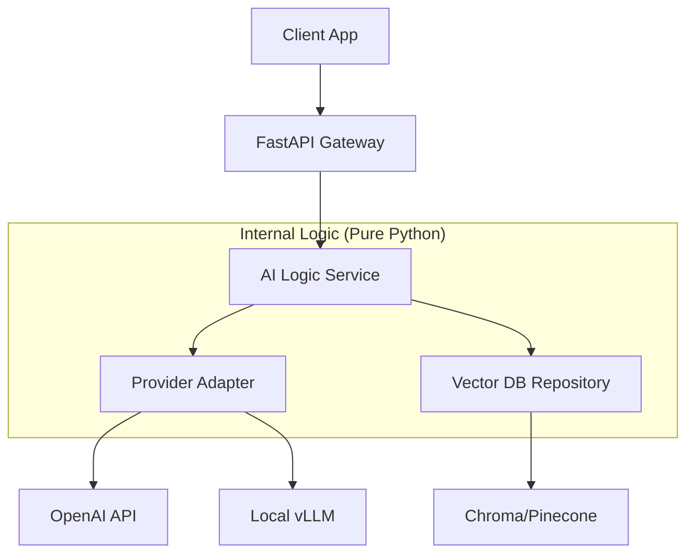

# 🏗️ Clean Code & Architecture for AI: Scaling from Script to System
> **Level:** Advanced | **Language:** Hinglish | **Goal:** Master the software engineering principles (SOLID, Design Patterns, Modularity) required to build maintainable, scalable, and robust AI applications.

---

## 🧭 1. Beginner-Friendly Hinglish Explanation
Clean Code ka matlab hai "Aisa code jo doosre log (aur aap 6 mahine baad) asani se samajh sakein". 

AI mein shuruat mein hum sirf "Scripts" likhte hain—ek single file jisme data load ho raha hai, model chal raha hai, aur results save ho rahe hain. Par jab ye "Product" banta hai, toh wo script ek "Maseebat" ban jati hai. 
- **Modularity:** Har cheez ko alag dabe (box) mein rakhna. Data alag, Model alag, Logic alag.
- **SOLID Principles:** Code ko aise likhna ki naye features add karne ke liye purana code todna na padhe.
- **Architecture:** Ek bada "Naksha" (Map) banana taaki 10 engineers ek saath ek hi project par bina lade kaam kar sakein.

Is module mein hum seekhenge ki kaise AI "Hacking" se nikal kar AI "Engineering" ki taraf badhein.

---

## 🧠 2. Deep Technical Explanation
Software Engineering for AI requires a blend of standard patterns and AI-specific needs:
1. **Separation of Concerns (SoC):** 
   - **Data Layer:** Handling data loading, cleaning, and augmentation.
   - **Model Layer:** Handling model architecture, weights, and inference.
   - **Service Layer:** The business logic (e.g., "If the user is premium, use GPT-4").
   - **API Layer:** The interface (FastAPI/REST/gRPC).
2. **SOLID Principles in AI:**
   - **Single Responsibility:** A class should do ONE thing (e.g., `TextTokenizer` shouldn't also be calling the Database).
   - **Open/Closed:** You should be able to add a new model (e.g., Llama-4) without changing the existing `InferenceService` code.
3. **Design Patterns:**
   - **Strategy Pattern:** To switch between different models (OpenAI vs. Local) at runtime.
   - **Factory Pattern:** To create the right "Agent" or "Tool" based on the user's task.
   - **Singleton:** Ensuring only ONE instance of a massive 70B model is loaded in memory.

---

## 🏗️ 3. The AI System Layers
| Layer | Responsibility | Pattern |
| :--- | :--- | :--- |
| **Inference Service** | Running the LLM/Model | Singleton, Batching |
| **Data Repository** | Interacting with Vector DB/SQL | Repository Pattern |
| **Orchestrator** | Managing Multi-agent flows | Graph / State Machine |
| **Adapter Layer** | Standardizing different AI APIs | Adapter Pattern |
| **Guardrails** | Validating Input/Output | Decorator / Middleware |

---

## 📐 4. Mathematical Intuition
Clean Architecture is about **Reducing Entropy ($S$)** in a codebase.
- As a project grows, its "Complexity" (Entropy) naturally increases: $S \uparrow$.
- Clean code principles act as a **Negative Entropy** force.
- **Goal:** Keep the "Cost of Change" ($dC/dt$) constant over time, rather than let it grow exponentially.

---

## 📊 5. Modular AI Architecture (Diagram)


---

## 💻 6. Production-Ready Examples (Strategy Pattern for Models)
```python
# 2026 Pro-Tip: Use Interfaces (Abstract Base Classes) for Model Flexibility
from abc import ABC, abstractmethod

class LLMProvider(ABC):
    """Abstract Base Class for all LLMs."""
    @abstractmethod
    def generate(self, prompt: str) -> str:
        pass

class OpenAIProvider(LLMProvider):
    def generate(self, prompt: str):
        return "Response from GPT-4"

class LocalProvider(LLMProvider):
    def generate(self, prompt: str):
        return "Response from Llama-3"

class AIService:
    """The Business Logic doesn't care which model it uses."""
    def __init__(self, provider: LLMProvider):
        self.provider = provider

    def run_task(self, prompt: str):
        # Additional logic (Logging, Guardrails)
        return self.provider.generate(prompt)

# Usage: Switching models is now 1 line of code!
service = AIService(OpenAIProvider())
```

---

## ❌ 7. Failure Cases
- **The "God File" Failure:** One `app.py` with 5,000 lines of code doing everything from DB connection to model training. **Fix:** Use **Directory Structuring** (`/models`, `/api`, `/utils`).
- **Hardcoded Logic:** `if user_query == "hi": return "hello"`. This makes the system impossible to scale. **Fix:** Use **Prompt Templates** and **Knowledge Bases**.
- **The "Model-in-Controller" Trap:** Loading a heavy AI model inside every web request handler.

---

## 🛠️ 7. Debugging Guide
- **Symptom:** Changing the model provider (e.g., moving from OpenAI to Anthropic) broke 50 files.
- **Check:** **Leaky Abstractions**. Does your business logic know too much about OpenAI's specific JSON format? Use a **Standardized Adapter**.
- **Symptom:** "Circular Import Error".
- **Check:** Are your components too tightly coupled? Use **Dependency Injection**.

---

## ⚖️ 8. Tradeoffs
- **Over-Engineering vs. Speed:** For a 2-day hackathon, a single script is fine. For a 2-year production project, Clean Architecture is mandatory. Don't build a "Rocket Ship" for a "Bicycle" task.
- **Readability vs. Conciseness:** Sometimes "Clean Code" is more lines than "Hackey Code," but it's easier to maintain.

---

## 🛡️ 9. Security Concerns
- **Logic Injection:** If your architecture allows agents to "modify" the business logic layer, they can disable security checks.
- **Secret Management:** Always use a **Configuration Layer** (like `BaseSettings` in Pydantic) to handle API keys. NEVER put secrets in your main logic.

---

## 📈 10. Scaling Challenges
- **State Synchronization:** In a clean architecture, where does the "Session History" live? It should be in a separate **Caching Layer (Redis)**, not in the memory of the service.
- **Microservices vs. Monolith:** As the AI team grows, you might need to move the "Model Inference" into its own microservice to scale GPUs independently of the web server.

---

## 💸 11. Cost Considerations
- Clean code allows for **Easy Optimization**. If your code is modular, you can easily swap an expensive GPT-4 call for a cheap Llama-3 call in specific modules without rewriting the whole app, saving $90\%$ in costs.

---

## ✅ 12. Best Practices
- **DRY (Don't Repeat Yourself):** If you are writing the same "Prompt formatting" logic in 3 places, make it a function.
- **Composition over Inheritance:** Instead of making a "SmartAgent" inherit from "BaseAgent", give "BaseAgent" a list of "Skills" (Composition).
- **Type Everything:** Use Python Type Hints for every function parameter and return value.

---

## ⚠️ 13. Common Mistakes
- **No Directory Structure:** Keeping all `.py` files in the root folder.
- **Spaghetti Code:** Passing the entire `request` object deep into the model inference logic.
- **Global Variables:** Using a global `MODEL` variable that makes testing impossible.

---

## 📝 14. Interview Questions
1. **"Explain how the 'Adapter Pattern' helps in an AI application with multiple LLM providers."**
2. **"What is the 'Single Responsibility Principle' and how does it apply to an AI Data Pipeline?"**
3. **"Why is 'Dependency Injection' useful for testing AI systems?"**

---

## 🚀 15. Latest 2026 Industry Patterns
- **Agentic Clean Architecture:** A new pattern where the "Service Layer" is replaced by a "Graph of Agents," but the underlying principles of modularity and testing remain the same.
- **Configuration as Code:** Moving all prompt engineering into YAML/JSON files, keeping the Python code purely for logic and flow.
- **Hexagonal Architecture (Ports & Adapters) for AI:** Ensuring the "AI Core" is completely isolated from the "External World" (Databases, Slack, Webhooks), making it $100\%$ portable.
