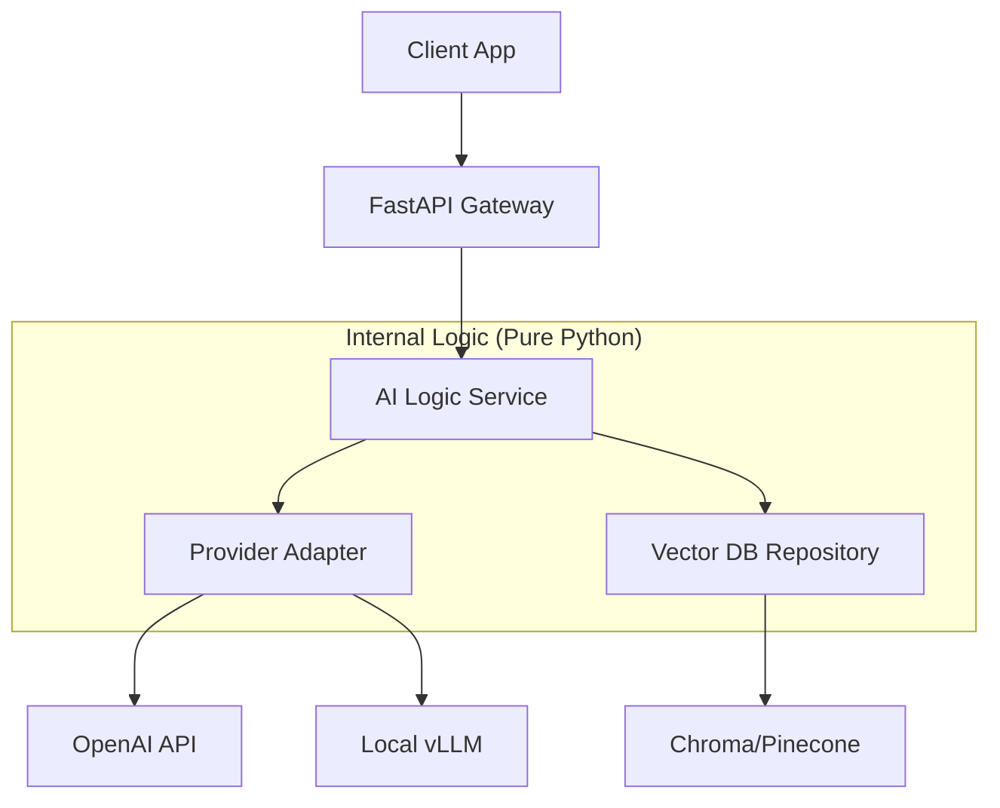

# 🏗️ Clean Code & Architecture for AI: Script Se Lekar System Tak Scale Karna
> **Level:** Advanced | **Language:** Hinglish | **Goal:** Maintainable, scalable, aur robust AI applications build karne ke liye required software engineering principles (SOLID, Design Patterns, Modularity) ko master karna.

---

## 🧭 1. Beginner-Friendly Hinglish Explanation
Clean Code ka matlab hai "Aisa code jo doosre log (aur aap 6 mahine baad) asani se samajh sakein". 

AI mein shuruat mein hum sirf "Scripts" likhte hain—ek single file jisme data load ho raha hai, model chal raha hai, aur results save ho rahe hain. Par jag ye "Product" banta hai, toh wo script ek "Maseebat" ban jati hai. 
- **Modularity:** Har cheez ko alag dabe (box) mein rakhna. Data alag, Model alag, Logic alag.
- **SOLID Principles:** Code ko aise likhna ki naye features add karne ke liye purana code todna na padhe.
- **Architecture:** Ek bada "Naksha" (Map) banana taaki 10 engineers ek saath ek hi project par bina lade kaam kar sakein.

Is module mein hum seekhenge ki kaise AI "Hacking" se nikal kar AI "Engineering" ki taraf badhein.

---

## 🧠 2. Deep Technical Explanation
AI ke liye Software Engineering standard patterns aur AI-specific needs ke blend ki demand karti hai:
1. **Separation of Concerns (SoC):** 
   - **Data Layer:** Data loading, cleaning, aur augmentation ko handle karna.
   - **Model Layer:** Model architecture, weights, aur inference ko handle karna.
   - **Service Layer:** Business logic ko handle karna (e.g., "Agar user premium hai, toh GPT-4 use karein").
   - **API Layer:** Interface ko handle karna (FastAPI/REST/gRPC).
2. **SOLID Principles in AI:**
   - **Single Responsibility:** Ek class ko sirf EK hi kaam karna chahiye (e.g., `TextTokenizer` ko Database call nahi karna chahiye).
   - **Open/Closed:** Aap existing `InferenceService` code ko bina change kiye ek naya model (e.g., Llama-4) add kar sakein.
3. **Design Patterns:**
   - **Strategy Pattern:** Runtime par different models (OpenAI vs. Local) ke beech switch karne ke liye.
   - **Factory Pattern:** User ke task ke basis par correct "Agent" ya "Tool" create karne ke liye.
   - **Singleton:** Ye ensure karne ke liye ki memory me massive 70B model ka sirf EK hi instance load ho.

---

## 🏗️ 3. The AI System Layers
| Layer | Responsibility | Pattern |
| :--- | :--- | :--- |
| **Inference Service** | LLM/Model ko run karna | Singleton, Batching |
| **Data Repository** | Vector DB/SQL ke sath interact karna | Repository Pattern |
| **Orchestrator** | Multi-agent flows ko manage karna | Graph / State Machine |
| **Adapter Layer** | Different AI APIs ko standardize karna | Adapter Pattern |
| **Guardrails** | Input/Output ko validate karna | Decorator / Middleware |

---

## 📐 4. Mathematical Intuition
Clean Architecture codebase me **Entropy ($S$) ko reduce karne** ke baare me hai.
- As a project grows, its "Complexity" (Entropy) naturally increases: $S \uparrow$.
- Clean code principles act as a **Negative Entropy** force.
- **Goal:** Time ke sath "Cost of Change" ($dC/dt$) ko constant rakhna, na ki use exponentially grow hone dena.

---

## 📊 5. Modular AI Architecture (Diagram)

```mermaid
graph TD
    Client[Client App] --> API[FastAPI Gateway]
    API --> Service[AI Logic Service]
    Service --> Adapter[Provider Adapter]
    Adapter --> OpenAI[OpenAI API]
    Adapter --> Local[Local vLLM]
    
    Service --> DB[Vector DB Repository]
    DB --> Chroma[Chroma/Pinecone]
    
    subgraph "Internal Logic (Pure Python)"
    Service
    Adapter
    DB
    end
```

---

## 💻 6. Production-Ready Examples (Strategy Pattern for Models)
```python
# 2026 Pro-Tip: Model Flexibility ke liye Interfaces (Abstract Base Classes) ka use karein
from abc import ABC, abstractmethod

class LLMProvider(ABC):
    """Abstract Base Class for all LLMs."""
    @abstractmethod
    def generate(self, prompt: str) -> str:
        pass

class OpenAIProvider(LLMProvider):
    def generate(self, prompt: str):
        return "Response from GPT-4"

class LocalProvider(LLMProvider):
    def generate(self, prompt: str):
        return "Response from Llama-3"

class AIService:
    """The Business Logic doesn't care which model it uses."""
    def __init__(self, provider: LLMProvider):
        self.provider = provider

    def run_task(self, prompt: str):
        # Additional logic (Logging, Guardrails)
        return self.provider.generate(prompt)

# Usage: Models ko switch karna ab sirf 1 line ka code hai!
service = AIService(OpenAIProvider())
```

---

## ❌ 7. Failure Cases
- **The "God File" Failure:** Ek single `app.py` jisme 5,000 lines ka code hai aur jo DB connection se lekar model training tak sab kuch kar raha hai. **Fix:** **Directory Structuring** (`/models`, `/api`, `/utils`) ka use karein.
- **Hardcoded Logic:** `if user_query == "hi": return "hello"`. Ye system ko scale karna impossible bana deta hai. **Fix:** **Prompt Templates** aur **Knowledge Bases** ka use karein.
- **The "Model-in-Controller" Trap:** Har ek web request handler ke andar heavy AI model load karna.

---

## 🛠️ 7. Debugging Guide
- **Symptom:** Model provider ko change karne se (e.g., OpenAI se Anthropic par shift hone se) 50 files break ho gayi.
- **Check:** **Leaky Abstractions**. Kya aapki business logic OpenAI ke specific JSON format ke baare me bahut zyada jaanti hai? Ek **Standardized Adapter** ka use karein.
- **Symptom:** "Circular Import Error".
- **Check:** Kya aapke components bahut tightly coupled hain? **Dependency Injection** ka use karein.

---

## ⚖️ 8. Tradeoffs
- **Over-Engineering vs. Speed:** 2-day hackathon ke liye ek single script kafi hai. 2-year production project ke liye Clean Architecture mandatory hai. Kisi "Bicycle" task ke liye "Rocket Ship" mat build karein.
- **Readability vs. Conciseness:** Kabhi-kabhi "Clean Code" me "Hackey Code" se zyada lines hoti hain, par ise maintain karna kafi easy hota hai.

---

## 🛡️ 9. Security Concerns
- **Logic Injection:** Agar aapki architecture agents ko business logic layer ko "modify" karne ki permission deti hai, toh wo security checks ko disable kar sakte hain.
- **Secret Management:** API keys ko handle karne ke liye hamesha **Configuration Layer** (jaise Pydantic me `BaseSettings`) ka use karein. Secrets ko NEVER main logic me na rakhein.

---

## 📈 10. Scaling Challenges
- **State Synchronization:** Clean architecture me "Session History" kahan rehti hai? Ise ek separate **Caching Layer (Redis)** me hona chahiye, na ki service ki memory me.
- **Microservices vs. Monolith:** Jaise-jaise AI team grow karti hai, aapko web server se independently GPUs ko scale karne ke liye "Model Inference" ko uske khud ke microservice me shift karne ki need ho sakti hai.

---

## 💸 11. Cost Considerations
- Clean code **Easy Optimization** ki permission deta hai. Agar aapka code modular hai, toh aap pure app ko rewrite kiye bina specific modules me expensive GPT-4 call ko cheap Llama-3 call se easily swap kar sakte hain, jisse costs me $90\%$ ki saving hogi.

---

## ✅ 12. Best Practices
- **DRY (Don't Repeat Yourself):** Agar aap 3 places par same "Prompt formatting" logic likh rahe hain, toh use ek function bana dein.
- **Composition over Inheritance:** "SmartAgent" ko "BaseAgent" se inherit karwane ke bajaye, "BaseAgent" ko "Skills" ki ek list dein (Composition).
- **Type Everything:** Har function parameter aur return value ke liye Python Type Hints ka use karein.

---

## ⚠️ 13. Common Mistakes
- **No Directory Structure:** Saari `.py` files ko root folder me rakhna.
- **Spaghetti Code:** Pure `request` object ko model inference logic ke deep me pass kar dena.
- **Global Variables:** Global `MODEL` variable ka use karna jo testing ko impossible bana deta hai.

---

## 📝 14. Interview Questions
1. **"Explain karein ki kaise 'Adapter Pattern' multiple LLM providers ke sath ek AI application me help karta hai."**
2. **"'Single Responsibility Principle' kya hai aur ye ek AI Data Pipeline par kaise apply hota hai?"**
3. **"AI systems ko test karne ke liye 'Dependency Injection' kyun useful hai?"**

---

## 🚀 15. Latest 2026 Industry Patterns
- **Agentic Clean Architecture:** Ek naya pattern jahan "Service Layer" ko "Graph of Agents" se replace kar diya jata hai, par modularity aur testing ke underlying principles same rehte hain.
- **Configuration as Code:** Saari prompt engineering ko YAML/JSON files me shift karna, Python code ko purely logic aur flow ke liye rakhna.
- **Hexagonal Architecture (Ports & Adapters) for AI:** Ye ensure karna ki "AI Core" "External World" (Databases, Slack, Webhooks) se completely isolated ho, jisse ye $100\%$ portable ban sake.
