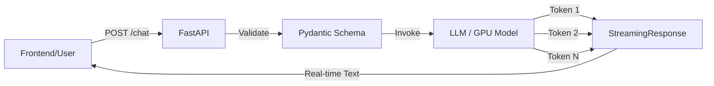

# 🌐 FastAPI & Backend Engineering: Production AI APIs Build Karna
> **Level:** Advanced | **Language:** Hinglish | **Goal:** Streaming, background tasks, aur architectural excellence par focus karte hue FastAPI ka use karke scalable aur high-performance AI backends ke development ko master karna.

---

## 🧭 1. Beginner-Friendly Hinglish Explanation
FastAPI AI dunya ka sabse "Cool" aur powerful backend framework hai. 

Sochiye, aapne ek bahut intelligent AI model banaya. Par log use kaise use karenge? Unhe ek "Website" ya "Mobile App" chahiye hogi. FastAPI wo **"Bridge"** (Pul) hai jo aapke AI model aur user ke beech mein khada hota hai. 
- **The Door (Endpoint):** Jahan user apna sawal (request) bhejta hai.
- **The Security (Validation):** Ye check karna ki user sahi data bhej raha hai.
- **The Waiter (Async):** Ek saath 100 users ke orders lena bina kisi ko wait karwaye.
- **Streaming:** Jaise ChatGPT mein words ek-ek karke aate hain, wo FastAPI ki "StreamingResponse" se hi mumkin hai.

Is module mein hum seekhenge ki kaise ek aisa AI backend banayein jo kabhi crash na ho.

---

## 🧠 2. Deep Technical Explanation
FastAPI **Starlette** (web layer ke liye) aur **Pydantic** (data layer ke liye) par built hai. AI ke liye, iski key strengths ye hain:
1. **Asynchronous Handlers:** AI models slow hote hain. Async backend ko doosre users ko block kiye bina LLM ka wait karne ki permission deta hai.
2. **StreamingResponse:** Frontend par tokens generate hote hi unhe stream karne ke liye generators ka use karna ($TTFT$ - Time To First Token optimization).
3. **Dependency Injection:** Shared resources jaise Database sessions, Redis caches, ya yahan tak ki AI Model ko hi manage karne ka ek powerful system.
4. **Automatic OpenAPI (Swagger):** Jab bhi aap kisi endpoint ka code likhte hain, FastAPI aapke liye `/docs` par automatic documentation generate kar deta hai.
5. **Background Tasks:** "Heavy" kaam (jaise 100 PDFs ko Vector DB me index karna) ko background thread par offload karna taaki user ko instant "In progress" response mil sake.

---

## 🏗️ 3. The Production AI Backend Stack
| Layer | Tech Choice | Purpose (Maqsad) |
| :--- | :--- | :--- |
| **API Framework** | FastAPI | Main orchestration & Endpoints |
| **Data Validation** | Pydantic V2 | User prompts & Model outputs ko validate karna |
| **Inference Proxy** | LiteLLM / LangChain | Multiple LLM providers ko standardize karna |
| **State/History** | Redis | Conversation memory ko store karna |
| **Background Jobs** | Celery / Arq | Heavy data processing (RAG indexing) |
| **Observability** | LangSmith / Arize | AI quality aur costs ko monitor karna |

---

## 📐 4. Mathematical Intuition
AI ke liye Backend engineering **Throughput Optimization** ke baare me hai.
- **Request Cycle:** $T_{total} = T_{validation} + T_{network\_to\_llm} + T_{llm\_generation} + T_{parsing}$.
- **Bottleneck:** $T_{llm\_generation}$ usually total time ka $90\%$ hota hai.
- **Strategy:** Hum $T_{total}$ ko har user ke liye independent banane ke liye **Asynchronous Concurrency** ka use karte hain, jisse $N$ users same server resources share kar sakein.

---

## 📊 5. AI Streaming Workflow (Diagram)


---

## 💻 6. Production-Ready Examples (The Ultimate AI Endpoint)
```python
# 2026 Pro-Tip: 10x better UX dene ke liye LLMs ke liye StreamingResponse ka use karein
from fastapi import FastAPI, Depends, HTTPException
from fastapi.responses import StreamingResponse
from pydantic import BaseModel
import asyncio

app = FastAPI(title="AI Production Backend")

class ChatRequest(BaseModel):
    prompt: str
    stream: bool = True

async def generate_ai_response(prompt: str):
    # Simulated LLM stream (Real life me: OpenAI/vLLM call)
    text = f"Analyzing your request: '{prompt}'. Here is the data..."
    for chunk in text.split():
        yield f"data: {chunk}\n\n"
        await asyncio.sleep(0.1) # Simulated network/inference latency
    yield "data: [DONE]\n\n"

@app.post("/v1/chat")
async def chat_endpoint(request: ChatRequest):
    if not request.prompt:
        raise HTTPException(status_code=400, detail="Prompt is empty")
    
    return StreamingResponse(
        generate_ai_response(request.prompt), 
        media_type="text/event-stream"
    )

# Run with: uvicorn main:app --workers 4
```

---

## ❌ 7. Failure Cases
- **The "Blocking Model" Failure:** Bina GPU wali machine par FastAPI process ke andar 7B model load karna. CPU max out ho jayega aur API sabhi ke liye respond karna band kar degi. **Fix:** Ek separate **Inference Server** (vLLM/Ollama) ka use karein.
- **CORS Errors:** CORS enable karna bhul jana, jisse aapka frontend backend se baat nahi kar pata.
- **JSON Overhead:** Large 10MB images ko Base64 JSON ki tarah send karne ki koshish karna. **Fix:** Binary streams ke liye `UploadFile` ka use karein.

---

## 🛠️ 8. Debugging Guide
- **Symptom:** Long LLM generations ke dauran "Connection Timeout" hona.
- **Check:** **Uvicorn Timeout**. `--timeout-keep-alive` ko increase karein.
- **Check:** **Proxy (Nginx/Cloudflare) settings**. Ye aksar 30 seconds ke baad connections ko cut kar dete hain. "Stream" settings enable karein.
- **Symptom:** LLM response par Validation error aana.
- **Check:** Kya LLM JSON se pehle "Thinking..." text return kar raha hai? Ek better **Output Parser** ka use karein.

---

## ⚖️ 9. Tradeoffs
- **REST vs. WebSockets:** REST simple hai aur ise cache karna easy hai. Low-latency Voice AI ya real-time collaborative agents ke liye WebSockets better hain.
- **JSON vs. Protocol Buffers:** JSON human-readable aur standard hai. High-speed internal AI services ke liye Protobuf 5x fast hai.

---

## 🛡️ 10. Security Concerns
- **API Key Leakage:** Logs me kabhi bhi `os.environ` print na karein. Ek dedicated **Secret Manager** ka use karein.
- **Prompt Injection:** User ek aisa prompt send kar sakta hai jo aapke backend ko kisi expensive tool (jaise "Delete all files") ko call karne par majboor kar de. Hamesha **Input Sanitization** aur **Limited Scopes** ka use karein.
- **Rate Limiting:** Loop wala ek user 5 minutes me aapko $\$100$ ki cost de sakta hai. `slowapi` ya Redis-based rate limiting ka use karein.

---

## 📈 11. Scaling Challenges
- **Load Balancing Streams:** Standard load balancers (jaise round-robin) ek hi server par bahut saari heavy LLM requests send kar sakte hain. **Least-Connection** balancing ka use karein.
- **Auto-scaling:** CPU ke basis par scale na karein; AI backends ko **GPU Utilization** ya **Pending Request Queue** ke basis par scale karein.

---

## 💸 12. Cost Considerations
- **Cache common queries:** $30\%$ users identical sawal puchte hain. Un hits ke liye LLM costs ka $100\%$ save karne ke liye unhe Redis se serve karne ke liye **GPT-Cache** ka use karein.
- **Serverless vs. Dedicated:** Variable traffic ke liye Serverless (Cloud Run) aur consistent, high-volume production loads ke liye Dedicated GPUs ka use karein.

---

## ✅ 13. Best Practices
- **Use Pydantic V2:** Ye V1 se $10x$ fast hai.
- **APIRouter:** Apne code ko `/auth`, `/chat`, `/admin` routes me organize karein.
- **Graceful Shutdown:** Ye ensure karein ki aapka AI model `lifespan` events ka use karke resources ko properly release kare.

---

## ⚠️ 14. Common Mistakes
- **Sync in Async:** `async def` ke andar `time.sleep()` ya `requests.get()` ka use karna. (Performance ke liye fatal hai).
- **Ignoring Validation Errors:** Data wrong hone par frontend ko ek clean 422 error return na karna.

---

## 📝 15. Interview Questions
1. **"FastAPI dependency injection ko kaise handle karta hai?"**
2. **"`BackgroundTasks` aur `Celery` workers ke beech ke difference ko explain karein."**
3. **"LLM ke liye FastAPI backend me aap 'Streaming' kaise implement karte hain?"**

---

## 🚀 15. Latest 2026 Industry Patterns
- **MCP (Model Context Protocol) Integration:** FastAPI backends ab "MCP Servers" ki tarah act karte hain jo AI Agents ko unke tools automatically discover aur use karne ki permission dete hain.
- **Native GraphQL for AI:** GraphQL ka use karna taaki frontend complex AI agentic response se sirf specific "fields" ya "data" ko hi request kar sake.
- **Function Calling Frameworks:** FastAPI ke Pydantic integration ka use karke logic ko "Text parsing" se "Structured Tool Calls" me shift karna.
