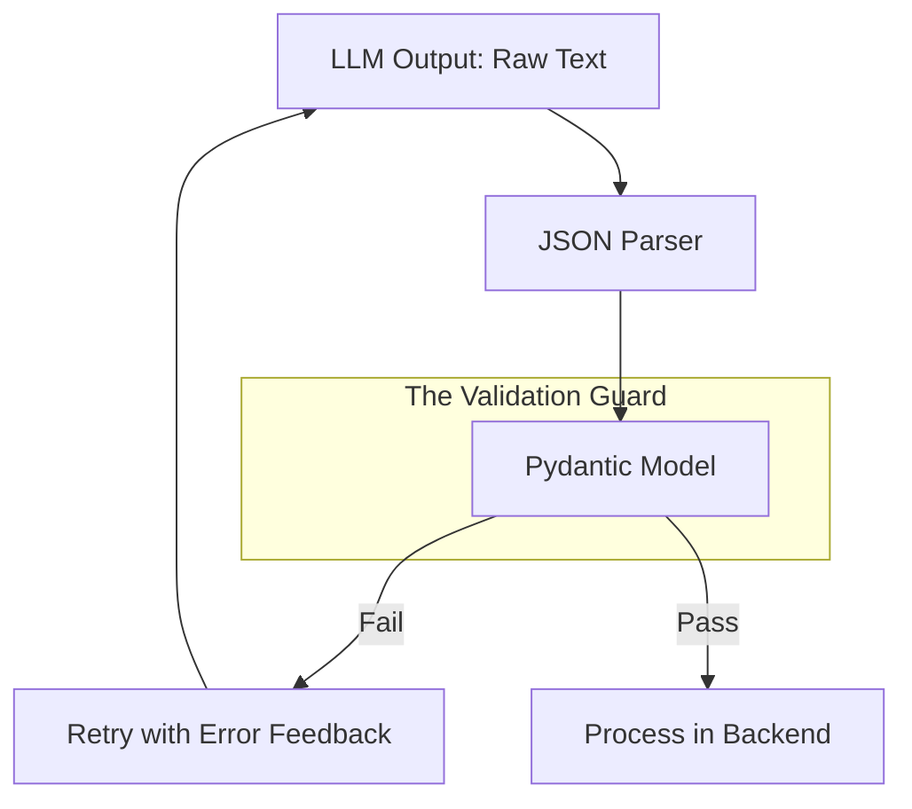

# ✅ Pydantic & Data Validation: The Wall of Defense for AI Pipelines
> **Level:** Intermediate | **Language:** Hinglish | **Goal:** Master Pydantic V2 to enforce strict schemas, validate unstructured LLM outputs, and build reliable data-driven AI systems.

---

## 🧭 1. Beginner-Friendly Hinglish Explanation
Pydantic AI systems ka wo "Security Guard" hai jo check karta hai ki aapke code ke andar aane wala data "Asli" aur "Sahi" hai ya nahi. 

Sochiye, aapne ek AI tool banaya jo invoices (bills) se "Total Amount" nikalta hai.
- **Problem:** AI kabhi-kabhi amount ki jagah "Rs 500" (string) likh deta hai ya "Unknown" likh deta hai. Agar aapka code sirf "Numbers" expect kar raha hai, toh pura system crash ho jayega.
- **Solution (Pydantic):** Pydantic data ko "Parse" karta hai. Agar AI ne "500" (string) bheja, toh ye use automatically `500.0` (float) mein badal dega. Agar bilkul galat data aaya, toh ye use model tak pahunchne se pehle hi "Reject" kar dega.

Bina Pydantic ke, AI software kabhi "Production-grade" nahi ban sakta kyunki LLMs aksar "Unpredictable" hote hain.

---

## 🧠 2. Deep Technical Explanation
Pydantic V2 is a data validation and settings management library written in **Rust**. For AI, it provides:
1. **Type Enforcement:** Using Python Type Hints to force strict data types (`int`, `str`, `List`, etc.).
2. **Data Coercion:** Attempting to fix data (e.g., converting `"true"` to `True`) to make it fit the schema.
3. **Custom Validators:** Using `@field_validator` and `@model_validator` to enforce complex business logic (e.g., "Temperature must be between 0 and 2").
4. **Serialization:** One-click conversion from Python objects to JSON (`model_dump_json()`) or Dictionaries.
5. **Schema Generation:** Automatically creating **JSON Schema** from your models. This is how OpenAI/Claude "Structured Outputs" or "Tool Calling" works—they read your Pydantic schema to know what to output.
6. **Error Handling:** Providing detailed, machine-readable `ValidationError` objects that tell you exactly what went wrong in a complex nested JSON.

---

## 🏗️ 3. Pydantic vs. Traditional Validation
| Feature | Manual Validation | Pydantic V2 |
| :--- | :--- | :--- |
| **Speed** | Slow (Python loops) | Blazing Fast (Rust core) |
| **Type Checking** | `isinstance()` checks | Automatic via Type Hints |
| **Parsing** | Manual `int()` / `json.loads` | Automatic Coercion |
| **Documentation** | Hand-written | Auto-generated OpenAPI/JSON Schema |
| **Nested Data** | Painful to validate | Seamless (Model inside Model) |

---

## 📐 4. Mathematical Intuition
Pydantic is a **Mapping Function** $f: U \to S$, where:
- $U$ is the set of **Unstructured** (unsafe) data from the internet/LLM.
- $S$ is the set of **Structured** (safe) data defined by your business logic.
- $f$ ensures that for any $x \in U$, either $f(x) \in S$ or the system raises an exception. This "Cleanliness Guarantee" simplifies the rest of your AI logic.

---

## 📊 5. Structured Output Flow (Diagram)


---

## 💻 6. Production-Ready Examples (Validating Agent Outputs)
```python
# 2026 Pro-Tip: Use Pydantic to force LLMs to follow a strict format.
from pydantic import BaseModel, Field, field_validator
from typing import List, Optional

class SearchResult(BaseModel):
    title: str
    url: str = Field(..., pattern=r"^https?://") # Regex check for valid URLs
    snippet: str

class AgentResponse(BaseModel):
    summary: str = Field(..., max_length=500)
    sources: List[SearchResult]
    confidence: float = Field(0.7, ge=0.0, le=1.0)
    
    @field_validator('summary')
    @classmethod
    def check_non_empty(cls, v: str) -> str:
        if len(v.strip()) == 0:
            raise ValueError("Summary cannot be blank")
        return v

# Imagine an LLM returns this JSON
raw_data = {
    "summary": "AI is growing fast.",
    "sources": [{"title": "News", "url": "https://ai.com", "snippet": "..."}],
    "confidence": 0.95
}

# Validation
try:
    validated_agent_data = AgentResponse(**raw_data)
    print(f"Success! Confidence: {validated_agent_data.confidence}")
except Exception as e:
    print(f"Schema Mismatch: {e}")
```

---

## ❌ 7. Failure Cases
- **Over-validation:** Adding too many complex validators that slow down the inference pipeline. **Fix:** Use `computed_field` for post-validation derived values.
- **Strict Mode Issues:** If you use `Strict=True`, Pydantic won't convert `"5"` to `5`. This can break if the LLM output is slightly inconsistent. **Best Practice:** Keep strict mode off for LLM outputs, but on for internal APIs.
- **Circular References:** Model A refers to Model B, which refers back to Model A. Use `ForwardRef` or `deferred_annotations`.

---

## 🛠️ 8. Debugging Guide
- **Symptom:** `ValidationError` in a nested list of items.
- **Fix:** Use `e.errors()` to get a list of dictionaries that show the exact "Location" (Path) of the error (e.g., `['sources', 2, 'url']`).
- **Check:** **None vs Empty**. Are you allowing `Optional[str]` but receiving `""` (empty string)?

---

## ⚖️ 9. Tradeoffs
- **Pydantic vs. Dataclasses:** Dataclasses are faster for internal math (0.5ms vs 5ms) but have zero validation. Use Dataclasses for high-frequency trading/math, and Pydantic for APIs and AI.
- **Manual JSON Parsing:** Faster for simple cases but $100x$ more likely to have a bug in complex cases.

---

## 🛡️ 10. Security Concerns
- **Schema Poisoning:** If an attacker can control the JSON Schema you send to the LLM, they can force the LLM to output malicious payloads.
- **DoS (Denial of Service):** Sending a recursive JSON that Pydantic takes too long to validate (Regex-based DoS). Always set `max_length` and `max_digits`.

---

## 📈 11. Scaling Challenges
- **Large Batches:** Validating $10,000$ records in one request can block the event loop. **Fix:** Use `Pydantic-Core` (C-optimized) functions directly for massive datasets.
- **Memory Overhead:** Pydantic models use more memory than raw dictionaries. For millions of objects, consider using `__slots__` or `msgspec`.

---

## 💸 12. Cost Considerations
- **Prompt Savings:** By sending a concise Pydantic-based JSON schema to the LLM (instead of long-winded text instructions), you save $20-30\%$ on input tokens every time.
- **Fewer Retries:** Validation catches errors early, preventing the need to re-call the LLM API (which costs money).

---

## ✅ 13. Best Practices
- **Use `Field(description=...)`:** This metadata is used by LLMs (in Function Calling) to understand what you want.
- **Immutable Models:** Use `frozen=True` if you don't want the data to change after validation.
- **Alias Management:** Use `AliasGenerator` if your database uses `snake_case` but your API needs `camelCase`.

---

## ⚠️ 14. Common Mistakes
- **Forgetting `mode='before'`:** By default, validators run *after* Pydantic tries to cast types. Use `mode='before'` if you want to modify the raw input string.
- **Ignoring Type Hints:** Pydantic works *because* of type hints. If you use `Any`, you lose the validation power.

---

## 📝 15. Interview Questions
1. **"Difference between `.model_dump()` and `.model_dump_json()`?"**
2. **"How does Pydantic V2 use Rust to improve performance?"**
3. **"Explain the use of 'Annotated' in Pydantic for adding extra metadata to fields."**

---

## 🚀 15. Latest 2026 Industry Patterns
- **Pydantic-AI Integration:** Direct integration where libraries like `Instructor` or `Outlines` use Pydantic to "patch" LLM APIs, making them return Python objects directly.
- **Dynamic Schemas:** Using `create_model()` to build schemas on-the-fly based on a user's database structure.
- **Type-Safe Agents:** Every agent in a multi-agent system has a Pydantic "Contract" for what data it receives and what it passes to the next agent.
