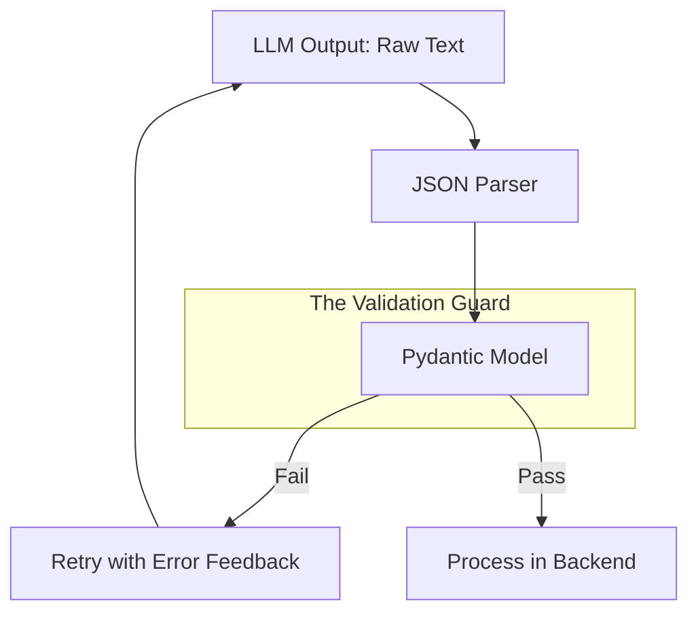

# ✅ Pydantic & Data Validation: AI Pipelines Ka Wall of Defense
> **Level:** Intermediate | **Language:** Hinglish | **Goal:** Strict schemas enforce karne, unstructured LLM outputs ko validate karne, aur reliable data-driven AI systems build karne ke liye Pydantic V2 ko master karna.

---

## 🧭 1. Beginner-Friendly Hinglish Explanation
Pydantic AI systems ka wo "Security Guard" hai jo check karta hai ki aapke code ke andar aane wala data "Asli" aur "Sahi" hai ya nahi. 

Sochiye, aapne ek AI tool banaya jo invoices (bills) se "Total Amount" nikalta hai.
- **Problem:** AI kabhi-kabhi amount ki jagah "Rs 500" (string) likh deta hai ya "Unknown" likh deta hai. Agar aapka code sirf "Numbers" expect kar raha hai, toh pura system crash ho jayega.
- **Solution (Pydantic):** Pydantic data ko "Parse" karta hai. Agar AI ne "500" (string) bheja, toh ye use automatically `500.0` (float) mein badal dega. Agar bilkul galat data aaya, toh ye use model tak pahunchne se pehle hi "Reject" kar dega.

Bina Pydantic ke, AI software kabhi "Production-grade" nahi ban sakta kyunki LLMs aksar "Unpredictable" hote hain.

---

## 🧠 2. Deep Technical Explanation
Pydantic V2 ek data validation aur settings management library hai jo **Rust** me likhi gayi hai. AI ke liye, ye provide karta hai:
1. **Type Enforcement:** Strict data types (`int`, `str`, `List`, etc.) ko force karne ke liye Python Type Hints ka use karna.
2. **Data Coercion:** Data ko schema me fit karne ke liye use fix karne ki koshish karna (e.g., `"true"` ko `True` me convert karna).
3. **Custom Validators:** Complex business logic ko enforce karne ke liye `@field_validator` aur `@model_validator` ka use karna (e.g., "Temperature 0 aur 2 ke beech hona chahiye").
4. **Serialization:** Python objects ko JSON (`model_dump_json()`) ya Dictionaries me convert karne ka one-click method.
5. **Schema Generation:** Automatically creating **JSON Schema** from your models. This is how OpenAI/Claude "Structured Outputs" or "Tool Calling" works—they read your Pydantic schema to know what to output.
6. **Error Handling:** Providing detailed, machine-readable `ValidationError` objects that tell you exactly what went wrong in a complex nested JSON.

---

## 🏗️ 3. Pydantic vs. Traditional Validation
| Feature (Suvidha) | Manual Validation | Pydantic V2 |
| :--- | :--- | :--- |
| **Speed** | Slow (Python loops) | Blazing Fast (Rust core) |
| **Type Checking** | `isinstance()` checks | Type Hints ke through Automatic |
| **Parsing** | Manual `int()` / `json.loads` | Automatic Coercion |
| **Documentation** | Hand-written | Auto-generated OpenAPI/JSON Schema |
| **Nested Data** | Validate karna mushkil hai | Seamless (Model inside Model) |

---

## 📐 4. Mathematical Intuition
Pydantic ek **Mapping Function** $f: U \to S$ hai, jahan:
- $U$ internet/LLM se aane wale **Unstructured** (unsafe) data ka set hai.
- $S$ aapke business logic dwara defined **Structured** (safe) data ka set hai.
- $f$ ye ensure karta hai ki kisi bhi $x \in U$ ke liye, ya toh $f(x) \in S$ ho ya system ek exception raise kare. Ye "Cleanliness Guarantee" aapke baaki ke AI logic ko simple bana deti hai.

---

## 📊 5. Structured Output Flow (Diagram)

```mermaid
graph TD
    LLM[LLM Output: Raw Text] --> Parser[JSON Parser]
    Parser --> Schema[Pydantic Model]
    Schema -- "Fail" --> Retry[Retry with Error Feedback]
    Schema -- "Pass" --> Logic[Process in Backend]
    Retry --> LLM
    
    subgraph "The Validation Guard"
    Schema
    end
```

---

## 💻 6. Production-Ready Examples (Validating Agent Outputs)
```python
# 2026 Pro-Tip: LLMs ko strict format follow karne par majboor karne ke liye Pydantic ka use karein.
from pydantic import BaseModel, Field, field_validator
from typing import List, Optional

class SearchResult(BaseModel):
    title: str
    url: str = Field(..., pattern=r"^https?://") # Valid URLs ke liye Regex check
    snippet: str

class AgentResponse(BaseModel):
    summary: str = Field(..., max_length=500)
    sources: List[SearchResult]
    confidence: float = Field(0.7, ge=0.0, le=1.0)
    
    @field_validator('summary')
    @classmethod
    def check_non_empty(cls, v: str) -> str:
        if len(v.strip()) == 0:
            raise ValueError("Summary cannot be blank")
        return v

# Imagine karein ki LLM ye JSON return karta hai
raw_data = {
    "summary": "AI is growing fast.",
    "sources": [{"title": "News", "url": "https://ai.com", "snippet": "..."}],
    "confidence": 0.95
}

# Validation
try:
    validated_agent_data = AgentResponse(**raw_data)
    print(f"Success! Confidence: {validated_agent_data.confidence}")
except Exception as e:
    print(f"Schema Mismatch: {e}")
```

---

## ❌ 7. Failure Cases
- **Over-validation:** Bahut saare complex validators add karna jo inference pipeline ko slow kar dete hain. **Fix:** Post-validation derived values ke liye `computed_field` ka use karein.
- **Strict Mode Issues:** If you use `Strict=True`, Pydantic won't convert `"5"` to `5`. This can break if the LLM output is slightly inconsistent. **Best Practice:** Keep strict mode off for LLM outputs, but on for internal APIs.
- **Circular References:** Model A Model B ko refer karta hai, aur Model B wapas Model A ko refer karta hai. Use `ForwardRef` or `deferred_annotations`.

---

## 🛠️ 8. Debugging Guide
- **Symptom:** Items ki ek nested list me `ValidationError` aana.
- **Fix:** Dictionaries ki list paane ke liye `e.errors()` ka use karein jo error ki exact "Location" (Path) ko show karti hain (e.g., `['sources', 2, 'url']`).
- **Check:** **None vs Empty**. Are you allowing `Optional[str]` but receiving `""` (empty string)?

---

## ⚖️ 9. Tradeoffs
- **Pydantic vs. Dataclasses:** Dataclasses internal math ke liye fast hoti hain (0.5ms vs 5ms) par unme zero validation hoti hai. Use Dataclasses for high-frequency trading/math, and Pydantic for APIs and AI.
- **Manual JSON Parsing:** Simple cases ke liye fast hai par complex cases me bug hone ke chances $100x$ zyada hote hain.

---

## 🛡️ 10. Security Concerns
- **Schema Poisoning:** Agar koi attacker aapke dwara LLM ko bheje jaane wale JSON Schema ko control kar sakta hai, toh wo LLM ko malicious payloads output karne par force kar sakta hai.
- **DoS (Denial of Service):** Sending a recursive JSON that Pydantic takes too long to validate (Regex-based DoS). Always set `max_length` and `max_digits`.

---

## 📈 11. Scaling Challenges
- **Large Batches:** Ek request me $10,000$ records ko validate karna event loop ko block kar sakta hai. **Fix:** Use `Pydantic-Core` (C-optimized) functions directly for massive datasets.
- **Memory Overhead:** Pydantic models raw dictionaries se zyada memory use karte hain. For millions of objects, consider using `__slots__` or `msgspec`.

---

## 💸 12. Cost Considerations
- **Prompt Savings:** LLM ko ajeeb-o-gareeb long-winded text instructions ke bajaye ek concise Pydantic-based JSON schema bhej kar, aap har baar input tokens par $20-30\%$ save karte hain.
- **Fewer Retries:** Validation errors ko pehle hi catch kar leta hai, jisse LLM API ko dobara call karne ki need nahi padti (jiski wajah se cost bachti hai).

---

## ✅ 13. Best Practices
- **Use `Field(description=...)`:** Is metadata ka use LLMs dwara (Function Calling me) ye samajhne ke liye kiya jata hai ki aap kya chahte hain.
- **Immutable Models:** Use `frozen=True` if you don't want the data to change after validation.
- **Alias Management:** Use `AliasGenerator` if your database uses `snake_case` but your API needs `camelCase`.

---

## ⚠️ 14. Common Mistakes
- **Forgetting `mode='before'`:** By default, validators run *after* Pydantic tries to cast types. Use `mode='before'` if you want to modify the raw input string.
- **Ignoring Type Hints:** Pydantic type hints ki *wajah* se hi kaam karta hai. If you use `Any`, you lose the validation power.

---

## 📝 15. Interview Questions
1. **"`.model_dump()` aur `.model_dump_json()` me kya difference hai?"**
2. **"Pydantic V2 performance ko improve karne ke liye Rust ka use kaise karta hai?"**
3. **"Fields me extra metadata add karne ke liye Pydantic me 'Annotated' ke use ko explain karein."**

---

## 🚀 15. Latest 2026 Industry Patterns
- **Pydantic-AI Integration:** Direct integration jahan `Instructor` ya `Outlines` jaisi libraries LLM APIs ko "patch" karne ke liye Pydantic ka use karti hain, jisse wo directly Python objects return karein.
- **Dynamic Schemas:** Using `create_model()` to build schemas on-the-fly based on a user's database structure.
- **Type-Safe Agents:** Multi-agent system me har ek agent ke paas ek Pydantic "Contract" hota hai ki wo kaun sa data receive karega aur agle agent ko kya pass karega.
