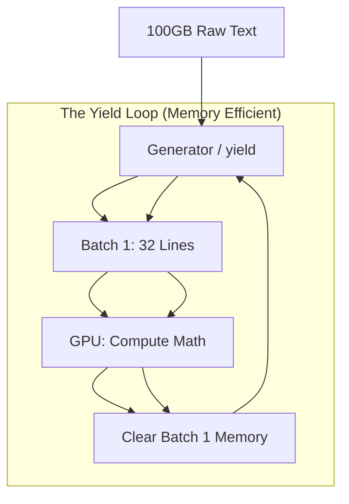

# 🐍 Python for AI Engineering: The Professional Infrastructure Stack
> **Level:** Intermediate | **Language:** Hinglish | **Goal:** Master advanced Python paradigms, resource management, and software engineering patterns specifically tailored for high-performance AI systems.

---

## 🧭 1. Beginner-Friendly Hinglish Explanation
Python AI ki "Primary Language" hai, par ek "AI Infrastructure Engineer" ke liye sirf basic loops aur functions seekhna kaafi nahi hai. 2026 mein industry un logo ko dhund rahi hai jo Python ko "Speed" aur "Scalability" ke liye use karna jaante hain.

Sochiye, aapke paas 100GB ka dataset hai par computer ki RAM sirf 16GB hai. Agar aapne standard `list` use ki, toh system crash ho jayega. Yahan **Generators** aur **Iterators** kaam aayenge. Aapko apne code ko secure banana hai? **Type Hinting** zaruri hai. Aapko model loading ko fast banana hai? **Context Managers** aur **Multiprocessing** seekhna hoga. 

Is module mein hum wahi "Pro-level" Python seekhenge jo ek basic developer aur ek $500k/year AI Engineer ke beech ka fark hai.

---

## 🧠 2. Deep Technical Explanation
Python in AI Engineering is about **Efficiency & Abstraction**:
1. **Generators & Iterators:** Using `yield` to process data streams. This is the heart of **DataLoaders** in PyTorch.
2. **Context Managers (`__enter__`, `__exit__`):** Crucial for managing GPU memory. Using `with torch.no_grad():` ensures that the gradient graph isn't built during inference, saving $50\%$ VRAM.
3. **Decorators:** For cross-cutting concerns like `@retry` for API calls, `@profile` for performance measurement, or `@app.post` in FastAPI.
4. **Metaclasses & Dunder Methods:** Understanding how `__call__` makes a class instance behave like a function (how `model(x)` works in PyTorch).
5. **Type Hinting (Typing):** Using `Union`, `Optional`, `Generic`, and `Protocol` to make code self-documenting and bug-free before execution.
6. **The GIL (Global Interpreter Lock):** Understanding why Python is slow for CPU-bound math and how libraries like NumPy bypass the GIL using C-extensions.

---

## 🏗️ 3. Python Resource Management Stack
| Pattern | AI Use Case | Benefit |
| :--- | :--- | :--- |
| **Generators** | Streaming 1TB text datasets | Minimal RAM usage |
| **Context Managers** | Managing GPU handles/CUDA streams | No VRAM leaks |
| **Decorators** | Logging inference time / API retries | Clean, reusable code |
| **Type Hints** | Defining Model schemas | 90% fewer runtime bugs |
| **Dunder Methods** | Customizing Dataset behavior | Native Pythonic experience |

---

## 📐 4. Mathematical Intuition
Python is often called "Slow" because it's an interpreted language.
- **The Vectorization Rule:** $1,000,000$ additions in a Python `for` loop take seconds. In NumPy/PyTorch (C++/CUDA), it takes microseconds.
- **Intuition:** Python should only be the **Manager** (Orchestrator). The **Heavy Math** should always happen in specialized C/CUDA kernels. Your job as an AI engineer is to keep the "Management overhead" as low as possible.

---

## 📊 5. Memory Management (Diagram)


---

## 💻 6. Production-Ready Examples (The Efficient AI Pipeline)
```python
# 2026 Pro-Tip: Use Type Hints and Context Managers for Robust AI Apps
from typing import Iterator, List
import time

class ModelManager:
    """Manages LLM Loading and Memory Cleanup."""
    def __init__(self, model_id: str):
        self.model_id = model_id

    def __enter__(self):
        print(f"Loading Model: {self.model_id}")
        # Logic to move model to GPU
        return self

    def __exit__(self, exc_type, exc_val, exc_tb):
        print("Cleaning up VRAM...")
        # Logic to clear CUDA cache

def data_streamer(path: str) -> Iterator[List[str]]:
    """Generates batches of data without loading entire file."""
    with open(path, 'r') as f:
        batch = []
        for line in f:
            batch.append(line)
            if len(batch) == 32:
                yield batch
                batch = []

# Usage
with ModelManager("llama-3-8b") as model:
    for batch in data_streamer("big_data.txt"):
        # run_inference(model, batch)
        pass
```

---

## ❌ 7. Failure Cases
- **The "List Accumulation" Trap:** Doing `results.append(data)` in a loop for millions of items. This will cause an `OutOfMemory` (OOM) error. **Fix:** Use Generators or write to disk periodically.
- **Mutable Default Arguments:** Using `def train(config={}):`. Since dictionaries are mutable, every call to `train` will share the same config object! **Fix:** Use `config=None`.
- **Circular Imports:** In large AI projects (e.g., `model.py` imports `utils.py`, which imports `model.py`). This crashes the interpreter.

---

## 🛠️ 8. Debugging Guide
- **Symptom:** "CUDA Out of Memory" even after the process finishes.
- **Check:** **Object References**. Is a tensor still being held in a global variable? Use `del tensor` and `torch.cuda.empty_cache()`.
- **Symptom:** Code is mysteriously slow.
- **Check:** **Python Profiler (`cProfile`)**. Are you doing heavy string formatting inside a tight training loop?

---

## ⚖️ 9. Tradeoffs
- **Python vs. Mojo/Rust:** Python is easy but slow for custom loops. For 2026-level speed, we use Python for the "Glue" and Rust/C++ for "Kernels".
- **Dynamic vs. Strict Typing:** Dynamic is fast to prototype; Strict (using `mypy`) is mandatory for production to ensure your 70B model doesn't receive a `string` when it expects a `float`.

---

## 🛡️ 10. Security Concerns
- **Pickle Vulnerability:** Never use `pickle.load()` on a model file you downloaded from an untrusted source. It can execute arbitrary code on your system. **Always use `safetensors`**.
- **Environment Exposure:** Hardcoding API keys in `settings.py`. Use **Pydantic Settings** to load from `.env` and mask secrets in logs.

---

## 📈 11. Scaling Challenges
- **The GIL Bottleneck:** When you need to parallelize data preprocessing across 64 CPU cores, standard Python threads won't work. You must use the `multiprocessing` module or **Ray**.
- **Pickle Serialization:** Moving large objects between processes is slow. Use **Shared Memory** or **Apache Arrow**.

---

## 💸 12. Cost Considerations
- Efficient Python (Vectorized) code runs faster, reducing the "Compute Time" on AWS. Reducing training time from 10 days to 8 days via Python optimization can save thousands of dollars.

---

## ✅ 13. Best Practices
- **Use Pydantic:** For all configuration and data validation.
- **Logging over Printing:** Use the `logging` module. `print` statements are slow and hard to filter in production.
- **Docstrings:** Use Google or NumPy style docstrings. In AI teams, your code is your documentation.

---

## ⚠️ 14. Common Mistakes
- **Nested Loops:** Writing triple-nested loops in Python for matrix math. (Just use `.matmul()`).
- **Ignoring Exception Handling:** Not wrapping your "Inference" call in a `try-except`. If one request fails, the entire worker might crash.

---

## 📝 15. Interview Questions
1. **"What is the GIL and how does it affect AI data preprocessing?"**
2. **"Difference between a Deep Copy and a Shallow Copy in the context of Model Weights?"**
3. **"How do you optimize a Python loop that is processing 10 million tokens per second?"** (Vectorization, Cython, or offloading to C++).

---

## 🚀 15. Latest 2026 Industry Patterns
- **Mojo Integration:** The new "AI language" Mojo allows Python-like syntax with C-like speed. AI engineers are now writing "Mojo-Python" hybrid code.
- **Type-safe Tensors:** Using libraries that allow specifying tensor shapes in type hints (e.g., `Tensor["Batch", "Channels", "Height", "Width"]`) to catch dimension errors at compile time.
- **FastAPI 2.0:** Moving towards fully asynchronous AI backends where every model call is an `awaitable` task.
