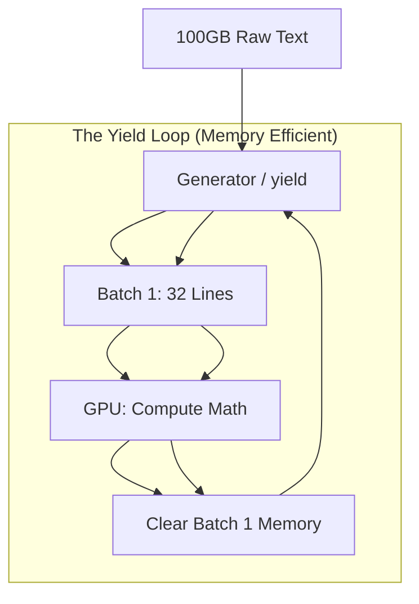

# 🐍 Python for AI Engineering: The Professional Infrastructure Stack
> **Level:** Intermediate | **Language:** Hinglish | **Goal:** High-performance AI systems ke liye specifically designed advanced Python paradigms, resource management, aur software engineering patterns ko master karna.

---

## 🧭 1. Beginner-Friendly Hinglish Explanation
Python AI ki "Primary Language" hai, par ek "AI Infrastructure Engineer" ke liye sirf basic loops aur functions seekhna kaafi nahi hai. 2026 mein industry un logo ko dhund rahi hai jo Python ko "Speed" aur "Scalability" ke liye use karna jaante hain.

Sochiye, aapke paas 100GB ka dataset hai par computer ki RAM sirf 16GB hai. Agar aapne standard `list` use ki, toh system crash ho jayega. Yahan **Generators** aur **Iterators** kaam aayenge. Aapko apne code ko secure banana hai? **Type Hinting** zaruri hai. Aapko model loading ko fast banana hai? **Context Managers** aur **Multiprocessing** seekhna hoga. 

Is module mein hum wahi "Pro-level" Python seekhenge jo ek basic developer aur ek $500k/year AI Engineer ke beech ka fark hai.

---

## 🧠 2. Deep Technical Explanation
AI Engineering me Python **Efficiency & Abstraction** ke baare me hai:
1. **Generators & Iterators:** Data streams ko process karne ke liye `yield` ka use karna. PyTorch me **DataLoaders** ke peeche yahi core concept hai.
2. **Context Managers (`__enter__`, `__exit__`):** GPU memory ko manage karne ke liye crucial hain. `with torch.no_grad():` ka use ye ensure karta hai ki inference ke dauran gradient graph build na ho, jisse $50\%$ VRAM save hoti hai.
3. **Decorators:** Cross-cutting concerns ke liye, jaise API calls ke liye `@retry`, performance measure karne ke liye `@profile`, ya FastAPI me `@app.post`.
4. **Metaclasses & Dunder Methods:** Ye samajhna ki kaise `__call__` kisi class ke instance ko ek function ki tarah behave karwata hai (jaise PyTorch me `model(x)` kaam karta hai).
5. **Type Hinting (Typing):** Execution se pehle code ko self-documenting aur bug-free banane ke liye `Union`, `Optional`, `Generic`, aur `Protocol` ka use karna.
6. **The GIL (Global Interpreter Lock):** Ye samajhna ki Python CPU-bound math ke liye slow kyun hai aur kaise NumPy jaisi libraries C-extensions ka use karke GIL ko bypass karti hain.

---

## 🏗️ 3. Python Resource Management Stack
| Pattern | AI Use Case | Benefit (Fayda) |
| :--- | :--- | :--- |
| **Generators** | Streaming 1TB text datasets | Minimal RAM usage |
| **Context Managers** | GPU handles/CUDA streams ko manage karna | VRAM leaks nahi hote |
| **Decorators** | Logging inference time / API retries | Clean, reusable code |
| **Type Hints** | Model schemas ko define karna | 90% kam runtime bugs |
| **Dunder Methods** | Dataset behavior ko customize karna | Native Pythonic experience |

---

## 📐 4. Mathematical Intuition
Python ko aksar "Slow" kaha jata hai kyunki ye ek interpreted language hai.
- **The Vectorization Rule:** Python `for` loop me $1,000,000$ additions seconds lete hain. NumPy/PyTorch (C++/CUDA) me isme microseconds lagte hain.
- **Intuition:** Python ko sirf ek **Manager** (Orchestrator) hona chahiye. **Heavy Math** hamesha specialized C/CUDA kernels me hi hona chahiye. Ek AI engineer ke roop me aapka kaam "Management overhead" ko jitna ho sake utna low rakhna hai.

---

## 📊 5. Memory Management (Diagram)

```mermaid
graph TD
    Data[100GB Raw Text] --> Gen[Generator / yield]
    Gen --> Batch[Batch 1: 32 Lines]
    Batch --> GPU[GPU: Compute Math]
    GPU --> Free[Clear Batch 1 Memory]
    Free --> Gen
    
    subgraph "The Yield Loop (Memory Efficient)"
    Gen --> Batch --> GPU --> Free
    end
```

---

## 💻 6. Production-Ready Examples (The Efficient AI Pipeline)
```python
# 2026 Pro-Tip: Robust AI Apps ke liye Type Hints aur Context Managers ka use karein
from typing import Iterator, List
import time

class ModelManager:
    """Manages LLM Loading and Memory Cleanup."""
    def __init__(self, model_id: str):
        self.model_id = model_id

    def __enter__(self):
        print(f"Loading Model: {self.model_id}")
        # Model ko GPU par move karne ka logic
        return self

    def __exit__(self, exc_type, exc_val, exc_tb):
        print("Cleaning up VRAM...")
        # CUDA cache ko clear karne ka logic

def data_streamer(path: str) -> Iterator[List[str]]:
    """Generates batches of data without loading entire file."""
    with open(path, 'r') as f:
        batch = []
        for line in f:
            batch.append(line)
            if len(batch) == 32:
                yield batch
                batch = []

# Usage
with ModelManager("llama-3-8b") as model:
    for batch in data_streamer("big_data.txt"):
        # run_inference(model, batch)
        pass
```

---

## ❌ 7. Failure Cases
- **The "List Accumulation" Trap:** Millions of items ke liye loop me `results.append(data)` karna. Ye `OutOfMemory` (OOM) error ka kaaran banega. **Fix:** Generators ka use karein ya periodically disk par write karein.
- **Mutable Default Arguments:** `def train(config={}):` ka use karna. Dictionaries ke mutable hone ke kaaran, `train` ka har ek call same config object share karega! **Fix:** `config=None` ka use karein.
- **Circular Imports:** Large AI projects me (e.g., `model.py` `utils.py` ko import karta hai, jo fir se `model.py` ko import karta hai). Ye interpreter ko crash kar deta hai.

---

## 🛠️ 8. Debugging Guide
- **Symptom:** Process finish hone ke baad bhi "CUDA Out of Memory" hona.
- **Check:** **Object References**. Kya tensor abhi bhi kisi global variable me hai? `del tensor` aur `torch.cuda.empty_cache()` ka use karein.
- **Symptom:** Code mysteriously slow chal raha hai.
- **Check:** **Python Profiler (`cProfile`)**. Kya aap tight training loop ke andar heavy string formatting kar rahe hain?

---

## ⚖️ 9. Tradeoffs
- **Python vs. Mojo/Rust:** Python easy hai par custom loops ke liye slow hai. 2026-level ki speed ke liye, hum Python ko "Glue" (milane) ke liye aur Rust/C++ ko "Kernels" ke liye use karte hain.
- **Dynamic vs. Strict Typing:** Dynamic prototyping ke liye fast hai; Strict (using `mypy`) production ke liye mandatory hai taaki ye ensure kiya ja sake ki aapke 70B model ko tab `string` na mile jab wo `float` expect kar raha ho.

---

## 🛡️ 10. Security Concerns
- **Pickle Vulnerability:** Untrusted source se download kiye gaye model file par `pickle.load()` ka use kabhi na karein. Ye aapke system par arbitrary code execute kar sakta hai. **Hamesha `safetensors` ka use karein**.
- **Environment Exposure:** `settings.py` me API keys ko hardcode karna. `.env` se load karne aur logs me secrets ko mask karne ke liye **Pydantic Settings** ka use karein.

---

## 📈 11. Scaling Challenges
- **The GIL Bottleneck:** Jab aapko 64 CPU cores par data preprocessing ko parallelize karna ho, toh standard Python threads kaam nahi karenge. Aapko `multiprocessing` module ya **Ray** ka use karna hoga.
- **Pickle Serialization:** Processes ke beech large objects ko move karna slow hota hai. **Shared Memory** ya **Apache Arrow** ka use karein.

---

## 💸 12. Cost Considerations
- Efficient Python (Vectorized) code fast chalta hai, jisse AWS par "Compute Time" reduce hota hai. Python optimization ke zariye training time ko 10 days se 8 days reduce karne se thousands of dollars bachaye ja sakte hain.

---

## ✅ 13. Best Practices
- **Use Pydantic:** Sabhi configuration aur data validation ke liye.
- **Logging over Printing:** `logging` module ka use karein. `print` statements slow hote hain aur production me unhe filter karna mushkil hota hai.
- **Docstrings:** Google ya NumPy style docstrings ka use karein. AI teams me, aapka code hi aapki documentation hai.

---

## ⚠️ 14. Common Mistakes
- **Nested Loops:** Matrix math ke liye Python me triple-nested loops likhna. (Bas `.matmul()` ka use karein).
- **Ignoring Exception Handling:** Apne "Inference" call ko `try-except` me wrap na karna. Agar ek request fail hoti hai, toh pura worker crash ho sakta hai.

---

## 📝 15. Interview Questions
1. **"GIL kya hai aur ye AI data preprocessing ko kaise affect karta hai?"**
2. **"Model Weights ke context me Deep Copy aur Shallow Copy me kya difference hai?"**
3. **"10 million tokens per second process karne wale Python loop ko aap kaise optimize karenge?"** (Vectorization, Cython, ya C++ par offload karke).

---

## 🚀 15. Latest 2026 Industry Patterns
- **Mojo Integration:** Nayi "AI language" Mojo Python-like syntax ke sath C-like speed ki permission deti hai. AI engineers ab "Mojo-Python" hybrid code likh rahe hain.
- **Type-safe Tensors:** Aisi libraries ka use karna jo type hints me tensor shapes specify karne ki permission deti hain (e.g., `Tensor["Batch", "Channels", "Height", "Width"]`) taaki compile time par dimension errors ko catch kiya ja sake.
- **FastAPI 2.0:** Fully asynchronous AI backends ki taraf badhna jahan har ek model call ek `awaitable` task hoti hai.
