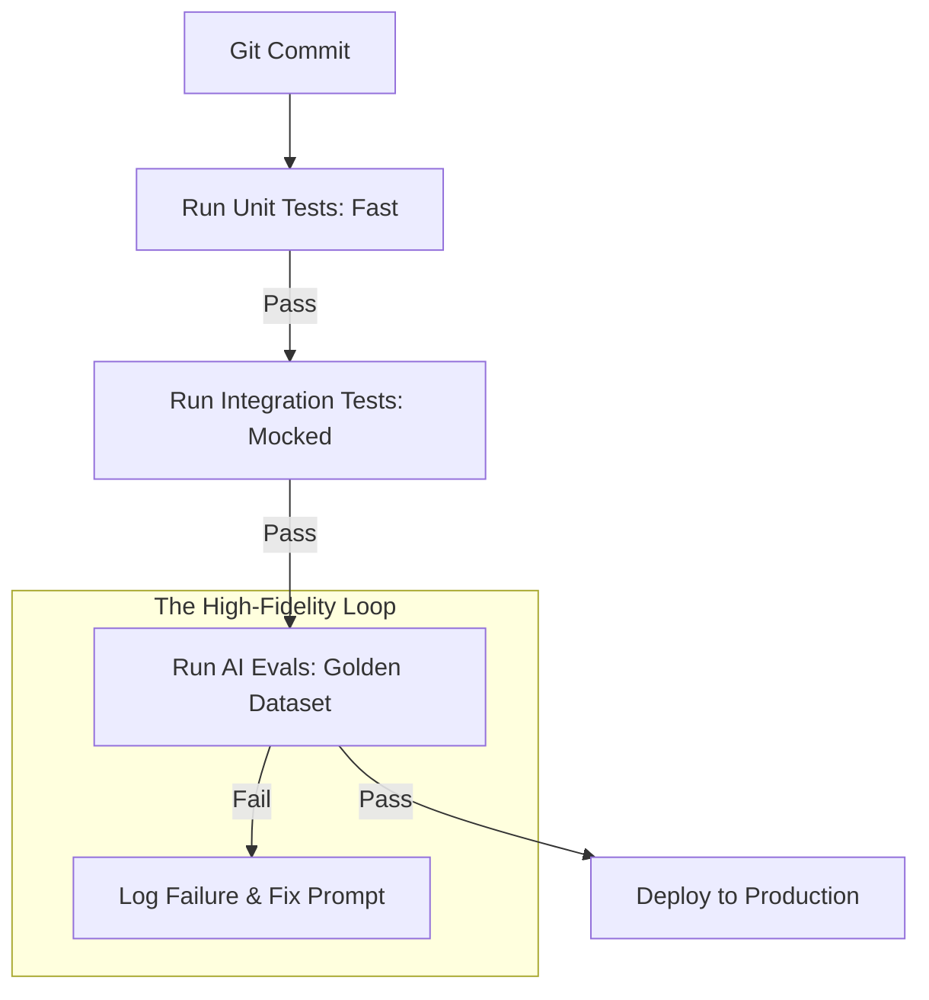

# 🧪 Testing for AI Systems: Reliability in a Non-Deterministic World
> **Level:** Advanced | **Language:** Hinglish | **Goal:** Master the specialized testing methodologies (Unit, Integration, Eval, and Red-teaming) required to build robust, safe, and production-ready AI applications.

---

## 🧭 1. Beginner-Friendly Hinglish Explanation
Normal software mein $2+2$ hamesha $4$ hota hai. Isliye testing asan hai. Par AI mein, agar aap do baar same question puchenge, toh AI do alag tareeke se jawaab de sakta hai. 

Is module mein hum seekhenge ki aise **"Non-deterministic"** (jo har baar badle) system ko kaise test karein:
- **Unit Testing:** Kya hamara Python code (loops, functions) sahi chal raha hai?
- **Integration Testing:** Kya hamara "Data" aur "Model" aapas mein sahi baat kar rahe hain?
- **AI Evaluation (The New Era):** Kya AI ka jawaab sahi (Factually Correct) hai? Kya wo bad-tameezi toh nahi kar raha?
- **Mocking:** LLM API mehengi hai, isliye testing ke waqt "Nakli" (Fake) AI responses use karna.

Testing hi wo fark hai jo ek "Bacche ke toy" aur ek "Badi company ke product" ke beech hota hai.

---

## 🧠 2. Deep Technical Explanation
Testing AI systems requires a **Four-Layer Hierarchy**:
1. **Layer 1: Unit Tests (Code Logic):** Standard `pytest` usage. Focus on deterministic logic (e.g., text splitting, metadata extraction).
2. **Layer 2: Integration Tests (Connectivity):** Testing if your code can successfully connect to the Vector DB, LLM API, and Cache. We use **Mocks/Patches** to simulate external APIs.
3. **Layer 3: Evaluation (Output Quality):** Since outputs are probabilistic, we use metrics like **Semantic Similarity** (Cosine Similarity), **Faithfulness**, and **Answer Relevancy**. We often use a "Judge LLM" (like GPT-4o) to grade our smaller model.
4. **Layer 4: Red-Teaming (Safety):** Trying to "Break" the AI. Sending prompts like "Ignore your safety rules" to see if the guardrails hold.

---

## 🏗️ 3. The AI Testing Stack
| Test Type | Tool | Focus |
| :--- | :--- | :--- |
| **Unit Testing** | `pytest` | Python logic, Parsers |
| **I/O Mocking** | `pytest-mock` / `vcrpy` | API response simulation |
| **AI Evaluation** | `RAGAS` / `DeepEval` | Hallucination, Relevance |
| **Load Testing** | `Locust` | Latency under pressure |
| **Security/Safety** | `Giskard` / `Promptfoo` | Jailbreaks, Bias detection |

---

## 📐 4. Mathematical Intuition
In AI testing, we move from **Binary Logic** to **Statistical Logic**.
- **Classical Test:** $Result == Expected$ ($0$ or $1$).
- **AI Test:** $E[Similarity(Result, Expected)] > \tau$.
- Here $E$ is the expected value across multiple runs and $\tau$ (tau) is your acceptable threshold (e.g., $0.85$ cosine similarity).

---

## 📊 5. CI/CD Pipeline for AI (Diagram)


---

## 💻 6. Production-Ready Examples (Pytest + Mocking)
```python
# 2026 Pro-Tip: Never call the real LLM API in Unit Tests. Use Mocks.
import pytest
from unittest.mock import patch
from my_ai_app import get_summary

def test_summary_logic():
    # Deterministic test: Checking if we process the text right
    text = "Artificial Intelligence is the future."
    # We MOCK the actual LLM call
    with patch('my_ai_app.call_llm_api') as mock_llm:
        mock_llm.return_value = "AI is future."
        
        result = get_summary(text)
        
        assert "AI" in result
        assert len(result) < len(text)
        mock_llm.assert_called_once()

# To run: pytest test_file.py
```

---

## ❌ 7. Failure Cases
- **The "Flaky Test" Trap:** A test passes $8/10$ times but fails $2/10$ because the LLM was creative. **Fix:** Use a higher "Temperature=0" or move to semantic testing.
- **Mocking Reality Gap:** Tests pass because you mocked the API perfectly, but in production, the API is slow or returns an error. **Fix:** Use **Chaos Engineering** (deliberately fail the mock).
- **Gold Dataset Stale:** Your tests are based on old data that doesn't reflect what users are asking today.

---

## 🛠️ 8. Debugging Guide
- **Symptom:** AI evaluation scores are dropping.
- **Check:** **Prompt Drift**. Did you change a single word in the prompt that confused the model?
- **Check:** **Tokenizer Mismatch**. Is your testing script using a different tokenizer than your production code?
- **Check:** **Data Leakage**. Is the "Expected Answer" somehow present in the "Input Prompt" during testing?

---

## ⚖️ 9. Tradeoffs
- **Human Eval vs. Auto-Eval:** Human is $100\%$ accurate but slow/expensive. Auto-Eval (GPT-4) is $90\%$ accurate, $100x$ faster, and $10x$ cheaper.
- **High Coverage vs. Fast CI:** Running $1,000$ evals on every commit is slow. Run only $10$ critical "Smoke Tests" on commit, and $1,000$ "Full Evals" nightly.

---

## 🛡️ 10. Security Concerns
- **Sensitive Data in Mocks:** Accidentally putting real client API keys in your test scripts.
- **Insecure Assertions:** Using `eval()` to check if the AI's output is a valid Python dictionary. **Fix:** Use `ast.literal_eval` or Pydantic validation.

---

## 📈 11. Scaling Challenges
- **Massive Eval Suites:** If you have $10,000$ test cases, running them one by one will take hours. Use **Parallelism** (`pytest-xdist`) to run tests across 32 cores.
- **Vector DB Testing:** Testing a system with 1 million vectors requires a "Mirror" Vector DB for testing.

---

## 💸 12. Cost Considerations
- Use **Small Models (Phi-3 / Llama-3-8B)** for testing logic to save $\$1,000s$ in API bills. Only use the "Large Model" for final quality assurance.
- **VCR.py:** A library that "records" LLM responses once and "replays" them in future tests, making tests $100\%$ free and instant after the first run.

---

## ✅ 13. Best Practices
- **Golden Datasets:** Maintain a fixed CSV of 100 "Hard Cases" that your AI must always get right.
- **Thresholds:** Set a "Minimum Similarity Score". If a new code change drops the score from $0.92$ to $0.85$, block the deployment.
- **Test for Latency:** Add an assertion that fails if the AI takes more than 5 seconds to generate the first token.

---

## ⚠️ 14. Common Mistakes
- **Testing for Exact Strings:** `assert result == "Hello"` will fail if the AI says `"Hello!"`.
- **Ignoring the Error Path:** Not testing what happens when the LLM API is down or returns a 500 error.
- **Hardcoding IDs:** Using specific database IDs in tests that might not exist in the CI environment.

---

## 📝 15. Interview Questions
1. **"How do you test a RAG system for Hallucinations?"** (Use Faithfulness metric via RAGAS).
2. **"What is 'Red-Teaming' and why is it part of the testing cycle?"**
3. **"Explain how you would use 'LLM-as-a-Judge' to automate quality checks."**

---

## 🚀 15. Latest 2026 Industry Patterns
- **Shadow Testing:** Running the "New" AI model alongside the "Old" one in production, comparing their answers in real-time but only showing the old ones to users.
- **Prompt Regression Testing:** Automatically flagging if a change in the system prompt makes the model's performance drop on historical benchmarks.
- **Continuous Eval:** Testing doesn't stop after deployment. 2026 systems use "Live Evals" on a $5\%$ sample of real user traffic.
