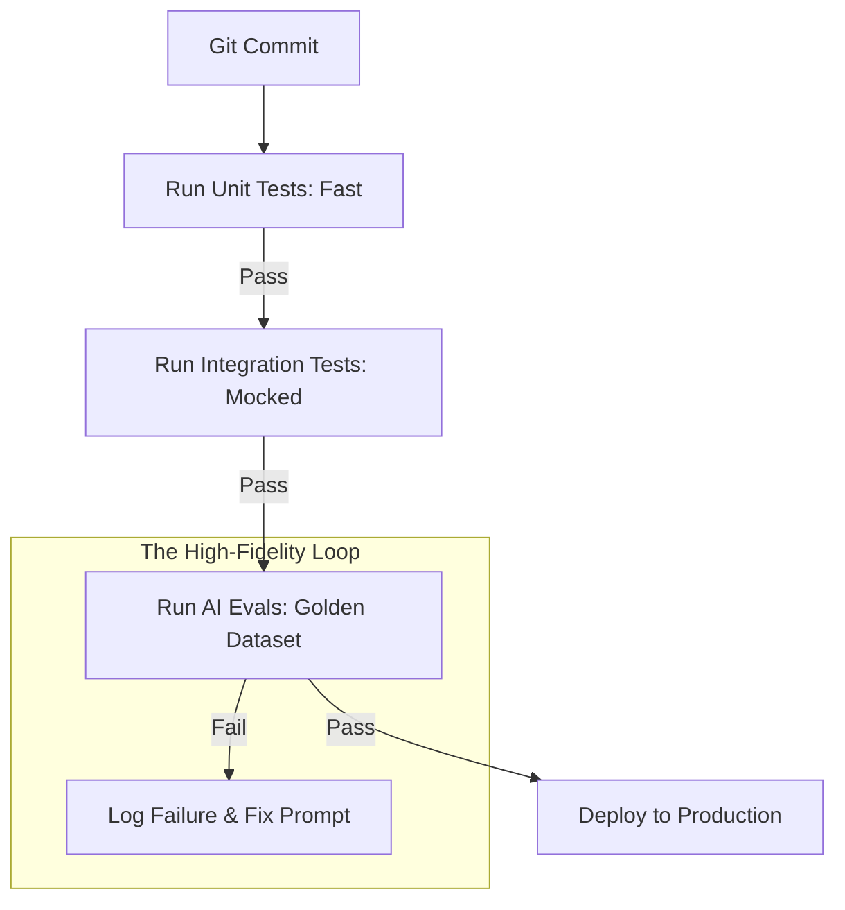

# 🧪 Testing for AI Systems: Non-Deterministic World Me Reliability
> **Level:** Advanced | **Language:** Hinglish | **Goal:** Robust, safe, aur production-ready AI applications build karne ke liye required specialized testing methodologies (Unit, Integration, Eval, aur Red-teaming) ko master karna.

---

## 🧭 1. Beginner-Friendly Hinglish Explanation
Normal software mein $2+2$ hamesha $4$ hota hai. Isliye testing asan hai. Par AI mein, agar aap do baar same question puchenge, toh AI do alag tareeke se jawaab de sakta hai. 

Is module mein hum seekhenge ki aise **"Non-deterministic"** (jo har baar badle) system ko kaise test karein:
- **Unit Testing:** Kya hamara Python code (loops, functions) sahi chal raha hai?
- **Integration Testing:** Kya hamara "Data" aur "Model" aapas mein sahi baat kar rahe hain?
- **AI Evaluation (The New Era):** Kya AI ka jawaab sahi (Factually Correct) hai? Kya wo bad-tameezi toh nahi kar raha?
- **Mocking:** LLM API mehengi hai, isliye testing ke waqt "Nakli" (Fake) AI responses use karna.

Testing hi wo fark hai jo ek "Bacche ke toy" aur ek "Badi company ke product" ke beech hota hai.

---

## 🧠 2. Deep Technical Explanation
AI systems ko test karne ke liye ek **Four-Layer Hierarchy** ki zaroorat hoti hai:
1. **Layer 1: Unit Tests (Code Logic):** Standard `pytest` ka use. Deterministic logic (e.g., text splitting, metadata extraction) par focus.
2. **Layer 2: Integration Tests (Connectivity):** Ye test karna ki kya aapka code Vector DB, LLM API, aur Cache se successfully connect ho sakta hai. Hum external APIs ko simulate karne ke liye **Mocks/Patches** ka use karte hain.
3. **Layer 3: Evaluation (Output Quality):** Kyunki outputs probabilistic hote hain, isliye hum **Semantic Similarity** (Cosine Similarity), **Faithfulness**, aur **Answer Relevancy** jaise metrics ka use karte hain. Hum aksar apne chhote model ko grade karne ke liye ek "Judge LLM" (jaise GPT-4o) ka use karte hain.
4. **Layer 4: Red-Teaming (Safety):** AI ko "Break" (todne) karne ki koshish karna. Aise prompts send karna jaise "Ignore your safety rules" ye check karne ke liye ki kya guardrails hold karte hain.

---

## 🏗️ 3. The AI Testing Stack
| Test Type | Tool | Focus (Dhyan) |
| :--- | :--- | :--- |
| **Unit Testing** | `pytest` | Python logic, Parsers |
| **I/O Mocking** | `pytest-mock` / `vcrpy` | API response simulation |
| **AI Evaluation** | `RAGAS` / `DeepEval` | Hallucination, Relevance |
| **Load Testing** | `Locust` | Latency under pressure |
| **Security/Safety** | `Giskard` / `Promptfoo` | Jailbreaks, Bias detection |

---

## 📐 4. Mathematical Intuition
AI testing me, hum **Binary Logic** se **Statistical Logic** ki taraf move karte hain.
- **Classical Test:** $Result == Expected$ ($0$ aur $1$).
- **AI Test:** $E[Similarity(Result, Expected)] > \tau$.
- Yahan $E$ multiple runs me expected value hai aur $\tau$ (tau) aapka acceptable threshold hai (e.g., $0.85$ cosine similarity).

---

## 📊 5. CI/CD Pipeline for AI (Diagram)

```mermaid
graph TD
    Commit[Git Commit] --> Unit[Run Unit Tests: Fast]
    Unit -- Pass --> Int[Run Integration Tests: Mocked]
    Int -- Pass --> Eval[Run AI Evals: Golden Dataset]
    Eval -- Pass --> Deploy[Deploy to Production]
    
    subgraph "The High-Fidelity Loop"
    Eval -- Fail --> Logs[Log Failure & Fix Prompt]
    end
```

---

## 💻 6. Production-Ready Examples (Pytest + Mocking)
```python
# 2026 Pro-Tip: Unit Tests me real LLM API ko kabhi call na karein. Mocks ka use karein.
import pytest
from unittest.mock import patch
from my_ai_app import get_summary

def test_summary_logic():
    # Deterministic test: Checking if we process the text right
    text = "Artificial Intelligence is the future."
    # We MOCK the actual LLM call
    with patch('my_ai_app.call_llm_api') as mock_llm:
        mock_llm.return_value = "AI is future."
        
        result = get_summary(text)
        
        assert "AI" in result
        assert len(result) < len(text)
        mock_llm.assert_called_once()

# Run karne ke liye: pytest test_file.py
```

---

## ❌ 7. Failure Cases
- **The "Flaky Test" Trap:** Ek test $8/10$ baar pass hota hai par $2/10$ baar fail ho jata hai kyunki LLM creative tha. **Fix:** Higher "Temperature=0" ka use karein ya semantic testing par shift karein.
- **Mocking Reality Gap:** Tests isliye pass ho jaate hain kyunki aapne API ko perfectly mock kiya tha, par production me API slow hai ya error return karti hai. **Fix:** **Chaos Engineering** ka use karein (deliberately mock ko fail karein).
- **Gold Dataset Stale:** Aapke tests purane data par based hain jo ye reflect nahi karta ki users aaj kya puch rahe hain.

---

## 🛠️ 8. Debugging Guide
- **Symptom:** AI evaluation scores drop ho rahe hain.
- **Check:** **Prompt Drift**. Kya aapne prompt me ek bhi word change kiya jisne model ko confuse kar diya?
- **Check:** **Tokenizer Mismatch**. Kya aapka testing script aapke production code se different tokenizer use kar raha hai?
- **Check:** **Data Leakage**. Kya testing ke dauran "Expected Answer" kisi tarah "Input Prompt" me present hai?

---

## ⚖️ 9. Tradeoffs
- **Human Eval vs. Auto-Eval:** Human $100\%$ accurate hota hai par slow/expensive hai. Auto-Eval (GPT-4) $90\%$ accurate hai, $100x$ fast hai, aur $10x$ cheap hai.
- **High Coverage vs. Fast CI:** Har commit par $1,000$ evals run karna slow hai. Commit par sirf $10$ critical "Smoke Tests" run karein, aur $1,000$ "Full Evals" nightly (raat me) run karein.

---

## 🛡️ 10. Security Concerns
- **Sensitive Data in Mocks:** Galti se apne test scripts me real client API keys rakh dena.
- **Insecure Assertions:** AI ke output ko valid Python dictionary check karne ke liye `eval()` ka use karna. **Fix:** `ast.literal_eval` ya Pydantic validation ka use karein.

---

## 📈 11. Scaling Challenges
- **Massive Eval Suites:** Agar aapke paas $10,000$ test cases hain, toh unhe ek-ek karke run karne me hours lagenge. 32 cores par tests run karne ke liye **Parallelism** (`pytest-xdist`) ka use karein.
- **Vector DB Testing:** 1 million vectors wale system ko test karne ke liye testing ke liye ek "Mirror" Vector DB ki need hoti hai.

---

## 💸 12. Cost Considerations
- API bills me $\$1,000s$ save karne ke liye testing logic ke liye **Small Models (Phi-3 / Llama-3-8B)** ka use karein. Final quality assurance ke liye hi "Large Model" ka use karein.
- **VCR.py:** Ek library jo LLM responses ko ek baar "record" karti hai aur future tests me unhe "replay" karti hai, jisse first run ke baad tests $100\%$ free aur instant ho jaate hain.

---

## ✅ 13. Best Practices
- **Golden Datasets:** 100 "Hard Cases" ka ek fixed CSV maintain karein jise aapke AI ko hamesha sahi karna chahiye.
- **Thresholds:** Ek "Minimum Similarity Score" set karein. Agar koi new code change score ko $0.92$ se $0.85$ par drop karta hai, toh deployment block kar dein.
- **Test for Latency:** Ek aisa assertion add karein jo tab fail ho jaye jab AI first token generate karne me 5 seconds se zyada le.

---

## ⚠️ 14. Common Mistakes
- **Testing for Exact Strings:** Agar AI `"Hello!"` kehta hai toh `assert result == "Hello"` fail ho jayega.
- **Ignoring the Error Path:** Ye test na karna ki kya hota hai jab LLM API down hoti hai ya 500 error return karti hai.
- **Hardcoding IDs:** Tests me specific database IDs ka use karna jo CI environment me present na ho sakein.

---

## 📝 15. Interview Questions
1. **"Hallucinations ke liye aap RAG system ko kaise test karte hain?"** (RAGAS ke through Faithfulness metric ka use karke).
2. **"'Red-Teaming' kya hai aur ye testing cycle ka part kyun hai?"**
3. **"Quality checks ko automate karne ke liye aap 'LLM-as-a-Judge' ka use kaise karenge explain karein."**

---

## 🚀 15. Latest 2026 Industry Patterns
- **Shadow Testing:** Production me "Old" model ke sath "New" AI model run karna, real-time me unke answers ko compare karna par users ko sirf old answers hi show karna.
- **Prompt Regression Testing:** Automatically flag karna agar system prompt me change se model ki performance historical benchmarks par drop hoti hai.
- **Continuous Eval:** Deployment ke baad testing stop nahi hoti. 2026 ke systems real user traffic ke $5\%$ sample par "Live Evals" ka use karte hain.
