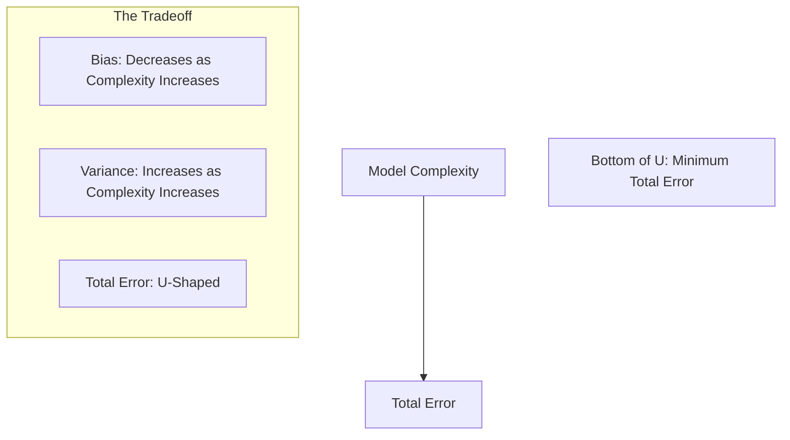

# ⚖️ Bias-Variance Tradeoff: The Equilibrium of Prediction
> **Level:** Advanced | **Language:** Hinglish | **Goal:** Deeply understand the mathematical relationship between Bias and Variance, and learn how to balance them to build models that generalize across all scenarios.

---

## 🧭 1. Beginner-Friendly Hinglish Explanation
ML mein success ke liye humein do "Dushmanon" se ladna hota hai: **Bias** aur **Variance**.

1. **Bias (Zidd/Kattarpan):** Jab model pehle se hi dimaag bana leta hai ki "Duniya aisi hi hai". Wo data ko dekhta hi nahi. Jaise agar main kahu "Saare engineers lazy hote hain"—ye ek Bias hai. Model itna simple hai ki wo real patterns miss kar deta hai. 
   - **Result:** Underfitting.

2. **Variance (Ghabrahat/Confusion):** Jab model har choti detail par "Over-react" karta hai. Data mein zara sa badlav aaya aur model ka answer badal gaya. Jaise koi insaan jo har afwaah (rumor) par yakeen kar le. 
   - **Result:** Overfitting.

**Tradeoff ka matlab:** Agar aap Bias kam karenge, toh Variance badh jayega. Agar Variance kam karenge, toh Bias badh jayega. Aapko "Goldilocks Zone" dhoondhna hai jahan dono control mein rahein.

---

## 🧠 2. Deep Technical Explanation
The Bias-Variance Tradeoff is the decomposition of the expected prediction error of a model.
- **Error due to Bias:** The difference between the expected prediction of our model and the true value. High bias means the model is too simple and makes wrong assumptions about the data.
- **Error due to Variance:** The variability of a model prediction for a given data point. High variance means the model is highly sensitive to small fluctuations in the training set.
- **Irreducible Error ($\epsilon$):** Noise that exists in the data itself (e.g., measurement errors). No model can reduce this.

**The Equation:**
$$\text{Total Error} = \text{Bias}^2 + \text{Variance} + \text{Irreducible Error}$$

---

## 🏗️ 3. The Archer Analogy (Technical Breakdown)
| Target | Analogy | Description |
| :--- | :--- | :--- |
| **Low Bias, Low Var** | Bullseye | All shots in the center. (The Ideal Model) |
| **High Bias, Low Var** | Consistent but Off | All shots in a tight circle but far from center. (Underfitting) |
| **Low Bias, High Var** | Spread Out | Shots are around the center but scattered everywhere. (Overfitting) |
| **High Bias, High Var** | Worst Case | Shots are scattered and far from the center. (Messy Model) |

---

## 📐 4. Mathematical Intuition
- **Simple Models (Linear Regression):** High Bias, Low Variance. They are stable but often wrong in complex cases.
- **Complex Models (Deep Neural Nets, Decision Trees):** Low Bias, High Variance. They can learn anything but are unstable and prone to noise.
- **Goal:** Minimize the **Total Error** by finding the point where Bias and Variance curves intersect.

---

## 📊 5. Bias-Variance Curves (Diagram)


---

## 💻 6. Production-Ready Examples (Bias-Variance Diagnostics)
```python
# 2026 Pro-Tip: Use Learning Curves to diagnose Bias and Variance issues.
import matplotlib.pyplot as plt
from sklearn.model_selection import learning_curve
from sklearn.ensemble import RandomForestRegressor

def plot_learning_curve(model, X, y):
    train_sizes, train_scores, test_scores = learning_curve(
        model, X, y, cv=5, scoring='neg_mean_squared_error'
    )
    
    train_mean = -np.mean(train_scores, axis=1)
    test_mean = -np.mean(test_scores, axis=1)

    plt.plot(train_sizes, train_mean, label='Training Error')
    plt.plot(train_sizes, test_mean, label='Validation Error')
    
    # Diagnosis:
    # 1. High Gap = High Variance (Overfitting)
    # 2. High Training Error = High Bias (Underfitting)
    plt.legend()
    plt.show()

# plot_learning_curve(RandomForestRegressor(), X, y)
```

---

## ❌ 7. Failure Cases
- **Over-regularization:** Adding too much Dropout ($0.8$) or Weight Decay, pushing a low-bias model into a high-bias (underfitting) zone.
- **The "Data-Hungry" Variance:** Training a complex model on $50$ rows of data. Variance will be near infinity.
- **Ensemble Misuse:** Using "Bagging" (which reduces variance) on a model that already has high bias. It won't help.

---

## 🛠️ 8. Debugging Guide
- **Fixing High Bias (Underfitting):**
  - Add more features.
  - Increase model complexity (more layers/neurons).
  - Reduce regularization ($\lambda \downarrow$).
  - Train for more epochs.
- **Fixing High Variance (Overfitting):**
  - Get more training data.
  - Reduce model complexity (Pruning, smaller layers).
  - Increase regularization ($\lambda \uparrow$).
  - Use **Ensemble Methods** (Random Forest, Bagging).

---

## ⚖️ 9. Tradeoffs
- **Interpretability:** High-bias models (Linear Regression) are easy to explain to stakeholders. High-variance models (XGBoost) are hard to explain but highly accurate.
- **Compute Cost:** High-variance models usually require much more compute to train and serve.

---

## 🛡️ 10. Security Concerns
- **Model Inversion Attacks:** High-variance models are more susceptible to "Memorizing" data points. An attacker can mathematically extract specific training examples because the model is too sensitive to them.

---

## 📈 11. Scaling Challenges
- In 2026, we deal with **Extremely High Variance** in LLMs. We manage this through **Stochastic Weight Averaging (SWA)** and **Knowledge Distillation** (teaching a high-bias student model from a low-bias teacher model).

---

## 💸 12. Cost Considerations
- Reducing Bias often requires more "Feature Engineering" (Human Time). Reducing Variance often requires more "Data Collection" (Compute/Storage Cost). Balanced models are the most cost-efficient in the long run.

---

## ✅ 13. Best Practices
- **Bagging (Bootstrap Aggregating):** Use it to reduce Variance (e.g., Random Forest).
- **Boosting:** Use it to reduce Bias (e.g., XGBoost, Gradient Boosting).
- **Validation Curve:** Always plot Bias vs. Variance before finalizing a model architecture.

---

## ⚠️ 14. Common Mistakes
- **Assuming Bias is always bad:** In very noisy datasets, a slightly biased (simpler) model is often more reliable than a low-bias model that captures all the noise.
- **Ignoring Irreducible Error:** Sometimes, you can't improve a model further because the data itself is low-quality. Don't waste weeks trying to fix a model if the data is the bottleneck.

---

## 📝 15. Interview Questions
1. **"What is the mathematical relationship between Bias and Variance?"**
2. **"Does increasing the dataset size reduce Bias or Variance?"** (It primarily reduces Variance).
3. **"Which ensemble technique is specifically designed to reduce Variance?"** (Bagging / Random Forest).

---

## 🚀 15. Latest 2026 Industry Patterns
- **Double Descent Paradox:** It was recently discovered that for very large models (LLMs), after the Bias-Variance tradeoff point, error starts decreasing AGAIN as you add more complexity. This has changed how we train 2026 models.
- **Bayesian Neural Networks:** Instead of single weights, they learn a "Distribution" of weights, naturally managing Bias and Variance through probabilistic uncertainty.
- **Self-Correction Loops:** Agents that monitor their own Bias/Variance in real-time and adjust their "Confidence Thresholds" accordingly.
