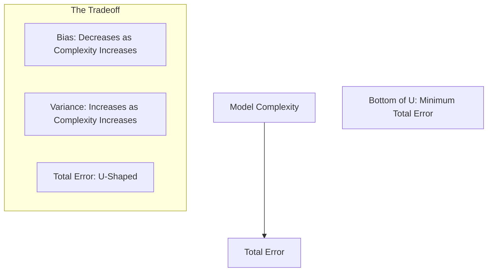

# ⚖️ Bias-Variance Tradeoff: Prediction Ka Equilibrium
> **Level:** Advanced | **Language:** Hinglish | **Goal:** Bias aur Variance ke beech ke mathematical relationship ko deeply samajhna, aur all scenarios me generalize hone wale models build karne ke liye unhe balance karna seekhna.

---

## 🧭 1. Beginner-Friendly Hinglish Explanation
ML mein success ke liye humein do "Dushmanon" se ladna hota hai: **Bias** aur **Variance**.

1. **Bias (Zidd/Kattarpan):** Jab model pehle se hi dimaag bana leta hai ki "Duniya aisi hi hai". Wo data ko dekhta hi nahi. Jaise agar main kahu "Saare engineers lazy hote hain"—ye ek Bias hai. Model itna simple hai ki wo real patterns miss kar deta hai. 
   - **Result:** Underfitting.

2. **Variance (Ghabrahat/Confusion):** Jab model har choti detail par "Over-react" karta hai. Data mein zara sa badlav aaya aur model ka answer badal gaya. Jaise koi insaan jo har afwaah (rumor) par yakeen kar le. 
   - **Result:** Overfitting.

**Tradeoff ka matlab:** Agar aap Bias kam karenge, toh Variance badh jayega. Agar Variance kam karenge, toh Bias badh jayega. Aapko "Goldilocks Zone" dhoondhna hai jahan dono control mein rahein.

---

## 🧠 2. Deep Technical Explanation
Bias-Variance Tradeoff model ke expected prediction error ka decomposition hai:
- **Error due to Bias:** Humare model ki expected prediction aur true value ke beech ka difference. High bias ka matlab hai ki model bahut simple hai aur data ke baare me galat assumptions banata hai.
- **Error due to Variance:** Kisi diye gaye data point ke liye model prediction ki variability. High variance ka matlab hai ki model training set me small fluctuations ke prati highly sensitive hai.
- **Irreducible Error ($\epsilon$):** Noise jo data me hi exist karta hai (e.g., measurement errors). Koi bhi model ise reduce nahi kar sakta.

**The Equation:**
$$\text{Total Error} = \text{Bias}^2 + \text{Variance} + \text{Irreducible Error}$$

---

## 🏗️ 3. The Archer Analogy (Technical Breakdown)
| Target | Analogy | Description (Vivarana) |
| :--- | :--- | :--- |
| **Low Bias, Low Var** | Bullseye | Saare shots center me. (The Ideal Model) |
| **High Bias, Low Var** | Consistent but Off | Saare shots ek tight circle me par center se door. (Underfitting) |
| **Low Bias, High Var** | Spread Out | Shots center ke aaspas hain par har jagah scattered hain. (Overfitting) |
| **High Bias, High Var** | Worst Case | Shots scattered hain aur center se door hain. (Messy Model) |

---

## 📐 4. Mathematical Intuition
- **Simple Models (Linear Regression):** High Bias, Low Variance. Ye stable hote hain par complex cases me aksar galat hote hain.
- **Complex Models (Deep Neural Nets, Decision Trees):** Low Bias, High Variance. Ye kuch bhi seekh sakte hain par unstable hote hain aur noise ke prati prone hote hain.
- **Goal:** Wo point find karke **Total Error** ko minimize karna jahan Bias aur Variance curves intersect karte hain.

---

## 📊 5. Bias-Variance Curves (Diagram)

```mermaid
graph TD
    Complexity[Model Complexity] --> Error[Total Error]
    
    subgraph "The Tradeoff"
    B[Bias: Decreases as Complexity Increases]
    V[Variance: Increases as Complexity Increases]
    E[Total Error: U-Shaped]
    end
    
    Optimal[Bottom of U: Minimum Total Error]
```

---

## 💻 6. Production-Ready Examples (Bias-Variance Diagnostics)
```python
# 2026 Pro-Tip: Bias aur Variance ki problems ko diagnose karne ke liye Learning Curves ka use karein.
import matplotlib.pyplot as plt
from sklearn.model_selection import learning_curve
from sklearn.ensemble import RandomForestRegressor

def plot_learning_curve(model, X, y):
    train_sizes, train_scores, test_scores = learning_curve(
        model, X, y, cv=5, scoring='neg_mean_squared_error'
    )
    
    train_mean = -np.mean(train_scores, axis=1)
    test_mean = -np.mean(test_scores, axis=1)

    plt.plot(train_sizes, train_mean, label='Training Error')
    plt.plot(train_sizes, test_mean, label='Validation Error')
    
    # Diagnosis:
    # 1. High Gap = High Variance (Overfitting)
    # 2. High Training Error = High Bias (Underfitting)
    plt.legend()
    plt.show()

# plot_learning_curve(RandomForestRegressor(), X, y)
```

---

## ❌ 7. Failure Cases
- **Over-regularization:** Bahut zyada Dropout ($0.8$) ya Weight Decay add karna, jo ek low-bias model ko high-bias (underfitting) zone me push kar deta hai.
- **The "Data-Hungry" Variance:** Data ki sirf $50$ rows par ek complex model ko train karna. Variance near infinity ho jayega.
- **Ensemble Misuse:** Ek aise model par "Bagging" (jo variance ko reduce karta hai) use karna jisme pehle se hi high bias hai. Ye help nahi karega.

---

## 🛠️ 8. Debugging Guide
- **Fixing High Bias (Underfitting):**
  - Zyada features add karein.
  - Model complexity (zyada layers/neurons) ko increase karein.
  - Regularization reduce karein ($\lambda \downarrow$).
  - Zyada epochs ke liye train karein.
- **Fixing High Variance (Overfitting):**
  - Zyada training data layein.
  - Model complexity (Pruning, smaller layers) ko reduce karein.
  - Regularization increase karein ($\lambda \uparrow$).
  - **Ensemble Methods** (Random Forest, Bagging) ka use karein.

---

## ⚖️ 9. Tradeoffs
- **Interpretability:** High-bias models (Linear Regression) ko stakeholders ko explain karna easy hota hai. High-variance models (XGBoost) ko explain karna mushkil hota hai par ye highly accurate hote hain.
- **Compute Cost:** High-variance models ko train aur serve karne ke liye usually kafi zyada compute ki need hoti hai.

---

## 🛡️ 10. Security Concerns
- **Model Inversion Attacks:** High-variance models data points ko "Memorize" karne ke prati zyada susceptible hote hain. Ek attacker mathematically specific training examples ko extract kar sakta hai kyunki model unke prati bahut sensitive hota hai.

---

## 📈 11. Scaling Challenges
- 2026 me, hum LLMs me **Extremely High Variance** se deal karte hain. Hum ise **Stochastic Weight Averaging (SWA)** aur **Knowledge Distillation** (ek low-bias teacher model se high-bias student model ko padhana) ke through manage karte hain.

---

## 💸 12. Cost Considerations
- Bias ko reduce karne ke liye aksar zyada "Feature Engineering" (Human Time) ki need hoti hai. Variance ko reduce karne ke liye aksar zyada "Data Collection" (Compute/Storage Cost) ki need hoti hai. Balanced models long run me sabse cost-efficient hote hain.

---

## ✅ 13. Best Practices
- **Bagging (Bootstrap Aggregating):** Variance ko reduce karne ke liye iska use karein (e.g., Random Forest).
- **Boosting:** Bias ko reduce karne ke liye iska use karein (e.g., XGBoost, Gradient Boosting).
- **Validation Curve:** Model architecture finalize karne se pehle hamesha Bias vs. Variance plot karein.

---

## ⚠️ 14. Common Mistakes
- **Assuming Bias is always bad:** Bahut noisy datasets me, ek slightly biased (simpler) model aksar us low-bias model se zyada reliable hota hai jo saari noise ko capture kar leta hai.
- **Ignoring Irreducible Error:** Kabhi-kabhi, aap model ko mazeed improve nahi kar sakte kyunki data hi low-quality ka hota hai. Agar data bottleneck hai, toh model ko fix karne ke liye weeks waste na karein.

---

## 📝 15. Interview Questions
1. **"Bias aur Variance ke beech ka mathematical relationship kya hai?"**
2. **"Dataset size ko increase karne se Bias reduce hota hai ya Variance?"** (Ye primarily Variance ko reduce karta hai).
3. **"Kaun si ensemble technique specifically Variance ko reduce karne ke liye design ki gayi hai?"** (Bagging / Random Forest).

---

## 🚀 15. Latest 2026 Industry Patterns
- **Double Descent Paradox:** Hal hi me discover kiya gaya hai ki bahut large models (LLMs) ke liye, Bias-Variance tradeoff point ke baad, complexity badhane par error FIR SE decrease hona shuru ho jata hai. Isne 2026 me models ko train karne ke tarike ko badal diya hai.
- **Bayesian Neural Networks:** Single weights ke bajaye, ye weights ka ek "Distribution" seekhte hain, jo probabilistic uncertainty ke through Bias aur Variance ko naturally manage karta hai.
- **Self-Correction Loops:** Aise agents jo real-time me apne khud ke Bias/Variance ko monitor karte hain aur uske according apne "Confidence Thresholds" ko adjust karte hain.
