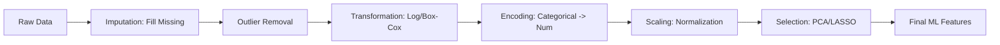

# 🛠️ Feature Engineering: The Art of Creating Intelligence from Data
> **Level:** Advanced | **Language:** Hinglish | **Goal:** Master the techniques of transforming raw data into high-signal features that maximize the performance and robustness of Machine Learning models.

---

## 🧭 1. Beginner-Friendly Hinglish Explanation
Feature Engineering ka matlab hai "Data ko aise sajayein ki computer use asani se samajh sake". 

Sochiye, aap ek restaurant ka business predict kar rahe hain. 
- **Raw Data:** "Monday, 10:00 AM, 35 Degrees".
- **Better Feature:** "Is it a Weekend?", "Is it a Holiday?", "Is it Lunch Time?".
Computer ke liye "Monday" sirf ek word hai, par "Is it a Weekend? = False" ek bahut bada signal hai. 

Jaise ek chef raw sabziyo ko kaat kar aur masale daal kar ek badhiya dish banata hai, waise hi ek AI Engineer raw data ko "Features" mein badalta hai. 2026 mein bhi, bhale hi LLMs smart ho gaye hain, par data ko sahi dhang se "Represent" karna hi model ki accuracy decide karta hai.

---

## 🧠 2. Deep Technical Explanation
Feature Engineering is the process of using domain knowledge to extract features from raw data. It involves:
1. **Feature Transformation:** Changing the scale or distribution (e.g., Log Transform for skewed data).
2. **Feature Encoding:** Converting categories into numbers (e.g., One-Hot Encoding, Label Encoding, Target Encoding).
3. **Feature Scaling:** Ensuring all features have similar ranges (e.g., Min-Max Scaling, Z-score Normalization).
4. **Feature Interaction:** Combining two features to create a more powerful signal (e.g., $Area = Length \times Width$).
5. **Feature Selection:** Removing redundant or noisy features to reduce complexity and overfitting.
6. **Handling Missing Values:** Imputation techniques (Mean, Median, K-Nearest Neighbors).

---

## 🏗️ 3. The Feature Engineering Toolbox
| Technique | Best For | Logic |
| :--- | :--- | :--- |
| **One-Hot Encoding** | Categorical Data | Creates binary columns for each category |
| **Log Transform** | Skewed Data (Income/Price) | Compresses large values, expands small ones |
| **StandardScaler** | Gaussian Data | Sets $Mean=0$ and $Std=1$ |
| **Polynomial Features**| Non-linear Data | Creates $X^2, X^3, XY$ terms |
| **Binning** | Continuous to Categorical | Grouping ages into "Young", "Middle", "Old" |

---

## 📐 4. Mathematical Intuition
- **Normalization (Min-Max):** Scales data to $[0, 1]$. 
  $$X' = \frac{X - X_{min}}{X_{max} - X_{min}}$$
- **Standardization (Z-score):** Center the data. 
  $$X' = \frac{X - \mu}{\sigma}$$
- **The Rank Rule:** If you have $N$ categories, One-Hot Encoding creates $N$ dimensions. This can lead to the **"Sparse Matrix"** problem if $N$ is very large (e.g., zip codes).

---

## 📊 5. Feature Engineering Workflow (Diagram)


---

## 💻 6. Production-Ready Examples (Advanced Feature Pipeline)
```python
# 2026 Pro-Tip: Use ColumnTransformer for a clean, production-ready pipeline.
from sklearn.compose import ColumnTransformer
from sklearn.preprocessing import StandardScaler, OneHotEncoder
from sklearn.impute import SimpleImputer
from sklearn.pipeline import Pipeline
import pandas as pd

# Define feature types
num_features = ['age', 'salary', 'experience']
cat_features = ['city', 'job_role']

# 1. Numeric Pipeline: Fill missing with median, then scale
num_transformer = Pipeline(steps=[
    ('imputer', SimpleImputer(strategy='median')),
    ('scaler', StandardScaler())
])

# 2. Categorical Pipeline: Fill missing with "missing" label, then one-hot encode
cat_transformer = Pipeline(steps=[
    ('imputer', SimpleImputer(strategy='constant', fill_value='missing')),
    ('onehot', OneHotEncoder(handle_unknown='ignore'))
])

# 3. Combine both
preprocessor = ColumnTransformer(
    transformers=[
        ('num', num_transformer, num_features),
        ('cat', cat_transformer, cat_features)
    ])

# usage: preprocessor.fit_transform(X)
```

---

## ❌ 7. Failure Cases
- **Data Leakage (Scaling):** Calculating the mean/std on the WHOLE dataset before splitting. **Fix:** Always fit your scaler ONLY on the training data.
- **Dimensionality Explosion:** One-hot encoding a column with 10,000 unique strings (like product names). **Fix:** Use **Feature Hashing** or **Embeddings**.
- **Information Loss:** Binning data too aggressively (e.g., converting "Exact Salary" into just "Rich/Poor") destroys useful nuances.

---

## 🛠️ 8. Debugging Guide
- **Symptom:** Gradient Descent is taking forever to converge.
- **Check:** **Scaling**. Are your features on different scales (e.g., 0.1 and 1,000,000)?
- **Symptom:** Model works great on training but fails on "New Categories" in test.
- **Check:** **One-Hot Encoding**. Did you set `handle_unknown='ignore'`?

---

## ⚖️ 9. Tradeoffs
- **One-Hot vs. Label Encoding:** One-hot is better for linear models (no fake order). Label encoding is better for trees (saves memory).
- **Manual vs. Automated (Deep Learning):** Manual FE is better for small tabular data. Deep Learning (Embeddings) is better for massive image/text data.

---

## 🛡️ 10. Security Concerns
- **Feature Inference Attack:** If an attacker knows the feature engineering steps, they can mathematically reverse-engineer sensitive raw data (like exact age or income) from the normalized feature vector.
- **PII Leakage:** Accidentally keeping "Names" or "Addresses" in your features which get stored in a model file.

---

## 📈 11. Scaling Challenges
- **Real-time Feature Engineering:** How to calculate "Average transactions in last 1 hour" in milliseconds? Use a **Feature Store** (like Feast or Hopsworks).
- **Big Data Transform:** Scaling One-Hot Encoding to billions of rows across a Spark cluster.

---

## 💸 12. Cost Considerations
- **Storage Cost:** Creating 1,000 new polynomial features increases your dataset size by $1,000x$, increasing storage and cloud processing costs.
- **Inference Latency:** Complex feature transformations (like 10-level nested joins) can make your API slow, costing you users.

---

## ✅ 13. Best Practices
- **Domain First:** Talk to an expert. A bank manager knows more about "Credit Risk features" than an AI model.
- **Use Log Transform:** For any data that follows a "Power Law" (few people are very rich, many are poor).
- **Feature Selection:** Use **Random Forest Importance** to find which features actually matter.

---

## ⚠️ 14. Common Mistakes
- **Applying Scaling to Target:** Never scale your target variable $Y$ unless you have a very specific reason (like predicting log-prices).
- **Imputing with Mean for Outliers:** Mean is sensitive to outliers. Use Median or Mode instead.

---

## 📝 15. Interview Questions
1. **"Why is One-Hot Encoding preferred over Label Encoding for Linear Regression?"**
2. **"Difference between Normalization and Standardization?"**
3. **"What is 'Feature Cross' and give a real-world example."**

---

## 🚀 15. Latest 2026 Industry Patterns
- **LLM-Based Feature Engineering:** Using an LLM to look at raw data and "Describe" new features that a human might miss.
- **Feature Stores:** Centralized repositories where teams share validated features, ensuring "Training-Serving Consistency."
- **Automated Feature Synthesis (AFS):** Using AI to automatically generate and test billions of feature combinations to find the highest-signal signals.
