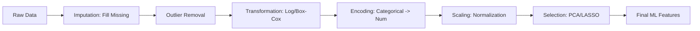

# 🛠️ Feature Engineering: Data Se Intelligence Create Karne Ki Art
> **Level:** Advanced | **Language:** Hinglish | **Goal:** Raw data ko high-signal features me transform karne ki techniques ko master karna jo Machine Learning models ki performance aur robustness ko maximize karti hain.

---

## 🧭 1. Beginner-Friendly Hinglish Explanation
Feature Engineering ka matlab hai "Data ko aise sajayein ki computer use asani se samajh sake". 

Sochiye, aap ek restaurant ka business predict kar rahe hain. 
- **Raw Data:** "Monday, 10:00 AM, 35 Degrees".
- **Better Feature:** "Is it a Weekend?", "Is it a Holiday?", "Is it Lunch Time?".
Computer ke liye "Monday" sirf ek word hai, par "Is it a Weekend? = False" ek bahut bada signal hai. 

Jaise ek chef raw sabziyo ko kaat kar aur masale daal kar ek badhiya dish banata hai, waise hi ek AI Engineer raw data ko "Features" mein badalta hai. 2026 mein bhi, bhale hi LLMs smart ho gaye hain, par data ko sahi dhang se "Represent" karna hi model ki accuracy decide karta hai.

---

## 🧠 2. Deep Technical Explanation
Feature Engineering raw data se features extract karne ke liye domain knowledge use karne ki process hai. Isme shamil hain:
1. **Feature Transformation:** Scale ya distribution ko change karna (e.g., skewed data ke liye Log Transform).
2. **Feature Encoding:** Categories ko numbers me convert karna (e.g., One-Hot Encoding, Label Encoding, Target Encoding).
3. **Feature Scaling:** Ye ensure karna ki sabhi features ki ranges similar hon (e.g., Min-Max Scaling, Z-score Normalization).
4. **Feature Interaction:** Ek aur powerful signal create karne ke liye do features ko combine karna (e.g., $Area = Length \times Width$).
5. **Feature Selection:** Complexity aur overfitting ko reduce karne ke liye redundant ya noisy features ko remove karna.
6. **Handling Missing Values:** Imputation techniques (Mean, Median, K-Nearest Neighbors).

---

## 🏗️ 3. The Feature Engineering Toolbox
| Technique | Best For | Logic (Tark) |
| :--- | :--- | :--- |
| **One-Hot Encoding** | Categorical Data | Har category ke liye binary columns create karta hai |
| **Log Transform** | Skewed Data (Income/Price) | Large values ko compress karta hai aur small ones ko expand karta hai |
| **StandardScaler** | Gaussian Data | $Mean=0$ aur $Std=1$ set karta hai |
| **Polynomial Features**| Non-linear Data | $X^2, X^3, XY$ terms create karta hai |
| **Binning** | Continuous to Categorical | Ages ko "Young", "Middle", "Old" me group karna |

---

## 📐 4. Mathematical Intuition
- **Normalization (Min-Max):** Data ko $[0, 1]$ par scale karta hai.
  $$X' = \frac{X - X_{min}}{X_{max} - X_{min}}$$
- **Standardization (Z-score):** Data ko center karta hai.
  $$X' = \frac{X - \mu}{\sigma}$$
- **The Rank Rule:** Agar aapke paas $N$ categories hain, toh One-Hot Encoding $N$ dimensions create karti hai. Agar $N$ bahut large hai (e.g., zip codes), toh ye **"Sparse Matrix"** problem ka kaaran ban sakta hai.

---

## 📊 5. Feature Engineering Workflow (Diagram)

```mermaid
graph LR
    Raw[Raw Data] --> Clean[Imputation: Fill Missing]
    Clean --> Outlier[Outlier Removal]
    Outlier --> Trans[Transformation: Log/Box-Cox]
    Trans --> Encode[Encoding: Categorical -> Num]
    Encode --> Scale[Scaling: Normalization]
    Scale --> Select[Selection: PCA/LASSO]
    Select --> Model[Final ML Features]
```

---

## 💻 6. Production-Ready Examples (Advanced Feature Pipeline)
```python
# 2026 Pro-Tip: Clean aur production-ready pipeline ke liye ColumnTransformer ka use karein.
from sklearn.compose import ColumnTransformer
from sklearn.preprocessing import StandardScaler, OneHotEncoder
from sklearn.impute import SimpleImputer
from sklearn.pipeline import Pipeline
import pandas as pd

# Define feature types
num_features = ['age', 'salary', 'experience']
cat_features = ['city', 'job_role']

# 1. Numeric Pipeline: Missing ko median se fill karein, fir scale karein
num_transformer = Pipeline(steps=[
    ('imputer', SimpleImputer(strategy='median')),
    ('scaler', StandardScaler())
])

# 2. Categorical Pipeline: Missing ko "missing" label se fill karein, fir one-hot encode karein
cat_transformer = Pipeline(steps=[
    ('imputer', SimpleImputer(strategy='constant', fill_value='missing')),
    ('onehot', OneHotEncoder(handle_unknown='ignore'))
])

# 3. Combine both
preprocessor = ColumnTransformer(
    transformers=[
        ('num', num_transformer, num_features),
        ('cat', cat_transformer, cat_features)
    ])

# usage: preprocessor.fit_transform(X)
```

---

## ❌ 7. Failure Cases
- **Data Leakage (Scaling):** Data split karne se pehle PURE dataset par mean/std calculate karna. **Fix:** Hamesha apne scaler ko ONLY training data par hi fit karein.
- **Dimensionality Explosion:** 10,000 unique strings (jaise product names) wale column ko One-hot encode karna. **Fix:** **Feature Hashing** ya **Embeddings** ka use karein.
- **Information Loss:** Data ko bahut aggressively bin karna (e.g., "Exact Salary" ko sirf "Rich/Poor" me convert karna) useful nuances ko destroy kar deta hai.

---

## 🛠️ 8. Debugging Guide
- **Symptom:** Gradient Descent converge hone me forever le raha hai.
- **Check:** **Scaling**. Kya aapke features different scales par hain (e.g., 0.1 aur 1,000,000)?
- **Symptom:** Model training par bahut badhiya chal raha hai par test me "New Categories" par fail ho jata hai.
- **Check:** **One-Hot Encoding**. Kya aapne `handle_unknown='ignore'` set kiya hai?

---

## ⚖️ 9. Tradeoffs
- **One-Hot vs. Label Encoding:** Linear models ke liye One-hot better hai (koi fake order nahi). Trees ke liye Label encoding better hai (memory save hoti hai).
- **Manual vs. Automated (Deep Learning):** Small tabular data ke liye Manual FE better hai. Massive image/text data ke liye Deep Learning (Embeddings) better hai.

---

## 🛡️ 10. Security Concerns
- **Feature Inference Attack:** Agar koi attacker feature engineering steps ko jaanta hai, toh wo normalized feature vector se sensitive raw data (jaise exact age ya income) ko mathematically reverse-engineer kar sakta hai.
- **PII Leakage:** Galti se apne features me "Names" ya "Addresses" ko rakhna jo model file me store ho jaate hain.

---

## 📈 11. Scaling Challenges
- **Real-time Feature Engineering:** Milliseconds me "Average transactions in last 1 hour" kaise calculate karein? Iske liye **Feature Store** (jaise Feast ya Hopsworks) ka use karein.
- **Big Data Transform:** Spark cluster par billions of rows me One-Hot Encoding ko scale karna.

---

## 💸 12. Cost Considerations
- **Storage Cost:** 1,000 new polynomial features create karne se aapke dataset ka size $1,000x$ increase ho jata hai, jisse storage aur cloud processing costs badh jaati hain.
- **Inference Latency:** Complex feature transformations (jaise 10-level nested joins) aapki API ko slow kar sakte hain, jisse aap users ko kho sakte hain.

---

## ✅ 13. Best Practices
- **Domain First:** Expert se baat karein. Ek bank manager ko "Credit Risk features" ke baare me AI model se zyada pata hota hai.
- **Use Log Transform:** Aise kisi bhi data ke liye jo "Power Law" ko follow karta hai (kuch hi log bahut rich hote hain, bahut saare poor hote hain).
- **Feature Selection:** Ye find karne ke liye ki kaun se features actually matter karte hain, **Random Forest Importance** ka use karein.

---

## ⚠️ 14. Common Mistakes
- **Applying Scaling to Target:** Jab tak koi specific reason na ho (jaise log-prices predict karna), apne target variable $Y$ ko scale na karein.
- **Imputing with Mean for Outliers:** Mean outliers ke prati sensitive hota hai. Iske bajaye Median ya Mode ka use karein.

---

## 📝 15. Interview Questions
1. **"Linear Regression ke liye Label Encoding ke bajaye One-Hot Encoding ko kyun prefer kiya jata hai?"**
2. **"Normalization aur Standardization me kya difference hai?"**
3. **"Feature Cross kya hai aur ek real-world example dein."**

---

## 🚀 15. Latest 2026 Industry Patterns
- **LLM-Based Feature Engineering:** Raw data ko dekhne aur aise naye features ko "Describe" karne ke liye LLM ka use karna jo human miss kar sakta hai.
- **Feature Stores:** Centralized repositories jahan teams validated features ko share karti hain, jo "Training-Serving Consistency" ko ensure karta hai.
- **Automated Feature Synthesis (AFS):** Highest-signal signals ko find karne ke liye automatically billions of feature combinations ko generate aur test karne ke liye AI ka use karna.
