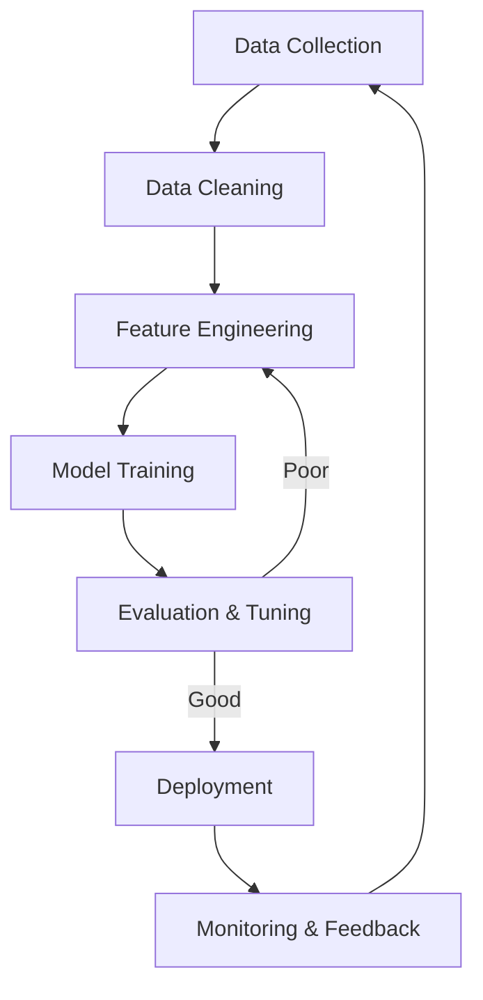

# 🤖 Machine Learning Fundamentals: The Core Science of AI
> **Level:** Beginner | **Language:** Hinglish | **Goal:** Master the foundational principles of Machine Learning, including the types of learning, key algorithms, and the underlying statistical mechanics.

---

## 🧭 1. Beginner-Friendly Hinglish Explanation
Machine Learning (ML) ka matlab hai computer ko "Rules" ratane ki jagah use "Data se seekhna" sikhana. 

Sochiye, purane zamane mein agar hume spam email pehchanna hota, toh hum hazaaron rules likhte: "Agar 'Lottery' word hai toh spam". Par spammers hoshiyar hain, wo spelling badal dete hain. 
ML mein hum computer ko 1 lakh "Spam" aur 1 lakh "Real" emails dikhate hain. Computer khud patterns dhoondhta hai—jaise ki sender ka address kaisa hai, links kahan ja rahe hain, aur words ka combination kya hai. 

Is module mein hum seekhenge ki machine kaise "Sawal" aur "Jawaab" ko dekh kar unke beech ka "Logic" (Model) khud create karti hai.

---

## 🧠 2. Deep Technical Explanation
Machine Learning is the study of computer algorithms that improve automatically through experience. It is divided into three main paradigms:
1. **Supervised Learning:** Learning with labeled data ($X \to Y$). Goal: Find a function $f$ such that $f(X) \approx Y$. (e.g., Classification, Regression).
2. **Unsupervised Learning:** Learning without labels. Goal: Find hidden patterns or structures in data (e.g., Clustering, Dimensionality Reduction).
3. **Reinforcement Learning:** Learning through trial and error to maximize a reward. (e.g., Game playing, Robotics).

**The Workflow:**
- **Inference:** Using a trained model to make predictions.
- **Training:** The process of optimizing model parameters ($\theta$) to minimize a Loss Function.
- **Generalization:** The ability of a model to perform well on new, unseen data (the ultimate goal of ML).

---

## 🏗️ 3. The ML Algorithm Map
| Algorithm | Type | Logic | Use Case |
| :--- | :--- | :--- | :--- |
| **Linear Regression** | Regression | Line of best fit | Predicting House Prices |
| **Logistic Regression** | Classification | Probability Threshold | Spam Detection |
| **Decision Trees** | Both | If-Else Tree structure | Credit Scoring |
| **K-Means** | Clustering | Distance-based groups | Customer Segmentation |
| **PCA** | Dim. Reduction | Feature compression | Data Visualization |

---

## 📐 4. Mathematical Intuition
At its heart, ML is **Function Approximation**.
- **Parametric Models:** Assume the function has a fixed form (e.g., $y = wx + b$). We just need to find $w$ and $b$.
- **Non-Parametric Models:** The function form grows with the data (e.g., KNN).
- **The Optimization Goal:** Minimizing the **Expected Risk**. Since we don't know the future, we minimize the **Empirical Risk** (the error on our current data).

---

## 📊 5. ML Lifecycle (Diagram)


---

## 💻 6. Production-Ready Examples (Building a Regressor)
```python
# 2026 Pro-Tip: Use Scikit-Learn for baseline ML before jumping to DL.
from sklearn.model_selection import train_test_split
from sklearn.linear_model import LinearRegression
from sklearn.metrics import mean_squared_error
import pandas as pd

# 1. Load Data
df = pd.read_csv("house_prices.csv")
X = df[['sqft', 'bedrooms', 'age']]
y = df['price']

# 2. Split (Standard 80-20 rule)
X_train, X_test, y_train, y_test = train_test_split(X, y, test_size=0.2, random_state=42)

# 3. Train
model = LinearRegression()
model.fit(X_train, y_train)

# 4. Evaluate
predictions = model.predict(X_test)
error = mean_squared_error(y_test, predictions)
print(f"Prediction Error: ${error**0.5:.2f}")
```

---

## ❌ 7. Failure Cases
- **Data Leakage:** Accidentally including the "Answer" in the training features. (e.g., including "Monthly Profit" to predict "Annual Revenue").
- **Survivorship Bias:** Training a model only on data from "Successful" cases, making it blind to why things fail.
- **Concept Drift:** The relationship between $X$ and $Y$ changes over time (e.g., house prices during a recession).

---

## 🛠️ 8. Debugging Guide
- **Symptom:** Model has 100% accuracy on training data but 10% on test data.
- **Check:** **Overfitting**. Your model has "memorized" the data instead of "learning" it. Use **Regularization** or **Cross-Validation**.
- **Symptom:** Model is predicting the same value for every input.
- **Check:** **Target Imbalance**. If 99% of your data is "Not Spam," the model might learn that saying "Not Spam" is the safest bet.

---

## ⚖️ 9. Tradeoffs
- **Interpretability vs. Accuracy:** A Decision Tree is easy to explain but less accurate. A Neural Network is a Black Box but highly accurate.
- **Training Time vs. Inference Speed:** Some models (like KNN) have 0 training time but are very slow during inference.

---

## 🛡️ 10. Security Concerns
- **Adversarial Perturbation:** Changing a single feature slightly to trick the model (e.g., adding a small sticker to a stop sign to make a car see it as 45mph).
- **Data Poisoning:** An attacker injects "False" data into your training set to systematically bias your model's future decisions.

---

## 📈 11. Scaling Challenges
- **The 1 Billion Row Problem:** Standard ML libraries (like Scikit-Learn) run in-memory. For datasets that don't fit in RAM, you need **Distributed ML** (like Spark ML or XGBoost on Dask).
- **Online Learning:** Updating a model in real-time as new data comes in, without retraining from scratch.

---

## 💸 12. Cost Considerations
- **Data Labeling is the biggest cost:** Hiring humans to label 1 million images can cost $\$100,000+$.
- **Automated Labeling:** Use LLMs or "Weak Supervision" (Snorkel) to label data at $1/100th$ of the cost.

---

## ✅ 13. Best Practices
- **Baseline First:** Always start with a simple model (Linear Regression/Random Forest) before trying a Neural Network.
- **Normalize Your Data:** Features with different scales (e.g., Age 0-100 vs. Salary 0-1M) can confuse most ML algorithms.
- **Cross-Validation:** Use K-Fold Cross-Validation to get a reliable estimate of your model's performance.

---

## ⚠️ 14. Common Mistakes
- **Ignoring the "No Free Lunch" Theorem:** No single algorithm is best for every problem.
- **Not checking Feature Importance:** Training a model with 500 features when only 5 of them are actually useful.
- **Ignoring Outliers:** One "extreme" data point can completely shift your Linear Regression line.

---

## 📝 15. Interview Questions
1. **"What is the difference between Parametric and Non-parametric models?"**
2. **"Explain the 'Bias-Variance Tradeoff' in one sentence."** (The balance between underfitting and overfitting).
3. **"Why do we need a separate 'Validation' set in addition to 'Train' and 'Test'?"**

---

## 🚀 15. Latest 2026 Industry Patterns
- **AutoML 2.0:** Systems that not only find the best model but also automatically engineer the best features and deploy the model to the cloud.
- **Foundation Models for Tabular Data:** Using Transformer-based models (like TabPFN) that can do "In-context learning" on Excel-style data without any training.
- **Privacy-Preserving ML:** Using **Homomorphic Encryption** to train models on data that stays encrypted, ensuring $100\%$ privacy.
