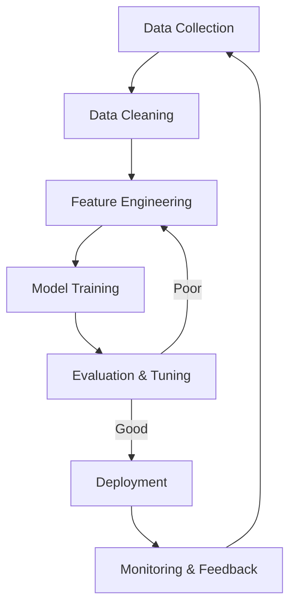

# 🤖 Machine Learning Fundamentals: AI Ki Core Science
> **Level:** Beginner | **Language:** Hinglish | **Goal:** Machine Learning ke foundational principles ko master karna, jisme types of learning, key algorithms, aur underlying statistical mechanics shamil hain.

---

## 🧭 1. Beginner-Friendly Hinglish Explanation
Machine Learning (ML) ka matlab hai computer ko "Rules" ratane ki jagah use "Data se seekhna" sikhana. 

Sochiye, purane zamane mein agar hume spam email pehchanna hota, toh hum hazaaron rules likhte: "Agar 'Lottery' word hai toh spam". Par spammers hoshiyar hain, wo spelling badal dete hain. 
ML mein hum computer ko 1 lakh "Spam" aur 1 lakh "Real" emails dikhate hain. Computer khud patterns dhoondhta hai—jaise ki sender ka address kaisa hai, links kahan ja rahe hain, aur words ka combination kya hai. 

Is module mein hum seekhenge ki machine kaise "Sawal" aur "Jawaab" ko dekh kar unke beech ka "Logic" (Model) khud create karti hai.

---

## 🧠 2. Deep Technical Explanation
Machine Learning un computer algorithms ka study hai jo experience ke through automatically improve hote hain. Ise teen main paradigms me divide kiya jata hai:
1. **Supervised Learning:** Labeled data ($X \to Y$) ke sath seekhna. Goal: Ek aisa function $f$ find karna jisse $f(X) \approx Y$ ho. (e.g., Classification, Regression).
2. **Unsupervised Learning:** Bina labels ke seekhna. Goal: Data me hidden patterns ya structures find karna (e.g., Clustering, Dimensionality Reduction).
3. **Reinforcement Learning:** Reward ko maximize karne ke liye trial aur error ke through seekhna. (e.g., Game playing, Robotics).

**The Workflow:**
- **Inference:** Predictions karne ke liye trained model ka use karna.
- **Training:** Loss Function ko minimize karne ke liye model parameters ($\theta$) ko optimize karne ki process.
- **Generalization:** Model ki new, unseen data par achha perform karne ki ability (ML ka ultimate goal).

---

## 🏗️ 3. The ML Algorithm Map
| Algorithm | Type | Logic (Tark) | Use Case (Upyog) |
| :--- | :--- | :--- | :--- |
| **Linear Regression** | Regression | Line of best fit | Predicting House Prices |
| **Logistic Regression** | Classification | Probability Threshold | Spam Detection |
| **Decision Trees** | Both | If-Else Tree structure | Credit Scoring |
| **K-Means** | Clustering | Distance-based groups | Customer Segmentation |
| **PCA** | Dim. Reduction | Feature compression | Data Visualization |

---

## 📐 4. Mathematical Intuition
Apne core me, ML **Function Approximation** hai.
- **Parametric Models:** Ye assume karte hain ki function ka ek fixed form hai (e.g., $y = wx + b$). Hume bas $w$ aur $b$ find karne ki zaroorat hoti hai.
- **Non-Parametric Models:** Function ka form data ke sath grow karta hai (e.g., KNN).
- **The Optimization Goal:** **Expected Risk** ko minimize karna. Kyunki hum future nahi jaante, isliye hum **Empirical Risk** (apne current data par error) ko minimize karte hain.

---

## 📊 5. ML Lifecycle (Diagram)

```mermaid
graph TD
    Data[Data Collection] --> Clean[Data Cleaning]
    Clean --> Features[Feature Engineering]
    Features --> Train[Model Training]
    Train --> Eval[Evaluation & Tuning]
    Eval -- "Poor" --> Features
    Eval -- "Good" --> Deploy[Deployment]
    Deploy --> Monitor[Monitoring & Feedback]
    Monitor --> Data
```

---

## 💻 6. Production-Ready Examples (Building a Regressor)
```python
# 2026 Pro-Tip: DL par jump karne se pehle baseline ML ke liye Scikit-Learn ka use karein.
from sklearn.model_selection import train_test_split
from sklearn.linear_model import LinearRegression
from sklearn.metrics import mean_squared_error
import pandas as pd

# 1. Load Data
df = pd.read_csv("house_prices.csv")
X = df[['sqft', 'bedrooms', 'age']]
y = df['price']

# 2. Split (Standard 80-20 rule)
X_train, X_test, y_train, y_test = train_test_split(X, y, test_size=0.2, random_state=42)

# 3. Train
model = LinearRegression()
model.fit(X_train, y_train)

# 4. Evaluate
predictions = model.predict(X_test)
error = mean_squared_error(y_test, predictions)
print(f"Prediction Error: ${error**0.5:.2f}")
```

---

## ❌ 7. Failure Cases
- **Data Leakage:** Galti se training features me "Answer" (jawaab) ko shamil kar lena. (e.g., "Annual Revenue" ko predict karne ke liye "Monthly Profit" ko shamil karna).
- **Survivorship Bias:** Model ko sirf "Successful" cases ke data par train karna, jisse ye un reasons ke prati blind ho jata hai jinki wajah se failure hoti hai.
- **Concept Drift:** Time ke sath $X$ aur $Y$ ke beech ka relationship change ho jana (e.g., recession ke dauran house prices).

---

## 🛠️ 8. Debugging Guide
- **Symptom:** Model ki training data par 100% accuracy hai par test data par 10% hai.
- **Check:** **Overfitting**. Computes ko update karne ke liye "learning" ke bajaye model ne data ko "memorize" kar liya hai. **Regularization** ya **Cross-Validation** ka use karein.
- **Symptom:** Model har ek input ke liye same value predict kar raha hai.
- **Check:** **Target Imbalance**. Agar aapka 99% data "Not Spam" hai, toh model ye seekh sakta hai ki "Not Spam" kehna hi sabse safe bet hai.

---

## ⚖️ 9. Tradeoffs
- **Interpretability vs. Accuracy:** Decision Tree ko explain karna easy hai par ye less accurate hota hai. Neural Network ek Black Box hai par highly accurate hota hai.
- **Training Time vs. Inference Speed:** Kuch models (jaise KNN) ka training time 0 hota hai par wo inference ke dauran bahut slow hote hain.

---

## 🛡️ 10. Security Concerns
- **Adversarial Perturbation:** Model ko trick karne ke liye kisi single feature ko slightly change karna (e.g., stop sign par ek chota sticker lagana taaki car use 45mph ki tarah dekhe).
- **Data Poisoning:** Ek attacker aapke training set me "False" data inject kar deta hai taaki aapke model ke future decisions ko systematically bias kiya ja sake.

---

## 📈 11. Scaling Challenges
- **The 1 Billion Row Problem:** Standard ML libraries (jaise Scikit-Learn) in-memory run karti hain. Aise datasets ke liye jo RAM me fit nahi hote, aapko **Distributed ML** (jaise Spark ML ya XGBoost on Dask) ki need hoti hai.
- **Online Learning:** Jaise hi new data aaye, model ko bina scratch se retrain kiye real-time me update karna.

---

## 💸 12. Cost Considerations
- **Data Labeling sabse bada cost hai:** 1 million images ko label karne ke liye humans ko hire karna $\$100,000+$ cost kar sakta hai.
- **Automated Labeling:** $1/100th$ cost par data ko label karne ke liye LLMs ya "Weak Supervision" (Snorkel) ka use karein.

---

## ✅ 13. Best Practices
- **Baseline First:** Neural Network try karne se pehle hamesha ek simple model (Linear Regression/Random Forest) se start karein.
- **Normalize Your Data:** Different scales wale features (e.g., Age 0-100 vs. Salary 0-1M) most ML algorithms ko confuse kar sakte hain.
- **Cross-Validation:** Apne model ki performance ka reliable estimate paane ke liye K-Fold Cross-Validation ka use karein.

---

## ⚠️ 14. Common Mistakes
- **Ignoring the "No Free Lunch" Theorem:** Point parameters check karein; koi bhi single algorithm har problem ke liye best nahi hai.
- **Not checking Feature Importance:** 500 features ke sath model train karna jab unme se sirf 5 hi actually useful hon.
- **Ignoring Outliers:** Ek "extreme" data point aapki Linear Regression line ko completely shift kar sakta hai.

---

## 📝 15. Interview Questions
1. **"Parametric aur Non-parametric models me kya difference hai?"**
2. **"Ek sentence me 'Bias-Variance Tradeoff' ko explain karein."** (Underfitting aur overfitting ke beech ka balance).
3. **"Hume 'Train' aur 'Test' ke alawa ek separate 'Validation' set ki need kyun hoti hai?"**

---

## 🚀 15. Latest 2026 Industry Patterns
- **AutoML 2.0:** Aise systems jo na sirf best model find karte hain balki automatically best features engineer karte hain aur model ko cloud par deploy karte hain.
- **Foundation Models for Tabular Data:** Transformer-based models (jaise TabPFN) ka use karna jo bina kisi training ke Excel-style data par "In-context learning" kar sakte hain.
- **Privacy-Preserving ML:** Data jo encrypted rehta hai, uspar models ko train karne ke liye **Homomorphic Encryption** ka use karna, jo $100\%$ privacy ensure karta hai.
