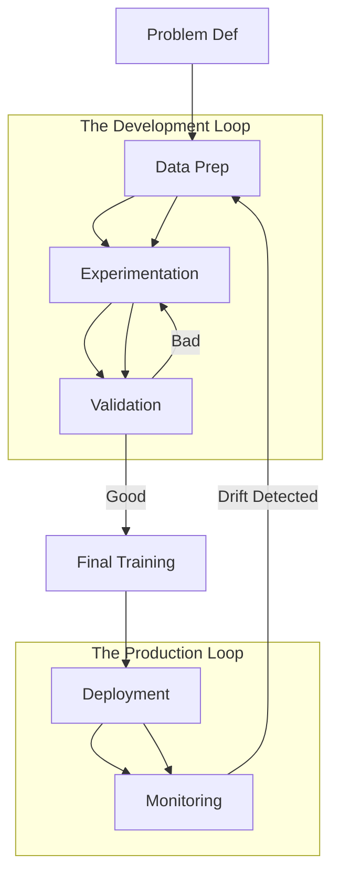

# 🔄 Model Training Lifecycle: The End-to-End AI Engineering Process
> **Level:** Advanced | **Language:** Hinglish | **Goal:** Master the systematic journey of an AI model, from data acquisition and experimentation to deployment, monitoring, and iterative improvement.

---

## 🧭 1. Beginner-Friendly Hinglish Explanation
Model training sirf `model.fit()` likhna nahi hai. Ye ek lamba aur discipline wala process hai. 

Sochiye, aap ek gaadi (car) bana rahe hain:
1. **Design (Problem Definition):** Kaunsi gaadi banani hai? SUV ya Sportscar?
2. **Raw Materials (Data Collection):** Loha, tyres, aur engine parts ikhattha karna.
3. **Assembly (Preprocessing):** Parts ko saaf karna aur sahi size mein kaatna.
4. **Testing (Training & Validation):** Gaadi ko track par chalana aur check karna ki engine heat toh nahi ho raha?
5. **Quality Check (Evaluation):** Kya gaadi crash test pass kar rahi hai?
6. **Launch (Deployment):** Gaadi ko showroom (Production) mein bhejna.
7. **Service (Monitoring):** Gaadi road par kaisi chal rahi hai, uska feedback lena aur agli baar use sudharna.

Ek AI Engineer ka kaam model ko "Zinda" rakhna hai, sirf train karna nahi.

---

## 🧠 2. Deep Technical Explanation
The AI Lifecycle (often called **MLOps**) consists of several critical phases:
1. **Problem Definition:** Is it a business problem? What are the KPIs (Key Performance Indicators)?
2. **Data Acquisition & Labeling:** Gathering data from SQL, S3, or APIs. Ensuring high-quality labels (Ground Truth).
3. **Exploratory Data Analysis (EDA):** Visualizing distributions, finding outliers, and checking feature correlations.
4. **Preprocessing & Feature Engineering:** Handling missing values, scaling, and encoding.
5. **Model Experimentation:** Trying different architectures (CNN vs. ViT, Llama vs. Mistral).
6. **Hyperparameter Tuning:** Finding the best Learning Rate, Batch Size, and Epochs using **Bayesian Optimization** or Grid Search.
7. **Evaluation:** Testing on a "Hidden" dataset. Checking for Bias and Fairness.
8. **Deployment (Serving):** Turning the model into an API (FastAPI) or a batch process.
9. **Monitoring & Retraining:** Detecting "Model Drift" (when the model becomes less accurate because the world changed).

---

## 🏗️ 3. The Lifecycle Stack (2026 Standards)
| Phase | Tool Choice | Purpose |
| :--- | :--- | :--- |
| **Data Versioning** | DVC / LakeFS | Track data changes like code |
| **Experiment Tracking** | MLflow / Weights & Biases | Log every run's accuracy & loss |
| **Preprocessing** | Spark / Pandas / DuckDB | Cleaning and transforming data |
| **Tuning** | Optuna / Ray Tune | Automated hyperparameter search |
| **Model Registry** | MLflow Models | Storing "Approved" versions |
| **Monitoring** | Evidently AI / Prometheus | Detecting drift in production |

---

## 📐 4. Mathematical Intuition
The lifecycle is about reducing the **Generalization Error**:
$$E_{gen} = E_{train} + (E_{test} - E_{train})$$
- We minimize $E_{train}$ during the **Training Phase**.
- We minimize the gap $(E_{test} - E_{train})$ during the **Validation/Tuning Phase** to avoid overfitting.
- We monitor $E_{prod}$ during the **Monitoring Phase** to ensure it doesn't drift.

---

## 📊 5. Iterative Lifecycle (Diagram)


---

## 💻 6. Production-Ready Examples (Experiment Tracking with W&B)
```python
# 2026 Pro-Tip: NEVER train without experiment tracking.
import wandb
import torch

# 1. Initialize Experiment
wandb.init(project="my_ai_model", config={
    "learning_rate": 1e-4,
    "architecture": "Transformer",
    "dataset": "Wiki-Text-2026"
})

def train_loop():
    for epoch in range(10):
        # ... training logic ...
        loss = 0.5 / (epoch + 1) # Dummy loss
        accuracy = 0.8 + (epoch * 0.01) # Dummy accuracy
        
        # 2. Log Metrics
        wandb.log({"epoch": epoch, "loss": loss, "accuracy": accuracy})

train_loop()
# Now you can see beautiful graphs on your wandb dashboard!
```

---

## ❌ 7. Failure Cases
- **The "Vibe-Check" Deployment:** Deploying a model because it "looked good" on 5 examples, only for it to fail on 10,000 edge cases.
- **Training-Serving Skew:** The preprocessing code in your Training script (Python) is different from your Production script (C++/Java), leading to wrong predictions.
- **Manual Overwrite:** Deploying a model by manually copying a `.pkl` file to a server instead of using a proper CI/CD pipeline.

---

## 🛠️ 8. Debugging Guide
- **Symptom:** Model accuracy is perfect in Jupyter but zero in the Web App.
- **Check:** **Data Pipeline**. Are you scaling the production input using the SAME mean/std as training?
- **Symptom:** Loss is not decreasing.
- **Check:** **Learning Rate**. It might be too small ($10^{-10}$) or too large ($1.0$).
- **Check:** **Target Label Encoding**. Did you accidentally swap "Spam" (1) and "Not Spam" (0)?

---

## ⚖️ 9. Tradeoffs
- **Accuracy vs. Speed:** A "Slower" lifecycle with more validation takes more time but results in a "Safer" model.
- **Automated vs. Manual Deployment:** Automated is safer; Manual is faster for a quick prototype.

---

## 🛡️ 10. Security Concerns
- **Model Inversion:** An attacker can use your API outputs to reverse-engineer the training data.
- **Adversarial Attacks during Inference:** Specifically targeting the model once it is deployed to production.
- **Credential Leakage:** Forgetting your AWS/W&B API keys in the training script.

---

## 📈 11. Scaling Challenges
- **Multi-GPU Training:** Syncing weights across 8 GPUs without slowing down the lifecycle.
- **Feature Store Latency:** Getting real-time features to the model in $<10ms$.
- **Model Versioning:** Managing 100 versions of a 140GB model file.

---

## 💸 12. Cost Considerations
- **Early Stopping:** Save $\$1,000s$ by stopping the training if the loss doesn't improve for 5 epochs.
- **Spot Instances:** Using "Cheap" AWS servers that might shut down, requiring your lifecycle to have **Checkpointing** (saving progress every hour).

---

## ✅ 13. Best Practices
- **Write Unit Tests for Data:** Check if any column is $100\%$ null before training starts.
- **Stateless Serving:** Ensure your API doesn't "remember" previous users (unless it's a Chat bot with Redis), making it easy to scale horizontally.
- **Document Everything:** Why did you choose 128 batch size? Write it in the W&B notes.

---

## ⚠️ 14. Common Mistakes
- **Retraining too often:** Wasting money retraining every day when the data only changes once a month.
- **Not having a "Baseline":** Comparing your new model against nothing. How do you know it's better?
- **Hardcoding Paths:** Using `C:\Users\John\data.csv` in your code, which will fail on any other machine.

---

## 📝 15. Interview Questions
1. **"What is 'Model Drift' and how do you monitor it?"**
2. **"Difference between a Validation set and a Test set?"**
3. **"Explain the importance of 'Feature Stores' in a production ML lifecycle."**

---

## 🚀 15. Latest 2026 Industry Patterns
- **LLMOps (Generative AI Lifecycle):** Focusing on "RLHF" (Reinforcement Learning from Human Feedback) as the final stage of the lifecycle.
- **CI/CD for Weights:** Instead of just code, we use pipelines that automatically trigger a "Training Run" when new data is added to the database.
- **Edge-to-Cloud Lifecycle:** Training a large model on the cloud, and automatically "Distilling" it to run on a mobile phone (Edge).
