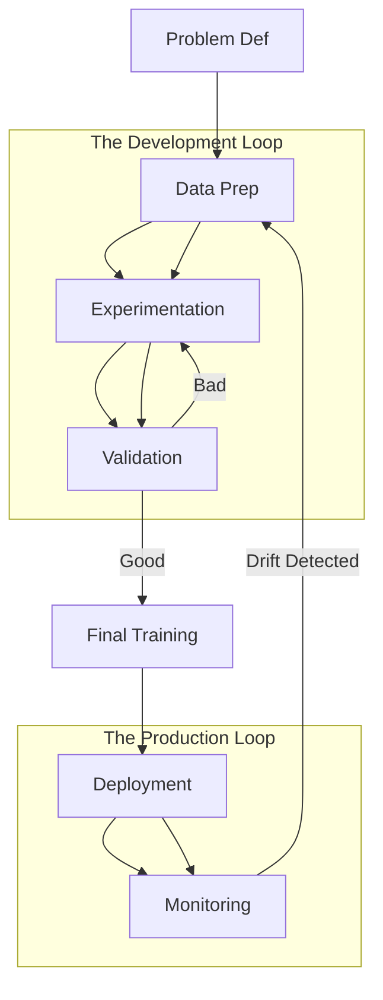

# 🔄 Model Training Lifecycle: The End-to-End AI Engineering Process
> **Level:** Advanced | **Language:** Hinglish | **Goal:** AI model ke systematic safar ko master karein, data acquisition aur experimentation se lekar deployment, monitoring, aur iterative improvement tak.

---

## 🧭 1. Beginner-Friendly Hinglish Explanation
Model training sirf `model.fit()` likhna nahi hai. Ye ek lamba aur discipline wala process hai. 

Sochiye, aap ek gaadi (car) bana rahe hain:
1. **Design (Problem Definition):** Kaunsi gaadi banani hai? SUV ya Sportscar?
2. **Raw Materials (Data Collection):** Loha, tyres, aur engine parts ikhattha karna.
3. **Assembly (Preprocessing):** Parts ko saaf karna aur sahi size mein kaatna.
4. **Testing (Training & Validation):** Gaadi ko track par chalana aur check karna ki engine heat toh nahi ho raha?
5. **Quality Check (Evaluation):** Kya gaadi crash test pass kar rahi hai?
6. **Launch (Deployment):** Gaadi ko showroom (Production) mein bhejna.
7. **Service (Monitoring):** Gaadi road par kaisi chal rahi hai, uska feedback lena aur agli baar use sudharna.

Ek AI Engineer ka kaam model ko "Zinda" rakhna hai, sirf train karna nahi.

---

## 🧠 2. Deep Technical Explanation
AI Lifecycle (jise aksar **MLOps** bhi kaha jata hai) me kai saare critical phases hote hain:
1. **Problem Definition:** Kya ye ek business problem hai? KPIs (Key Performance Indicators) kya hain?
2. **Data Acquisition & Labeling:** SQL, S3, ya APIs se data collect karna. High-quality labels (Ground Truth) ensure karna.
3. **Exploratory Data Analysis (EDA):** Distributions ko visualize karna, outliers find karna, aur feature correlations check karna.
4. **Preprocessing & Feature Engineering:** Missing values ko handle karna, scaling, aur encoding karna.
5. **Model Experimentation:** Different architectures (CNN vs. ViT, Llama vs. Mistral) ko try karna.
6. **Hyperparameter Tuning:** **Bayesian Optimization** ya Grid Search ka use karke best Learning Rate, Batch Size, aur Epochs find karna.
7. **Evaluation:** Ek "Hidden" dataset par test karna. Bias aur Fairness check karna.
8. **Deployment (Serving):** Model ko ek API (FastAPI) ya batch process me convert karna.
9. **Monitoring & Retraining:** "Model Drift" detect karna (jab real-world changes ki wajah se model ki accuracy kam ho jati hai).

---

## 🏗️ 3. The Lifecycle Stack (2026 Standards)
| Phase | Tool Choice | Purpose (Udeshya) |
| :--- | :--- | :--- |
| **Data Versioning** | DVC / LakeFS | Data changes ko code ki tarah track karna |
| **Experiment Tracking** | MLflow / Weights & Biases | Har run ke accuracy & loss ko log karna |
| **Preprocessing** | Spark / Pandas / DuckDB | Data ko clean aur transform karna |
| **Tuning** | Optuna / Ray Tune | Automated hyperparameter search karna |
| **Model Registry** | MLflow Models | Approved versions ko store karna |
| **Monitoring** | Evidently AI / Prometheus | Production me drift ko detect karna |

---

## 📐 4. Mathematical Intuition
Lifecycle ka main goal **Generalization Error** ko reduce karna hai:
$$E_{gen} = E_{train} + (E_{test} - E_{train})$$
- Hum **Training Phase** ke dauran $E_{train}$ ko minimize karte hain.
- Hum overfitting se bachne ke liye **Validation/Tuning Phase** ke dauran gap $(E_{test} - E_{train})$ ko minimize karte hain.
- Hum **Monitoring Phase** ke dauran $E_{prod}$ ko monitor karte hain taaki ye ensure kar sakein ki model drift na ho.

---

## 📊 5. Iterative Lifecycle (Diagram)

```mermaid
graph TD
    P[Problem Def] --> D[Data Prep]
    D --> E[Experimentation]
    E --> V[Validation]
    V -- "Bad" --> E
    V -- "Good" --> T[Final Training]
    T --> Dep[Deployment]
    Dep --> M[Monitoring]
    M -- "Drift Detected" --> D
    
    subgraph "The Development Loop"
    D --> E --> V
    end
    
    subgraph "The Production Loop"
    Dep --> M
    end
```

---

## 💻 6. Production-Ready Examples (Experiment Tracking with W&B)
```python
# 2026 Pro-Tip: NEVER train without experiment tracking.
import wandb
import torch

# 1. Initialize Experiment
wandb.init(project="my_ai_model", config={
    "learning_rate": 1e-4,
    "architecture": "Transformer",
    "dataset": "Wiki-Text-2026"
})

def train_loop():
    for epoch in range(10):
        # ... training logic ...
        loss = 0.5 / (epoch + 1) # Dummy loss
        accuracy = 0.8 + (epoch * 0.01) # Dummy accuracy
        
        # 2. Log Metrics
        wandb.log({"epoch": epoch, "loss": loss, "accuracy": accuracy})

train_loop()
# Ab aap apne wandb dashboard par beautiful graphs dekh sakte hain!
```

---

## ❌ 7. Failure Cases
- **The "Vibe-Check" Deployment:** Model ko sirf isliye deploy kar dena kyunki wo 5 examples par "achha dikh raha tha", aur fir production me 10,000 edge cases par fail ho jana.
- **Training-Serving Skew:** Aapke Training script (Python) aur Production script (C++/Java) ka preprocessing code different hona, jiski wajah se galat predictions aati hain.
- **Manual Overwrite:** Kisi proper CI/CD pipeline ka use karne ke bajaye manually server par `.pkl` file copy karke model deploy karna.

---

## 🛠️ 8. Debugging Guide
- **Symptom:** Jupyter me model accuracy perfect hai par Web App me zero hai.
- **Check:** **Data Pipeline**. Kya aap production input ko training ke SAME mean/std ka use karke scale kar rahe hain?
- **Symptom:** Loss is not decreasing.
- **Check:** **Learning Rate**. Ye shayad bahut chota ($10^{-10}$) ya bahut bada ($1.0$) ho sakta hai.
- **Check:** **Target Label Encoding**. Kya aapne galti se "Spam" (1) aur "Not Spam" (0) ko swap kar diya hai?

---

## ⚖️ 9. Tradeoffs
- **Accuracy vs. Speed:** Ek "slower" lifecycle jisme zyada validation ho, wo time toh zyada leta hai par isse ek "safer" model milta hai.
- **Automated vs. Manual Deployment:** Automated zyada safe hai; ek quick prototype ke liye manual fast hota hai.

---

## 🛡️ 10. Security Concerns
- **Model Inversion:** Attacker aapke API outputs ka use karke training data ko reverse-engineer kar sakta hai.
- **Adversarial Attacks during Inference:** Model ke production me deploy hone ke baad use specifically target karna.
- **Credential Leakage:** Training script me apne AWS/W&B API keys ko chhor dena ya bhul jana.

---

## 📈 11. Scaling Challenges
- **Multi-GPU Training:** Lifecycle ko slow kiye bina 8 GPUs me weights ko sync karna.
- **Feature Store Latency:** Model ke liye real-time features $<10ms$ me access karna.
- **Model Versioning:** 140GB model file ke 100 versions ko manage karna.

---

## 💸 12. Cost Considerations
- **Early Stopping:** Agar loss 5 epochs tak improve na ho toh training ko stop karke thousands of dollars ($\$1,000s$) save karna.
- **Spot Instances:** "Saste" AWS servers ka use karna jo kabhi bhi shut down ho sakte hain, jiske liye aapke lifecycle me **Checkpointing** (har hour progress save karna) hona zaroori hai.

---

## ✅ 13. Best Practices
- **Write Unit Tests for Data:** Training start hone se pehle check karein ki kya koi column $100\%$ null hai.
- **Stateless Serving:** Ensure karein ki aapki API previous users ko "yaad" na rakhe (jab tak ki ye Redis ke sath koi Chat bot na ho), jisse ise horizontally scale karna easy ho jaye.
- **Document Everything:** Aapne 128 batch size kyun select kiya? Ise W&B notes me likhein.

---

## ⚠️ 14. Common Mistakes
- **Retraining too often:** Agar data mahine me sirf ek baar badalta hai, toh har roz retrain karke paise waste karna.
- **Not having a "Baseline":** Comparing your new model against nothing. How do you know it's better?
- **Hardcoding Paths:** Apne code me `C:\Users\John\data.csv` jaise paths ko hardcode karna, jo kisi dusri machine par fail ho jayega.

---

## 📝 15. Interview Questions
1. **"Model Drift kya hai aur aap ise kaise monitor karte hain?"**
2. **"Validation set aur Test set me kya difference hai?"**
3. **"Production ML lifecycle me 'Feature Stores' ki importance ko explain karein."**

---

## 🚀 16. Latest 2026 Industry Patterns
- **LLMOps (Generative AI Lifecycle):** Focusing on "RLHF" (Reinforcement Learning from Human Feedback) as the final stage of the lifecycle.
- **CI/CD for Weights:** Instead of just code, we use pipelines that automatically trigger a "Training Run" when new data is added to the database.
- **Edge-to-Cloud Lifecycle:** Training a large model on the cloud, and automatically "Distilling" it to run on a mobile phone (Edge).
