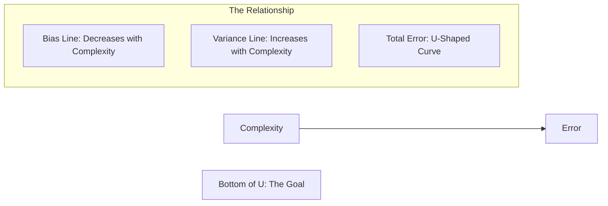

# 📉 Overfitting & Underfitting: The Battle for Generalization
> **Level:** Intermediate | **Language:** Hinglish | **Goal:** Master the concepts of model capacity, noise, and signal to ensure your AI works perfectly on new, unseen data.

---

## 🧭 1. Beginner-Friendly Hinglish Explanation
ML mein sabse badi tension hoti hai: "Kya mera model sach mein seekh raha hai ya sirf ratta (memorization) maar raha hai?"

1. **Underfitting (Model is too simple):** Sochiye aapne ek bacche ko sirf "2+2=4" aur "3+3=6" sikhaya, aur ab aap use complex Algebra ka test de rahe hain. Baccha fail ho jayega kyunki use basic concept hi nahi pata. 
   - **Symptom:** Training aur Testing dono mein gande results. 
   - **Solution:** Model ko "Hard" banao, zyada features do.

2. **Overfitting (Model is too complex / Ratta):** Sochiye bacche ne poori book rat li hai. Agar aapne book ka exact sawal pucha, toh wo $100/100$ laayega. Par agar aapne sawal thoda sa ghumaya, toh wo fail ho jayega kyunki usne "Logic" nahi samjha, sirf "Ratta" mara tha.
   - **Symptom:** Training mein $100\%$ accuracy, par Testing mein $50\%$.
   - **Solution:** Model ko thoda "Control" karo, irrelevant data hatao, data badhao.

Humein in dono ke beech ka **"Sweet Spot"** (Generalization) dhoondhna hota hai.

---

## 🧠 2. Deep Technical Explanation
Overfitting and Underfitting are about the **Model Capacity** vs. **Data Complexity**:

### Underfitting (High Bias)
- **Definition:** The model is unable to capture the underlying trend of the data. It assumes too much about the data structure (e.g., trying to fit a straight line to a spiral).
- **Cause:** Not enough features, model is too small, or training time is too short.
- **Metric:** High Training Error, High Test Error.

### Overfitting (High Variance)
- **Definition:** The model captures the "Noise" in the data along with the "Signal." It fits every single outlier in the training set.
- **Cause:** Model is too large (too many parameters), too much noise in data, or small dataset.
- **Metric:** Low Training Error, High Test Error.

---

## 🏗️ 3. The Comparison Matrix
| Feature | Underfitting | Optimal | Overfitting |
| :--- | :--- | :--- | :--- |
| **Model Complexity** | Low (Too Simple) | Medium (Just Right) | High (Too Complex) |
| **Training Error** | High | Low | Very Low |
| **Test Error** | High | Low | High |
| **Bias** | High | Low | Low |
| **Variance** | Low | Low | High |

---

## 📐 4. Mathematical Intuition
- **Capacity:** The number of free parameters in a model. 
- **The Gap:** The difference between Training Loss and Validation Loss. A growing gap is a 100% indicator of overfitting.
- **Complexity Penalty:** We often add a penalty term to the loss function to discourage overfitting: 
  $$Loss = Error(Y, Y_{hat}) + \lambda \cdot Complexity(W)$$
  This is called **Regularization**.

---

## 📊 5. Bias-Variance Curve (Diagram)


---

## 💻 6. Production-Ready Examples (Fixing Overfitting with Early Stopping)
```python
# 2026 Pro-Tip: Use Early Stopping to prevent the model from over-learning.
from sklearn.neural_network import MLPRegressor
from sklearn.model_selection import train_test_split

X_train, X_val, y_train, y_val = train_test_split(X, y, test_size=0.2)

# MLP with many hidden layers (High capacity - prone to overfitting)
model = MLPRegressor(
    hidden_layer_sizes=(500, 500, 500), 
    max_iter=1000, 
    early_stopping=True, # STOP when validation score stops improving
    validation_fraction=0.1,
    n_iter_no_change=10 # Wait for 10 epochs before quitting
)

model.fit(X_train, y_train)

print(f"Epochs trained: {model.n_iter_}")
# This ensures we stop at the 'Sweet Spot' before overfitting starts.
```

---

## ❌ 7. Failure Cases
- **Overfitting on Small Data:** Trying to train a 7B parameter model on 100 rows of data. It will reach 0 loss in 1 second but will be useless on new data.
- **Underfitting on Image Data:** Using a simple Linear Regression to detect faces. It will never learn the complex pixel patterns.
- **The "Over-Regularization" Failure:** Adding so much penalty ($\lambda$) that the model stops learning altogether (it just predicts the average).

---

## 🛠️ 8. Debugging Guide
- **Symptom:** Training loss is flat and high from the start.
- **Check (Underfitting):** Add more layers? Add more features? Train for longer?
- **Symptom:** Training loss is dropping, but Validation loss is increasing.
- **Check (Overfitting):** **Dropout**. Are you randomly shutting down neurons during training?
- **Check (Overfitting):** **Data Augmentation**. Can you create "Fake" data (flip images, add noise to text) to force the model to generalize?

---

## ⚖️ 9. Tradeoffs
- **Model Size:** Smaller models are faster and don't overfit easily, but they might miss complex nuances. 
- **Training Time:** More epochs = Better training, but also higher risk of overfitting.

---

## 🛡️ 10. Security Concerns
- **Model Memorization:** An overfitted LLM might "memorize" a private phone number from its training set. An attacker can extract this number by asking the right questions. This is why **Regularization** is a security requirement.

---

## 📈 11. Scaling Challenges
- **Large Model Generalization:** Large models (like GPT-4) actually generalize BETTER than medium models (Double Descent phenomenon), which goes against traditional ML theory. Managing this "Scale vs. Overfitting" balance is the core of AI Research.

---

## 💸 12. Cost Considerations
- Overfitting wastes money because you are paying for GPU time to learn "Noise." Stopping early (Early Stopping) can save $20-40\%$ of your cloud bill.

---

## ✅ 13. Best Practices
- **K-Fold Cross-Validation:** The most reliable way to check for overfitting.
- **Dropout (0.2 - 0.5):** Mandatory for deep neural networks.
- **Weight Decay (L2):** Keeps weights small, preventing the model from becoming too sensitive to any one feature.

---

## ⚠️ 14. Common Mistakes
- **Testing on Training Data:** Never, ever judge your model based on the same data it learned from.
- **Ignoring the Validation Curve:** Not looking at the graph of Training vs. Validation loss.
- **Adding Features blindly:** Adding "ID" columns or "Names" that have no signal but lead to instant overfitting.

---

## 📝 15. Interview Questions
1. **"How do you know if your model is Overfitting?"** (Train loss $\downarrow$, Val loss $\uparrow$).
2. **"Difference between L1 and L2 Regularization?"** (L1 creates sparse weights/removes features; L2 keeps weights small).
3. **"What is 'Dropout' and how does it prevent overfitting?"** (It forces the model to not rely on any single neuron, creating a more robust ensemble).

---

## 🚀 15. Latest 2026 Industry Patterns
- **Double Descent Mastery:** Engineers are now intentionally over-parameterizing models and training them *beyond* the point of overfitting to reach a "Second Descent" where accuracy becomes even higher.
- **Adversarial Training:** Feeding the model "Hard examples" that are specifically designed to make it overfit, teaching it to ignore those traps.
- **LoRA (Low-Rank Adaptation):** Fine-tuning only a tiny fraction of weights ($<1\%$) to prevent the model from "forgetting" its general knowledge while learning a specific task.
