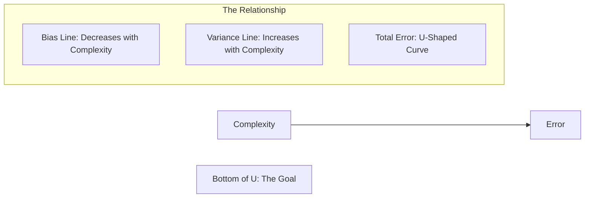

# 📉 Overfitting & Underfitting: The Battle for Generalization
> **Level:** Intermediate | **Language:** Hinglish | **Goal:** Model capacity, noise, aur signal ke concepts ko master karein taaki aapka AI naye, unseen data par perfectly kaam kare.

---

## 🧭 1. Beginner-Friendly Hinglish Explanation
ML mein sabse badi tension hoti hai: "Kya mera model sach mein seekh raha hai ya sirf ratta (memorization) maar raha hai?"

1. **Underfitting (Model is too simple):** Sochiye aapne ek bacche ko sirf "2+2=4" aur "3+3=6" sikhaya, aur ab aap use complex Algebra ka test de rahe hain. Baccha fail ho jayega kyunki use basic concept hi nahi pata. 
   - **Symptom:** Training aur Testing dono mein gande results. 
   - **Solution:** Model ko "Hard" banao, zyada features do.

2. **Overfitting (Model is too complex / Ratta):** Sochiye bacche ne poori book rat li hai. Agar aapne book ka exact sawal pucha, toh wo $100/100$ laayega. Par agar aapne sawal thoda sa ghumaya, toh wo fail ho jayega kyunki usne "Logic" nahi samjha, sirf "Ratta" mara tha.
   - **Symptom:** Training mein $100\%$ accuracy, par Testing mein $50\%$.
   - **Solution:** Model ko thoda "Control" karo, irrelevant data hatao, data badhao.

Humein in dono ke beech ka **"Sweet Spot"** (Generalization) dhoondhna hota hai.

---

## 🧠 2. Deep Technical Explanation
Overfitting aur Underfitting dono hi **Model Capacity** vs. **Data Complexity** ke baare me hote hain:

### Underfitting (High Bias)
- **Definition:** Model data ke underlying trend ko capture nahi kar pata hai. Ye data structure ke baare me bahut zyada assumptions bana leta hai (e.g., kisi spiral data me straight line fit karne ki koshish karna).
- **Cause:** Sahi amount me features na hona, model ka bahut small hona, ya training time ka bahut short hona.
- **Metric:** High Training Error, High Test Error.

### Overfitting (High Variance)
- **Definition:** Model "Signal" ke sath-sath data me maujood "Noise" ko bhi capture kar leta hai. Ye training set ke har ek outlier ko fit karne ki koshish karta hai.
- **Cause:** Model ka bahut bada hona (too many parameters), data me bahut zyada noise hona, ya dataset ka bahut chota hona.
- **Metric:** Low Training Error, High Test Error.

---

## 🏗️ 3. The Comparison Matrix
| Feature (Lakshan) | Underfitting | Optimal | Overfitting |
| :--- | :--- | :--- | :--- |
| **Model Complexity** | Low (Bahut Simple) | Medium (Sahi hai) | High (Bahut Complex) |
| **Training Error** | High | Low | Very Low |
| **Test Error** | High | Low | High |
| **Bias** | High | Low | Low |
| **Variance** | Low | Low | High |

---

## 📐 4. Mathematical Intuition
- **Capacity:** Kisi model me free parameters ka number. 
- **The Gap:** Training Loss aur Validation Loss ke beech ka difference. Ek badhta hua gap overfitting ka $100\%$ indicator hai.
- **Complexity Penalty:** Overfitting ko rokne ke liye hum aksar loss function me ek penalty term add karte hain: 
  $$Loss = Error(Y, Y_{hat}) + \lambda \cdot Complexity(W)$$
  Ise **Regularization** kaha jata hai.

---

## 📊 5. Bias-Variance Curve (Diagram)

```mermaid
graph LR
    C[Complexity] --> E[Error]
    
    subgraph "The Relationship"
    Bias[Bias Line: Decreases with Complexity]
    Var[Variance Line: Increases with Complexity]
    Total[Total Error: U-Shaped Curve]
    end
    
    Optimal[Bottom of U: The Goal]
```

---

## 💻 6. Production-Ready Examples (Fixing Overfitting with Early Stopping)
```python
# 2026 Pro-Tip: Model ko over-learning se bachane ke liye Early Stopping ka use karein.
from sklearn.neural_network import MLPRegressor
from sklearn.model_selection import train_test_split

X_train, X_val, y_train, y_val = train_test_split(X, y, test_size=0.2)

# MLP jisme kai hidden layers hain (High capacity - overfitting ke chances zyada hain)
model = MLPRegressor(
    hidden_layer_sizes=(500, 500, 500), 
    max_iter=1000, 
    early_stopping=True, # Validation score improve hona band hone par STOP karein
    validation_fraction=0.1,
    n_iter_no_change=10 # Quit karne se pehle 10 epochs tak wait karein
)

model.fit(X_train, y_train)

print(f"Epochs trained: {model.n_iter_}")
# Ye ensure karta hai ki hum overfitting start hone se pehle hi 'Sweet Spot' par stop ho jayein.
```

---

## ❌ 7. Failure Cases
- **Overfitting on Small Data:** 100 rows ke data par 7B parameter model train karne ki koshish karna. Ye 1 second me 0 loss tak pahunch jayega par new data par completely useless hoga.
- **Underfitting on Image Data:** Faces detect karne ke liye simple Linear Regression ka use karna. Ye kabhi bhi complex pixel patterns ko learn nahi kar payega.
- **The "Over-Regularization" Failure:** Bahut zyada penalty ($\lambda$) add kar dena jisse model bilkul seekhna hi band kar de (ye sirf average predict karne lagta hai).

---

## 🛠️ 8. Debugging Guide
- **Symptom:** Training loss shuru se hi flat aur high rehta hai.
- **Check (Underfitting):** Kya aur layers add karein? Aur features add karein? Ya thoda aur train karein?
- **Symptom:** Training loss drop ho raha hai, par Validation loss increase ho raha hai.
- **Check (Overfitting):** **Dropout**. Kya aap training ke dauran neurons ko randomly shut down kar rahe hain?
- **Check (Overfitting):** **Data Augmentation**. Kya aap model ko generalize karne par force karne ke liye "Fake" data (images flip karna, text me noise add karna) create kar sakte hain?

---

## ⚖️ 9. Tradeoffs
- **Model Size:** Smaller models fast hote hain aur easily overfit nahi hote, par wo complex nuances ko miss kar sakte hain. 
- **Training Time:** Zyada epochs = Better training, par isse overfitting ka risk bhi badh jata hai.

---

## 🛡️ 10. Security Concerns
- **Model Memorization:** Ek overfitted LLM training set se kisi private phone number ko "memorize" kar sakta hai. Attacker sahi sawal puch kar is number ko extract kar sakta hai. Isiliye **Regularization** ek security requirement hai.

---

## 📈 11. Scaling Challenges
- **Large Model Generalization:** Large models (jaise GPT-4) actually medium models se BEHTAR generalize karte hain (Double Descent phenomenon), jo traditional ML theory ke against jata hai. Is "Scale vs. Overfitting" balance ko manage karna hi AI Research ka core hai.

---

## 💸 12. Cost Considerations
- Overfitting se paise waste hote hain kyunki aap "Noise" ko learn karne ke liye GPU time ke paise de rahe hote hain. Jaldi stop karne se (Early Stopping) aapke cloud bill ka $20-40\%$ save ho sakta hai.

---

## ✅ 13. Best Practices
- **K-Fold Cross-Validation:** Overfitting check karne ka sabse reliable tarika.
- **Dropout (0.2 - 0.5):** Deep neural networks ke liye mandatory hai.
- **Weight Decay (L2):** Weights ko small rakhta hai, jisse model kisi bhi ek feature ke liye bahut zyada sensitive nahi hota.

---

## ⚠️ 14. Common Mistakes
- **Testing on Training Data:** Apne model ko kabhi bhi us same data par judge na karein jisse usne seekha hai.
- **Ignoring the Validation Curve:** Training vs. Validation loss ke graph ko ignore karna.
- **Adding Features blindly:** Aise "ID" columns ya "Names" ko bina soche-samjhe add karna jisme koi signal nahi hota par instant overfitting ho jati hai.

---

## 📝 15. Interview Questions
1. **"Aapko kaise pata chalega ki aapka model Overfit ho raha hai?"** (Train loss $\downarrow$, Val loss $\uparrow$).
2. **"L1 aur L2 Regularization me kya difference hai?"** (L1 sparse weights create karta hai/features ko remove karta hai; L2 weights ko small rakhta hai).
3. **"'Dropout' kya hai aur ye overfitting ko kaise prevent karta hai?"** (Ye model ko kisi single neuron par rely na karne ke liye force karta hai, jisse ek robust ensemble banta hai).

---

## 🚀 16. Latest 2026 Industry Patterns
- **Double Descent Mastery:** Engineers ab intentionally models ko over-parameterize kar rahe hain aur unhe overfitting ke point ke *beyond* train kar rahe hain taaki ek "Second Descent" tak pahunch sakein jahan accuracy aur bhi high ho jati hai.
- **Adversarial Training:** Model ko aise "Hard examples" feed karna jo specifically use overfit karne ke liye design kiye gaye hain, taaki wo un traps ko ignore karna seekh sake.
- **LoRA (Low-Rank Adaptation):** Weights ke sirf ek tiny fraction ($<1\%$) ko fine-tune karna taaki model specific task seekhte waqt apni general knowledge ko "bhool" na jaye.
