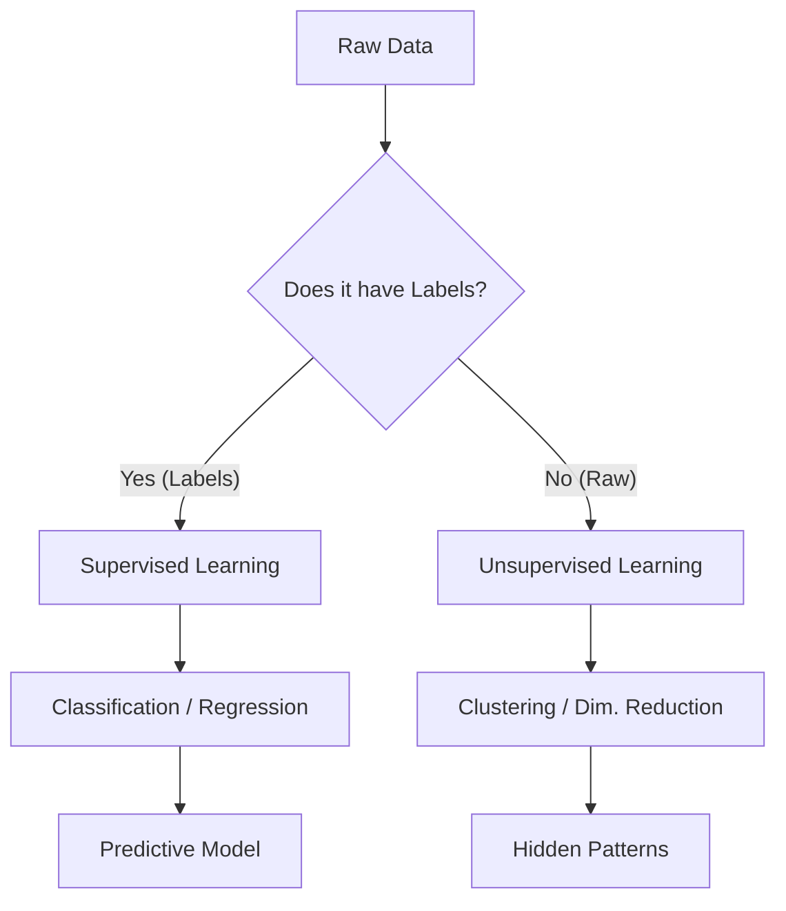

# ⚖️ Supervised vs. Unsupervised Learning: The Two Pillars of Machine Learning
> **Level:** Beginner | **Language:** Hinglish | **Goal:** Master the conceptual and technical differences between learning with labels (Supervised) and learning patterns from raw data (Unsupervised).

---

## 🧭 1. Beginner-Friendly Hinglish Explanation
ML ki duniya mein do bade tareeke hain seekhne ke: **Supervised** aur **Unsupervised**.

1. **Supervised Learning (Teacher-Student):** Kochi sochiye ek school class hai jahan teacher student ko sawal dikhata hai aur sath mein "Answer Key" bhi deta hai. "Ye photo kutte ki hai", "Ye bill spam hai". Student (Model) dhire-dhire sawal aur jawab ke beech ka connection samajh jata hai.
   - **Goal:** Naye sawal ka sahi jawab dena.

2. **Unsupervised Learning (Self-Discovery):** Sochiye ek baccha hai jise humne bahut saari random toys ki bucket de di. Humne use kuch nahi bataya. Baccha khud dekhega ki "Ye saari gol (round) hain", "Ye saari lal (red) hain". Wo toys ko unke "Features" ke hisab se dher (groups) mein baant dega.
   - **Goal:** Data mein chhupi hui "Structure" dhoondhna.

AI Engineer banne ke liye aapko pata hona chahiye ki kab aapko "Labels" ki zarurat hai aur kab machine ko khud rasta dhoondhne dena hai.

---

## 🧠 2. Deep Technical Explanation
The technical distinction lies in the **Data Structure** and the **Objective Function**:

### Supervised Learning
- **Dataset:** $\{(x_1, y_1), (x_2, y_2), ..., (x_n, y_n)\}$ where $x$ are features and $y$ are ground-truth labels.
- **Objective:** Minimize the **Loss Function** $L(y, f(x))$.
- **Subtypes:**
  - **Regression:** $y$ is continuous (e.g., Temperature, Stock Price).
  - **Classification:** $y$ is categorical (e.g., Cat vs. Dog, Fraud vs. Legitimate).

### Unsupervised Learning
- **Dataset:** $\{x_1, x_2, ..., x_n\}$ No $y$ (labels) provided.
- **Objective:** Discover a mapping $z = f(x)$ that reveals the underlying probability distribution or structure.
- **Subtypes:**
  - **Clustering:** Grouping similar data points (e.g., K-Means, DBSCAN).
  - **Dimensionality Reduction:** Compressing features while keeping info (e.g., PCA, t-SNE).
  - **Anomaly Detection:** Finding points that don't fit the pattern.
  - **Association:** Finding rules like "People who buy milk also buy bread."

---

## 🏗️ 3. Comparative Matrix
| Feature | Supervised | Unsupervised |
| :--- | :--- | :--- |
| **Input Data** | Labeled (X + Y) | Unlabeled (X only) |
| **Feedback Loop** | Direct (Correct/Incorrect) | No explicit feedback |
| **Complexity** | Simple logic, but data labeling is hard | Complex math, but data collection is easy |
| **Output** | Prediction / Categorization | Pattern / Grouping / Compression |
| **Accuracy** | High (measurable) | Subjective (hard to measure) |

---

## 📐 4. Mathematical Intuition
- **Supervised:** We are learning a conditional probability $P(Y | X)$. "Given these pixels, what is the probability it's a cat?".
- **Unsupervised:** We are learning the data's joint probability $P(X)$ or a lower-dimensional latent representation $Z$. "What is the most efficient way to represent this data without losing information?".

---

## 📊 5. Learning Patterns (Diagram)


---

## 💻 6. Production-Ready Examples (Labels vs. Patterns)
```python
# 2026 Pro-Tip: Use Unsupervised learning to CLEAN data before Supervised learning.
import numpy as np
from sklearn.cluster import KMeans
from sklearn.linear_model import LogisticRegression

# 1. Unsupervised: Clustering users based on behavior (No labels)
user_features = np.random.rand(100, 5) # 100 users, 5 behavioral metrics
kmeans = KMeans(n_clusters=3)
user_segments = kmeans.fit_predict(user_features)
print(f"User Segments Found: {user_segments[:5]}")

# 2. Supervised: Predicting if a user will buy (With labels)
# X = Features, y = Did they buy? (0 or 1)
X_train = user_features[:80]
y_train = np.random.randint(0, 2, 80) 

model = LogisticRegression()
model.fit(X_train, y_train)
print(f"Purchase Prediction Confidence: {model.score(X_train, y_train)}")
```

---

## ❌ 7. Failure Cases
- **Supervised - Label Noise:** If $20\%$ of your "Dog" photos are labeled as "Cat", the model will learn wrong patterns. **Fix:** Data Auditing.
- **Unsupervised - The "Garbage In, Garbage Out" Trap:** If your data is just random noise, K-Means will still give you clusters, but they will be meaningless.
- **Supervised - Target Leakage:** Predicting cancer using a feature that was created *after* the diagnosis (e.g., "Surgery Date").

---

## 🛠️ 8. Debugging Guide
- **Symptom (Supervised):** Model works on training data but fails on new users.
- **Check:** **Distribution Shift**. Does your training data labels reflect the real-world labels?
- **Symptom (Unsupervised):** Clusters are overlapping or don't make sense.
- **Check:** **Feature Scaling**. Are you using "Income" (0-1M) and "Age" (0-100) together? Income will dominate the distance calculation. **Fix:** Use `StandardScaler`.

---

## ⚖️ 9. Tradeoffs
- **Cost:** Supervised is very expensive (Human labelers cost $\$20/hr$). Unsupervised is cheap (just use raw logs).
- **Control:** Supervised gives you $100\%$ control over what the model learns. Unsupervised is unpredictable—it might find patterns you don't care about.

---

## 🛡️ 10. Security Concerns
- **Data Poisoning (Supervised):** Injecting $1000$ images of a specific person and labeling them "Criminal" to bias the model.
- **Privacy Leakage (Unsupervised):** Clustering can reveal "Anonymized" users' identities by grouping them with known data points (The Netflix Prize leak).

---

## 📈 11. Scaling Challenges
- **Supervised:** Scaling the labeling pipeline is the bottleneck. (Need 1000s of workers).
- **Unsupervised:** Computation is the bottleneck. Clustering millions of points is $O(N^2)$ or $O(N \log N)$, which is very slow.

---

## 💸 12. Cost Considerations
- **Semi-Supervised Learning:** The 2026 compromise. Use Unsupervised to learn on $99\%$ raw data, and only label $1\%$ of the data to "Fine-tune" the model. Saves $90\%$ labeling costs.

---

## ✅ 13. Best Practices
- **EDA First:** Always use Unsupervised methods (like PCA or Clustering) to "Visualize" your data before starting a Supervised project.
- **Balanced Labels:** In Supervised, ensure you have equal examples of every class.
- **Choose the right K:** In Clustering, use the **Elbow Method** or **Silhouette Score** to find how many groups actually exist.

---

## ⚠️ 14. Common Mistakes
- **Assuming Unsupervised is "Easier":** It's actually harder because there is no "True Score" to tell you if you are right.
- **Forgetting to Shuffle:** In Supervised learning, if all "Cats" come first and all "Dogs" come later, the model will struggle to learn.

---

## 📝 15. Interview Questions
1. **"Can we use Unsupervised learning for Classification?"** (No, but you can use it to create 'Pseudo-labels' which can then be used for classification).
2. **"Difference between Clustering and Classification?"** (Unlabeled vs. Labeled groups).
3. **"What is 'Self-Supervised' learning and why is it the secret behind LLMs?"** (It's a mix: Hide part of the data and ask the model to predict it).

---

## 🚀 15. Latest 2026 Industry Patterns
- **SSL (Self-Supervised Learning):** The dominant paradigm for LLMs (GPT-4) and Vision Models (DINOv2). It creates its own "labels" from the raw data by masking words/pixels.
- **Zero-Shot Clustering:** Using LLMs to look at 1000 reviews and "Describe the main themes" without pre-defined labels.
- **Active Learning:** A system where the model "Asks" for a label only when it is confused, reducing labeling costs by $80\%$.
