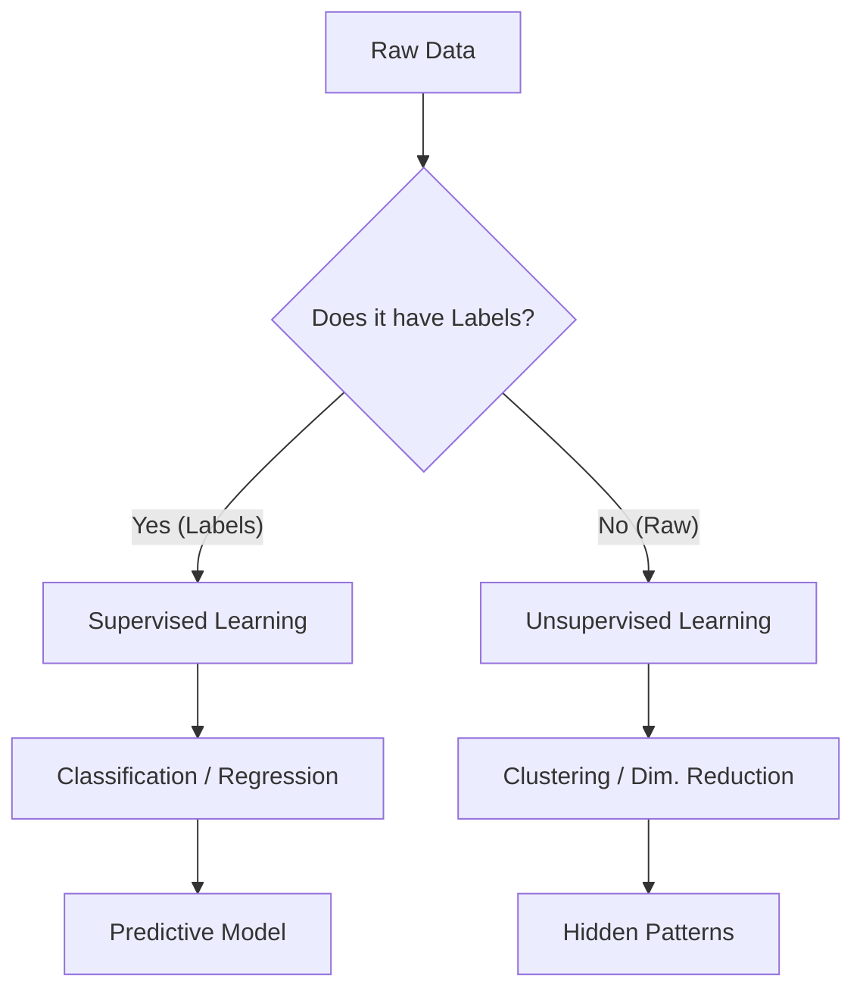

# ⚖️ Supervised vs. Unsupervised Learning: The Two Pillars of Machine Learning
> **Level:** Beginner | **Language:** Hinglish | **Goal:** Labels ke sath seekhne (Supervised) aur raw data se patterns seekhne (Unsupervised) ke beech ke conceptual aur technical differences ko master karein.

---

## 🧭 1. Beginner-Friendly Hinglish Explanation
ML ki duniya mein do bade tareeke hain seekhne ke: **Supervised** aur **Unsupervised**.

1. **Supervised Learning (Teacher-Student):** Kochi sochiye ek school class hai jahan teacher student ko sawal dikhata hai aur sath mein "Answer Key" bhi deta hai. "Ye photo kutte ki hai", "Ye bill spam hai". Student (Model) dhire-dhire sawal aur jawab ke beech ka connection samajh jata hai.
   - **Goal:** Naye sawal ka sahi jawab dena.

2. **Unsupervised Learning (Self-Discovery):** Sochiye ek baccha hai jise humne bahut saari random toys ki bucket de di. Humne use kuch nahi bataya. Baccha khud dekhega ki "Ye saari gol (round) hain", "Ye saari lal (red) hain". Wo toys ko unke "Features" ke hisab se dher (groups) mein baant dega.
   - **Goal:** Data mein chhupi hui "Structure" dhoondhna.

AI Engineer banne ke liye aapko pata hona chahiye ki kab aapko "Labels" ki zarurat hai aur kab machine ko khud rasta dhoondhne dena hai.

---

## 🧠 2. Deep Technical Explanation
Technical difference **Data Structure** aur **Objective Function** me hota hai:

### Supervised Learning
- **Dataset:** $\{(x_1, y_1), (x_2, y_2), ..., (x_n, y_n)\}$ jahan $x$ features hain aur $y$ ground-truth labels hain.
- **Objective:** **Loss Function** $L(y, f(x))$ ko minimize karna.
- **Subtypes:**
  - **Regression:** $y$ continuous hota hai (e.g., Temperature, Stock Price).
  - **Classification:** $y$ categorical hota hai (e.g., Cat vs. Dog, Fraud vs. Legitimate).

### Unsupervised Learning
- **Dataset:** $\{x_1, x_2, ..., x_n\}$ isme koi $y$ (labels) nahi diye hote.
- **Objective:** Ek aisa mapping $z = f(x)$ discover karna jo underlying probability distribution ya structure ko reveal kare.
- **Subtypes:**
  - **Clustering:** Grouping similar data points (e.g., K-Means, DBSCAN).
  - **Dimensionality Reduction:** Information ko loss kiye bina features ko compress karna (e.g., PCA, t-SNE).
  - **Anomaly Detection:** Aise points ko find karna jo normal pattern me fit nahi hote.
  - **Association:** Rules find karna jaise "People who buy milk also buy bread."

---

## 🏗️ 3. Comparative Matrix
| Feature (Lakshan) | Supervised | Unsupervised |
| :--- | :--- | :--- |
| **Input Data** | Labeled (X + Y) | Unlabeled (X only) |
| **Feedback Loop** | Direct (Sahi/Galat) | Koi explicit feedback nahi |
| **Complexity** | Simple logic, par data labeling difficult hai | Complex math, par data collection easy hai |
| **Output** | Prediction / Categorization | Pattern / Grouping / Compression |
| **Accuracy** | High (ise measure kiya ja sakta hai) | Subjective (measure karna difficult hai) |

---

## 📐 4. Mathematical Intuition
- **Supervised:** Hum conditional probability $P(Y | X)$ seekhte hain. "Agar ye pixels diye hain, toh iske cat hone ki probability kya hai?".
- **Unsupervised:** Hum data ki joint probability $P(X)$ ya ek lower-dimensional latent representation $Z$ seekhte hain. "Bina information lose kiye is data ko represent karne ka sabse efficient tarika kya hai?".

---

## 📊 5. Learning Patterns (Diagram)

```mermaid
graph TD
    Data[Raw Data] --> Split{Does it have Labels?}
    Split -- "Yes (Labels)" --> Super[Supervised Learning]
    Split -- "No (Raw)" --> Unsuper[Unsupervised Learning]
    
    Super --> Class[Classification / Regression]
    Unsuper --> Cluster[Clustering / Dim. Reduction]
    
    Class --> Res1[Predictive Model]
    Cluster --> Res2[Hidden Patterns]
```

---

## 💻 6. Production-Ready Examples (Labels vs. Patterns)
```python
# 2026 Pro-Tip: Supervised learning se pehle data ko CLEAN karne ke liye Unsupervised learning ka use karein.
import numpy as np
from sklearn.cluster import KMeans
from sklearn.linear_model import LogisticRegression

# 1. Unsupervised: Behavior ke basis par users ko cluster karna (No labels)
user_features = np.random.rand(100, 5) # 100 users, 5 behavioral metrics
kmeans = KMeans(n_clusters=3)
user_segments = kmeans.fit_predict(user_features)
print(f"User Segments Found: {user_segments[:5]}")

# 2. Supervised: Predict karna ki kya user buy karega (With labels)
# X = Features, y = Did they buy? (0 or 1)
X_train = user_features[:80]
y_train = np.random.randint(0, 2, 80) 

model = LogisticRegression()
model.fit(X_train, y_train)
print(f"Purchase Prediction Confidence: {model.score(X_train, y_train)}")
```

---

## ❌ 7. Failure Cases
- **Supervised - Label Noise:** Agar aapki "Dog" ki $20\%$ photos par "Cat" ka label laga hai, toh model galat patterns seekh lega. **Fix:** Data Auditing.
- **Unsupervised - The "Garbage In, Garbage Out" Trap:** Agar aapka data sirf random noise hai, toh bhi K-Means aapko clusters de dega, par wo completely meaningless honge.
- **Supervised - Target Leakage:** Kisi feature ka use karke cancer predict karna jo diagnosis ke *baad* create hua ho (e.g., "Surgery Date").

---

## 🛠️ 8. Debugging Guide
- **Symptom (Supervised):** Model training data par toh kaam kar raha hai par new users par fail ho jata hai.
- **Check:** **Distribution Shift**. Kya aapke training data ke labels real-world labels ko reflect karte hain?
- **Symptom (Unsupervised):** Clusters overlap ho rahe hain ya unka koi matlab nahi ban raha.
- **Check:** **Feature Scaling**. Kya aap "Income" (0-1M) aur "Age" (0-100) ko ek sath use kar rahe hain? Income distance calculation ko dominate karegi. **Fix:** Use `StandardScaler`.

---

## ⚖️ 9. Tradeoffs
- **Cost:** Supervised bahut expensive hai (Human labelers ki cost around $\$20/hr$ hoti hai). Unsupervised sasta (cheap) hai (aap direct raw logs use kar sakte hain).
- **Control:** Supervised aapko $100\%$ control deta hai ki model kya seekhega. Unsupervised unpredictable hota hai—ye aise patterns bhi dhoondh sakta hai jinki aapko parwah nahi hai.

---

## 🛡️ 10. Security Concerns
- **Data Poisoning (Supervised):** Kisi specific person ki $1000$ images inject karna aur unhe "Criminal" label karna taaki model bias ho sake.
- **Privacy Leakage (Unsupervised):** Clustering se "Anonymized" users ki identity reveal ho sakti hai unhe known data points ke sath group karke (jaise Netflix Prize leak me hua tha).

---

## 📈 11. Scaling Challenges
- **Supervised:** Labeling pipeline ko scale karna sabse bada bottleneck hai (hazaaron workers ki need padti hai).
- **Unsupervised:** Computation yahan bottleneck hai. Millions of points ko cluster karna $O(N^2)$ ya $O(N \log N)$ complexity leta hai, jo ki bahut slow hai.

---

## 💸 12. Cost Considerations
- **Semi-Supervised Learning:** 2026 ka compromise approach. $99\%$ raw data par seekhne ke liye Unsupervised ka use karein, aur model ko "Fine-tune" karne ke liye sirf $1\%$ data ko label karein. Isse labeling cost $90\%$ tak save hoti hai.

---

## ✅ 13. Best Practices
- **EDA First:** Supervised project start karne se pehle data ko "Visualize" karne ke liye hamesha Unsupervised methods (jaise PCA ya Clustering) ka use karein.
- **Balanced Labels:** Supervised me ye ensure karein ki aapke paas har class ke equal examples hon.
- **Choose the right K:** Clustering me actual groups ka number pata lagane ke liye **Elbow Method** ya **Silhouette Score** ka use karein.

---

## ⚠️ 14. Common Mistakes
- **Assuming Unsupervised is "Easier":** Log sochte hain ki Unsupervised aasan hai, par ye actually difficult hai kyunki ye batane ke liye koi "True Score" nahi hota ki aap sahi hain ya galat.
- **Forgetting to Shuffle:** Supervised learning me shuffle karna bhool jana. Agar saari "Cats" pehle aayengi aur saare "Dogs" baad me, toh model ko seekhne me struggle karna padega.

---

## 📝 15. Interview Questions
1. **"Kya hum Classification ke liye Unsupervised learning ka use kar sakte hain?"** (Nahi, par aap iska use 'Pseudo-labels' create karne ke liye kar sakte hain jisse baad me classification kiya ja sake).
2. **"Clustering aur Classification me kya difference hai?"** (Unlabeled vs. Labeled groups).
3. **"'Self-Supervised' learning kya hai aur ye LLMs ke peeche ka secret kyun hai?"** (Ye ek mix hai: Data ke kuch part ko hide karein aur model se use predict karne ko kahein).

---

## 🚀 16. Latest 2026 Industry Patterns
- **SSL (Self-Supervised Learning):** LLMs (GPT-4) aur Vision Models (DINOv2) ke liye dominant paradigm. Ye raw data me words/pixels ko mask karke apne khud ke "labels" create karta hai.
- **Zero-Shot Clustering:** Bina kisi pre-defined labels ke 1000 reviews ko dekhne aur "main themes ko describe" karne ke liye LLMs ka use karna.
- **Active Learning:** Ek aisa system jahan model tabhi label "puchta" (asks) hai jab wo confused hota hai, jisse labeling cost $80\%$ tak kam ho jati hai.
