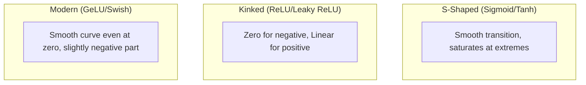

# ⚡ Activation Functions: The "Firing" Logic of Deep Learning
> **Level:** Intermediate | **Language:** Hinglish | **Goal:** Master the non-linear mathematical functions that allow neural networks to capture complex patterns, solve vanishing gradient problems, and enable deep architectures.

---

## 🧭 1. Beginner-Friendly Hinglish Explanation
Activation Function ek neuron ka "Decision Maker" hai. 

Sochiye aapka ek dost hai jo har baat par "Haan" ya "Na" bolta hai. Ek neuron ke paas bahut saara data aata hai, wo use multiply karta hai, par end mein use ye decide karna hota hai: **"Kya mujhe ye information aage bhejni chahiye?"**
- **Linear:** Jaisa signal aaya, waisa bhej diya. (Dimaag ke liye boring hai).
- **Sigmoid:** Signal ko 0 aur 1 ke beech mein fit kar dena. (Binary decision ke liye acha hai).
- **ReLU:** Agar signal negative hai, toh "Chup raho" (0). Agar positive hai, toh "Waisa hi bhej do". 

Bina activation functions ke, AI sirf ek bada calculator hota. Inki wajah se hi AI "Sojh-samajh" (Non-linearity) paida kar sakta hai.

---

## 🧠 2. Deep Technical Explanation
Activation functions introduce **Non-linearity** into the network. Without them, a multi-layer neural network is mathematically equivalent to a single-layer linear model.

### Key Functions:
1. **Sigmoid:** $\sigma(x) = \frac{1}{1 + e^{-x}}$. Outputs values in $(0, 1)$. Good for output layers in binary classification.
2. **Tanh (Hyperbolic Tangent):** $\tanh(x) = \frac{e^x - e^{-x}}{e^x + e^{-x}}$. Outputs in $(-1, 1)$. Better than Sigmoid because its output is zero-centered.
3. **ReLU (Rectified Linear Unit):** $f(x) = \max(0, x)$. The industry standard. Fast to compute and helps mitigate the vanishing gradient problem.
4. **Leaky ReLU:** $f(x) = \max(0.01x, x)$. Fixes the "Dying ReLU" problem by allowing a small gradient for negative values.
5. **Softmax:** $\sigma(z)_i = \frac{e^{z_i}}{\sum e^{z_j}}$. Converts a vector of raw scores into probabilities that sum to $1$. Essential for multi-class classification.
6. **GeLU (Gaussian Error Linear Unit):** Used in Transformers (GPT/BERT). It weights inputs by their percentile in a normal distribution.

---

## 🏗️ 3. Activation Function Comparison
| Function | Range | Best Use Case | Main Drawback |
| :--- | :--- | :--- | :--- |
| **Sigmoid** | (0, 1) | Binary Output Layer | Vanishing Gradient |
| **Tanh** | (-1, 1) | RNNs / Hidden Layers | Vanishing Gradient |
| **ReLU** | [0, $\infty$) | Most Hidden Layers | Dying ReLU (Dead neurons) |
| **Softmax** | (0, 1) | Multi-class Output | Computationally expensive |
| **GeLU** | (-0.17, $\infty$) | Transformers / LLMs | More complex math |

---

## 📐 4. Mathematical Intuition
- **The Derivative Problem:** During backpropagation, we multiply gradients. If the derivative of the activation function is small (like Sigmoid's max 0.25), the gradient becomes $0$ very quickly.
- **ReLU's Secret:** Its derivative is $1$ for all $x > 0$. This means the gradient flows perfectly through the layer without shrinking.
- **Non-Linearity:** It allows the model to create "Curved" decision boundaries instead of just straight lines.

---

## 📊 5. Visualizing the Curves (Diagram)


---

## 💻 6. Production-Ready Examples (Implementing Custom Activations)
```python
# 2026 Pro-Tip: Use GeLU for Transformers and LeakyReLu for GANs.
import torch
import torch.nn as nn

class ModernNetwork(nn.Module):
    def __init__(self):
        super().__init__()
        self.fc1 = nn.Linear(784, 256)
        # 1. GeLU: The choice for modern LLMs
        self.act1 = nn.GELU() 
        
        self.fc2 = nn.Linear(256, 10)
        # 2. Softmax: The choice for the final output (10 classes)
        self.output = nn.LogSoftmax(dim=1)

    def forward(self, x):
        x = self.act1(self.fc1(x))
        return self.output(self.fc2(x))

# Usage in PyTorch is simple:
# model = ModernNetwork()
```

---

## ❌ 7. Failure Cases
- **Vanishing Gradients (Sigmoid/Tanh):** Using them in a 50-layer network. The first layers will never learn anything.
- **Dying ReLU:** If a large gradient update makes the bias so negative that the input is always $<0$, the neuron "dies" and always outputs $0$. **Fix:** Lower the learning rate or use Leaky ReLU.
- **Exploding Gradients:** Using an activation function that grows too fast (like a simple $x^2$).

---

## 🛠️ 8. Debugging Guide
- **Symptom:** "Dead" neurons (output is always 0 for all samples).
- **Check:** **ReLU**. Switch to `LeakyReLu(0.01)` and see if the loss starts moving.
- **Symptom:** Loss is `NaN`.
- **Check:** **Softmax Overflow**. Are your raw logits too large? Use `torch.nn.functional.log_softmax` for better numerical stability.

---

## ⚖️ 9. Tradeoffs
- **ReLU:** Fast and simple but can die.
- **Leaky ReLU:** More robust but adds one more hyperparameter (the slope).
- **Sigmoid:** Interpretable as probability but slow to train and prone to gradient issues.

---

## 🛡️ 10. Security Concerns
- **Activation Pattern Inversion:** An attacker can monitor which neurons are "firing" to reconstruct the original input image or text (Privacy breach).
- **Saturation Attack:** Providing inputs that specifically force all neurons into the "Saturated" region of Sigmoid, making the model stop learning or responding.

---

## 📈 11. Scaling Challenges
- **Softmax over 128k Tokens:** Calculating the denominator for a large vocabulary in LLMs is slow. We use **Flash-Attention** and **Sparse-Softmax** to scale this.

---

## 💸 12. Cost Considerations
- **ReLU is free:** It's just a `cmp` and `max` instruction in CUDA.
- **GeLU is expensive:** It involves `erf` (error function) or `tanh` approximations, which consume more GPU clock cycles. For massive training, these cycles add up to thousands of dollars.

---

## ✅ 13. Best Practices
- **Default to ReLU:** Start there for any hidden layer.
- **Softmax at End:** Only for multi-class classification.
- **Use Log-Space:** Use `LogSoftmax` + `NLLLoss` instead of `Softmax` + `CrossEntropy` for better math stability in production.

---

## ⚠️ 14. Common Mistakes
- **Sigmoid in Hidden Layers:** Stop doing this unless you are building a very specific 1990s-style model.
- **Forgetting dim in Softmax:** If you don't specify the dimension, Softmax might calculate probabilities across the batch instead of the classes.

---

## 📝 15. Interview Questions
1. **"Why is ReLU preferred over Sigmoid in deep networks?"** (Solves Vanishing Gradient).
2. **"What is the 'Dying ReLU' problem?"**
3. **"How does the Softmax function ensure that all probabilities sum to 1?"**

---

## 🚀 15. Latest 2026 Industry Patterns
- **Swish/SiLU:** Used in Llama models. $x \cdot \sigma(x)$. It's smooth and often outperforms ReLU for complex reasoning.
- **Snake Activation:** A periodic activation function that helps models understand sequences and cycles (like audio or time-series) much better than ReLU.
- **Adaptive Activations:** Neural networks where each neuron can "learn" its own activation function (shape) during training.
