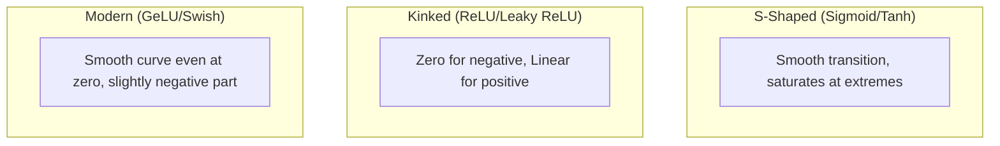

# ⚡ Activation Functions: The "Firing" Logic of Deep Learning
> **Level:** Intermediate | **Language:** Hinglish | **Goal:** Non-linear mathematical functions ko master karein jo neural networks ko complex patterns capture karne, vanishing gradient problems ko solve karne, aur deep architectures ko enable karne mein madad karte hain.

---

## 🧭 1. Beginner-Friendly Hinglish Explanation
Activation Function ek neuron ka "Decision Maker" hai. 

Sochiye aapka ek dost hai jo har baat par "Haan" ya "Na" bolta hai. Ek neuron ke paas bahut saara data aata hai, wo use multiply karta hai, par end mein use ye decide karna hota hai: **"Kya mujhe ye information aage bhejni chahiye?"**
- **Linear:** Jaisa signal aaya, waisa bhej diya. (Dimaag ke liye boring hai).
- **Sigmoid:** Signal ko 0 aur 1 ke beech mein fit kar dena. (Binary decision ke liye acha hai).
- **ReLU:** Agar signal negative hai, toh "Chup raho" (0). Agar positive hai, toh "Waisa hi bhej do". 

Bina activation functions ke, AI sirf ek bada calculator hota. Inki wajah se hi AI "Sojh-samajh" (Non-linearity) paida kar sakta hai.

---

## 🧠 2. Deep Technical Explanation
Activation functions network me **Non-linearity** introduce karte hain. Unke bina, ek multi-layer neural network mathematically ek single-layer linear model ke equivalent hota hai.

### Key Functions (Main Functions):
1. **Sigmoid:** $\sigma(x) = \frac{1}{1 + e^{-x}}$. Ye values ko $(0, 1)$ me output karta hai. Binary classification ke output layers ke liye achha hai.
2. **Tanh (Hyperbolic Tangent):** $\tanh(x) = \frac{e^x - e^{-x}}{e^x + e^{-x}}$. Ye $(-1, 1)$ me output deta hai. Sigmoid se behtar hai kyunki iska output zero-centered hota hai.
3. **ReLU (Rectified Linear Unit):** $f(x) = \max(0, x)$. Industry standard. Ise compute karna fast hai aur ye vanishing gradient problem ko mitigate karne me help karta hai.
4. **Leaky ReLU:** $f(x) = \max(0.01x, x)$. Negative values ke liye ek small gradient allow karke ye "Dying ReLU" problem ko fix karta hai.
5. **Softmax:** $\sigma(z)_i = \frac{e^{z_i}}{\sum e^{z_j}}$. Raw scores ke vector ko probabilities me convert karta hai jinka sum $1$ hota hai. Multi-class classification ke liye essential hai.
6. **GeLU (Gaussian Error Linear Unit):** Transformers (GPT/BERT) me use hota hai. Ye inputs ko normal distribution me unke percentile ke basis par weight karta hai.

---

## 🏗️ 3. Activation Function Comparison
| Function | Range | Best Use Case (Best Upyog) | Main Drawback (Main Kami) |
| :--- | :--- | :--- | :--- |
| **Sigmoid** | (0, 1) | Binary Output Layer | Vanishing Gradient |
| **Tanh** | (-1, 1) | RNNs / Hidden Layers | Vanishing Gradient |
| **ReLU** | [0, $\infty$) | Most Hidden Layers | Dying ReLU (Dead neurons) |
| **Softmax** | (0, 1) | Multi-class Output | Computationally expensive (Heavy compute) |
| **GeLU** | (-0.17, $\infty$) | Transformers / LLMs | More complex math (Complex ganit) |

---

## 📐 4. Mathematical Intuition
- **The Derivative Problem:** Backpropagation ke dauran, hum gradients ko multiply karte hain. Agar activation function ka derivative chota ho (jaise Sigmoid ka max 0.25 hota hai), toh gradient bahut jaldi $0$ ban jata hai.
- **ReLU's Secret:** Iska derivative $x > 0$ ke liye hamesha $1$ hota hai. Iska matlab hai ki gradient bina shrink hue layer se perfectly flow karta hai.
- **Non-Linearity:** Ye model ko sirf straight lines ke bajaye "Curved" decision boundaries create karne ki permission deta hai.

---

## 📊 5. Visualizing the Curves (Diagram)

```mermaid
graph TD
    subgraph "S-Shaped (Sigmoid/Tanh)"
    S[Smooth transition, saturates at extremes]
    end
    
    subgraph "Kinked (ReLU/Leaky ReLU)"
    R[Zero for negative, Linear for positive]
    end
    
    subgraph "Modern (GeLU/Swish)"
    G[Smooth curve even at zero, slightly negative part]
    end
```

---

## 💻 6. Production-Ready Examples (Implementing Custom Activations)
```python
# 2026 Pro-Tip: Transformers ke liye GeLU aur GANs ke liye LeakyReLu ka use karein.
import torch
import torch.nn as nn

class ModernNetwork(nn.Module):
    def __init__(self):
        super().__init__()
        self.fc1 = nn.Linear(784, 256)
        # 1. GeLU: Modern LLMs ke liye prime choice
        self.act1 = nn.GELU() 
        
        self.fc2 = nn.Linear(256, 10)
        # 2. Softmax: Final output ke liye choice (10 classes)
        self.output = nn.LogSoftmax(dim=1)

    def forward(self, x):
        x = self.act1(self.fc1(x))
        return self.output(self.fc2(x))

# PyTorch me iska usage simple hai:
# model = ModernNetwork()
```

---

## ❌ 7. Failure Cases
- **Vanishing Gradients (Sigmoid/Tanh):** Kisi 50-layer network me inka use karna. Pehli layers kabhi kuch learn nahi kar payengi.
- **Dying ReLU:** Agar koi bada gradient update bias ko itna negative bana de ki input hamesha $<0$ rahe, toh neuron "die" (mar) jata hai aur hamesha $0$ output karta hai. **Fix:** Learning rate ko kam karein ya Leaky ReLU ka use karein.
- **Exploding Gradients:** Aise activation function ka use karna jo bahut fast grow karta ho (jaise simple $x^2$).

---

## 🛠️ 8. Debugging Guide
- **Symptom:** "Dead" neurons (saare samples ke liye output hamesha 0 hota hai).
- **Check:** **ReLU**. `LeakyReLu(0.01)` par switch karein aur dekhein ki kya loss move hona shuru hota hai.
- **Symptom:** Loss `NaN` ho jata hai.
- **Check:** **Softmax Overflow**. Kya aapke raw logits bahut bade hain? Better numerical stability ke liye `torch.nn.functional.log_softmax` ka use karein.

---

## ⚖️ 9. Tradeoffs
- **ReLU:** Fast aur simple hai par ye die (dead) ho sakta hai.
- **Leaky ReLU:** Zyada robust hai par ye ek aur hyperparameter (slope) add karta hai.
- **Sigmoid:** Probability ki tarah interpret kiya ja sakta hai par ise train karna slow hai aur isme gradient issues ke chances zyada hote hain.

---

## 🛡️ 10. Security Concerns
- **Activation Pattern Inversion:** Attacker ye monitor kar sakta hai ki kaunse neurons "fire" ho rahe hain taaki original input image ya text ko reconstruct kiya ja sake (Privacy breach).
- **Saturation Attack:** Aise inputs provide karna jo specifically saare neurons ko Sigmoid ke "Saturated" region me force kar dein, jisse model seekhna ya respond karna band kar deta hai.

---

## 📈 11. Scaling Challenges
- **Softmax over 128k Tokens:** LLMs me large vocabulary ke liye denominator calculate karna slow hota hai. Ise scale karne ke liye hum **Flash-Attention** aur **Sparse-Softmax** ka use karte hain.

---

## 💸 12. Cost Considerations
- **ReLU is free:** Ye CUDA me sirf ek `cmp` aur `max` instruction hota hai.
- **GeLU is expensive:** Isme `erf` (error function) ya `tanh` approximations involve hote hain, jo GPU ke clock cycles zyada consume karte hain. Massive training ke dauran, ye cycles thousands of dollars tak pahunch sakte hain.

---

## ✅ 13. Best Practices
- **Default to ReLU:** Kisi bhi hidden layer ke liye yahin se start karein.
- **Softmax at End:** Sirf multi-class classification ke liye.
- **Use Log-Space:** Production me better math stability ke liye `Softmax` + `CrossEntropy` ke bajaye `LogSoftmax` + `NLLLoss` ka use karein.

---

## ⚠️ 14. Common Mistakes
- **Sigmoid in Hidden Layers:** Ise use karna band karein jabi tak ki aap koi 1990s-style model na bana rahe hon.
- **Forgetting dim in Softmax:** Agar aap dimension specify nahi karte hain, toh Softmax classes ke bajaye batch ke across probabilities calculate kar sakta hai.

---

## 📝 15. Interview Questions
1. **"Deep networks me Sigmoid ke upar ReLU ko kyun prefer kiya jata hai?"** (Ye Vanishing Gradient ko solve karta hai).
2. **"'Dying ReLU' problem kya hai?"**
3. **"Softmax function kaise ensure karta hai ki saari probabilities ka sum 1 ho?"**

---

## 🚀 16. Latest 2026 Industry Patterns
- **Swish/SiLU:** Llama models me use hota hai. $x \cdot \sigma(x)$. Ye smooth hai aur aksar complex reasoning ke liye ReLU se behtar perform karta hai.
- **Snake Activation:** A periodic activation function that helps models understand sequences and cycles (like audio or time-series) much better than ReLU.
- **Adaptive Activations:** Neural networks where each neuron can "learn" its own activation function (shape) during training.
