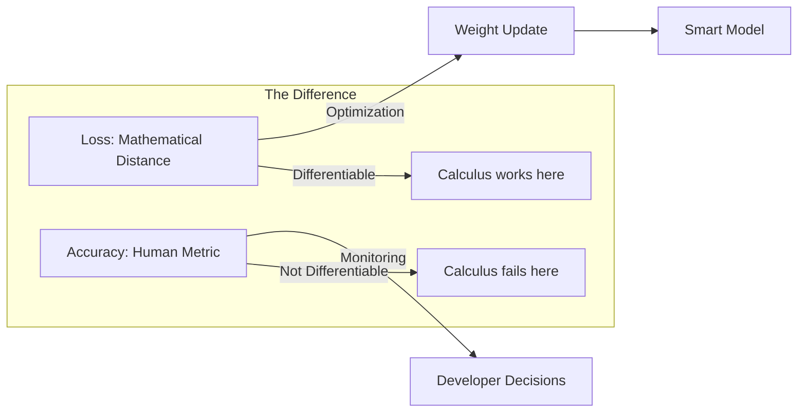

# 📉 Loss Functions in Deep Learning: Measuring the "Gap"
> **Level:** Intermediate | **Language:** Hinglish | **Goal:** Master the mathematical functions used to quantify model errors, and learn how to choose the right loss for different AI tasks like classification, regression, and generation.

---

## 🧭 1. Beginner-Friendly Hinglish Explanation
Loss Function AI ka "Teacher" hai jo use har galti par ek "Score" deta hai. 

Sochiye, AI ek photo dekh kar kehta hai "Ye $60\%$ chance hai ki ye Billi (Cat) hai". Par asliyat mein wo "Kutta (Dog)" tha. 
- **Loss:** Ye batata hai ki AI ka answer "Sach" (Ground Truth) se kitna door hai. 
- **Goal:** Loss ko kam se kam karna (Minimize). Jitna kam loss, utna smart AI.

Agar aap galat Loss function choose karenge, toh AI kabhi seekh hi nahi payega. Jaise agar aap Maths ke student ko History ke basis par judge karein, toh wo kabhi Maths nahi seekh payega. AI mein bhi task ke hisab se loss function badalta hai.

---

## 🧠 2. Deep Technical Explanation
The Loss Function (or Cost Function) $J(\theta)$ maps the model's parameters to a scalar value representing the "Cost" of being wrong. During training, the optimizer uses the gradient of this loss to update weights.

### Key Loss Functions:
1. **MSE (Mean Squared Error):** Average of squared differences. Penalizes large errors heavily. Used for **Regression**.
   $$MSE = \frac{1}{n} \sum (y_{true} - y_{pred})^2$$
2. **MAE (Mean Absolute Error):** Average of absolute differences. More robust to outliers than MSE.
3. **Cross-Entropy Loss (Log Loss):** Measures the performance of a classification model whose output is a probability between $0$ and $1$.
   $$CE = - \sum y_{true} \log(y_{pred})$$
4. **Binary Cross-Entropy (BCE):** Specialized for 2-class classification (Spam/Not Spam).
5. **Hinge Loss:** Used primarily for SVMs and some GANs. It penalizes examples that are within the "Margin."
6. **Huber Loss:** A combination of MSE and MAE. It is quadratic for small errors and linear for large ones (Best of both worlds).

---

## 🏗️ 3. Loss Function Decision Matrix
| Task | Output Layer | Recommended Loss |
| :--- | :--- | :--- |
| **Regression (Price, Age)** | Linear (None) | MSE or Huber |
| **Binary Classification** | Sigmoid | Binary Cross-Entropy (BCE) |
| **Multi-class Classification**| Softmax | Categorical Cross-Entropy |
| **Object Detection** | Mixed | Smooth L1 (for boxes) + CE (for class) |
| **Generative AI (GANs)** | Mixed | Binary CE or Wasserstein Loss |
| **LLM Training** | Softmax | Cross-Entropy |

---

## 📐 4. Mathematical Intuition
- **The "Sparsity" of Cross-Entropy:** Why not use MSE for classification? Because if the model is very wrong (e.g., predicting $0.001$ for a target of $1$), the gradient of MSE becomes very small, making learning slow. Cross-entropy has a much steeper gradient for wrong predictions.
- **Logarithmic Scaling:** Using `log` in Cross-entropy means that as the prediction gets closer to $0$ (when it should be $1$), the loss approaches $\infty$, forcing the model to fix itself immediately.

---

## 📊 5. Loss vs. Accuracy (Diagram)


---

## 💻 6. Production-Ready Examples (Loss in PyTorch)
```python
# 2026 Pro-Tip: Use Label Smoothing with CrossEntropy for better generalization.
import torch
import torch.nn as nn

# 1. Regression Loss
mse_loss = nn.MSELoss()
y_pred = torch.tensor([25.5, 30.0], requires_grad=True)
y_true = torch.tensor([24.0, 31.0])
loss_reg = mse_loss(y_pred, y_true)

# 2. Classification Loss with Label Smoothing (Modern Standard)
# Label smoothing prevents the model from being "too confident"
ce_loss = nn.CrossEntropyLoss(label_smoothing=0.1)
logits = torch.tensor([[2.0, 1.0, 0.1]], requires_grad=True) # Class scores
target = torch.tensor([0]) # Correct class is 0
loss_cls = ce_loss(logits, target)

print(f"Regression Loss: {loss_reg.item()}")
print(f"Classification Loss: {loss_cls.item()}")
```

---

## ❌ 7. Failure Cases
- **Outlier Sensitivity (MSE):** One single wrong data point (e.g., price is 1 billion instead of 1 million) can ruin your entire model because MSE squares the error. **Fix:** Use **MAE** or **Huber Loss**.
- **Vanishing Gradients:** If you use a loss that is too "flat," the gradients become zero and training stops.
- **Wrong Loss for Task:** Using BCE for a task where multiple labels can be true at once (Multi-label). **Fix:** Use **BCEWithLogitsLoss** for each label independently.

---

## 🛠️ 8. Debugging Guide
- **Symptom:** Loss is `NaN`.
- **Check:** **Input Data**. Are there any `null` or `inf` values?
- **Check:** **Learning Rate**. Is it too high, causing the loss to jump to infinity?
- **Symptom:** Loss is $0$ but accuracy is also $0$.
- **Check:** Are you accidentally training on your labels? (Data leakage).

---

## ⚖️ 9. Tradeoffs
- **MSE (Smooth) vs. MAE (Robust):** MSE is easier for optimization (smooth derivatives), but MAE is better if your data is "Dirty" (has outliers).
- **Categorical CE vs. Sparse Categorical CE:** Sparse CE saves memory because it doesn't need "One-hot" encoded labels.

---

## 🛡️ 10. Security Concerns
- **Loss Surface Probing:** An attacker can send many queries and observe the loss values to reconstruct the model's training data (Membership Inference Attack).
- **Adversarial Training:** Using the loss function to create "Noise" that specifically tricks the model into making a mistake.

---

## 📈 11. Scaling Challenges
- **Large Vocab Softmax:** Calculating Cross-entropy for $128,000$ classes in LLMs is slow. We use **Sampled Softmax** or **Noise Contrastive Estimation (NCE)** to speed it up.

---

## 💸 12. Cost Considerations
- **Loss Convergence:** Choosing a better loss function (like **Huber** over **MSE**) can make the model converge $2x$ faster, saving $\$100s$ in GPU training time.

---

## ✅ 13. Best Practices
- **Label Smoothing (0.1):** Always use it for classification to prevent overfitting.
- **Use `WithLogits` versions:** In PyTorch, use `BCEWithLogitsLoss` instead of `Sigmoid` + `BCELoss`. It is more numerically stable and prevents `NaN` errors.
- **Log Loss constantly:** Use Weights & Biases to track if the loss curve is actually going down.

---

## ⚠️ 14. Common Mistakes
- **MSE for Classification:** Don't do it. It leads to slow convergence and poor results.
- **Ignoring the Scale:** If your loss is $10^6$, your gradients will be huge. Scale your targets/data first.

---

## 📝 15. Interview Questions
1. **"Why is Cross-Entropy preferred over MSE for classification?"**
2. **"Difference between MSE and MAE in terms of outlier handling?"**
3. **"What is 'Smooth L1 Loss' and why is it used in Object Detection?"**

---

## 🚀 15. Latest 2026 Industry Patterns
- **Contrastive Loss (InfoNCE):** Used in CLIP and self-supervised learning to bring "similar" things closer in space and "different" things further apart.
- **Focal Loss:** Used in 2026 computer vision to focus the model's attention on "Hard" examples while ignoring the "Easy" ones (Imbalanced data problem).
- **DPO (Direct Preference Optimization) Loss:** A new loss function for LLMs that replaces complex RLHF by directly optimizing the model on "Preferred" vs "Rejected" answers.
