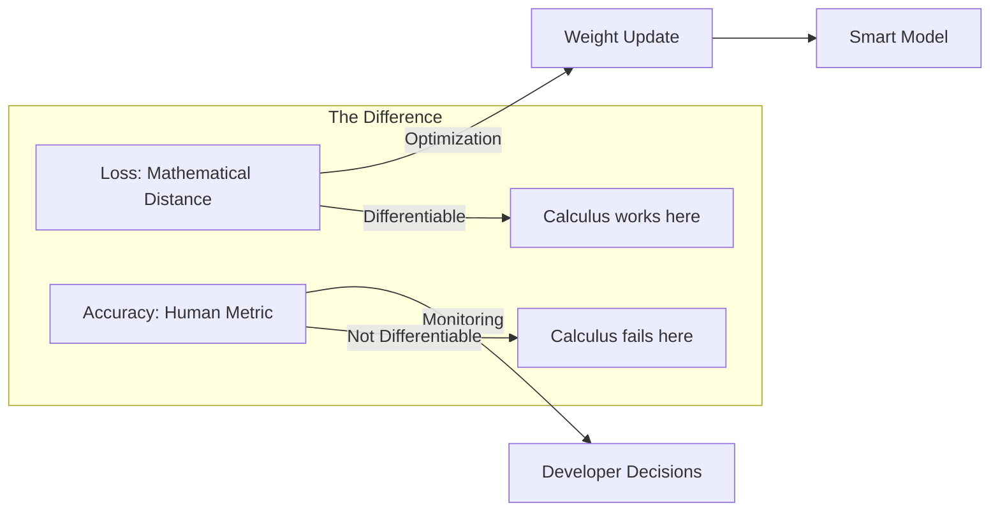

# 📉 Loss Functions in Deep Learning: Measuring the "Gap"
> **Level:** Intermediate | **Language:** Hinglish | **Goal:** Model errors ko quantify karne ke liye use hone wale mathematical functions ko master karein, aur classification, regression, aur generation jaise alag-alag AI tasks ke liye sahi loss function chunna seekhein.

---

## 🧭 1. Beginner-Friendly Hinglish Explanation
Loss Function AI ka "Teacher" hai jo use har galti par ek "Score" deta hai. 

Sochiye, AI ek photo dekh kar kehta hai "Ye $60\%$ chance hai ki ye Billi (Cat) hai". Par asliyat mein wo "Kutta (Dog)" tha. 
- **Loss:** Ye batata hai ki AI ka answer "Sach" (Ground Truth) se kitna door hai. 
- **Goal:** Loss ko kam se kam karna (Minimize). Jitna kam loss, utna smart AI.

Agar aap galat Loss function choose karenge, toh AI kabhi seekh hi nahi payega. Jaise agar aap Maths ke student ko History ke basis par judge karein, toh wo kabhi Maths nahi seekh payega. AI mein bhi task ke hisab se loss function badalta hai.

---

## 🧠 2. Deep Technical Explanation
Loss Function (ya Cost Function) $J(\theta)$ model ke parameters ko ek scalar value par map karta hai jo wrong hone ke "Cost" ko represent karti hai. Training ke dauran, optimizer weights ko update karne ke liye is loss ke gradient ka use karta hai.

### Key Loss Functions (Main Loss Functions):
1. **MSE (Mean Squared Error):** Squared differences ka average. Ye bade errors ko heavily penalize karta hai. **Regression** ke liye use hota hai.
   $$MSE = \frac{1}{n} \sum (y_{true} - y_{pred})^2$$
2. **MAE (Mean Absolute Error):** Absolute differences ka average. Outliers ke liye MSE se zyada robust hai.
3. **Cross-Entropy Loss (Log Loss):** Ek aisi classification model ki performance ko measure karta hai jiska output $0$ aur $1$ ke beech ki probability hoti hai.
   $$CE = - \sum y_{true} \log(y_{pred})$$
4. **Binary Cross-Entropy (BCE):** 2-class classification (Spam/Not Spam) ke liye specialized.
5. **Hinge Loss:** Primary roop se SVMs aur kuch GANs ke liye use kiya jata hai. Ye un examples ko penalize karta hai jo "Margin" ke andar hote hain.
6. **Huber Loss:** MSE aur MAE ka combination. Ye small errors ke liye quadratic hota hai aur large errors ke liye linear (dono approaches ka best mixture).

---

## 🏗️ 3. Loss Function Decision Matrix
| Task (Kaam) | Output Layer | Recommended Loss (Recommended Loss) |
| :--- | :--- | :--- |
| **Regression (Price, Age)** | Linear (None) | MSE or Huber |
| **Binary Classification** | Sigmoid | Binary Cross-Entropy (BCE) |
| **Multi-class Classification**| Softmax | Categorical Cross-Entropy |
| **Object Detection** | Mixed | Smooth L1 (for boxes) + CE (for class) |
| **Generative AI (GANs)** | Mixed | Binary CE or Wasserstein Loss |
| **LLM Training** | Softmax | Cross-Entropy |

---

## 📐 4. Mathematical Intuition
- **The "Sparsity" of Cross-Entropy:** Classification ke liye MSE kyun nahi use karte? Kyunki agar model bahut zyada galat ho (e.g., target 1 ke liye $0.001$ predict karna), toh MSE ka gradient bahut small ho jata hai, jisse learning slow ho jati hai. Wrong predictions ke liye Cross-entropy ka gradient bahut steep hota hai.
- **Logarithmic Scaling:** Cross-entropy me `log` ka use karne ka matlab hai ki jaise-jaise prediction $0$ ke paas pahunchta hai (jabki use $1$ hona chahiye tha), loss $\infty$ ki taraf badhne lagta hai, jisse model immediately khud ko fix karne ke liye force hota hai.

---

## 📊 5. Loss vs. Accuracy (Diagram)

```mermaid
graph LR
    Loss[Loss: Mathematical Distance] -- "Optimization" --> Weights[Weight Update]
    Accuracy[Accuracy: Human Metric] -- "Monitoring" --> Developer[Developer Decisions]
    
    Weights --> Success[Smart Model]
    
    subgraph "The Difference"
    Loss -- "Differentiable" --> Calc[Calculus works here]
    Accuracy -- "Not Differentiable" --> NoCalc[Calculus fails here]
    end
```

---

## 💻 6. Production-Ready Examples (Loss in PyTorch)
```python
# 2026 Pro-Tip: Better generalization ke liye CrossEntropy ke sath Label Smoothing ka use karein.
import torch
import torch.nn as nn

# 1. Regression Loss
mse_loss = nn.MSELoss()
y_pred = torch.tensor([25.5, 30.0], requires_grad=True)
y_true = torch.tensor([24.0, 31.0])
loss_reg = mse_loss(y_pred, y_true)

# 2. Classification Loss with Label Smoothing (Modern Standard)
# Label smoothing model ko "too confident" hone se rokta hai
ce_loss = nn.CrossEntropyLoss(label_smoothing=0.1)
logits = torch.tensor([[2.0, 1.0, 0.1]], requires_grad=True) # Class scores
target = torch.tensor([0]) # Correct class is 0
loss_cls = ce_loss(logits, target)

print(f"Regression Loss: {loss_reg.item()}")
print(f"Classification Loss: {loss_cls.item()}")
```

---

## ❌ 7. Failure Cases
- **Outlier Sensitivity (MSE):** Ek single wrong data point (e.g., price 1 million ke bajaye 1 billion hona) aapke poore model ko kharab kar sakta hai kyunki MSE error ka square karta hai. **Fix:** **MAE** ya **Huber Loss** ka use karein.
- **Vanishing Gradients:** Agar aap aisa loss use karte hain jo bahut "flat" ho, toh gradients zero ho jate hain aur training ruk jati hai.
- **Wrong Loss for Task:** Aise task ke liye BCE ka use karna jahan ek sath multiple labels true ho sakte hain (Multi-label). **Fix:** Har label ke liye independently **BCEWithLogitsLoss** ka use karein.

---

## 🛠️ 8. Debugging Guide
- **Symptom:** Loss is `NaN`.
- **Check:** **Input Data**. Bureau inputs me koi `null` ya `inf` values hain?
- **Check:** **Learning Rate**. Kya ye bahut high hai, jiski wajah se loss infinity tak jump kar raha hai?
- **Symptom:** Loss is $0$ but accuracy is also $0$.
- **Check:** Kya aap galti se apne labels par hi train kar rahe hain? (Data leakage).

---

## ⚖️ 9. Tradeoffs
- **MSE (Smooth) vs. MAE (Robust):** MSE optimization ke liye easy hai (smooth derivatives), par agar aapka data "Dirty" (outliers hain) hai toh MAE behtar hai.
- **Categorical CE vs. Sparse Categorical CE:** Sparse CE memory save karta hai kyunki ise "One-hot" encoded labels ki zaroorat nahi hoti.

---

## 🛡️ 10. Security Concerns
- **Loss Surface Probing:** Attacker kai saari queries bhej sakta hai aur model ke training data ko reconstruct karne ke liye loss values ko observe kar sakta hai (Membership Inference Attack).
- **Adversarial Training:** Loss function ka use karke aisa "Noise" create karna jo specifically model ko mistake karne ke liye trick kare.

---

## 📈 11. Scaling Challenges
- **Large Vocab Softmax:** LLMs me $128,000$ classes ke liye Cross-entropy calculate karna slow hota hai. Ise speed up karne ke liye hum **Sampled Softmax** ya **Noise Contrastive Estimation (NCE)** ka use karte hain.

---

## 💸 12. Cost Considerations
- **Loss Convergence:** Behtar loss function (jaise MSE ke upar **Huber**) choose karne se model $2x$ faster converge ho sakta hai, jisse GPU training time me hundreds of dollars ($\$1,000s$) save hote hain.

---

## ✅ 13. Best Practices
- **Label Smoothing (0.1):** Overfitting se bachne ke liye classification me hamesha iska use karein.
- **Use `WithLogits` versions:** PyTorch me, `Sigmoid` + `BCELoss` ke bajaye `BCEWithLogitsLoss` ka use karein. Ye numerically zyada stable hai aur `NaN` errors ko rokta hai.
- **Log Loss constantly:** Loss curve actually down ja raha hai ya nahi, ise track karne ke liye Weights & Biases ka use karein.

---

## ⚠️ 14. Common Mistakes
- **MSE for Classification:** Don't do it. It leads to slow convergence and poor results.
- **Ignoring the Scale:** Agar aapka loss $10^6$ hai, toh aapke gradients huge honge. Sabse pehle apne targets/data ko scale karein.

---

## 📝 15. Interview Questions
1. **"Classification ke liye MSE ke upar Cross-Entropy ko kyun prefer kiya jata hai?"**
2. **"Outlier handling ke mamle me MSE aur MAE me kya difference hai?"**
3. **" 'Smooth L1 Loss' kya hai aur ye Object Detection me kyun use hota hai?"**

---

## 🚀 16. Latest 2026 Industry Patterns
- **Contrastive Loss (InfoNCE):** CLIP aur self-supervised learning me use hota hai taaki "similar" cheezon ko space me paas laya ja sake aur "different" cheezon ko door bheja ja sake.
- **Focal Loss:** 2026 computer vision me use hota hai taaki model ka attention "Hard" examples par focus kiya ja sake aur "Easy" ones ko ignore kiya ja sake (Imbalanced data problem).
- **DPO (Direct Preference Optimization) Loss:** A new loss function for LLMs that replaces complex RLHF by directly optimizing the model on "Preferred" vs "Rejected" answers.
