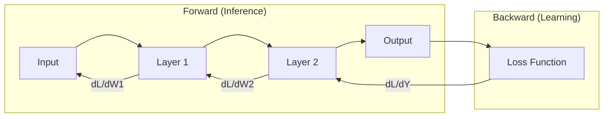

# 🔄 Backpropagation Deep Dive: The Mathematical Heart of Learning
> **Level:** Advanced | **Language:** Hinglish | **Goal:** Master the end-to-end mechanism of how neural networks learn, covering the forward pass, loss computation, the chain rule, and the weight update process.

---

## 🧭 1. Beginner-Friendly Hinglish Explanation
Backpropagation AI ka wo "Feedback Loop" hai jo use har baar pehle se behtar banata hai.

Sochiye, aap archery (teer-andazi) seekh rahe hain. 
1. **Forward Pass:** Aapne teer chalaya (Input $\to$ Model $\to$ Output). Teer target se 10 inch door laga.
2. **Loss Calculation:** Aapne dekha ki galti 10 inch ki hai (Loss).
3. **Backpropagation:** Ab aap apne dimaag mein peeche ki taraf sochte hain: "Galti kahan hui? Kya mera hath (Weight 1) dhila tha? Kya meri nazar (Weight 2) sahi nahi thi?". 
4. **Weight Update:** Aap agli baar apna hath thoda tight karte hain aur apni nazar fix karte hain. 

Neural Network mein ye "Peeche sochna" hi **Backpropagation** hai. Ye calculus ko use karke har layer ko batata hai ki use kitna "thoda sa" badalna hai taaki agli baar loss kam ho jaye.

---

## 🧠 2. Deep Technical Explanation
Backpropagation is an application of the **Chain Rule** from calculus to calculate the gradient of the loss function with respect to every weight in the network.

### The 4 Phases:
1. **Forward Pass:** Input data moves through layers. Intermediate activations $a^{(l)}$ and weighted sums $z^{(l)}$ are stored in memory (this is why training needs more VRAM).
2. **Loss Computation:** The final output is compared to the target using a loss function $L$.
3. **Backward Pass (The Calculus):**
   - Calculate the error at the output layer: $\delta^{(L)} = \nabla_a L \odot \sigma'(z^{(L)})$.
   - Propagate the error backward to previous layers using the chain rule: $\delta^{(l)} = ((W^{(l+1)})^T \delta^{(l+1)}) \odot \sigma'(z^{(l)})$.
   - This "flows" the gradient from the output back to the input.
4. **Weight Update:** Use the calculated gradients to update weights via an optimizer (like SGD): $W = W - \eta \cdot \frac{\partial L}{\partial W}$.

---

## 🏗️ 3. The Backprop Components
| Step | Mechanism | Mathematical Term |
| :--- | :--- | :--- |
| **Prediction** | Linear Transform + Activation | $a = \sigma(Wx + b)$ |
| **Error** | Difference from Target | $L(y, \hat{y})$ |
| **Gradient Flow** | Chain Rule | $\frac{\partial L}{\partial w} = \frac{\partial L}{\partial \hat{y}} \cdot \frac{\partial \hat{y}}{\partial z} \cdot \frac{\partial z}{\partial w}$ |
| **Adjustment** | Learning Rate Step | $w_{new} = w_{old} - \eta \cdot Grad$ |

---

## 📐 4. Mathematical Intuition
- **The Chain Rule:** It's like a relay race. Each person (layer) passes a baton (gradient) to the next. If any person drops the baton (gradient becomes 0), the race stops (Learning stops).
- **Partial Derivatives:** We only care about how ONE specific weight $w$ affects the loss $L$, assuming everything else is fixed for that split second.
- **Auto-Differentiation:** Modern tools like PyTorch build a **Dynamic Computational Graph**. Every operation (`+`, `*`, `exp`) has a corresponding "Backward function" already written.

---

## 📊 5. Forward vs. Backward (Diagram)


---

## 💻 6. Production-Ready Examples (Manual Backprop Logic)
```python
# 2026 Pro-Tip: Understanding why we call .backward() in PyTorch.
import torch

# Define inputs and target
x = torch.tensor([1.0], requires_grad=False)
y_true = torch.tensor([5.0], requires_grad=False)

# Define weights (the things we want to learn)
w = torch.tensor([2.0], requires_grad=True)
b = torch.tensor([0.0], requires_grad=True)

# 1. Forward Pass
y_hat = x * w + b

# 2. Loss Calculation
loss = (y_hat - y_true)**2

# 3. Backward Pass (The Magic)
# This calculates dLoss/dw and dLoss/db automatically
loss.backward()

print(f"Gradient for w: {w.grad}") # How much w should change
print(f"Gradient for b: {b.grad}") # How much b should change

# 4. Optimization Step
with torch.no_grad():
    w -= 0.01 * w.grad # Learning rate = 0.01
    b -= 0.01 * b.grad
```

---

## ❌ 7. Failure Cases
- **Vanishing Gradients:** In deep networks (50+ layers), multiplying small numbers (like 0.1) 50 times makes the gradient $10^{-50}$. The first layers never learn. **Fix:** Use **Residual Connections** (ResNet).
- **Exploding Gradients:** In RNNs, gradients can multiply and become $10^{50}$. Weights become `NaN`. **Fix:** Use **Gradient Clipping**.
- **Broken Graph:** Accidentally converting a PyTorch tensor to a NumPy array in the middle of the loop. This breaks the link, and `.backward()` will fail.

---

## 🛠️ 8. Debugging Guide
- **Symptom:** Gradients are all Zero.
- **Check:** **Activations**. Are you using Sigmoid? Switch to ReLU.
- **Check:** **Freezing**. Did you accidentally set `requires_grad=False`?
- **Symptom:** Training is extremely slow.
- **Check:** **Batch Size**. If it's too small, the gradients are too "Noisy" and backprop takes many more steps to converge.

---

## ⚖️ 9. Tradeoffs
- **Exact Gradient vs. Batch Gradient:** Exact gradient (on full data) is perfect but takes forever. Stochastic Gradient (on 1 sample) is fast but messy. **Standard:** Use **Mini-batch** (32-128 samples).
- **Memory vs. Time:** You can save VRAM by re-calculating activations during backprop instead of storing them (**Gradient Checkpointing**), but it takes $30\%$ more time.

---

## 🛡️ 10. Security Concerns
- **Gradient Inversion:** If you are doing "Federated Learning" (training on user's phones), an attacker can intercept the gradients sent to the server and use them to reconstruct the user's private photos or messages. **Fix:** Use **Differential Privacy**.

---

## 📈 11. Scaling Challenges
- **FP8 Training:** In 2026, we train in 8-bit to save memory, but backpropagation requires high precision for small gradients. We use **Mixed Precision** (keep weights in 16-bit, do math in 8-bit).

---

## 💸 12. Cost Considerations
- Backpropagation is the most expensive part of AI. It takes $3x$ more compute than forward pass. 
- **Optimization:** Using **Fused Kernels** (combining multiple steps into one GPU operation) can reduce backprop cost by $40\%$.

---

## ✅ 13. Best Practices
- **Standardize Inputs:** Backprop works best when inputs have mean 0 and variance 1.
- **Use Better Init:** Initialize weights with `He` or `Xavier` to keep gradients from vanishing at the start.
- **Monitor Gradients:** Use W&B to check if any layer has "zero" gradients—this indicates a dead part of your model.

---

## ⚠️ 14. Common Mistakes
- **Not zeroing gradients:** In PyTorch, `w.grad` is not overwritten; it's ADDED to. If you don't call `optimizer.zero_grad()`, your model will learn from the sum of all previous errors.
- **Using `.data`:** Never use `.data` on a tensor; use `.detach()` or `with torch.no_grad()`.

---

## 📝 15. Interview Questions
1. **"What is the mathematical foundation of Backpropagation?"** (Chain Rule).
2. **"Why do we need to store activations in memory during the forward pass?"** (Because they are needed to calculate derivatives during the backward pass).
3. **"How do Residual Connections solve the vanishing gradient problem?"** (They provide a 'shortcut' for the gradient to flow directly to earlier layers).

---

## 🚀 15. Latest 2026 Industry Patterns
- **Forward-Forward Algorithm:** Geoffrey Hinton's new proposal to replace Backpropagation with two forward passes (one positive, one negative), mimicking how biological brains might actually learn.
- **Reversible Networks:** Networks where you can calculate the input from the output, removing the need to store activations and saving $90\%$ of training VRAM.
- **Memory-Efficient Backprop:** Using **FlashAttention-3** to compute gradients of attention layers without ever materializing the massive $N \times N$ attention matrix.
